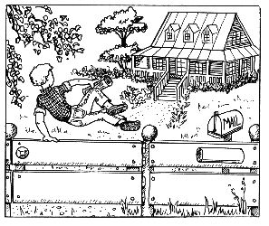
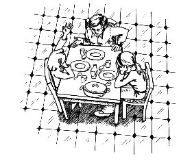

**总目录**

[小狗钱钱1](#bm00010000000000)

[小狗钱钱2](#bm001N0000000000)

**图书在版编目（CIP）数据**

小狗钱钱／（德）舍费尔（Schafer, B.）著；王钟欣，余茜译．—成都：四川少年儿童出版社，2014.1

ISBN 978-7-5365-6358-2

Ⅰ．①小…　Ⅱ．①舍…②王…③余…　Ⅲ．①财务管理—少儿读物　Ⅳ．①TS976.15-49

中国版本图书馆CIP数据核字（2013）第315643号

Money oder das 1×1 des Geldes

By Bodo Schäfer

Copyright © 2000 by F. A. Herbig

Published by arrangement with The Rights Company

All Rights Reserved.

未经出版者书面许可，任何单位或个人不得以任何形式复制或传播本书的部分或全部内容。版权所有，侵权必究。

著作权合同登记号　国字：21-2014-38

XIAOGOUQIANQIAN

小狗钱钱

〔德〕博多·舍费尔著　王钟欣　余　茜译

-----
出 版 人　常　青

出　　品　读书人文化

责任编辑　郭志平　李明颖

封面设计　朱　红

责任印制　王　春

出　　版　四川少年儿童出版社

地　　址　成都市槐树街2号

印　　刷　三河市中晟雅豪印务有限公司

经　　销　新华书店

成品尺寸　215mm×152mm　1/32

印　　张　6.75

网　　址　http://www.sccph.com.cn

网　　店　http://shop.sccph.com.cn

版　　次　2014年3月第1版

印　　次　2014年3月第1次印刷

书　　号　ISBN 978-7-5365-6358-2

定　　价　22.00元

**目录**

[童话与理财](#bm00050000000000)

[前　言](#bm00060000000000)

[第一章　白色的拉布拉多犬](#bm00090000000000)

[第二章　梦想储蓄罐和梦想相册](#bm000C0000000000)

[第三章　达瑞，一个很会挣钱的男孩](#bm000F0000000000)

[第四章　堂兄的挣钱之道](#bm000I0000000000)

[第五章　钱钱以前的主人](#bm000L0000000000)

[第六章　爸爸妈妈犯下的错误](#bm000N0000000000)

[第七章　在金先生家](#bm000P0000000000)

[第八章　陶穆太太](#bm000S0000000000)

[第九章　冒险经历](#bm000U0000000000)

[第十章　在地下室里](#bm00100000000000)

[第十一章　爸爸妈妈不明白](#bm00120000000000)

[第十二章　陶穆太太归来](#bm00140000000000)

[第十三章　巨大的危机](#bm00170000000000)

[第十四章　投资俱乐部](#bm00190000000000)

[第十五章　演　讲](#bm001C0000000000)

[第十六章　俱乐部的投资行动](#bm001E0000000000)

[第十七章　爷爷奶奶害怕风险](#bm001G0000000000)

[第十八章　大冒险的结局](#bm001J0000000000)

[自力更生——写给成年人的后记](#bm001L0000000000)

[附　录](#bm001M0000000000)

[返回总目录](#bm00000000000000)
# **童话与理财**
二十五年前我曾写过一首诗：

坐在屋子里

看墙上的风景画

在画框里

坐在窗户旁

看外面的风景

在窗框里

走下楼去

想看一看原野

高楼和烟囱

横在风景上

想看一幅风景

没有画框的风景

我知道

我还要走很远很远

当时的我不无伤感地表达了：在这个绚丽、复杂、多变的都市，我们离简单和真实已经有很远很远的距离了，无论是在现实世界，还是在我们的心里。

我们从教科书中知道，很久很久以前，货币（金钱）是为方便人们进行货物交换而诞生的，是为人服务的。然而在今天这个财富的时代，这个初衷却似乎已经如同诗中的风景，远离了我们。

近些年，中国变化迅猛，眼前耳边，媒体上关于企业家的报道和各种财富故事纷至沓来。国外的不说，单就国内的各种评述、渲染已是不绝于耳。他们在崛起的市场经济中，或叱咤风云，或激烈厮杀，或神秘莫测，或鞠躬尽瘁，或厚黑有术……凡此种种，无不给投资理财蒙上了一层厚重的面纱，似乎与财富相关的一切都离我们普通百姓的生活太远、太远了。

于是有人说：赚钱太累！那是“他们”才能做到的事。

想看一幅没有画框的风景，现在想来也许并没有之前所说的那么伤感，要走“很远很远”。

关键在于你的心态，在你的心里究竟还有多少框框——“名人”的框框、习惯的框框、观念的框框……

当然，对于框框我们不可能也不可以视而不见，但最重要的是在看见框框的同时，你是否也看见了里面的风景。这需要勇气和信心，而真正的勇敢是在感到最恐惧的时候，你依然在往前走。

这本书让我想起了我最喜爱的一句话：如果你想富有，请把自己变成一个小孩。因为小孩子的框框最少，他们诚实、快乐、乐于学习。

本书的主人公小姑娘吉娅和她可爱的小狗——钱钱，一同为你讲述了一个童话般的理财故事，一切从一本成功日记、一个梦想储蓄罐开始……

这样的故事正不断地在我们身边发生着，只要你认为我们的生活也必须过得更好。事实上，理财和实现富有对老百姓来说未必只意味着沉重与艰辛；理财和你热爱的其他任何事业都可如童话般有趣，如童话般简单。只要你诚实、自信、轻松、快乐，并乐于学习。

你会发现这幅富有的风景画原本就在你身边。

而你也将在你童话般的理财生活中发现自己既平凡又伟大！

汤小明

2013年岁末
# **前言**
所有人都希望自己变得富有一些，只是有些人的这一愿望更为强烈，而有些人却假装自己满足于现在的生活。事实上，大多数人都希望自己更幸福、更成功，也想拥有更多的钱。

这种愿望是无可非议的，因为追求富裕是我们与生俱来的权利。假如我们有足够的钱，我们就能生活得更有尊严，也能更好地为自己和他人服务。认为我们必须忍受拮据的生活，甚至认为这样才是高尚的——这种想法是人类犯下的最重大的错误之一。
## **结束错误**
对许多人而言，梦境和现实是截然不同的，而且他们觉得这是一种正常的现象。为了给这个错误观点画上一个句号，我写了《财务自由之路》一书。在书中，我介绍了我的导师传授给我的致富方法，它将引导你在7年之后获得你的第一个100万。
## **为什么要讲这样一个故事**
《小狗钱钱》讲述的是一个故事，你会发现，《财务自由之路》中介绍的一些方法被编在了这个故事中。故事描述了在实施这些方法的过程中可能遇到的挑战，并且告诉了你令人难以置信的结果。钱钱是一只会说话的狗，它教一个12岁的小女孩学会了与钱打交道的方法。小女孩不仅自己掌握了使用钱的技巧，还帮助父母走出了财务危机。

我写这本书的目的是希望这个故事能触动大家的心灵，使我们看到生活为我们提供的众多财富——金钱便是其中之一。

读这个故事能让你有什么收获呢？假如你已经读过《财务自由之路》一书的话，这个故事能加深你对那本书的理解，也许你还会产生新的认识。更重要的是，你会从新的角度、以新的方式去看待生活中的各种挑战，并成功地利用这些挑战。

如果你还没有读过《财务自由之路》的话，这个故事将使你重新认识到你拥有的机会，故事中的人物将给你启发和动力。你会兴奋地发现，原来自由是可以增加的，潜力和力量都是可以增强的！
## **故事形式并非无懈可击**
但是我必须承认，我起初有些担心，人们在读故事时，不是努力去挖掘故事情节之后隐藏的生活原则，而是试图模仿书中主人公获取成功的举动。成功的故事很少有精彩的翻版，但是故事中包含的道理却可以帮助我们在遭遇困境时找到最佳的出路。同样，当我发现读者开始崇拜作者本人，而没有掌握书中叙述的古老真理时，我也有些不安。个人的经历是很难效仿的，但最基本的真理却完全可以复制。

我还担心，故事这种形式会不会让人们认为图书缺乏深度。我写这些书并不是要给理财专家们提供第×条绝密建议，我的书面向程度各异的读者：有些人一看到这一类标题就发怵，根本不敢奢望构筑自己的财富梦想；有些人整天忙得不可开交，所以没有工夫去打理自己的财产；还有一些人对理财这个话题或多或少有点反感；剩下的一些人，只需要别人的一个提醒、一个点拨。

另外，那些复杂的投资模型经常会将人引入歧途。在这个高科技的时代，似乎只有追求高深莫测的东西才是正道，而那些简单和基本的真理却越来越被我们淡忘了。人们总是觉得：“不可能这么简单。”但实际上，一切就是“这么简单”，就如同本书中所写的一样。但是我要提醒你注意：实际操作并不是一件简单的事。获取财富的法则虽然很容易理解，但是实际运用却并不容易，所以我们常常需要别人的帮助。本书就能够为你提供这方面的帮助。

这本书原本是打算写给孩子们看的（在欧洲可以买到儿童版），因此我觉得应当采用讲故事的方式。我想通过这种方式可以让孩子们更容易理解怎样轻松地获得财富和成功——这是许多家长经常回避的话题。
## **出乎意料的反响**
图书出版后我收到了成千上万封来信——是成年人写的。信的内容大致相同：“这个故事激励我去行动，因为它触动了我的情感。”“我非常感动。”“因为这个故事，我第一次接触了‘钱’这个话题。”“我终于懂得了获取财富的真正秘诀。”

这些读者的反馈使我发现，我原先的估计错了。如今我才明白，其实一个动人的故事远比一幅美丽的图画更值得我们花费笔墨去描述。最容易触动心灵的始终是故事，无论对象是孩子还是成年人。因此我的这本书既是为孩子们写的，也是为成年人写的。
## **故事产生距离感**
作为成年人，读一个小女孩的故事是一件很愉快的事情，因为即使故事情节很贴近我们的生活，我们也可以轻松地置身事外，因为这里叙述的是一个孩子的故事，谈论的是孩子的问题，而我们早已成熟了，离这些问题也很遥远了。吉娅的困惑不会像我们自己的忧虑那样使我们困扰。这是一件令人感到安慰的事。孩子面临的挑战都不会太严峻，何况我们自己已经经历过许多挑战了。

什么？我们还应该从中得到一些收获？假如我们将自己的生活——或者生活的某个阶段——看成是一个故事，假如我们设想自己已经很富有，正回顾着当年自己“财务上的童年”，那又会是一种什么情形呢？这个故事中充满了我们早已克服过的那些困难，我们完全可以带着读故事时的那种距离感来体验我们如今的现实生活。也许在这种情况下，我们能够试着嘲笑自己从前的某些荒唐做法，不会再那么严肃地对待自己以及曾经遇到的困难。我们会发现，我们绝不会被某种情况所困住，而且现在还有这样一个故事可以帮助我们。
## **明确方向十分必要**
但这不仅是一个简单的故事。故事中讲述的更多的是《财务自由之路》中介绍的获取成功与富裕的规律。这些规律不受时间和地点的限制，是你在任何情况下要赢得成功的准则。

不受地点限制的含义是“在所有地方都有效”，不管是什么社会、什么文化背景下；不受时间的限制是指“绝对不会发生改变”，因为我们生活在一个变化越来越快、也越来越剧烈的时代，所以这一点显得尤为重要。一切变得更加复杂、更加混乱，更新、更好的产品层出不穷。因此，在这样的时代里，明确方向、找到永恒的真理是十分必要的。我认为，准则就是没有讨论余地的规律。
## **所有的原则自古有之**
如果上述这些话听上去有点狂妄，那么请允许我作两点解释。

首先，这些规律不是我发明出来的。它们如同自然法则一样，是世间固有的。无论我们愿不愿意，它们都统治着我们的生活。即使我们反对，它们也不会失效。我所做的只是将其中有关富裕和成功的那些规律用我自己的语言进行诠释和整理。

其次，我想，所有真正获得了成功的人士都依据这些规律生活。经常有记者或主持人问我能否证明这些规律的正确性，而我所列举的例证中的主人公全部都是读了我的书或听了我的讲座的人。但我想，在你听从了我的如下建议后，一定能自己找到最好的实例和证据——请回想任何一个或一群成功的人，一个成功的组织或公司，然后找出他们的共性，并分析他们走过的道路，然后你就能找到你想要的例证了。

你所分析的这些人物是否了解获取财富的规律并不重要。有些人也许并不喜欢我所运用的语言——这是无可厚非的，有某些批评意见也是完全合理的，因为是作家就必须面对批评。也许有些人无法理解我这本书中的故事，也许他们甚至为同一条规律想出了完全不同的例证，又或者他们的侧重点不同。所有这些都是允许的，这取决于他们和我不同的经历和个性。但是他们的生活道路仍然可以证明，我所说的那些规律在任何时间和任何地点都是有效的。
## **有益和必要的知识**
这本书将陪伴你实现富裕和成功。但是它不同于许多提供了全面信息的经济类书籍（例如讲述货币史的书籍），那些知识或许也有用，但它们不能帮助我们实现富裕和幸福。我把重点放在了必要的知识上，即我自己经历和走过的通往富裕的每一步。
## **肤浅的危险**
过于复杂的叙述有偏离本质的危险，描述基本的事实时同样也存在一种危险。我们常常会过于迅速地得出结论：“这我已经知道了。”似乎认识几个关键词就足够了。这种想法很可能是一个陷阱，因为当我们发现对要学的东西早已熟悉时，可能就不会继续学习下去。因为我们觉得自己已经知道了，所以就对这些信息不再感兴趣。在本书里，你不仅要学习一些新知识，而且还要学习实际运用这些知识的方法。
## **财富法则**
吉娅——这位在我的故事中学习如何与金钱打交道的小女孩——渐渐了解了致富的规律。下面我就列举其中最重要的一些原则，这也是本书的线索。当你在故事中再次读到这些原则的时候，你的记忆就会加深，也会有更强烈的行动力。

1．一开始，必须明确金钱对你的意义。

2．确立最重要的目标。为什么我们必须特别强调在我们“长长的愿望清单中”的某几个目标？

3．为什么梦想储蓄罐和梦想相册很重要？我们的潜意识如何支持着我们？我们为此需满足哪些前提条件？

4．为什么仅有较高的收入绝不可能解决我们的财务难题？

5．如何使我们不放弃已经作出的决定——想象的艺术。

6．总会有一些人想要阻止我们实现自己的目标，阻力甚至经常来自我们的亲戚朋友，但还是有一些不让自己迷失的方法。

7．为什么一本成功日记能促使我们的收入不断地增加？为什么自信是最关键的因素？

8．人们如何将自己最大的爱好作为职业，并由此再次大幅度提高自己的收入？

9．重要性和紧迫性之间有什么区别？如何保证在任何情况下都不偏离制订的目标？

10．付诸实施的关键：72小时规定。

11．如何以轻松的方式挣到许多钱？

12．关于如何处理债务的4个忠告。

13．一只下金蛋的鹅的故事——人们如何量入为出。

14．如何正确使用银行并使之成为一种乐趣？

15．幸福的本质以及我们如何才能获得更多的幸福。

16．爱钱有什么不对吗？保险箱里留多少现金比较合适？

17．“金钱是‘中性’的”指的是什么意思？钱与幸福之间有什么联系？

18．归还我们的一部分所得是十分重要的。（做慈善和公益事业。）

19．对待恐惧的最佳方式。成功日记所起的作用。

20．增加金钱的最有效途径之一：投资俱乐部。保证成功的5条规定。

21．白手起家的魔法。

22．适用于所有投资的3条最重要的规定。

23．什么是股票？股票是如何运作的？收益是如何产生的？你是否适合股票投资？

24．为什么偶尔放弃熟悉的环境、从事我们畏惧的事情很重要？

25．怎样确保每年获得12％以上的利息？近乎完美的投资形式和投资战略是什么？

26．为什么股票基金是保险的，而且可以为你带来丰厚的利润？挑选保险的基金的3个注意事项。

27．投资基金为什么很简单？

28．在投资基金的情况下，你的钱变成了什么——利滚利的力量。

29．浮动利率：如何平衡风险和赢利。

30．如何轻松地计算利息与复利？

31．当汇率下跌时应当做什么？如何在这种情况下获得高额利润？

32．用基金获得可靠的高利润的前提。

33．通货膨胀的真正含义以及如何轻松计算出它对财产的影响。如何使通货膨胀成为你最好的朋友——当你正确选择投资对象时。

34．金钱对我们生活中的其他领域会产生什么影响？当我们更多地研究金钱这个题目时，将会发生怎样的变化？
## **一切皆有可能**
只需要一点思想的火花就足以让你走上富裕的道路。可是在这里，我还想提醒你注意一个令人惊讶的事实，在某种程度上也作为一个预先的提醒——一旦丰厚的资产开始流动，其速度之快和数量之大都可能让你吃惊：以前它们都藏到哪里去了？

这个现象还纠正了广为流传的错误观点——人们只能通过多年艰苦的工作才能实现富裕。财富应该是某种思想观点、某种以富裕为导向的信仰的产品。只要满足了这些前提条件，那么这一切比大多数人想象的都要简单得多。
## **忽视是一种认输**
大多数人对自己的财务状况关心得不够。在这方面，他们像一个3岁的孩子，只会闭上眼睛想：反正现在看不见它了。财务问题始终存在，如果我们对它不闻不问，它就会变成一种消极力量，降低我们的生活质量。忽视财务问题，就是放弃成功的机会。财务自由是今天每个人都可能实现的目标，当然这需要我们拥有追求自己真正想要的生活的勇气。正如一句名言所说：“并非困难使我们放弃，而是因为我们放弃，才显得如此困难。”
## **什么都无法阻挡你**
将金钱的规律铭记在心，你就会发现自己的财务状况在日益改善。没有任何东西能够阻挡一个顺应时势的想法。这一点也适用于每一个人的生活。什么都无法阻挡你享受自己与生俱来的权利——富裕。富有尊严、财务上游刃有余的生活符合我们的自然法则。只要你不放弃，那就没有任何东西可以阻碍你达到这个目标。就是现在，马上行动起来吧。

我们的生活是一次旅行。如果我们掌握了金钱的规律，那么这次旅行就可以为我们开创机遇，并将我们引向那个自己从未想过的方向。

吉娅是最好的例子。起初她几乎不知道自己的梦想是什么，可后来发生了让她难以置信的事情。当然，在此过程中也会出现一些困难，但当她实现了自己的目标的时候——比她预计的要迅速许多，她明白了，其实这种成功是必然的。她所经历的事情比当初她的梦想还要精彩许多。

这也是我对你的期望：希望你能抓住自己的愿望，实现自己的梦想。希望你在自己的生活旅途中能够拥有实现甚至超越自己的梦想的经历。

好了，现在该讲故事了。

致以最衷心的祝福！

博多·舍费尔
# **第一章　白色的拉布拉多犬**
很久很久以前，我就梦想着有一只属于自己的狗。可是我们全家住在租来的房子里，而房东又明令禁止养狗。爸爸曾经几次试着和房东商量，但都无济于事。唉，世上就是有那么一些不好商量的人。

房东声称，其他的房客不希望看见房子里有狗。这简直是胡说八道——我认识住在三楼和四楼的人家，他们都很想养一只狗。事实上是房东自己不喜欢狗。

我爸爸曾说：“其实这跟喜不喜欢狗无关，他是因为不喜欢自己，所以也不愿意让别人过得快乐。”

于是我找机会仔仔细细地观察了一下房东，他的长相看上去真的是很粗俗。

后来我妈妈又向他提起养狗的事情，他竟然给我们寄来了一封挂号信，恐吓我们，要我们从房子里搬出去！

直到今天我仍然认为，没有谁有权禁止别人养狗。

但从能不能养宠物这一点来看，自己买房子真的是一件非常必要的事情。

过了一段时间，爸爸妈妈真的买了一栋带花园的房子。于是我有了自己的房间，感觉真是好极了，像生活在天堂一般。

但爸爸妈妈却没有那么快乐了，他们总是愁云满面，因为买房的实际费用比原先计划的要高。我隐隐约约地听出，家里的钱现在变得很紧张了。所以我决定在几周之内先把我的愿望藏在肚子里，不对爸爸妈妈说，虽然我真的非常渴望有一只属于自己的小狗。

一天早上，妈妈激动地把我从梦中叫醒：“吉娅，快起来，咱们房前躺着一只受伤的狗！”

我一下子从床上弹起来，冲到楼下。

是真的！在房子和车库之间的角落里躺着一只白色的小狗。它睡着了，但睡得不太安稳。

它的背上有一道长长的伤口，一直延伸到后腿，流了很多血，可能是被别的狗咬伤的。它一定是拖着受伤的身子爬到了这里，最后筋疲力尽地睡着了。

我心疼极了，心里不由得嘀咕：“是哪条可恶的恶狗咬伤了这么漂亮的小狗？”

忽然间，小狗醒了，它睁开一双圆圆的眼睛，望了望我，然后努力撑起身体。可是它实在是太虚弱了，浑身颤抖着，爪子在光滑的石板路上撑不住，一下子又趴倒在地上。我立即把它搂在了怀里。

我和妈妈小心翼翼地把它抱上车，然后来到兽医诊所。医生给小狗缝合了伤口，又给它打了一针。它渐渐放松下来，睡着了。医生告诉我们，它确实是被咬伤的，但伤得不是很重，很快就会痊愈。他还向我们介绍说，这是一条拉布拉多猎犬。这种狗非常善良、聪明，而且对孩子特别友善。因为这些特点，拉布拉多通常会被训练成导盲犬。当医生讲解的时候，我轻轻抚摸着小狗柔软的毛，心里暗暗想着，它真是太可爱了。

当我们把它带回家的时候，它还在甜甜地睡着。我们把它小心地安置在一块软垫上。我的目光一直都离不开它，心里想：“但愿它能好起来。”

正如医生所说，小狗很快就恢复了健康。这时候我又开始担心：这只小狗是从哪里跑来的？它的主人是谁？我们能这样就把它养在家里吗？我的心中突然充满了恐惧：如果爸爸妈妈不想要这只小狗怎么办？因为我们现在正缺钱呢。想到这些，我就像一只泄了气的皮球，一下子变得无精打采起来。

我们当然得去寻找失主，可是我心里暗暗希望永远也不要找到。

爸爸先是登了一则广告，还给附近的动物收容所打了电话，可是没有人听说过这只白色的拉布拉多犬。

在寻找失主的这段日子里，小狗每天都和我们在一起，我们对它的疼爱也与日俱增。不久，它便成为了我们家的一员。

一天早晨，我和小狗在一起玩，一直玩到累得跑不动了，我才来到餐桌旁吃早饭。爸爸妈妈又在谈论钱的事情了。这是我最不愿意听到的话题：一方面，我根本不懂他们在说些什么；另一方面，只要他们说到这个话题，大家就都变得垂头丧气。

当他们停下来的时候，我把话题引到一件我认为更重要的事情上：“小狗到底叫什么名字？”爸爸妈妈都回答不上来，因为我们根本不知道小狗的名字。

我觉得这太糟糕了。小狗真的需要一个名字。这个毛茸茸的小家伙正蜷成一团睡在我脚边的软垫上，我目不转睛地盯着它，绞尽了脑汁，可是怎么也想不出一个合适的名字。

这时候爸爸妈妈还在继续讨论钱的问题。突然，爸爸大声叹了口气，说道：“Money，Money，Money……什么东西都需要Money！”

小狗一下子从睡梦中惊醒了，迷迷糊糊地凑到了爸爸身边。

“Money！”我叫起来，“它对‘Money’这个词有反应！”小狗听到我的声音，又立刻跑到我的身边。

“Money在英文中是‘钱’的意思，它应该叫‘钱钱’，因为这是它自己选的名字。”我这样认为。

可是妈妈一点也不高兴，她说：“我们怎么能把一只狗叫作‘钱’呢？”

爸爸却觉得这个名字很有趣，他说：“这样的话，我们呼唤‘钱’，然后‘钱’就来了，很不错嘛！如果真的是这样，我们大家就都可以无忧无虑了。”当然，他说这句话的时候根本没有意识到，一切正和他说的一样……

于是，这条拉布拉多犬就有了“钱钱”这个名字。

6个星期过去了，我们还是没有失主的消息——当然这正合我的心意。如果找到了失主，我们就必须把钱钱送回去了，而我是多么想把钱钱永远留在身边啊。

爸爸妈妈也已经习惯了和钱钱一起生活，于是钱钱就留在了我们家。

我想，不用我说，你们也猜得到，钱钱和我已经成为最好的朋友了。

可是我还是隐隐地担心，有一天失主会突然来到我们家门前，把钱钱从我们身边带走……

那件事发生的时候，钱钱在我们家已经住了整整半年了。

它真的是一只友善温顺、善解人意的小狗。我第一次从一只狗的眼中看到了如此充满智慧的目光。有时候我甚至敢肯定，它完全听得懂我说的话。

拉布拉多犬喜欢游泳。但是我觉得，钱钱比其他任何狗都更喜欢游泳，每次遇见小溪或是湖泊，它都要下去畅游一番。我很想带它去真正的海边，在广阔的沙滩上飞奔，与浪花嬉戏，那时它该多快乐呀。可是爸爸妈妈说，这种事情现在想都不要想，因为爸爸的生意不太景气，去海边度假是根本不可能的。

星期天，我和钱钱常会沿着一条流经全城的大河散步。这条河宽得简直像大海一样，当我们站在桥下的时候，就能看到河水汹涌而过，气势逼人。

我不知道那个星期天钱钱是怎么了。早上它还是兴高采烈的，但当我们照例去散步，走到河边的时候，它突然丢下我，飞快地跑了，很快消失在我的视线里。我呼唤着它的名字，到处也找不到它，简直快要绝望了。突然，我看见湍急的河水中有一只小狗在挣扎，是钱钱！至今我仍然不知道它是怎么掉到河里去的，因为它知道我们不允许它跳进这样的河里。水流很急，它划动着四肢，奋力向桥边游去。两个桥墩中间拉着一张网，而钱钱偏偏被网缠住了。波浪一次一次淹没它的头，它越来越喘不过气来。它已经快没有力气了，眼看就要被河水完全吞没。

我要救钱钱！我不能看着它淹死！我什么都来不及想，毫不犹豫地跳入水中，因为当时已经没有时间让我再考虑其他理智的方法了，我必须救钱钱！

一切都发生得太快，我立即被水淹没。我大口大口地呛水，心里害怕极了。到处都是又脏又冷的水，而我完全分不清东南西北。后来我晕了过去，失去了知觉，之后发生的事情我完全想不起来了。

后来爸爸妈妈告诉我，我也掉到了缠住钱钱的那张网里。幸亏当时有一艘水上警察的巡逻船就在附近，他们把我和钱钱同时从水里救了出来，那时我的胳膊还紧紧地搂着钱钱。

我在医院待了几个小时，然后回了家。但这之后的几天里，我仍然非常虚弱，必须卧床休息。

钱钱恢复得比我快多了，它寸步不离地守在我的床边，一连几个小时蹲在我的面前，一动不动地望着我。我从它的眼神里看出，它明白发生过的一切。

狗懂得用感恩的目光看着你，这是许多人都做不到的。钱钱就是这样连续几个小时充满友善和感激地望着我。

当然，我当时还无法预料之后发生的一切……

不久，我12岁了。一切还是保持原样，我们还是没有去海边度过假。爸爸妈妈仍然一再说，生意受到“经济衰退”的影响。他们的意思是，国内经济形势是导致他们财务问题的根源。可我却有一个疑问，为什么在同样的经济形势下，我朋友莫尼卡的爸爸妈妈的财务状况却越来越好呢？每当我这样问起，爸爸妈妈总是很生气，对我的问题置之不理。一年中有好几个月，爸爸的收入都不理想，家里的气氛常常十分压抑。妈妈偶尔念叨着，要是我们没有买这栋房子就好了。我认为这样想纯粹是浪费时间，因为时间是无法逆转的。另外，如果没有买这栋房子，我也就不能养钱钱了。

一天，发生了一件令人难以置信的事。

当时，我正决定打电话预订一张我最喜欢的乐队新出的CD。我刚刚从电视中看到了有关的广告，记录下了订购电话。

我坐到电话机旁，开始拨号码。突然，我听见一个声音对我说：“吉娅，你应该首先考虑一下，你是不是真的买得起这张CD！”

我大吃一惊，向四周望去，门是关着的，屋子里只有我一个人。也就是说，屋子里没有其他人——只有钱钱和我在一起。也许这个声音是我自己想象出来的。我冷静下来，拾起了听筒——刚才因为受到惊吓，我连手里的听筒都扔了。我又开始拨号。突然，那个声音再次响起来：“吉娅，如果你买了CD，这个月的零用钱就都花光了。”

钱钱蹲在我面前，歪着头望着我。那个声音是它发出来的？这不可能。我又激动，又害怕。“狗是不会讲话的，即使像钱钱这样聪明的狗也不可能会讲话。”我想。

“很久以前，所有的狗都会说话——只是它们说话的方式和人不一样罢了，可是后来这种能力逐渐退化了。”钱钱望着我说，“不过我还保留着这个能力。”

我曾在电影里看到一头会说话的骆驼。“可那是在电影里面，”我琢磨着，“而我们现在不是在演电影，这是现实生活啊。”立刻又有一个念头钻入我的脑海：“也许我是在做梦。”我迅速地捏了一下自己的胳膊，哇！好疼！——看来我并没有做梦。

钱钱一直望着我。过了一会儿，我听见那个声音再次响起来：“我们现在是不是可以正常地谈话了？还是你要再捏一会儿，再惊讶一阵子呢？”

我突然觉得自己能听见钱钱说话是一件十分普通和正常的事情，仿佛我们这样对话已经有好几年的时间了。我无法解释为什么会有这样的感觉。只是有一点我觉得很奇怪：钱钱说话的时候，它的嘴是一动不动的。

“我们狗说话的方式比你们人类要先进许多。当我们想传达某个信息的时候，我们就将信息直接送入对方的大脑里，”钱钱说，“因此，我也知道你在想什么。”

听到这里，我简直惊呆了。“你是说，你可以读到我的全部想法？”我问道，同时拼命地回忆自己之前都想过什么。

可是钱钱打断了我的思路。它说：“我当然知道你的想法。我只要靠近一个人，就能够在一定程度上读懂他的思想。所以我知道你很难过，因为你的爸爸妈妈出现了很多财务问题，而且我还知道你也正要犯同样的错误，步他们的后尘。一个人能否安排好自己的花费，是在他人生的早期就决定了的。其实，我本不想和你说话，因为一旦科学家知道我有这个本领，他们就会把我关进笼子，在我身上做各种各样的实验。所以我从来没有告诉过任何人我有说话的能力。但是你冒着生命危险救过我的命，所以我要为你破例。可你必须保密，不能让任何人知道。”

我有一大堆问题要问钱钱。我想知道，它是从哪里来的，它以前的主人是谁，是谁弄伤了它……但是没等我问，它就说：“我们能谈话，是上天的恩赐——你将来会更理解我这句话的。现在我们不应该浪费时间来回答这么多的问题。我建议，我们只谈有关钱的问题，因为我想尽可能地帮你降低风险。”

“可是我对其他话题更感兴趣。”我心想，况且妈妈常说，钱并不是人一生中最重要的东西。

“我也不认为钱是人一生中最重要的东西。可是假如我们缺钱的话，钱就会变得格外重要。你回想一下那次我们差点淹死在河里的情形，当时我们想的只是必须从河里爬上来，其他的一切都变得无关紧要了。而你的爸爸妈妈现在面临的正是这样一种局面。因为他们的经济状况太糟糕了，所以才会不停地谈论钱这个问题——他们就像是掉进河里的人，随时都有被淹没的危险。我想帮助你，是因为我希望你不要重蹈他们的覆辙。如果你愿意，我可以帮助你，让钱成为你生活中一种令人愉快的力量。”

我还从来没有考虑过这个问题。我当然希望爸爸妈妈能有更多的钱，可是我不免有点怀疑：让一只小狗来当经济顾问，能行吗？

“等着瞧吧。”钱钱的笑容似乎带着一点点骄傲。它接着说：“还有一点更为重要，那就是只有在你真的愿意的情况下，我才帮得了你。所以请你认真考虑一下。你们人类总是被自己的思想欺骗，所以我建议你，有些时候应该把自己的想法用笔记录下来。请你在明天之前想出10个你想变得富有的原因，也就是你的10个愿望，然后用笔写下来。明天下午6点钟，我们一起去树林里散步。”

我觉得，现在就学习金钱方面的知识对自己来说似乎有点太早了。而且爸爸妈妈的经历让我觉得，钱不是什么好东西。

钱钱当然又读出了我的想法。我立刻听见它的声音在说：“你的爸爸妈妈之所以陷入经济困境，是因为他们在像你这么大的时候没有学会理财的艺术。中国的智者老子说过：‘天下难事，必作于易；天下大事，必作于细。’金钱有一些秘密和规律，我可以慢慢解释给你听。但前提条件是，你自己必须真的有‘想要变得富有’这个愿望，所以你必须找到10个‘想要变得富有’的理由。在此之前我不会再和你谈话了。”

在那天剩下的时间里，我绞尽脑汁地想啊想啊。我要思考的东西实在是太多了，可是无论如何，我都决定不对任何人说出我的这个新发现。我绝对不希望钱钱成为科学家们无数实验的牺牲品。我仿佛已经看见他们把钱钱装进一个狭小的笼子，又在它身上接上许许多多的管子。不！我绝不允许有人这样对待钱钱！所以我不能把钱钱会说话的事告诉任何人。而且我也决定不继续追究钱钱以及它身上发生的奇迹的问题，我预感到自己永远也弄不清楚这些事。

而且，我也不明白为什么从现在起就必须考虑钱的问题。我想起那句中国的名言：“天下难事，必作于易；天下大事，必作于细。”这究竟是什么意思呢？

我突然想到了邻居家的狗——亨瑞。邻居得到亨瑞的时候，它已经5岁了。亨瑞一点儿也不听话。邻居总是说，现在要改变它已经很困难了。如果在它年幼时就训练它，会容易许多。

要爸爸妈妈学习金钱的知识，或许和亨瑞的情况有点相似。而且看钱钱说话的架势，它好像是认真的。所以我必须找到10个我想变得富有的原因，也就是10个愿望。这可不容易，因为我的许多愿望其实并不需要很多钱就可以实现了。

我用了足足3个小时，才列出了下面这个单子：

1．一辆18挡的变速自行车。

2．所有我想要的CD。

3．向往已久的漂亮运动鞋。

4．经常给住在200千米外的好朋友打电话，想打多久就打多久。

5．明年夏天参加交换学生项目去美国，提高自己的英语水平。

6．帮爸爸妈妈还清债务，让他们不再那么伤心。

7．请全家去意大利餐厅吃大餐。

8．帮助和我一样不太富裕的孩子。

9．黑色的名牌牛仔裤。

10．一台笔记本电脑。

写完这份清单以后，我突然觉得“富有”是一件很值得去争取的事情——富人可以轻易买到这些东西，也能做许多有趣的事情。列单子的时候，我还想到了我的几个朋友。我决定问一下钱钱，我是否可以将自己学到的有关金钱的知识告诉我的朋友们。我忽然希望时间能过得快一点儿，让第二天下午的6点钟快一些到来。那时，我就可以知道自己怎样才能变得富有了。
# **第二章　梦想储蓄罐和梦想相册**
我根本没办法集中精力做家庭作业。当闹钟的时针终于挪到“6”的位置时，我迅速地跑向花园。钱钱已经等候在那里了。我立即牵着它走进树林。我心里非常紧张，一路上一句话都不敢和钱钱说。终于，我们来到了秘密据点。

这是一片葱郁的树林，秘密据点就是林中一个隐蔽的小土洞。要进入洞内，首先得爬过一条5米长的狭窄通道。洞里面被我布置得十分舒适——真的很舒服！除了我和钱钱，没有人知道这个地方。在这里我们感到很安全。

我的心紧张得要跳出来了。但愿钱钱还能说话，可是谁知道呢，没有人能预测下一分钟将会发生什么。我有那么多的问题想问它，可是我立刻回想起钱钱说过的话，它只和我讨论有关钱的话题，所以我等着它开口。

钱钱看着我说：“吉娅，你有没有找到想要变得富有的原因？”

“当然了！”我急忙答道，从口袋里掏出单子。

“把它读给我听听。”钱钱说。于是我照着单子念出了我的10个愿望。

“这当中哪些对你是最重要的呢？”它接着问。

“全都重要。”我答道。

“这点我相信，”钱钱回答说，“可是尽管如此，我还是要请你再仔细看一看你的单子，并且把最重要的3项圈出来。”

我的注意力再次回到单子上，我又逐一阅读了我的愿望。要决定哪3个愿望是最想实现的，真是一件困难的事情。我终于完成了这项任务，圈出了其中的3项：

1．明年夏天参加交换学生项目去美国，提高自己的英语水平。

2．一台笔记本电脑。

3．帮爸爸妈妈还清债务，让他们不再那么伤心。

“很好的愿望，你做了很聪明的选择。”钱钱兴奋地说，“我要祝贺你！”

我心里洋溢着自豪感。可是我还是不明白做这个练习到底有什么意义。钱钱又一次看出了我的想法，马上回答说：“大多数人并不清楚自己想要的是什么，他们只知道，自己想得到更多的东西。你可以把自己的生活想象成一家很大的邮购公司。如果你给一家邮购公司写信说‘请给我寄一些好东西来’，你肯定什么都得不到。我们的愿望也是一样。我们必须确切地知道自己心里渴望的是什么才行。”

我有点怀疑：“是不是只要我明确知道自己想要什么，就真的能实现呢？”

“当然你还要为此付出努力，”钱钱答道，“但是至少你已经迈出了关键的第一步。”

“是因为我写下了自己的愿望吗？”我问道。

“是的。”钱钱说，“从现在开始，你必须每天都把这张写着自己的愿望的单子从头到尾看一遍，它会不断地提醒你自己想得到什么，那么你就会密切关注一切可以帮助你实现这些愿望的机遇了。”

“我想知道，这种方法会不会有效？”我有些怀疑地问道。

钱钱严肃地盯着我的眼睛说：“如果你带着这样一种态度来做这件事的话，我的方法肯定发挥不了作用。但是只要你做3件事，就可以轻易改变自己的想法。第一，我建议你拿一本相册作为你的梦想相册。收集一些与自己的愿望有关的照片，把它们贴在相册里。我们要通过图片来思考。”

“通过图片来思考？”

“就是说，不借助文字。”钱钱答道，“当你想到加利福尼亚的时候，你的脑海里浮现出的是‘加利福尼亚’这几个字，还是某一幅画面？”

钱钱说得有道理，我的眼前立刻浮现出迪士尼乐园、旧金山和好莱坞的画面。

“那我到哪里去找这些照片呢？”我问钱钱。

钱钱用一种奇怪的眼神看着我，好像在嘲笑我似的。

“好吧，”我赶紧说，“笔记本电脑的照片我可以从广告里剪下来，关于美国的照片我也许可以向交换学生机构要。可是尽管如此，我还是不太明白为什么要做这些。”

“有的时候我们不需要完全明白这种方法为什么有效，也不必管它是怎样起作用的，关键是它有效。比如说，你能给我解释一下电是如何工作的吗？”钱钱反问我。

我没料到它会向我提出这个问题。为什么钱钱问的偏偏是关于电的问题？要是我能说出一点儿什么就好了，其实我在学校里刚刚学过这个内容。

“你看，”钱钱继续它的话题，“你并不需要解释电的原理，但是你知道一按灯的开关，灯就亮了。我们狗对理论术语不感兴趣，我们只要知道一样东西是有用的就足够了。所以，你去准备一本相册，然后开始往里面贴照片。”

“我只是有点好奇罢了。”我忍不住嘟囔了一句。

钱钱立刻说：“好奇是好的，但是绝不能让好奇阻碍你做事。太多的人做事犹豫不决，就是因为他们觉得没有完全弄懂这件事。真正付诸实践要比纯粹的思考有用多了。”

“我同意，”我向钱钱保证说，“我会试试看。”

没等我说完，钱钱就又打断了我的话：“不是试试看，而是去切实行动！如果你只是抱着试试看的心态，那么你只会以失败告终，你会一事无成。‘尝试’纯粹是一种借口，你还没有做，就已经给自己想好了退路。不能试验，你只有两个选择——做或者不做。”

我陷入了沉思。我记得自己身边有一个人总是喜欢说“我试着做……”，对了，是爸爸。他总是说，他今天要试着赢得一个新客户，可是大多数时候他都失败了。也许钱钱说对了，成功与否也许真的和“试”这个词有一点关系。所以我决定试着不再用“试”这个词。

钱钱突然轻轻地嘟囔了一句。

该死的！我又用了这个词！我不能说我“试”着，而要说我从今以后不再用这个词了。

钱钱一直注视着我：“这不太容易，对吗？”

我想起钱钱刚才说过，只要做到3件事，我就会相信自己的愿望真的可以实现。第一件事就是准备一本相册，贴满与我的梦想有关的照片。那么另外的两件事是什么呢？

我立即得到了回答：“第二件你可以做的事，就是每天看几遍相册，然后想象着，你已经在美国了，已经拥有笔记本电脑了，还要想象你替爸爸还清债务后自豪的神情。”

我诧异地说：“这和做梦是一样的呀！可是妈妈总是告诉我，不要做白日梦。”

钱钱耐心地解释道：“人们把这种行为称作‘视觉化’。成功的人之所以成功，就是因为他们一直梦想着自己成功的那一天，不停地想象着自己实现了理想时的情形。当然，人不能停留在梦想里，你妈妈要对你说的是这一层意思。”

我觉得这一切都显得很可笑。这跟我设想中的关于金钱的第一课完全不同。

“这就叫学习，”我立即听见了钱钱的回答，“学习就是认识新观念和新想法的过程。假如人们始终以同一种思维方式来考虑问题的话，那么始终只会得到同样的结果。因为我对你讲述的许多内容是你以前从未接触过的，所以我建议你，在你还没有做之前，不要轻易下结论。没有想象力的人是很难成就大事的。我们对一件事投入的精力越多，成功的可能性也越大。可是大多数人把精力放在自己并不喜欢的事情上，而不去想象自己希望得到的东西。”

我马上联想到我的克里丝特阿姨。她总是觉得要做的事情太多，无法应付，她的神经快要崩溃了。结果就是她连一件小事都做不成。我也想到了爸爸。爸爸的脑子里装的全是“如何让我们渡过眼前的难关”这样的问题，而他的这种想法却在某种程度上使情况越来越糟。

“你可以做的第三件事就是准备一个梦想储蓄罐。”钱钱继续说。

“梦想储蓄罐？”我不解地问。

钱钱笑了，解释道：“是的，因为没有钱的话，你就去不成加利福尼亚。最好的攒钱方法之一就是使用梦想储蓄罐。你随便拿一个罐子，然后在这个罐子上写上你的梦想，把它作为你的储蓄罐。但是你要为自己的每一个梦想各准备一个储蓄罐。一旦储蓄罐准备好，你就应当把省下的每一分钱放进去。”

我的脑子里立刻有了许多反对意见：“那我得准备许许多多的储蓄罐。而且即使我每次能往每一个储蓄罐里放上1马克（马克：原德国货币单位，现在已经被欧元所取代。）我最早也得等到20岁生日的时候才能攒够钱。何况这样一来，我就没有钱来满足其他的愿望了……”

钱钱静静地看着我说：“你首先考虑的总是事情做不成的原因，你有没有注意到这一点？”

“也许有时候是吧。”我轻声嘟囔着说，“如果我们考虑的是如何让我得到更多的零花钱的问题，那样是不是要好得多呢？比如说，假如我得到的零花钱是现在的两倍，那么我肯定觉得棒极了。”

钱钱的声音一下子变得严肃起来：“吉娅，你现在可能不相信我说的话，但如果你的零花钱是现在的10倍的话，你的问题只会变得更加严重。因为我们的支出永远是随着我们的收入而增长的。”

在我看来，这也太夸张了。如果我的零花钱是现在的10倍，我一定感觉像生活在天堂里一般。

可是钱钱一点儿也不放过我：“看看你的爸爸妈妈，他们拥有的钱比你零花钱的10倍还要多得多，也许是你的100倍。尽管如此，他们的情况也并不好。钱的数目并不是决定性因素，更重要的是我们怎么来使用它。我们首先必须学会量入为出，只有这样，我们才有能力获得更多的钱。这些我会在今后几天里解释给你听，现在还是回到梦想储蓄罐这个话题上来。你马上就开始做这件事怎么样？”

“可是这么多的储蓄罐，我会弄糊涂的。”我答道。

“所以我让你从你列的单子里找出了最重要的愿望。”钱钱解释说。

我又看了一眼我的清单。不错，我最大的愿望是去美国旅行，买一台笔记本电脑，并且帮爸爸妈妈从债务中解脱出来。我可以为前两个愿望准备一个储蓄罐，而帮爸爸妈妈还债的希望简直是太渺茫了。

“的确如此。”钱钱看出了我的想法，“过几天，我们会讨论你爸爸妈妈的债务问题。其实，解决这个问题比你想象的要容易许多。你只需要两个储蓄罐，这肯定不难办到吧？”

“好的，我试一下……不是，我是说，我会去做。”我向钱钱保证道。

“那就马上开始吧。”钱钱要求我。

我有点吃惊：“你是说，现在立即开始？”

钱钱点了点头。

于是我闭上眼睛，首先想象我用自己的笔记本电脑写着家庭作业，这样作业就显得整齐多了，而且修改起来也会更方便；当然我也会得到更高的分数；而且我还能用它来玩超级棒的电子游戏……

接着我又开始想象自己在旧金山度过了3个星期。我住在一户友善的人家里；我还设想自己认识了一个很可爱的女孩，我们在一起共同度过了美妙的时光，我还从来没有遇见过这么投缘的朋友；而且我学到了许多东西，见识了许多不同的事物……

我还看见爸爸送我去机场，他的心情很好，因为他已经不必为还债而发愁了。瞧，他有多自豪。这简直太棒了。他甚至还吹着口哨——他最好还是别吹了，都走调了，但我还是喜欢他的这副样子，因为他看起来是那么高兴。

过了一会儿，我再次睁开眼睛。

“怎么样？”钱钱想立即知道我的感受。

“好极了，”我告诉它，“我真的很喜欢这种感觉。但我还是不明白这样做为什么会有用。”

“想一想电的问题，”钱钱提醒我说，“你不必明白其中的奥秘，你只需要知道这是有用的就够了。而且老实说，我也没办法给你解释清楚。有一只海鸥曾经对我说过：‘在你展翅飞翔之前，你就必须相信自己能到达目的地。’你必须设想自己已经拥有了这些东西，这样你的一个小愿望才会变成一种强烈的渴望。你想象得越多，你的愿望就越强烈，那么你就会开始寻找机会来实现自己的梦想。吉娅，机会到处都是，但是只有在你寻找它的时候，你才能看见它。只有当你心中有了强烈的渴望，你才会去寻觅机会。而当你想象的时候，强烈的渴望就产生了。”

“也许你是对的，”我一边回答，一边还在回味刚才的感觉，“我还从来没有认真考虑过去旧金山的事情。有一次我婉转地征求过妈妈的意见，她立即回答我说：‘根本别想这件事。’从那以后，我就没有再真正考虑过这个问题。现在我的愿望突然又变得非常强烈了。”

钱钱满意地咕噜道：“为此我应该得到一块饼干作为奖赏。”

我惊讶地看着它——自从钱钱成了我的老师，在我的眼里，它根本不再是一只狗了。我得赶快把心态调整过来才行。我迅速掏出一些饼干喂它。钱钱吃得津津有味，一下子就吃完了。

我还有好多问题要问它——我突然觉得世间有那么多秘密。可是钱钱说过，它和我只谈钱的问题，所以我只得把那些问题吞回肚子里。但是有一个问题始终困扰着我，我必须弄清楚，于是我问道：“钱钱，你是从哪里学会这些东西的？”

钱钱被逗乐了，答道：“因为狗绝顶聪明呗。”

“原来如此。”我说，“那么看家狗和卷毛狗为什么不会呢？”

钱钱笑了，答道：“我曾经住在一个非常富有的男人家里，但是我现在不想谈这件事，你以后会知道的。我们现在回去吧，已经很晚了。”

钱钱说对了，差不多快到吃晚饭的时间了。于是我们跑回家去。

吃晚饭的时候我完全心不在焉，而且也没有什么胃口。妈妈担心地看着我说：“吉娅，你不舒服吗？”

我只是大声地叹了口气，什么也没有说。我什么也不能说，我要思考那么多事情、那么多问题。

晚饭终于结束了，我回到房间，立即开始行动。

我需要一本相册。我拿出了一本旧的纪念册——这个应该可以派上用场。现在我要把笔记本电脑和加利福尼亚的照片贴进去。但是我惊讶地发现，我没有任何有关加利福尼亚的照片或是广告，什么也没有。我意识到我真的没有重视过自己的愿望。于是我决定明天立即去收集广告。

现在我至少可以准备一下储蓄罐。我找到一个装巧克力的空盒子，用透明胶带把盒盖封住，然后在盒盖上开了一个口——就像小猪储蓄罐上的开口一样。我用签字笔在盒盖上面写上了“笔记本电脑”几个大大的字。我想，等我找到照片后，我要把一张特别漂亮的笔记本电脑的照片贴在储蓄盒上面。也许我能找到一张特别大的，那样我就可以把整个盒盖都蒙住了。那时候，储蓄盒看起来就像一台笔记本电脑一样——开了一个口的笔记本电脑。我觉得这个主意很棒。随后，我又拿了爸爸的一个雪茄烟盒，并在上面写上“旧金山”几个大字。

现在梦想储蓄罐已经有了，但是我往里面放什么呢？我每个月的零花钱是20马克，用这笔钱我正好可以买一张CD。我想了想，假如我现在给每个盒子里放上5马克，那么剩下的钱就不够买一张CD了。真是个艰难的决定。我想，也许我每隔两三个月买一张CD会好一些，那么我就可以把一半的零用钱存起来了。这样一段时间以后，也许我真的能实现我的愿望。我越来越喜欢这个主意，所以我最终决定往每个梦想储蓄罐里放进5马克。

我骄傲地看着这两个梦想储蓄罐。它们突然显得那么重要。我觉得我一定会成功的。我的感觉棒极了！

我躺在床上，心里激动极了。我今天学到了那么多的东西。我的生活突然变得那样激动人心！肯定没有人能像我一样拥有这样一只不同寻常的狗。过了好久，我才终于进入梦乡。我梦见了钱钱，梦见了美国，还梦见了许许多多的笔记本电脑……
# **第三章　达瑞，一个很会挣钱的男孩**
“吉娅，该起床了！”我听见妈妈在喊我。要不是妈妈叫醒我，我肯定睡过头了。我觉得，有时候人想多睡一会儿，是因为想让梦做得更长一点儿。

我在床上伸了个懒腰。妈妈拉开了窗帘，阳光顿时洒满了整个房间。看到屋里乱七八糟，妈妈生气地摇了摇头。她一下子就发现了我的梦想储蓄罐，于是把两个都拿起来看。当她看见我写在上面的“笔记本电脑”和“旧金山”时，眉头紧紧地皱到了一起。“你怎么会有这么古怪的念头？”她问道。

我涨红了脸，感到全身发热。我答道：“你知道我一直想参加交换学生项目去美国的。另外，我要是有了一台电脑，写作业就更方便了，所以我想开始存钱。”

妈妈两手各拿着一个被我当作梦想储蓄罐的盒子，吃惊地看着我。她把一个盒子摇了摇，里边的那枚5马克硬币撞在盒壁上，发出沉闷的响声。“这里面真的有钱，”她感到很惊讶，“究竟有多少钱？”

我不想和妈妈谈论下去，于是含含糊糊地说：“5马克。”

“5马克就想买笔记本电脑，就想去美国旅行？你等的时间一定不会太长。”妈妈开始咯咯地笑起来，“假如你旅行需要3000马克的话，那么……”她在脑子里计算着，这可不是她的强项，“一个月攒5马克，一年12个月就是60马克，10年就是600马克……等到你攒够了钱，已经过去50年了！”她终于得出了一个结论，然后笑得前仰后合。

我讨厌妈妈嘲笑我的样子，泪水不争气地夺眶而出。我不想让妈妈看见我哭，所以拼命地忍着，可是怎么努力都没用，这让我更加恼火了。

妈妈跑出房间，大声叫爸爸：“哎，乔治，我们的女儿是个理财天才，她马上就要去旧金山了，哈哈哈！”

我再也控制不住了。我对着走廊大吼道：“你们等着瞧吧，我一定会去的！而且我明年暑假就去！我连一张明信片都不会给你们寄！你们就自己背着一屁股烂债吧！我不会帮你们的！”

接着我摔上了门，扑倒在床上放声大哭。我生自己的气，谁让我告诉她的呢，闭上嘴不就行了吗？我恨不得把盒子踩个粉碎。这种存钱的想法太可笑了，肯定没有用的。放学以后我要马上告诉钱钱，这是多无聊的一件事。等我成了老太婆的时候再去美国，这主意真是绝妙透顶！

学校里的一天糟糕透了。在课堂上，我根本没办法集中注意力。幸好这天没有测验，甚至不用做任何课堂作业，否则我的成绩肯定一塌糊涂。我也没和我的好朋友——同桌莫尼卡说一句话。我一言不发地想着心事，迫不及待地盼着能马上放学。最后莫尼卡忍不住了，她写了张字条递给我，而我连看也没看就塞进了牛仔裤兜。

休息的时候，我飞快地跑出教室。我只想一个人待着。但是莫尼卡跑过来追上我，问道：“你这是怎么了？是病了还是丢了什么东西？和爸爸妈妈吵架了吗？还是钱钱的主人来找你们了？别难过，一切都会过去的。”

“全都不是。”我不耐烦地打断了莫尼卡，否则她会一刻不停地问下去的。莫尼卡就是太喜欢说话了，而且根本守不住任何秘密，所以我们的班长亚森总是说，如果谁把什么事情告诉莫尼卡的话，就和登在报纸上没什么不同了。

莫尼卡还在锲而不舍地刨根问底。她和所有爱说话的人有同样的毛病——好奇心特别强。我知道这下子我别想安静了，于是在心里盘算着，怎么对她说才不会对钱钱有任何威胁。我决定告诉她梦想储蓄罐和妈妈嘲笑我的事。对她说完这些之后，我又补充说：“所以我必须有很多钱——而且要快。”

莫尼卡迷惑不解地看着我说：“那你就问你的爷爷奶奶要嘛，他们肯定会给你的。要是我就这么做。”

“莫尼卡，我爷爷奶奶的钱自己还不够用呢。”我答道。莫尼卡家里很有钱，跟我家的情况完全不同。

“那就问你叔叔婶婶要。”莫尼卡建议道。

“你烦死了，”我对她说，“我们家的人都没有钱，我没办法拿到钱。”

“也许确实是这么一回事，但是我还是要说，你太容易放弃了，连试一下都不愿意。在做什么事之前，你总是首先想‘这事是做不成的’，这样肯定不会成功。”她回答说。

我心里一动，钱钱也对我说过类似的话。也许他们真的说对了。

莫尼卡的确有很多缺点，但是她有一个优点，那就是从不气馁。在学校里她不算是特别聪明的学生，但是她的功课却很好。

休息时间结束了，我们又回到教室。我暗暗告诉自己，不能再这样悲观了。

终于熬到了放学。我一路跑回家，狼吞虎咽地吃完饭，就牵着钱钱跑进了树林。当我们好不容易来到秘密据点的时候，我简直等不及了，把憋在心里要说的话一股脑儿地告诉了钱钱：“我都快被你的主意气死了。妈妈发现了我的梦想储蓄罐后，嘲笑了我一番。她给我算了算，说我得用上50年的时间才能去美国，那时候我早成老太婆了。”

钱钱沉默地看了看我，然后低下了头，它看上去有一点儿忧伤。

终于我听见它低声问道：“你是真的想去美国，真的想拥有一台笔记本电脑吗？”

“当然了。”我坚定地回答。我必须承认，我坚定的语气让我自己都吃了一惊。昨天的想象、梦想储蓄罐以及梦想相册真的让我对自己的愿望非常确定。

“那好，”钱钱的目光似乎要将我看透一样，“因为这是最关键的。知道如何去实现并不是目前最重要的事情。最重要的是，你真的有这样的愿望，否则你一遇到困难就会放弃了。”

它说得对。和妈妈的争吵让我更加坚定了自己的想法，我一定要做成这件事。

“我从来也没有说过这件事很容易成功啊。”钱钱继续说。

“但是我真没想到我妈妈会是那种态度。”我伤心地说。

“让我们痛心的阻力总是从我们最想不到的地方来的。”钱钱答道，“我们现在应当考虑的是，怎样才能让你在变成老太婆之前就攒够这笔钱。”

“没指望了，”我回答钱钱，“我已经和莫尼卡讨论过这个问题了。我的亲戚都不富裕，我没办法向他们要钱。我简直快绝望了。”

钱钱气呼呼地用前爪刨着地说：“你不要总去想做不到的事情，你完全可以通过打工来挣钱呀！”

我开始生自己的气，我总是往事情的消极面去想，我一定要改掉这个习惯。可是我只是一个12岁的女孩，怎么才能去挣钱呢？我有了一个主意：“也许我可以定期在我们家的花园里割草，这样我肯定可以有几马克的收入。”

钱钱显得有点激动，它说：“你自己也住在这栋房子里，你自己也享用这个花园，你帮忙干点活是理所应当的，不能因此跟爸爸妈妈要钱。再说，爸爸妈妈为你做了很多事，他们也没有要你付过什么钱呀！”

“你说得也对，那我该到哪里去挣钱？”我问它。

“没有比这更容易的了。”我立即听见了钱钱的回答，“我会给你讲一个有趣的故事，一个名叫达瑞的美国男孩，他在17岁的时候就已经挣到了几百万马克，而他其实只不过是一个非常普通的男孩。但是在讲故事之前，我先要告诉你一个非常重要的道理：你是否能挣到钱，最关键的并不是你有没有好点子，也不是你有多聪明，而是你的自信程度。”

“我的自信程度？”我重复着钱钱的话，又问道，“这和挣钱有什么关系呢？”

钱钱一脸严肃地直立起来，它是在向我表明，这是非常重要的内容：“你的自信程度决定了你是否相信自己的能力，是否相信你自己。假如你根本不相信你能做到的话，那么你就根本不会动手去做，而假如你不开始去做，那么你就什么也得不到。”

我不能肯定自己是否真的听明白了，但是我想起了一件事。不久前有一次，我忘记第二天有课堂测验，事先没有复习。早晨到了学校，班里的同学和我说起了测验的事。我相信自己可以在很短的时间里复习完，于是逃了两节美术课，躲在校园里的一张长椅上开始复习。结果那次测验我真的得了个“良”。如果我不相信自己的能力的话，我就根本不会开始复习了。

“太棒了，”钱钱欢呼道，“这就是自信。”

我总是忘记它能读懂我的想法。

我还没有完全从自己的回忆中走出来，于是有点恍惚地说：“我不觉得自己特别自信。”

“那没关系，”钱钱说，“自信是很容易树立的。你想知道应该怎样做吗？”

“当然了。”我赶紧回答。

“那么我可以告诉你。你去准备一个本子，给它取名叫‘成功日记’，然后把所有做成功的事情记录进去。你最好每天都做这件事，每次都写至少5条你的个人成果，任何小事都可以。开始的时候也许你觉得不太容易，可能会问自己，这件或那件事情是否真的可以算作成果。在这种情况下，你的回答应该是肯定的。过于自信比不够自信要好得多。”

钱钱想了一会儿，然后接着说：“你最好立即开始做这项工作。我们一会儿晚饭后再见。到那时我会给你讲达瑞的故事。”

我很想立即听到达瑞的故事，可是我越来越信任钱钱了，相信它的安排是有道理的。看上去似乎所有的事情都在它的掌握之中，所以我同意了。我们一起散步回家。

一回到家，我就钻进自己的房间。我拿出一本旧的练习本，这是我以前的化学作业本。我把写了字的几张纸撕掉，然后在本子的封面上贴了一张新的标签，写上“成功日记”。

我写下今天的日期，准备开始我的第一篇成功日记。我目不转睛地盯着面前的白纸，我昨天都做成什么事了呢？想了好一会儿，除了准备梦想储蓄罐这件事，我什么都想不起来了。但是另一方面我又不敢确定这件事是不是成功。我问自己，是不是能算上这件事。

我突然想起钱钱对我说过，开始时，如果不能肯定是否应该写下一件事，那就应该作出肯定的回答。

于是我开始写：

1．我做了两个梦想储蓄罐。尽管我不能肯定这是否会成功，但我还是这样做了。如果我不做，就绝对不会成功。

2．我在每个储蓄罐里放进了5马克。

3．我开始制作梦想相册。

4．今天开始撰写我的成功日记。

5．我决定挣很多的钱。

6．我决定永不气馁。

7．我要学很多有关钱和挣钱的知识。

我看了看自己列的单子，突然感到非常自豪。做这些事的孩子肯定不会多。我觉得自己甚至有点骄傲自大了，但是也许所有不同寻常的人都有些疯狂吧。

接着我写完了家庭作业。吃完晚饭，我和钱钱走进了树林。现在是夏天，天黑得很晚。妈妈不喜欢我晚上还去树林，但是我必须和钱钱单独说话。

我先得意扬扬地告诉钱钱，我真的在成功日记里写下了5件我做成功的事情。钱钱对此很满意。

然后我急切地等着听关于达瑞的故事。

钱钱不再吊我的胃口，它开始讲故事——

“有一次达瑞对别人讲自己的故事，而我正好听见了。故事是这样开始的。在达瑞8岁的时候，有一天，他想去看电影但是没有钱。他面临一个基本的问题，是问爸爸妈妈要钱还是自己挣钱。最后他选择了后者。他自己调制了一种汽水，把它放在街边，向过路的行人出售。可那时正是寒冷的冬天，没有人来买，只有两个人例外——他的爸爸和妈妈。

“他偶然得到了一个机会，可以与一位非常成功的商人谈话。当他对商人讲述了自己的‘破产史’后，商人给了他两个重要的建议：第一，为别人解决一个难题，那么你就能赚到许多钱；第二，把精力集中在你知道的、能做的和拥有的东西上。

“这两个建议很关键。因为对于一个8岁的男孩而言，他不会做的事情有很多。于是他一边沿着大街小巷漫步，一边不停地思考人们会有什么难题，他又该如何利用这个机会为他们解决难题。

“这其实很不容易。好点子似乎都躲起来了，他什么办法都想不出来。但是有一天，他的爸爸无意中给他指出了一条路。吃早饭时，爸爸让达瑞去取报纸。这里必须补充一点，美国的送报员总是把报纸塞进花园篱笆上挂着的报箱里。假如你想穿着睡衣舒舒服服地一边吃早饭一边看报的话，就必须先离开温暖的房间，冒着寒风到房子的入口处去取。即使在天气不好的时候也是如此。虽然有时候只需要走二三十米路，但也是非常麻烦的事情。

“达瑞为父亲取报纸的时候，突然冒出了一个主意。当天他就挨个按响邻居的门铃，对他们说，只需每个月付给他1美元，他就负责每天早上把报纸塞到他们的房门底下。大多数人都同意了，达瑞很快有了70多个顾客。一个月后，当他第一次自己赚到了钱的时候，他高兴得简直快飞上了天。

“高兴的同时他并没有满足于现状，他还在寻找新的机会。成功了一次之后，他很快就找到了其他的机会。他让他的顾客每天早上把垃圾袋放在门前，然后由他丢到垃圾桶里——每个月加1美元。另外他还负责喂宠物、看房子、给植物浇水。但是他从来不以小时计费，因为用其他方法计费挣的钱更多。

“9岁时，他开始使用父亲的电脑，学着写广告。他还把孩子能够挣钱的方法记录下来。因为他不断有新的主意，所以很快就有了丰厚的积蓄。他的妈妈帮他记账，好让他知道什么时候该向谁收钱。

“他也雇别的孩子帮他的忙，然后把收入的一半付给他们。如此一来，钱如潮水般地涌进了他的腰包。

“一个出版商注意到了他，并说服他按自己的经历写了一本书，书名为《孩子挣钱的250个方法》。因此，达瑞在他12岁的时候就已经成为了一名畅销书作家。

“后来电视台发现了他，邀请他参加了许多儿童谈话节目。他在电视节目里表现得非常自然，受到许多观众的欢迎。15岁的时候他创办了自己的谈话节目。后来，他通过做电视节目以及广告挣的钱多得真的让人难以置信。

“当达瑞17岁的时候，他已经拥有了几百万美元。”

故事讲完了，钱钱向我提了一个问题：“你认为他在获得成功的道路上最关键、最重要的因素是什么？”

我还沉浸在达瑞神奇的经历之中。我很想回答钱钱，最关键的因素是电视台，但是如果没有写书，他也不会上电视，如果他没有在挣钱上获得成功的话，他也不会写书……

钱钱打断了我的思路，它说：“的确如此。其实从达瑞把精力集中在他知道、能做和拥有的东西上的那一天起，他的成功就已经拉开了序幕。这一决定使得一个孩子完全有能力挣到比成人更多的钱，因为成人经常把一生的时间都用来考虑他们不知道、不能做或没有的东西上。”

“原来又是自信的问题，”我发现了问题的本质，“但这些想法在我们这里也有效吗？美国的孩子拥有的条件肯定比我们好多了。”

钱钱响亮地叫了3声。

我怔住了。钱钱以前几乎从来不叫。我害怕地四处张望，也许我们遇到危险了。可是我什么可疑的东西也没有发现。突然我领悟过来，是我说了不该说的话。我真恨不得咬掉自己的舌头。我又做了我不应该做的事，又把注意力放在了我做不到和没有的东西上面了。虽然我不是住在美国，可是这里肯定也有其他的机会。

钱钱满意地说：“太好了！现在我们都应该得到奖励了。”

我赶紧从口袋里拿出几块饼干，喂给钱钱。它吃得津津有味。

我仿佛一下子充满了勇气。我觉得自己肯定能找到赚到钱的方法。我轻轻挠了挠钱钱的脖子，它舒服地抖了抖身上的毛，发出像小猫一样的呼噜声。几分钟之后，我们往家里走去。
# **第四章　堂兄的挣钱之道**
今天和钱钱的谈话引起了我许多的思考。我躺在床上，辗转难眠。我无论如何也得想出一个能让我挣到许多钱的方法。可是我该怎么做呢？我又该从哪里开始呢？达瑞获得的成功实在令人惊叹，但他毕竟只是一个特例，而且美国的条件也好多了。另外，他的爸爸妈妈也允许他做这些事情——并不是所有的孩子都有这么开明的父母。也许我做这些事情的确太早了……

我又一次想起钱钱对我说过的关于自信的话。假如我对自己的能力多一分自信的话，事情就会简单多了。我差一点又掉进昨天的陷阱中了。于是我决定立即写我的成功日记。我很快就想起了两件可以写进日记的事情：

1．我能成功地保守秘密。

2．当妈妈嘲笑我的时候，我没有灰心丧气。

我考虑了几分钟，又找到了另外4件“成功事迹”。

我一边写日记，一边想，我认识的人里有谁和达瑞有相似之处？能和这样的人聊天一定很痛快。

我突然想到了我的堂兄马塞尔，他只比我大10个月。我们一年里能见上一两次。我听说，他一直都很有钱。可他实在很讨厌，我以前从来不和他一起玩。不过，也许他现在可以帮助我。虽然现在已经很晚了，我还是马上给他打了电话。幸好他还没有睡觉。

他刚拿起电话，我就迫不及待地说出了我的愿望：“嗨，马塞尔，是我，吉娅。我有一件重要的事情要对你说。我明年想参加交换学生项目去旧金山，所以我需要一笔钱。爸爸妈妈帮不了我，所以我得自己去挣这笔钱。”

马塞尔在电话那边笑起来：“没有比这更简单的了。可是你真让我吃了一惊，我一直以为你是一个只会抱洋娃娃的笨丫头呢，所以我从来没有认真和你说过话。现在你却突然提出了一个非常有水平的问题。”

我真想马上挂断电话，他简直太不像话了，这个狂妄自大的家伙！我强忍着心中的怒火说：“你真不客气啊，不过我还是想知道你是怎么赚到那么多钱的。”

马塞尔挑衅地答道：“我以为你会立即挂上电话大哭一场呢。看来，你并不像我想的那么脆弱嘛。哦，我觉得，挣钱其实真的很容易。”

他一定不会想到，我费了多大的劲才没让眼泪掉下来。我不愿意让他察觉到我心中的不快，于是我接着他的话问道：“真的很容易吗？”

马塞尔傲慢地大声笑道：“哪儿都可以挣到钱，你只要四处看看就能发现机会了。”

我想，如果是达瑞也会这么说的。但我还是有一些不相信：“马塞尔，我的一些朋友也想挣钱，可是他们却什么机会都找不到，这是怎么回事呢？”

“那是因为他们从来没有认真找过，也许他们的时间都花在玩洋娃娃上了。”马塞尔答道。我真的开始生气了，他要是再提什么洋娃娃的事，我就……

但是他接着说：“吉娅，你真的认真找过工作了吗？我是说，你有没有用一整个下午的时间来考虑如何挣到钱的问题呢？”

我不得不承认，我考虑这个问题的时间加起来甚至还不到一个小时。其实每次想这件事，我总是很快就认定自己是不会有机会的。于是我告诉他没有。

“看见了吧，”马塞尔继续说，“这也就是你还没有找到机会的原因。不去寻找机会的人，最多不过是在走运的时候捡到天上掉下来的馅饼。告诉你吧，我之所以能挣到这么多的钱，那是因为我自己有一家公司。”

“你不是才12岁吗？”我惊讶地叫出声来。

“是啊，但我有自己的公司。我派送面包，我现在已经有14个顾客了。”他解释道。

“好棒的公司呀！”现在轮到我笑话他了，“你就像一个送报员，只不过你送的是面包。”

“傻瓜，”马塞尔低声骂道，“根本不是你想的那样。我只在星期天送面包，因为星期天的面包比平时贵，而且大多数人星期天都不愿意自己上街去买，所以我提出为他们送货上门。我们的面包师人很好，他给我出了许多好点子。他以平时的价格把面包卖给我，我再按星期天的价格卖出去，这样每个面包我可以赚到0.2马克。另外，我每次送货上门都收取同样的费用，也就是1.5马克。这样，我每个星期天只工作两三个小时，平均给每个顾客送5个面包，每个月就能有140马克的收入了。”

“140马克？这怎么可能！”我激动地叫出声来。

“这还没完呢，”马塞尔得意地说，“我每星期还有3个下午在敬老院工作。”

“你在哪儿工作？”我吃惊地问道。

“在敬老院。我替老人们去买东西，或者陪他们散步。有时候我只是陪他们聊天或者做做游戏什么的。敬老院每小时付给我10马克的工资，这样每个星期我又有了70～90马克的收入。最多的时候一个月可以挣到300马克。”

这个消息让我兴奋极了：“一个月你总共可以有400多马克的收入，这简直是太酷了！”我想了想又说：“可是我家附近没有敬老院……”

“而且你不叫马塞尔，你只是一个女孩子。”他嘲弄地说，“你能不能不去想做不到的事情？你只需要去找合适的机会就够了。”

又和钱钱说的一样。我又一次回想起达瑞的故事。他把注意力放在他所知道、能做以及拥有的东西上，而我却在想我家周围没有敬老院，这样做显然是不明智的，何况钱钱已经一再提醒过我应该怎么做了。

没等我想完，马塞尔就接着说：“你最好想清楚你喜欢做什么，然后再考虑你怎么用它来挣钱。我就是这样想出派送面包这项服务的。我喜欢骑自行车，而现在我可以边骑车边挣钱，两不误。这种感觉太美妙了，真的。我每天都要敲几户人家的门，问他们要不要我送面包上门。我的目标是赢得50个顾客。那样的话，单这一项的月收入就能超过500马克。”

我听得入了神，但是我能找到什么机会呢？我叹了口气说：“我觉得，我想不出自己能干什么。”

“你究竟喜欢做什么呢？”马塞尔问。

“我喜欢游泳，还喜欢玩洋……”我赶紧改口说，“还喜欢和可爱的小狗玩。”

“原来如此！”马塞尔热心地问，“你怎么不用这种爱好挣钱呢？”

“用狗挣钱？”我自语道。这回我没有听出马塞尔在讽刺我。

“真是傻瓜！”马塞尔叫道，“你每天不是必须带你的狗散步吗？”

“不是必须，我喜欢和钱钱一起散步，”我抗议道，“而且不许你以后再叫我傻瓜！”

“就是呀！”马塞尔大声说，“那你可以同时带其他狗散步，然后让狗的主人付钱给你。”

听到这里，我兴奋起来：“这个主意太妙了。虽然你很讨厌，但毕竟还是一个聪明的家伙。”我匆匆表示感谢，挂上了电话，因为我要立即开始制订计划了。

我认识几乎每一户邻居家的狗，它们也都认识我，而且其中的大多数狗我都非常喜欢。现在我既可以和它们一起散步，还可以挣到钱……

许多念头闪过我的脑海。直到几十分钟前我还在想，我的亲戚都很穷。而当我把注意力放到钱上的时候，我的想法已经变了。我首先“发现”了马塞尔。集中精力做一件事，这个办法的作用太惊人了。谁能预测今后将会发生什么呢？我又一次想到了达瑞。

不知道什么时候，我进入了梦乡。

第二天上学的时候，我仍在考虑我的计划。我们的邻居中有一对老夫妻，他们养了一只叫“拿破仑”的狗。老爷爷长着一张狼一样凶巴巴的脸，他得了轻度中风，再也走不利落了。所以一直以来，总是老太太带这条狗散步，而她根本不喜欢做这件事。那只狗是牧羊犬、罗特韦尔犬和其他什么犬种的混血犬，不太听话，一不留神，它就不知道跑到哪里去了。也许问题出在老太太身上，因为她压根儿不懂得如何与狗打交道。

我决定与“狼面人”和他的妻子谈谈。可是我连他们姓什么都不知道。

在回家的路上，我绕了一个弯，先去了拿破仑的家。刚走到门口，我就失去了勇气。我该说什么呢？我该要多少钱呢？我能直接要钱吗？我想，我还是干脆逃走算了。

可是正在院子里打盹的拿破仑认出了我，径直跑到了门口，习惯性地大叫起来。于是老爷爷走到窗前，想看一下是谁来了。他看见了我，问我想做什么。机会来了。我鼓足了勇气，一口气对他说：“我想参加交换学生项目去美国，所以我需要钱，我想自己挣这笔钱。我观察过您太太，我觉得她不太喜欢带拿破仑散步。所以我想，我可以每天帮你们带拿破仑去散步。您觉得怎么样？”

我不敢看这位老人的眼睛。我感觉到我的脸开始发烫。

他用很友好的语气邀请我进屋：“我认为这是一个绝妙的主意。来，进屋坐坐，我们可以好好谈谈这件事。”

他的妻子打开了门，我们在客厅里坐下来。一开始，我还是不敢抬头看“狼面人”的脸，他看起来凶巴巴的。当他的妻子开始说话的时候，我松了一口气。她说：“你知道吗？每天带拿破仑散3次步，这对我来说实在是太麻烦了。要是路上碰上别的什么狗，我根本牵不住拿破仑。你觉得你能做这件事吗？”

“拿破仑总是喜欢和钱钱待在一起，”我答道，“它会跟着我和钱钱走的。我们可以先试一下。”

“我见过你和狗打交道的情形，”老人插话说，“我想，没人能在这方面超过你。”他转过头对妻子说：“爱拉，我们完全可以放心了。这个女孩天生知道如何对待狗。我觉得，她几乎可以和它们说话了。”

我强忍着才没有笑出声来。有谁知道呢？我确实可以跟狗说话。

当老爷爷和他的妻子说话时，我小心地打量了他一下。在近处看，他显得一点儿也不可怕，还带着一丝神秘，好像有过很沧桑的经历，这使得他看起来很善良，而且充满了智慧。

老爷爷转过身来对我说：“我们应该先互相认识一下。她是爱拉，我叫瓦德马，我们姓汉内坎普。”

“我叫吉娅，吉娅·克劳斯米勒。”我也向他们介绍了我自己。

“很高兴认识你，小姑娘。”汉内坎普先生庄重地点点头说，“我给你提个要求吧，你每天带拿破仑散步，梳理它的毛，而且还要教导它听话。”老爷爷停了一会儿，又问道：“那么你要多少钱呢？”

我的脸一下子涨得通红。我还没有考虑过这个问题。他们满怀期待地看着我。我该要多少呢？

“我也不知道。”我轻声说。

“那我给你提个建议吧，”老爷爷说，“你觉得每天2马克怎么样？”

我轻声算着。这就是说，一个月60马克，这是我零花钱的3倍。天呀，这么多钱！但是我一言不发，这让他们俩误会了我的意思，以为我失望了，于是老爷爷又建议说：“而且你每教会拿破仑一个本领，你还会再得到20马克。”

这次我赶紧说：“我觉得好极了。我非常高兴。你们真是好人！”

他们俩满意地对视了一下。“好吧，你从今天下午就可以开始工作了。”老太太充满期待地说。

“没问题。”我答道，然后赶快起身告辞，妈妈肯定还在等我吃午饭呢。

我一溜烟跑回了家，兴奋地想，挣钱真是太容易了。我就像吃了蜂蜜蛋糕一样，心里美滋滋的。我抑制不住心中的喜悦，哼起了歌。

刚到家，我就温柔地亲吻了钱钱。我对着它的耳朵低声说，我现在已经能挣到很多钱了。它高兴地举起前腿，扑到我的怀里。我看得出，它也乐坏了。

吃完中午饭，我立即给马塞尔打电话，告诉他我找到了第一份工作。“看吧，吉娅，你能行的。”他只对我说了这么一句。我有一点儿失望，因为我本来以为他会表扬我几句，但是我突然发现，他第一次没有再提“洋娃娃”的事，而是叫了我的名字吉娅。这已经是一个好兆头了。

“但是，我想提醒你两件重要的事情。”我听见马塞尔说，“第一，无论在什么时候都不能把希望只寄托在一份工作上，它持续的时间不会像你设想的那么长，所以你要立即寻找另一份替代的工作。”

虽然我觉得他有点夸张，但我还是决定听从他的劝告。

“第二，你肯定会遇到一些困难，”马赛尔接着说，“这些困难是你现在还难以预料的。到那时候就能看出来，你到底是一个洋娃娃似的胆小鬼呢，还是一个像我一样能挣很多钱的人。情况顺利的时候，人人都能挣到钱。只有在逆境中，一切才能见分晓。”

我还不太明白他的第二个建议的含义。尽管如此，我还是礼貌地向他道谢，然后带着钱钱去拿破仑家。正如我所预料的，拿破仑是一条很温顺的狗。能和钱钱一起玩，它高兴得不得了。它们俩不停地追着我带去的小球跑呀跑呀，直到累得再也跑不动为止。

路上遇见其他狗的时候，拿破仑会停下，好奇地凑上去。我决定，在接下来的几天里，首先要教会它听懂“坐下”和“躺下”的命令。之后我还要教它，当别的狗经过身边的时候，它应该守规矩才行。

当我终于回到家的时候，姑妈爱娜来做客了。虽然她住的地方离我们只有35千米的路程，可是我们已经有很长时间没有见到她了。自从我们有了钱钱以后，她还没有来过我们家。

当我们互相问好时，她的目光落在了钱钱的身上。妈妈对她解释，这只狗是自己跑到我们家来的，我们一直都没有找到狗的主人。姑妈仔细地打量着钱钱，然后皱起了眉头。肯定是出了什么问题。

“这只狗你们养了多久了？”她问道。当她说话的时候，目光一刻都没有从钱钱的身上移开。

“大约9个月了。”妈妈回答道。

“我想，我有一个重要的消息要告诉你们，”姑妈严肃地说，“我确信，我知道它的主人是谁！”

“它是我的！”我急忙叫出声来。

“不，它是我邻居的狗。”姑妈坚持己见。

我的心里一下子充满了恐惧。“可它现在是我们的，因为它已经和我们在一起这么长时间了！”我固执地叫喊着。

妈妈严厉地看了我一眼，说道：“不准对姑妈大喊大叫！你的礼貌到哪里去了？”

我的脑袋一下子炸开了，胃也绞在了一起。我觉得我快要窒息了。爸爸的声音好像从很远的地方传来：“那明天我们马上带着钱钱去找这位先生，解决这件事。”

我听不下去了，冲出了客厅。钱钱也跟在我后面跑出来了。一回到我的房间，我就锁上门，然后一头扑在床上。但有一点我清楚地知道：我不会把钱钱还给任何人，我们必须在一起。我们共同经历了那么多的事情，我们再也分不开了。我情愿带着钱钱一起逃走。

钱钱把头枕在我的腿上，望着我。它根本不需要对我说什么，它的目光已经对我说明了一切。它也不想离开我。
# **第五章　钱钱以前的主人**
第二天，我一点儿都不想去上学。我害怕等我再回到家的时候，钱钱已经不在了。但是爸爸向我保证，会和我一起到姑妈的邻居家去。

莫尼卡现在已经习惯了变得不爱说话的我。但是到了第三节课，我实在忍不住要对她说出我的难题。我告诉她，我姑妈公布了一条多么可怕的消息。莫尼卡很同情我。

“如果你必须把钱钱藏起来的话，可以藏在我们家。”她想帮助我。

我觉得心里一下子轻松了许多。我突然有一种感觉，我肯定能找到什么解决方法。

尽管如此，在去往姑妈家的路上，我感到胃里难受极了。我们和姑妈一起去拜访她的邻居，来到一栋豪华的别墅前，这栋别墅坐落在一个十分美丽的花园里。门卫开了门，我们的车缓缓地驶向这座宏伟的建筑。

“不管住在这里的人是谁，他肯定非常有钱。”爸爸惊叹道。

姑妈解释说：“金先生在证券交易所赚了一大笔钱。但是我听说，前些日子，他出了车祸。我现在还不知道他出没出院。”

我用手紧紧地搂着钱钱，心里暗暗希望金先生和他的别墅都能化作一缕轻烟，消失得无影无踪。

一个身着制服的女仆已经从门卫那里得知我们到来的消息，她为我们打开了门。我们下车之后，姑妈向她说明了我们的来意。不一会儿，我们就见到了金先生。他是一个小个子男人，长着一张非常慈祥的脸。原先我是打算要恨他的，可是让我自己都很吃惊的是，我立即喜欢上了他。他十分聪明，一眼就看出我是和钱钱最亲近的人。

“你管我的宝贝叫什么呢？”他用很温和的声音问我。

我没法回答这个问题。我不得不面对钱钱以前有一个其他名字的事实。

“钱钱。”爸爸答道。

“钱钱，这个名字好，真的非常好。”金先生开心地笑着，“我更喜欢它现在的这个名字。我建议，我们以后就一直叫它钱钱吧。”

我惊讶地看着这个男人，他的语气听起来是认真的。而且我也觉得，无论如何都要保留钱钱这个名字。

金先生把我们领进了客厅。他告诉我们，他曾经带着这条狗开车经过距我们住处几千米的地方，在那里出了车祸。他当时伤势很重，昏迷了过去。当他苏醒过来的时候，已经躺在医院里了。自那以后，他再也没有见到过自己的狗。他在医院里住了几个月，一直让人找寻这只狗。但是没有人知道狗的下落。

“钱钱肯定是在回家的路上受到了别的狗的攻击，然后爬到了我们的院子里。”我告诉他有关钱钱的事情，包括它差一点儿就淹死的险情。当然我不会说出钱钱会讲话的事实，尽管我觉得金先生是一个可以信赖的人，但是我不能肯定钱钱是不是愿意让他知道。

金先生从摇椅里站起来，向我走来。我现在才发现，他走路很困难。也许是车祸留下的后遗症吧。他握住我的手，目光中充满了感激之情，他说：“你找到了我的宝贝，我简直太高兴了。我知道你把它照顾得很好，我心里的一块大石头终于落地了。”

我的脸红了，有点儿难为情。我结结巴巴地说：“我也非常非常喜欢钱钱。”

“这我能感觉到，而且我觉得很高兴，”他对我说，“因为我还要接受一系列的治疗，下一步就要到一个疗养院去住上几星期。如果你能接着照顾宝贝——我是说钱钱——的话，我就会觉得很放心了。当然我会支付一切费用的。”

我的心快乐得怦怦乱跳。钱钱可以留在我的身边了！可是我突然为这个男人觉得惋惜，我问：“您肯定非常想念钱钱，不是吗？”

“当然了，”金先生长叹了一口气，“所以我想请你帮我一个忙，你能每星期带钱钱到疗养院来看我一次吗？我的司机可以负责接送你们。”

“好的。”我赶紧说。我真的愿意帮这个男人做这件事，而且我越来越喜欢他了。

金先生转身对爸爸说：“您同意让狗留在您家里，并且让吉娅每星期带它来看我一次吗？所有的费用当然由我来承担——我指的是过去以及将来的所有费用。”

爸爸稍作推辞，说没有必要付钱，可是金先生一定坚持要这么做。我惊讶地发现，他说话的时候充满了威严。我为每星期能去看他一次感到很高兴。他和我认识的其他人是那么的不同。

这时，金先生显得十分疲惫。我们显然没有察觉，谈话已经让他过于劳累了。

姑妈建议说，我们该告辞了。

金先生感激地接受了她的建议。钱钱把头小心地在他的腿上靠了一会儿，它觉察到金先生十分虚弱。

金先生按了铃，女仆马上走了过来。我们向他告辞，女仆把我们送到了门口。

我们把姑妈送回家后径直回到了家。当爸爸对妈妈讲述刚刚发生的事情时，我带着钱钱向树林走去。我有一肚子的问题。

我们终于来到了秘密据点。我拨开了入口处的树枝，我们从掩藏在灌木丛中的通道爬到了洞里。

一到达我们的小天地，我就听见钱钱说：“你和金先生这么投缘，我很高兴。他是一个很好的人，我从他身上学到了许多东西。”

我吃了一惊，原来钱钱懂的东西也是学来的。这当然了，它也并不是天生就知道这么多东西的。

“那为什么你从来都没有向我提过金先生呢？”我问道。

“我们不是决定只谈钱的问题嘛。”钱钱答道。

“可是难道你不想念他吗？”我疑惑地问。

“出车祸的时候，我以为我亲爱的主人已经死了。”钱钱解释道，“到处都是血，他躺在那儿一动也不动。我也是昏昏沉沉的，支撑着爬到一片灌木丛下就失去了知觉。我肯定睡了很长的时间，因为当我醒来的时候，我亲爱的主人和汽车都不见了。我没有想到，我还会再见到他。”

现在我明白了。

钱钱接着说：“现在我们要再回到钱的话题上来，不谈别的事了。如果你还想知道什么的话，那下次我们去看我亲爱的主人时，你自己问他吧。”

我的脑子根本还没有转到钱的话题上来。因为今天发生了那么多激动人心的事情。而且我还想借此机会问一问钱钱，它为什么会说话。

但是钱钱的态度很坚决，它说：“我们要考虑一下如何帮你的爸爸妈妈解决财务困难的问题。可是在此之前，让我们复习一下我们以前已经讨论过的内容。你的梦想相册进展如何？”

我涨红了脸说：“我已经开始做了。可是我没有合适的笔记本电脑和旧金山的照片。我也没有为我的梦想储蓄罐找到合适的图片。我本来是打算找照片的，可是我把这件事彻底忘掉了。”

钱钱用不满的目光盯着我，毫不留情地说：“你想象了吗？你的成功日记呢？你昨天往里面写什么了吗？”

“可我一直在为其他的事烦恼呀。”我吞吞吐吐地说，“我害怕会失去你，我根本没有办法集中思想做那些事情。”

“这我理解，”钱钱答道，“可是，这正是许多没有钱的人爱犯的错误。他们总是有那么多紧急的事情要做，以至于没有时间来关注重要的事情。”

“这一点我不明白，”我对钱钱说，“有什么事情比让你留在我的身边更重要呢？”

“我已经说了，我理解你的心情，”我听见它说，“但是你姑妈来之前你为什么没有做呢？你又有什么借口呢？”

“因为带拿破仑散步能挣到许多钱，那时候我正高兴呢。”我答道。

钱钱严肃地看着我说：“我要告诉你3件很重要的事情。首先，在遇到困难的时候，仍然要坚持自己的想法。一切正常的时候，每个人都能做到这一点。只有当真正的困难出现时才能见分晓。只有少数人能坚定不移地贯彻自己的计划。那些非常成功的人，甚至有能力在他们最困难的时候作出最杰出的表现。”

我在琢磨钱钱的话。这些话似乎已经听过了，是谁对我说过的呢？对了，是马塞尔。他的第二条神秘的忠告：“情况顺利的时候，人人都能挣到钱。只有在逆境中，一切才能见分晓。”我发现，我还有那么多的东西要学。

钱钱对我点了点头，说：“困难总是在不断地出现。尽管如此，你每天还是要不间断地去做对你的未来意义重大的事情。你为此花费的时间不会超过10分钟，但是就是这10分钟会让一切变得不同。大多数人总是在现有的水平上停滞不前，就是因为他们没有拿出这10分钟。他们总是期望情况能向有利于自己的方向转变，但是他们忽视了一点，那就是他们首先必须改变自己。”

钱钱停了停，又接着说：“这10分钟就是你用来改变自己的最好机会。你最好现在大声地发誓，从现在开始会不间断地记录你的成功日记，并且不间断地设想你的未来。而且不论在什么情况下，每天都坚持这么做。”

我举起右手宣誓：我要从现在开始，每天记录我的成功，并不间断地设想我的未来，我发誓。

“第二点，”钱钱接着往下说，“在一切进展非常顺利的情况下，你也应该做这些事情。”我疑惑不解地望着它。它这么说是什么意思呢？

“当你得到带拿破仑散步的工作时，你的喜悦让你忘记了该做的事。你看，有成千上万件事情可能让你分心，因此你每天应该在固定的时间里，有规律地做这些事情。”钱钱建议说。

我思前想后，这可真不容易。晚上我也许已经太累了，白天总有这样那样的事情，剩下的其实只有早晨了。但那样我就得早起了……

“别忘了，这只需要10分钟的时间。”钱钱又看出了我的心思。

我同意了。但我知道，这不是一件简单的事情。我决定从明天开始，每天提早10分钟起床，快速梳洗，让自己清醒，然后就写我的成功日记。

“还有一点，”钱钱丝毫不同情我，接着说，“你知道你为什么没有找到照片吗？因为你没有遵守72小时规定！”

“72小时规定？”我紧接着问钱钱。

“很简单。当你决定做一件事情的时候，你必须在72小时之内完成，否则你很可能永远不会再做了。”

我想了想，问题也许出在这里，到目前为止，我计划了许多事情，可很多都没有实现。而另一方面我也完成了许多计划。钱钱讲的可能是对的。正因为它总是对的，所以我决定听从它的劝告。我要在72小时内完成我决定要做的事情。
# **第六章　爸爸妈妈犯下的错误**
我突然想到了拿破仑。啊，该死，我把它忘得干干净净了！

我对钱钱说，我们要赶紧去汉内坎普夫妇家，把拿破仑带出来散步。我决定，吃完晚饭再讨论爸爸妈妈的债务，那一定是一个非常令人兴奋的话题，因为我的3个最重要的愿望之一，就是帮助爸爸妈妈解除债务。“上帝啊，要是我能帮助爸爸妈妈，就太伟大了！”我琢磨着，不禁暗自高兴。

钱钱当然陪我一起去。汉内坎普先生已经在窗口前等着我们了。拿破仑一看见我，就兴奋地冲着我汪汪地叫起来。我向汉内坎普先生问过好之后，就带上两只狗走进了树林。才刚进入林子，拿破仑就看见了一只野兔，于是立刻像被毒蜘蛛蜇了似的飞奔过去，穷追不舍。

我吹口哨让它回来，可是拿破仑什么也听不见，它的眼里只有那只野兔。我没有办法，只能干等着。我发誓首先要训练拿破仑听从命令。

至少等了差不多10分钟，拿破仑终于回来了。之后，我们一下午都在进行训练。它每取得一点儿小小的进步，我都会表扬它，还经常给它奖励。钱钱也同样执行我的每一个命令，这对拿破仑非常有帮助。几个小时之后，拿破仑已经能很好地完成“坐下”的动作了。

我把它带回家，骄傲地向汉内坎普夫妇展示它的新本领。汉内坎普太太简直难以相信她的眼睛，喜出望外地鼓掌叫好：“我以为拿破仑已经无可救药了，可是它现在竟能准确地完成‘坐下’的动作！简直是太妙了！”

汉内坎普先生也露出了满意的微笑。他为自己判断正确而欣慰不已，因为是他建议我训练拿破仑的。他伸手从裤兜里掏出钱包，然后拿出一张20马克的钞票递给我。

接过钱时我感到有点儿惭愧。“做了这么一点儿事情就得到这么多的钱，何况我自己还从中得到了这么多的乐趣。”我心想。

汉内坎普先生有点儿失望地看着我，说道：“我以为你得到钱会高兴呢，可是你看起来却一点儿都不快乐。”

我难为情地说：“这钱挣得实在是太容易了。”

汉内坎普先生突然放声大笑。这时候他看上去倒真的有些吓人，连脸部的肌肉都扭曲变形了。可是他很快就恢复了平静，微笑地看着我。他在我的眼中顿时又亲切起来。

“大多数人都认为工作肯定是一件艰苦而令人不愉快的事情，”他向我解释道，“其实只有做自己喜欢的事情的人，才能真正获得成功。”

看着我一脸迷惑的样子，汉内坎普先生知道我不太明白他的话，他用鼓励的眼神望着我。于是我问道：“我妈妈总是说，工作第一，娱乐第二。可是您刚才说的话却完全不一样。”

“你认识的人中有没有谁会通过做自己喜欢的事情来挣钱？”老人问我。

我立即想到了堂兄马塞尔。他喜欢骑自行车，所以提供派送面包上门的服务。我给汉内坎普先生讲了堂兄的情况，他赞同地点点头说：“这个例子很好。我觉得，他的生意肯定会越做越大的。有机会的话，我可以给你讲讲我自己的经历，因为我总是在做我自己喜欢的事情，而且总能通过这些事情赚到很多钱。”

我好奇地望着这位老人，他的脸看上去就像是一本写满了冒险故事的书。他肯定经历过很多事情，有过十分不寻常的生活。

可惜我不得不告辞，因为妈妈已经在等我吃晚饭了。

她做了我最喜欢吃的烤饼，饭后甜点是巧克力布丁。尽管如此，我的注意力还是没放在晚饭上。如果你想到我在这么短的时间里经历了这么多的事情的话，就不会感到奇怪了。

我很快就把家庭作业做完了，然后牵着钱钱奔向我们的秘密据点。我迫不及待地想知道要怎么帮助爸爸妈妈摆脱债务的困扰。

但是我遇到了一个难题。我对爸爸妈妈的经济状况其实几乎一无所知——至少不了解具体的情况。我只知道他们财务上有困难，而且他们自己常说，贷款的利息高得让他们付不起了。我把我所知道的一切都告诉了钱钱。

“我以前的主人金先生有一家理财咨询公司。这家公司的工作就是教人们学会如何管理他们的财产。”钱钱意味深长地说，“虽然金先生自己只为非常富有的顾客当顾问，但是他公司里的许多工作人员会为那些在财务上遇到重大难题的普通人提供帮助。因为我可以到处跑，所以我常常听到他们的谈话。从根本上说，那些陷入债务的人只要听从4个忠告就可以解决负债问题。一切都很简单。”

接着，钱钱深深地吸了一口气，解释道：“第一，欠债的人应当毁掉所有的信用卡。”

“为什么呢？”我惊讶地问。

“因为大多数人在使用信用卡的时候，会比使用现金时花的钱要多得多。”钱钱答道。

我决定把这个忠告写下来——我不认为我能把听到的一切都记在脑子里。

钱钱接着说：“第二个忠告是，应当尽可能少地偿还贷款——也就是大人们说的分期付款。也许这个忠告听起来有点儿可笑，但你要知道，分期付款额越高，每个月剩下的生活费就越少。”

“爸爸妈妈为什么要付这么高的分期付款呢？”我疑惑不解地问道。钱钱说得完全正确，因为我的爸爸妈妈总是抱怨他们得筹那么多的钱来还贷款。

“因为他们想尽早还清贷款，这样他们就不必付利息了。”钱钱答道，“比如说，你贷款1万马克，那么你每年仅利息就必须付600马克。此外你每年还得偿还这1万马克中的一部分，假设你每年必须偿还1万马克的1％，也就是100马克。那么你每年要偿还的贷款总共为700马克，其中有600马克是利息。一旦你还清了贷款，当然也就不必再支付什么利息了。”

“因此人们想要立即还清1万马克，这听起来是完全合乎逻辑的。”我想，“因为付的利息要比偿还的钱还多。”

“第一眼看上去是这样的，”钱钱同意我的想法，说道，“如果每年偿还1％，虽然需要支付的利息逐年减少，但最后总共支付的利息数额仍会达到贷款数额的3倍左右。为了能快一点儿还清1万马克贷款，人们当然选择每年付较高的分期付款。许多人和银行约定的分期付款数额刚好在他们承受能力的上限，因此他们手里的钱一直很紧张。

“大多数情况下，他们没有估计到生活费会那么高。当他们必须购置一辆新汽车或家里的什么东西坏了的时候，他们只得通过再次贷款来偿付这些东西的账单。”

“你是说，他们用新的贷款来偿还旧的贷款？”我惊讶地问。

“正是。”钱钱答道，而且我从它的表情中看出，它感到很高兴，因为我立即明白了它的话。

“那我的爸爸妈妈现在应该怎么做呢？”我问道，“他们是不会听我的话的。”

“也许你可以让他们和金先生谈一谈，金先生可以轻松地帮助他们解决难题。”

“也许我能帮助他们挣到更多的钱。”我有点儿忘乎所以了。

“你当然应该这么做，”钱钱说，“但是他们首先必须学会量入为出，否则有了更多的钱只会给他们带来更大的麻烦，因为支出往往会和收入一同增长，除非我们学会合理分配我们的财产。这个问题我们以后再谈。”

我听懂了钱钱的话。于是我又在自己的袖珍笔记本里写上：

1．毁掉信用卡。

2．在许可范围内按最低的分期付款数目标准支付。问金先生是否可以帮助我的爸爸妈妈。

钱钱耐心地等着我把这两点记完，然后才开始讲第三点：“第三个忠告是针对消费贷款的。消费贷款是与住房无关的贷款。假如人们为了购置新的汽车、家具、电视机或其他用于生活的商品而贷款，就是消费贷款。这时候贷款的人应当遵守的一个原则，就是将不用于生活的那部分钱的一半存起来，另一半用于偿还贷款。”

“可是我奶奶常说，债务应当尽快还清，”我想起奶奶的话，“所以应该把所有不用于生活的钱都用来还债。”

“当你还清了债务的时候，又达到了什么目标呢？”钱钱问我。

“爸爸妈妈总是说，那时候他们肩上的一个重担就可以卸下来了。”我试着给钱钱解释。

“他们是这么以为的。”钱钱赞同地点点头，“可是事实上，当他们还清了债务的时候，他们拥有的财产为零，也就是一无所有。一无所有可不是目标呀。”

我吃了一惊，问道：“那么目标该是什么呢？”

“去美国旅行，买笔记本电脑——这些才是目标，”钱钱耐心地解释给我听，“或者把不花的钱都积攒起来。”

“为什么要把不花的钱攒起来呢？”我有点儿糊涂了。

“过几天我再给你解释这个问题，”钱钱安慰我说，“现在我们还是再回到债务的问题上来吧。你的爸爸妈妈应当开始攒钱，他们不需要等到还清债务以后再开始存钱，他们可以现在立即开始，只有这样，他们才有能力在不申请新的贷款的情况下，满足自己的愿望。那样他们也才能心安理得地、更好地享用这些东西。”

“你是说，他们完全可以给自己准备一个梦想储蓄罐？”我建议。

钱钱点头说：“这个主意真不错。此外，所有的消费贷款都是不明智的。聪明的做法是只把以前积攒起来的财富用于支出。”

这些我都一下子就明白了。所以我记下来：

3．将扣除生活费后剩下的钱的一半存起来，剩下的一半用于支付消费贷款。最好根本不申请消费贷款。

“然后还有最后一个忠告，”钱钱的眼中闪动着快乐的光芒，“债务人都应该在自己的钱包里贴一张纸条，上面写着‘这真的有必要吗’。这样的话，当他站在收银台前的时候，就会想到不应该花太多的钱。”

“对所有没有像我一样有一只聪明的狗的人来说，这个忠告很合适。”我笑着说。钱钱高兴地摇着尾巴，兴高采烈地凑上来舔我的脸。我轻轻拍了拍它，然后在本子上写下第四条：

4．这真的有必要吗？

现在我真的学到了许多关于债务的知识，但是与把它们传授给爸爸妈妈这个艰巨的任务相比，这只是很简单的一件事。钱钱建议请金先生和爸爸妈妈谈谈财务问题，我觉得这是个好主意。可是我和他还不太熟呢，所以我决定等上一段时间。

但是我作了一个决定：我绝不借债。为实现一个愿望，我要提前开始储蓄。我绝不要陷入和爸爸妈妈一样的困境。
# **第七章　在金先生家**
接下来的几天飞快地过去了。上学的时候我又能集中精力了，放学以后我就训练拿破仑。上周末，我从汉内坎普先生那里得到了14马克——每天2马克，总共7天。另外，我又教会了拿破仑2样本领，所以额外收入一共有了60马克。现在，拿破仑已经能够执行“坐下”“躺下”和“握手”三个命令了。

数钱的时候，我的心里充满了骄傲。总共74马克，这是一大笔收入。另外，我现在不会再有愧疚的感觉，能心安理得地收下我的劳动所得了。因为对于汉内坎普一家来说，如今和拿破仑相处真的轻松多了。

他们对我非常满意，问我能不能早上也带他们的狗出去散步，他们愿意为此每天再多付2马克。我征求爸爸妈妈的意见，他们同意了。

钱钱对我说，它会告诉我一个管钱的好办法，所以我暂时把我的钱小心翼翼地夹在旧的练习本中。

不过，有一件事比挣这么多钱更令人激动。今天是金先生的司机来接钱钱和我的日子。我迫不及待地想进一步了解这位富有的男人。

司机按照约定的时间，于下午3点15分准时按响了我家的门铃。

我没有想到，司机是一位中年女士，她一见到我就和善地笑了。劳斯莱斯汽车已经等候在门外，我们上了车。我对她说，以前我一直以为司机肯定是男的。她笑了，说：“金先生是一位不同寻常的人，他总是做一些非同寻常的事情。他不在乎别人做什么，只要他认为正确的事情，他就会去做。”

我非常好奇，很想听个究竟。司机好像猜到了我的心思，接着说：“有一次，我和一个女友聊天时说到我失业了，碰巧被他听见了。虽然他并不认识我，但还是问我会不会开车。我当然会了。‘好吧，’他回答我说，‘如果您愿意的话，您现在就可以得到一份工作，做我的司机，因为我正好在找一个司机。’这就是他说的全部的话，他甚至没有考察一下我的驾驶技术。他看人总是很准，所以他总是相信自己的直觉。”

这件事给我留下了深刻的印象。“开这么大一辆车，您不害怕吗？”我又问道。

“当然不，”司机告诉我，“金先生教会我如何建立自己的自信，所有和他一起工作的人都写成功日记。”

“我也写！”我得意扬扬地炫耀着。现在轮到司机惊讶了。我的心中充满了自豪，轻轻抚摸着钱钱，它飞快地舔了一下我的脸。我决定要让它改掉这个习惯。

我们终于来到了疗养院。

我不喜欢医院一类的地方，可是这家疗养院看起来更像一座豪华的度假村。能住在这么豪华的地方，这也许是有钱的好处之一吧。

司机把我们领到了金先生的房间。他坐在沙发椅里，看上去心情好极了。钱钱立即摇着尾巴向他跑去，它做的第一件事就是用舌头在他的脸上舔了一遍。

“它对我也这样，”我心想，“我已经决定要改掉它的这个习惯了。”

“你来了，我很高兴！”金先生欢迎我说。

“我也一直盼着这一天！”我说出了自己的真实感受。我弄不明白为什么会这样想，也许是因为我希望知道钱钱究竟为什么会说话吧。

金先生小心地逗着钱钱玩。看得出，每当动作剧烈一些，他的伤口就会疼，可是尽管如此，他还是很乐意这么做。

过了一会儿，他转向我，说他想知道关于钱钱近来的一切。我告诉他我喂钱钱吃什么，我们经常一起去散步。我还告诉他，我们一起带拿破仑散步，钱钱还帮助我训练拿破仑。

金先生满意地点了点头，说道：“第一次见到你，我就看出你很会和动物相处。你应该为此感到骄傲。”

“我明天一早就要把这一点写进我的成功日记。”我忍不住说。

金先生惊讶地看着我，问道：“你写成功日记？你怎么想到这个主意的？”

我涨红了脸。我该怎么向他解释呢？我可不能向他透露钱钱会说话的秘密。

金先生察觉到了我的不自在，他立即收回了疑问的表情，对我说：“你不必回答这个问题。”

“不，不！”我赶紧说，我决定要对他诚实，于是我说，“只是我不能告诉你是谁给我出了这个主意。”

出乎我的预料，金先生没有穷追不舍，而是表示了理解：“我也有自己的秘密。我的对话伙伴当然也有权保留自己的秘密。”

他的回答让我很放松，这位富有的男人显然很尊重我。

金先生若有所思地看着我说：“我在问自己，你和别的孩子有什么不同。你能回答我吗？”

我想了一会儿。在钱钱来到我们身边之前，对于这个问题我没有什么可以说的，那时候我真的相当普通。但是现在，很多事情发生了变化，因此我答道：“我想的事情和他们不一样。我想挣到很多的钱，因为我想去加利福尼亚，还想买一台笔记本电脑。”

我对金先生讲了我的10个愿望、我的梦想储蓄罐、我的梦想相册，还讲了我这个星期带拿破仑散步挣了多少钱。我还对他说了我的爸爸妈妈的财务危机，以及马塞尔的经历。

金先生全神贯注地听我说着每一句话，他是一个很好的倾听者。当我说完之后，他祝贺我说：“吉娅，我很高兴你对我说了这一切。我也相信你会达到自己的目标。但是，你不能因为任何人而放弃自己的理想。”

“我妈妈已经取笑过我了。”我打断了他，对他讲了妈妈发现我的梦想储蓄罐的事情。

“还会有各种各样的人取笑你，但也会有更多的人认可你。”金先生安慰我说，“而且我想，你妈妈也不是出于恶意，她也许觉得这个想法太疯狂了，太不切实际了。可是有的时候，疯狂的念头确实比普通的小目标更容易实现。当你定下大目标的时候，就意味着你必须付出比别人多得多的努力。”

这时，钱钱跑进了花园，在灌木丛中玩起游戏来。

“我们把一件重要的事情完全忘记了，”过了一会儿，这位富有的男人接着说，“你照顾了钱钱这么长的时间，我要支付这笔费用。”

“食物不是我买的，是我的爸爸妈妈付的钱。何况我也非常喜欢钱钱。”我答道。

“这样吧，我来提个建议，”金先生坚决地说，“我给你一张支票，你交给你的父母。另外你应该和你父母一起来一次，也许我可以和他们谈谈他们的财务状况。”

听了他的这个建议，我松了一口气，因为我已经琢磨了好一会儿，到底该怎么向他提出请求，让他给爸爸妈妈出出主意。

金先生接着说：“你当然也应该得到一点儿什么……让我想想。你照顾钱钱很长一段时间了，确切地说，是一年多。如果我一天付你10马克，你觉得怎么样？”

我一点儿都不高兴。我气呼呼地说：“我愿意照顾钱钱是因为我一见到它就喜欢上了它，而不是为了挣什么钱。”

金先生笑了，但我并不觉得他是在嘲笑我——这两者之间还是有一点儿细微差别的。他向我解释道：“吉娅，大多数人都是这么想的，我曾经也这么想。可是请你告诉我，你为什么不能因为做了一件自己喜欢的事情而挣到钱呢？”

类似的话我已经听过许多次了。的确如此，马塞尔对我说过，汉内坎普先生也说过。尽管如此，我还是觉得心里有些不安。

“我要告诉你一件事，”金先生接着说，“恰恰是因为你喜欢我的钱钱，我才要每天付你10马克，因为由此我知道，它在你身边过得很舒服，你也会继续好好地照顾它。正是你的真情实意才让你的劳动显得那样珍贵。”

我没有完全被他说服，不过还是忍不住在心里算着过去的一整年我可以赚到多少钱。

我有个很愚蠢的习惯，就是在心算的时候会轻轻地摇头，眼睛也会眯成一条缝。金先生忍不住笑了，我觉得自己被看穿了。可他严肃地说：“没错，这是一大笔钱。但我有一个条件，那就是你得把其中的一半存起来。”

“我全都存起来。”我欢呼着说，“我最想做的事是去旧金山，而且就在明年夏天。”

“这不是我说的存钱的意思。”金先生反对道，“你要花钱，这是对的，因为钱的用处正在于此。但是如果你想变得富有，你同时还要存钱，这笔钱是你绝不会再花的。”

“可是，假如我永远不能花这些钱，那我存它干什么呢？”我诧异地问。

“为了让你能依靠它来生活。”金先生给我解释说，“这样吧，我给你讲一个故事。”

我调整了一下姿势，让自己坐得舒服一点儿。我喜欢听故事。钱钱也从花园里回来了，趴在我们身边，显出一副对我们正在讨论的问题非常感兴趣的样子。

金先生讲道：“从前有一个年轻的农夫，他每天的愿望就是从鹅笼里捡一个鹅蛋当早饭。有一天，他竟然在鹅笼里发现了一只金蛋。当然，一开始他不相信这是真的。他想，也许是有人在捉弄他。为了谨慎起见，他把金蛋拿去让金匠看，可是金匠向他保证说，这只蛋完完全全是纯金铸成的。于是，农夫就卖了这只金蛋，然后举行了一个盛大的庆祝会。

“第二天清晨，他起了一个大早，赶到鹅笼处一看，那里果真又放着一个金蛋。这样的情况延续了好几天。

“可是这个农夫是一个贪婪的人，他对自己的鹅非常不满意，因为鹅没法向他解释是怎么下出金蛋的，否则也许他自己就可以制造金蛋了。他还气呼呼地想，这只懒惰的鹅每天至少应该下两只金蛋，现在这样的速度太慢了。他的怒火越来越大，最后，他终于怒不可遏地把鹅揪出鹅笼，劈成了两半。从那以后，他再也得不到金蛋了。

“我讲这个故事就是为了告诉你，‘不要杀死你的鹅’。”金先生向后靠了靠，他的眼光中充满了期待。

我很受触动。“这个农夫真笨，”我叫道，“现在他再也得不到金蛋了！”

显然金先生对我的反应很高兴。钱钱轻轻地摇着尾巴。

“你是不会这样做的，对吗？”金先生问道。

“当然不会了，”我肯定地回答，“我可不是傻瓜！”

“那么我要给你讲一讲这则小故事的寓意。”金先生慢悠悠地说，“鹅代表你的钱。如果你存钱，你就会得到利息。利息就相当于金蛋。”

我不敢肯定自己是不是真的懂了。金先生接着说：“大多数人生来并没有‘鹅’。这就是说，他们的钱不足以让他们依靠利息来生活。”

“可是要靠利息生活的话，这个人肯定得有很多很多的钱才行，是这样吗？”我不解地打断了金先生的话。

“你需要的钱其实比你想象的要少得多。”金先生答道，“如果你有2.5万马克，能得到12％的利息的话，那每年就有3000马克。”

“哇！”我兴奋地叫出了声，“那每个月就是250马克。而我根本不需要动用我的2.5万马克。”

“正是如此。”金先生对我的说法表示同意，他接着说，“那么2.5万马克就是你的‘鹅’，而你是不会‘杀’它的。”

我很喜欢这个想法，但我还有一个疑问：“但是，假如我现在开始存钱的话，我到加利福尼亚去的愿望就得搁置很长一段时间了。”

“你必须作出选择！”金先生点点头，“你可以马上拿出你的钱，用在任何一个地方——比如一旦你有了3000马克，你可以马上飞往加利福尼亚——可是那样的话，你也就‘杀死’了你的‘鹅’；你也可以选择将一部分钱存起来，那样过了一段时间之后，仅靠每年的利息，你就可以飞往加利福尼亚了。”

我觉得很有道理。尽管如此，我还是想在明年夏天去加利福尼亚。我当然也希望有这样一只‘鹅’。要是能两全其美就好了。

我叹道：“要在‘鹅’和愿望之间作取舍真难！”

“你根本不用放弃任何一个。两件事可以同时进行。”金先生微笑着说，“比如你挣了10马克，那么你可以分配一下这笔钱，把其中的大部分存入银行，然后把一部分放入你的梦想储蓄罐，剩下的当作零花钱。”

是的，这是一个解决办法。我立即开始考虑该如何以最佳方式分配这笔钱。这件事可不太容易。

“我应该怎么合理地分配呢？”我问金先生。

他不假思索地回答说：“这完全要根据你的目标来决定。如果你总是把10％的钱变成‘鹅’，那么你一定会变得富有。但如果你想有一天真的非常有钱的话，你存的比例可能得再高一些。我的习惯是把我收入的50％变成我的‘鹅’。”

我决定以金先生为榜样，我很喜欢他的生活方式，他看起来总是乐呵呵的——尽管有时候他的伤口肯定很疼。

我坚定地说：“我已经想好该怎么分配我的钱了，我也要把50％的收入变成我的‘鹅’，40％放入我的梦想储蓄罐，剩下的10％用来花。”

金先生看着我，眼光中充满了赞许。

我对自己作的决定感到很高兴。

但是有一点我还是不太明白：“既然存10％就能让人变得富有，那么我非常想知道，为什么还会有那么多的人为钱操心呢？”

“因为他们从来没有考虑过这个问题。”金先生对我解释说，“我们最好从很小的时候就开始做这件事，这样就很容易将其变成一种理所当然的习惯。你最好能立即着手做这件事。明天就去银行，给自己开一个账户。下一次见面的时候我会教你如何使用你的账户，然后再给你一张支票，你可以拿它到银行去兑现。但是现在你们俩得回去了，马上就到吃晚饭的时间了。而且我也觉得有点儿累了。”

看起来，金先生真的是在忍受着剧烈的疼痛。我真钦佩他还能保持这么好的心情，耐心地给我讲解这一切。

我问他为什么对自己的疼痛只字不提。

金先生答道：“越是把注意力放在疼痛上，我就越会觉得疼。谈论疼痛就像给植物施肥一样。所以我很多年以前就改掉了抱怨的习惯。”

我诚恳地感谢他给我的建议，然后和他告别。金先生在钱钱的身上拍了拍表示告别。随后司机把我们送回了家。
# **第八章　陶穆太太**
一回到家，我先冲进了自己的房间，迫不及待地写我的成功日记——我已经无法等到明天早晨了。我写道：

1．金先生给我讲解的内容，我很快就明白了。

2．我作了一个很好的决定：我要把自己全部收入的50％存起来。

3．我将有一只自己的“鹅”。我现在明白了富有的含义。

4．我有生以来第一次乘坐了劳斯莱斯汽车。

5．上周挣了74马克（其中的37马克变成我的“鹅”，29.6马克放入梦想储蓄罐，7.4马克用来花）。

6．金先生表扬了我。

7．下周我将得到照顾钱钱的报酬。每天10马克，413天就是4130马克。天哪！

我还是不能确定自己写的是不是真的可以算作成功，但是我觉得很舒服。我为自己感到骄傲，而且也越来越相信自己的能力。我决定在吃晚饭的时候谨慎地和爸爸妈妈谈一谈债务问题。我迅速把写有“如何处理债务的4个忠告”的纸条塞进了牛仔裤兜里。

当全家坐到饭桌前的时候，我兴高采烈地拿出了金先生让我带给爸爸妈妈的支票。爸爸接过支票，看到上面的数目，惊呼道：“2000马克！为什么金先生要给你这么多钱？”

“为我们在这段时间里给钱钱提供的食物。”我解释说。

“我不知道我们能不能接受这笔钱，”妈妈说，“现在钱钱就像我们自己的狗一样。”

“可是话说回来，这笔钱对我们很有用，”爸爸轻声嘟囔着，“我们的贷款还有几笔没还清呢。2000马克的确能派上一些用场。”

“如果是我，我会把其中的1000马克用来还贷款，把剩余的1000马克存起来。”我忍不住说。

爸爸妈妈放下手中的刀叉，怔怔地看着我。他们的表情看上去好像我刚把一个盛满菜的碟子打碎了一样。

“你听，你听，”爸爸的语调中充满了讽刺，“我们的女儿才坐过一次劳斯莱斯就已经成了一个理财天才了。苏珊，我不知道和这些人交往对我们的吉娅是不是一件好事。”

一股怒火从心中升起，我嚷道：“聪明的做法是尽可能偿还小的数额。”

“是啊，这样我光付利息就得付一辈子了！”爸爸激动得快要说不出话来。

我紧闭嘴唇不再说话。我已经记不清楚钱钱都是怎么给我解释的了。我只记得它说，人们会不停地申请新的贷款来偿还旧的贷款。我暗暗地想：“最好是等到我已经到了美国，而且也拥有了自己肥硕的鹅时，再和他们谈这件事。”

“小孩子懂什么钱？”爸爸嘀咕着。

我再也控制不住自己了，大声地炫耀说：“有一个叫达瑞的美国男孩，17岁的时候就已经拥有几百万的财产了，可你还没有那么多的钱呢！而我有一天也会十分富有的。”

“也许他的钱是继承来的。”爸爸猜测。

“是他自己挣的，就像我也会自己挣一样。”我激动地大声说。

妈妈担忧地看着我说：“吉娅，你不应该说这样的话。我们追求的不是巨额的财产。金钱只会带给人们不幸，学会知足才是最重要的。不要忘了，普通人家的孩子是永远不会成为百万富翁的。不要好高骛远。”

我不同意她的话。金先生看上去十分快乐，而爸爸妈妈却恰恰相反，总是不太高兴。直觉告诉我，贫穷更容易产生不幸。但我决定还是先闭口不提这件事，我静静地吃完了饭。

晚饭后，我没有兴趣继续留在家里，于是给莫尼卡打了一个电话，约她见一面。可是她还没吃晚饭呢，所以我们约好一个小时以后见面。在这之前我想出去散散步。我决定拜访一下汉内坎普夫妇，顺便看望拿破仑。

汉内坎普先生一看见我，立即叫我进屋。“你有没有时间再照顾另一只狗？”他问我。

“当然有时间。”我想也没想就肯定地回答。

“是这样的，今天早晨我和陶穆太太谈了谈。”汉内坎普先生说，“你一定认识那只高大的德国牧羊犬比安卡吧？它的主人就是陶穆太太。她要出门两个星期，可是她不知道该把比安卡交给谁来照看。当她听说你把拿破仑训练得很好的时候，就请我问一下你的意思。你最好马上去找她，亲自和她谈这件事。”

我认识陶穆太太。她非常喜欢说话。每次我路过她家，她总是想和我搭话。

我们很快就来到了她家。她的房子看起来真像“巫婆小屋”。

陶穆太太已经站在门口了——汉内坎普先生给她打了电话，告诉她我们要去拜访。

我们一起进了屋。

屋里简直乱极了，我一下子就不觉得拘束了。到处都摆满了书和剪下的报纸，墙上到处挂着画着古怪线条的表格，有两台电视机同时开着。

陶穆太太注意到我在四处张望，她解释说：“这是我的爱好。我喜欢看财经书，还喜欢看股票交易方面的杂志。我丈夫去世的时候，给我留下了一笔遗产。当时我不知道该如何处理这笔钱，于是我就开始学习理财投资。这是一件非常有趣的事情，可以让钱飞速增多。”

我第一次希望陶穆太太能继续说下去，但是她可能以为我对这个话题不感兴趣。

我们谈到了比安卡。陶穆太太好几年来一直想出门度假，可是她找不到人来照看狗。比安卡很乖，但它是一只牧羊犬，体形实在是太大了，看起来有点儿吓人，可能很多人因此害怕它。所以当我表示我有兴趣时，陶穆太太很感激。她愿意买好所需的狗食，而且每天付给我10马克报酬。我很满意。当然我还要征求一下爸爸妈妈的意见，因为这只牧羊犬得在我们家里住上两个星期。

我告别了陶穆太太，因为已经到了和莫尼卡见面的时间了。我有很多话要对她说。我告诉她我挣到了钱，给她讲了金先生的事情，还告诉她我将如何分配我的钱。

莫尼卡瞪圆了眼睛，看着我说：“你是怎么做成这些事的？真令人佩服！”

她想了一会儿又对我说：“如果你做不完的话，我可以帮你。就是说，我可以给你干活。”

我忍不住笑了。莫尼卡的爸爸妈妈有那么多的钱，她总是穿得很讲究，而现在她说要给我干活。这实在是太可笑了！

天快要黑了，我回到了家。我要尽快和爸爸妈妈谈比安卡的事情。开始时，爸爸有点儿犹豫，他担心我不能把精力放在读书上，可是妈妈站在了我一边。

这时电话铃响了，妈妈拿起话筒，然后递给了我：“马塞尔找你。”她感到奇怪，因为马塞尔从来没有给我打过电话。

不出所料，这次我们有了许多共同话题。我告诉他我的收入和我的新工作，而且还对他说，我要按金先生给我讲解的那样分配我的钱。

“啊，我要告诉你一句话，”他兴致勃勃地说，“你已经不再是那个只会玩洋娃娃的笨女孩了。这种分配钱的方式真好，我自己还从来没有想过。我把全部的钱都存起来了。”

“我还得开一个自己的账户，”我自言自语，“金先生要给我一张支票，可我还不知道怎么把钱存到银行账户里。”

“如果你愿意的话，我明天过来帮你去银行开户。”马塞尔说。

我简直不敢相信自己的耳朵。马塞尔以前总是不爱搭理我，可是现在却自愿帮助我。他住的地方离我家只有7千米，可是他以前从没有来看过我。即使他的爸爸妈妈到我们家来串门的时候，他也宁愿一个人留在家里。

“你要来看我？”我惊讶地问，“不久以前你还一直躲着我呢。”

“我只和自己尊重的人打交道，”他简短地说，“而现在你第一次让我感到佩服。”

我觉得骄傲极了。

“而且我现在已经有了自己的员工，”马塞尔用大人一样的口气说，“邻居家的几个男孩为我送面包。因为我现在已经有了50个顾客，我一个人根本忙不过来。”

我想起了莫尼卡，她表示要帮助我。我现在得照顾钱钱、拿破仑和比安卡3只狗，我想有的时候我的确需要她的帮助。

和马塞尔道别之后，我盼着明天能早点儿见到他。我还给钱钱梳理了毛，它觉得舒服极了。然后我上了床，一下子就进入了梦乡。

半夜里，我从噩梦中惊醒，吓出了一身冷汗。我梦见一群凶恶的匪徒追赶我，还要杀钱钱。莫尼卡和马塞尔也出现在我的梦中，他们无能为力，帮不了我们。

好一会儿，我都一直在全身发抖。钱钱好像觉察到了这一切，它跳上床，用舌头舔我的手。我紧紧把它搂住。这个梦一定是个不祥之兆。我翻来覆去，怎么也睡不着。我提醒自己第二天要特别小心。
# **第九章　冒险经历**
这一天从早晨起就不太对劲。因为噩梦一个连着一个，我醒来的时候已经精疲力竭了。爸爸起晚了，还占着浴室。天气非常糟糕。我想利用一下这段时间，就伸手去拿我的成功日记，可是它竟然不在平常放着的地方。我盯着钱钱看，它似乎什么都没有注意到。

“啊，”我心想，“你这个淘气包！我就知道是你。快还给我！”

钱钱正闹得开心，一点儿都没有放过我的意思。它跑进起居室，找出它藏起来的日记本，用嘴叼着跑开了，逗我去拿。我想抓住它，抢回本子，可是钱钱太灵活了，我追不上它。我奋力一跃，想把钱钱压在身下，它一下子就躲开了。随着一声巨响，我压在了爸爸用火柴制作的、还没有完工的轮船模型上。爸爸妈妈听到响声也跑了过来。看清发生了什么事之后，爸爸像疯了一样大声咆哮：“你毁了我4个月的心血！”完了，整个火柴模型都散架了，没有哪两根火柴还挨在一起。

我难过极了，我并不想这样的事发生。我又想起了昨晚的梦。这一天可真是开了个好头呀！

接着我误了校车，很晚才到学校。

放学后，我吃过饭就去接拿破仑。

我对汉内坎普夫妇说，我要晚一点儿送他们的狗回家，他们同意了。下午3点马塞尔要来。我同时约了莫尼卡，让她在我和马塞尔去银行开户的时候照顾这些狗。

我和马塞尔一起来到陶穆太太家接比安卡。

陶穆太太请我们进客厅，准备详细告诉我应该如何照顾她的宝贝。

在我们谈话的时候，马塞尔在屋里东张西望。他一张张地仔细阅读墙上挂的表格，不时地点着头。

“您投资股票。”他很专业地判断说。

陶穆太太奇怪地看着我的堂兄：“你也懂股票分时走势图吗？”

“不，我爸爸投资股票，我有时候跟着学一点儿。他总是说，没有别的东西比股票更能让人挣钱。但是这对我来说太复杂了，而且要付出很多精力。”马塞尔回答。

“你说对了，这不太容易，每天至少得拿出一两个小时花在这上面，也就是说得喜欢做这些事才行。”老太太笑眯眯地说，“不过，也可以让别人替你做，那样事情就简单多了，而且你自己仍然可以赚到钱。”

马塞尔的胃口一下子被吊了起来，他问道：“这听起来不错。究竟怎么做呢？”

“我很乐意解释给你听，”陶穆太太告诉他，“可是我们需要一些时间。我的飞机几个小时之后就起飞了，我建议等我度假回来以后再说这件事。”

“我想我也会感兴趣。”我赶快说。

陶穆太太又想起了别的什么事情，她问我：“吉娅，在我出门的这段时间里，你能给我养的花浇两三次水吗？”

我高兴地答应了。

我们告了别，把比安卡带回了家。

然后我跟马塞尔来到了银行。我十分兴奋，因为我马上就要拥有自己的第一个账户了。虽然我已经有了一个存折，爷爷奶奶时不时会给我往里面存些钱，可是一个真正属于自己的账户却完全是另外一回事。当我们走进银行的时候，我觉得自己真的已经是一个大人了。

银行里很热闹，许多人在排队等候。

我想站到最短的队伍后面，马塞尔拦住了我：“等一下，你得找一个适合自己的银行职员。”

“可我怎么知道这里面谁比较好呢？”我不解地问。

马塞尔笑着说：“就是找到跟你最合得来的人。你好好四处看看，找一个你觉得最亲切的人。”

我沿着几个队伍走了一圈，仔细瞧了瞧里面的银行职员。他们大多数看起来一点儿也不开心，而且没精打采的。有一个干活急匆匆的——这个人我实在有点儿害怕。

最后，我看见了一位女士，她和我妈妈的年纪相仿，脸上的表情也非常柔和。我立即喜欢上了她。

“可要是选她的话，我们得等上很长时间，这个队伍很长。”我想让马塞尔对我的决定有一点儿心理准备。

“等候是世界上最愚蠢的事情，”堂兄宣布说，“我们应该想一想如何利用这段时间。”

我们想出了一个主意，我可以给他详细讲一讲我打算如何分配我的钱。我还给他讲了会下金蛋的鹅的故事。

“比我想象的还要棒！”马塞尔大声说，“显而易见，假如我总是花光我的钱，那我就永远也得不到我的‘鹅’，所以我就总得为了赚钱而工作。而一旦我有了一只‘鹅’，我的钱就会自动为我工作了。”

“你分析得太精彩了！”我答道，“金先生的情况肯定就是这样，他的钱在为他工作。想一下吧，他出了车祸之后那么长的时间里根本无法工作，尽管如此，他还是能够轻轻松松地付清所有的账单。相反，我爸爸总是说，假如他连着两个月什么钱都挣不到的话，一切就全完了。他的意思是，到那时我们就不得不连房子都卖掉。”

“没错，金先生的情况很好，因为他拥有一只‘肥鹅’，而你爸爸却连一只‘小麻雀’都没有。”马塞尔笑了。

我们谈得很投机，根本没有觉察到队伍的移动。不一会儿就轮到了我们。那位和善的女士问我们想要做什么。

“我想为我的‘鹅’开一个账户。”我说。

“你为谁开账户？”她诧异地问。

马塞尔大声笑起来。我真想揍他，可是他的笑声感染了我。笑过之后，我们才互相作了自我介绍。这位女士姓海内。为了向她解释为什么要为我的“鹅”开一个账户，我把鹅和金蛋的故事从头到尾讲了一遍。我和她渐渐熟悉起来。

海内女士听得津津有味。“这是我听过的最好的教孩子如何理财的故事。”她高兴地说。

想了一会儿，她又说：“这个故事也许对成年人也很有用。你要开个账户是吗？我会尽力帮助你的。”

她免除了我的手续费。这就是说，银行为我提供与账户有关的全部服务，而我不需要为此付一分钱。

没有比这更好的事情了。

更让我惊讶的是，开户竟是如此简单，我只需要出示我的护照就可以了。海内女士填写了一张表格，然后我在上面签上了我的名字。这就是全部的手续。马塞尔根本不必陪我，但是他来了还是好一点儿，我们在一起很开心。

我高高兴兴地从包里拿出37马克存入我的账户。我暗暗念了一句自己想出来的咒语：“长大吧，小鹅，长大吧。”

在银行开户真的很有趣。我们和海内女士道了别，就离开了银行。

在回家的路上我想：“找到一个和善的顾问真好，我很愿意再见到她。”

我们急急忙忙往家赶。天晓得莫尼卡和那3只大狗相处得怎么样了。她实在是缺少和狗打交道的经验，虽然她自己也有威利——一只不听话的小哈巴狗，可是和大狗相处根本是另外一回事。

结果，我的担心完全是多余的，莫尼卡高兴地欢迎我们的归来。一切都井井有条。

然后我们3个人带着4只狗一起到树林里玩，玩得非常尽兴，连时间都忘了。

我们往家走的时候，天已经有点儿黑了。我请他们俩陪我一起到陶穆太太家去——我还得去取比安卡的食物。陶穆太太已经事先准备好，把食物放在了她家房子后面的小院子里。我们3个人一起去拿会轻松一点儿。

我们渐渐走近那座好像巫婆小屋的房子。它离我家只有几百米的距离，紧挨着树林。房子四周长满了杂草，因为陶穆太太很长时间没有修剪过那些树和灌木了。我们一起绕到了房子的后面，小心翼翼地从一些灌木中慢慢穿过。

这时候天已经完全黑了。虽然有钱钱、拿破仑和比安卡的陪伴，可我们还是觉得有一点儿害怕。威利在场一点儿也不能增加我们的安全感，它是最胆小的一只，只会亦步亦趋地跟着莫尼卡。我们谁都不说话，连莫尼卡都沉默不语。突然，我意识到我们为什么会觉得这么害怕了，因为四周是一片死寂，静得可怕。我们不由自主地屏住了呼吸。

我们悄无声息地往前走。脚下不时传来树枝被踩的沙沙声。我们终于走到了房子后面。狗粮果真在小院子里的平台上放着。不知为什么，我总觉得似乎有什么不太对劲。我们战战兢兢地四处张望，狗也开始发出咕噜噜的低吼声。

比安卡跑向房子的后门，我们的目光紧随着它。门只是虚掩着。它用嘴把门拱开，冲着里面汪汪地叫了几声，然后跳了进去。它的叫声一下子弱了许多，渐渐地变得越来越弱，仿佛是从很远的地方传出来似的，后来我们就什么声音都听不见了。

我们等了一会儿，比安卡也没有回来。我们轻声地叫着它的名字，可是得不到任何回答。

我们愣在了那里。我谨慎地四处张望。莫尼卡脸色惨白，威利跳到了她的怀里，她紧紧地抱住了它。

马塞尔第一个回过神来。他做了一个手势，示意我看住钱钱和拿破仑。我抓住了它俩的链圈——真庆幸自己训练过拿破仑。马塞尔紧紧地贴着墙壁，慢慢地向门口靠近。他小心翼翼地先把一只脚伸进了屋里，然后进去从里面把灯打开，又很快出现在门口。这个过程其实只有很短的时间，我们却仿佛经历了一个世纪一样。

他向我们挥手，示意我们过去。“好像没什么不对劲的。”他轻声说。

我牵着两只狗小心地跟过去。

“我绝不进去。”我们听见莫尼卡的声音。

“好吧，你等在这里！”马塞尔作了决定。

可是她立即又改变了主意，因为一个人待在小院子里对她来说更可怕，她跟着进了屋。

我们一起走进了陶穆太太的客厅。屋里的混乱让我们大吃一惊。

“有人入室盗窃。”马塞尔得出了结论。

“不，这里一直都是这么乱。”我反驳他，但声音很微弱。

马塞尔反对说：“看，门锁是被撬开的。”

他说对了。门框显然有被破坏的痕迹。

我立即明白为什么不再觉得这里舒服了——墙上所有的表格都被摘了下来，家具横七竖八地倒了一地。这种情形好像是电影里经常出现的一幕：间谍为了寻找一个缩微胶卷而把房间翻得一塌糊涂。

我想起了昨天夜里的噩梦。我本来决定今天要格外当心的，而现在我却站在一栋遭人盗窃的偏僻的房子里。盗贼会不会还在屋子里？我感到太阳穴胀得生疼。

突然，我听见门外传来轻轻的脚步声，立刻吓得不知所措。脚步声越来越近了。马塞尔急忙四处搜寻，拿起了放在沙发旁边的旧望远镜准备当武器。过了一会儿，客厅的门被推开了一条几厘米的缝。我们立刻四散跑开，莫尼卡发出一声尖叫。

就在这时，比安卡大大的脑袋从门缝里钻了进来。我们完全把它给忘掉了。大家这才松了一口气，连钱钱和拿破仑都高兴地迎上去，欢迎它回来。

马塞尔又成为我们中间最先认清形势的一个人：“盗贼已经在我们来之前逃走了，否则这些狗不会这么安静。”我看了看钱钱，它一点儿也没有显出躁动不安的样子。我伸出手搂住了它，马上觉得心里平静了许多。连威利也挣脱了莫尼卡的怀抱，独自安静地在墙角嗅来嗅去。
# **第十章　在地下室里**
我们鼓起了勇气，决定检查一下这栋房子。莫尼卡想先给警察打电话，可马塞尔和我都认为这事等一会儿再做也不迟。一时之间，我们的心中充满了对冒险的期待，开始小心翼翼地一间间地察看房间。到处都是一片狼藉，但除此之外没有什么异样。

“你们还记得吗？比安卡跑进房子的时候，它的叫声仿佛是从很远的地方传来的。”马塞尔说，“我想，肯定在什么地方有一个很深的地下室。”

莫尼卡打了个冷战说：“说不定还是一个地牢……”

我忍不住笑了起来，不过我现在的感觉也不是很好。

我们又在房里走了一圈，寻找地下室的入口。最后，我们终于在楼梯下面找到了地下室的门，它看上去像一扇柜门，虚掩着。我们轻手轻脚地打开门，只见一道很陡的楼梯，一直通向下面。我们想找电灯开关，但根本就没有。

“我在客厅里看到几根蜡烛。”我说。马塞尔点点头。

我们迅速拿来了蜡烛。莫尼卡一边点蜡烛，一边试图劝阻我们。她说：“你们不是真的想要下去吧？我可不去！”

“好吧，”马塞尔作出了决定，“那你就待在这上面，和威利还有拿破仑一起等着。我和吉娅带着比安卡还有钱钱一起去地下室里看一看。”

我其实情愿和莫尼卡一起留在上面，可我又很好奇，很想知道会在下面发现什么东西。何况我也不想在堂兄面前露怯，毕竟他刚开始对我有点儿尊敬。于是，我和马塞尔带着两只狗小心地走下了楼梯。这肯定是间很旧的地下室，在烛光映照下，那些光秃秃的石头看上去十分阴森可怕。

终于，我们走到了楼梯的尽头。这是一间很大的地下室，里面堆的全是各色破烂家什，还有许多架子，上面摆满了瓶瓶罐罐。天花板相当低，马塞尔不得不把头稍微低下一些。我仔细地环顾四周，没发现什么特别的东西。

“这儿没有什么东西。”我轻声说。

可是马塞尔却指着一个架子后面墙上的一扇小门让我看。我吃了一惊，要不是他指出来，我绝不会发现这扇门。我们小心地把架子移到旁边，还得当心别让那些瓶子掉到地上。把门前清空之后，我们试着开了一下门，可是门却锁住了。马塞尔的脸上流露出失望的神情：“没办法，太遗憾了，我真想知道这扇门背后藏着什么秘密。”

“里面很可能藏着金银财宝。”我信口说道。

“当然，这里跟美国诺克斯堡的军事基地一样，藏着好多金子。”马塞尔哧哧地笑着说。诺克斯堡的军事基地是美国储藏黄金的地下金库，这一点我早就知道了。

这时比安卡用它的头轻轻碰了碰我。我看到它的嘴里衔着一个黑糊糊的东西，仔细一看，原来是一把钥匙。它摇摇尾巴，把钥匙放在地上。“聪明的小狗，”我夸奖它说，“以前它可能经常替它的主人拿钥匙。”不过我们还是不知道比安卡是从哪里把钥匙找出来的。

马塞尔捡起钥匙，缓缓地打开门。我们举起手中的蜡烛往里照去，这是一间比外面那间小一些的房间，房间里除了一只箱子以外空无一物。这只箱子是用结实的木头做的，四周包着铁皮，上面挂着一把挂锁。马塞尔走到箱子跟前，看了一下这把锁，笑着说：“这个很容易就能打开，小事一桩。”我还在犹豫，想着我们有没有权利看里面的东西，可是马塞尔已经掏出了他的万能钥匙，开始开锁。我的好奇心占了上风。这时，锁咔嚓一声弹开了。

我咯咯笑着说：“你可真像个盗贼。是送面包的时候学来的吧？”

“干这行我很擅长。”马塞尔吹嘘道。他打开箱盖，吹了声口哨，连连说道：“好家伙，现在我明白那些盗贼想找什么了。”

我也向箱子里望去，里面有一大摞文件，厚厚的一捆面值1000马克的钞票和一堆码得整整齐齐的金条。那些金条格外显眼，它们居然真的是纯金做的，简直叫人不敢相信。马塞尔说对了，这一定是那些盗贼急于要找的东西。

“我们该怎么办？”我担心地问，“要是我们把东西都留在这里，那些盗贼回来了怎么办？”

马塞尔考虑了一下，说：“你说得没错，我们现在真得给警察打电话了，他们会把这些财产保管起来。不过，我们先把箱子里有些什么一一记下来，就算以防万一吧。”

我们开始仔细地清点里面的东西，再一一记录下来。完事之后，我们很有成就感地浏览了一下我们列出的清单：100张面值为1000马克的钞票——共计10万马克，另外还有25根金条，78枚金币，163份证书文件，一个装着信件和银行交易明细表的公文包，一个装着16颗宝石的小袋子，1根金项链，还有7枚金戒指。

马塞尔满意地把单子塞进口袋，他打算给我也抄一份。要是我们能拥有这么多钱和贵重物品，一定高兴死了。我们俩都这么想。

“陶穆太太真有钱！”我惊叹道。虽然她在我们面前偶尔说起过她的富有，可是与亲眼看见这些财产相比，感觉还是不一样。

“她怎么会把这么一大笔财产藏在这里呢？”我奇怪地问。

“很多有钱人都这么干。”马塞尔对我说，“我敢打赌，陶穆太太还有好多好多钱投资在别的地方。这里的东西很可能是她留着应急的。”

“留着这么一大笔财产应急？”我怀疑地问。

“这样她才能把这些拿在手里数着玩。”马塞尔坚持道，“你知道吸血鬼德库拉伯爵吧？他的钱多得不得了，他把数钱当成他最大的爱好之一。”

我回忆起了自己看过的那些漫画，不由自主地想起妈妈总是要求我在拿过钱之后洗手。“我想有钱人肯定不会觉得钱很脏。”我自言自语。

马塞尔赞同道：“我也这么想。陶穆太太肯定会不时地来看看她的箱子，这个时候她的感觉一定好极了。要是我的话，肯定也会这样。”

我忍不住扑哧一声笑了起来，脑海里浮现出一幅画面：老太太走进地窖，打开箱子，然后把这些金条和钱拿在手里细细把玩。“我觉得光是把这些金币和金条拿在手里掂一遍，我也会很开心的。”我说。

突然，钱钱叫了起来，比安卡也立即跟着叫了起来。两条狗背对我们，脸冲着门口，一边嗅着，一边越叫越响。马塞尔走到门口，冲着门外喊：“莫尼卡，是你吗？快过来，现在我们知道那些盗贼找的是什么了。”

钱钱和比安卡的叫声停了下来，开始在喉咙里发出威胁的呼噜呼噜的声音。马塞尔忽然显出惊慌失措的样子，“发生什么事了？”他问，“狗是不会对着莫尼卡发出呼噜声的。”

这时，外面突然传来了男人说话的声音，我们被吓了一跳。钱钱的毛竖了起来。“安静，钱钱。”我嘘了一声。可是它不肯安静下来，不停地发出呼噜呼噜声。门外又传来了脚步声，越来越近，越来越响，我们无路可逃。不一会儿，我们看到一支很大的手电筒的光在门外一闪，然后一道光柱直刺我的眼睛，我尖叫了一声。

“你看，你看！我们找到什么了？”一个低沉的声音喊道。

“你们最好别过来！”马塞尔硬邦邦地说。

光线太耀眼，我们什么也看不清楚。

随后，我们又听见了另一个人的声音：“找到什么东西了吗？要是这样，就能省不少事了！”

手电筒的光柱移到了箱子上，随后这个男人发出了一声惊呼。“贝尔恩德，瞧这儿，”他喊道，“那个小姑娘没有说错，这儿真的有一大笔财产。”

“把你的脏手拿开！这是属于一个老太太的！”我怒吼。

“小姑娘，你搞错了，我们是好人。”我们听到第一个人的声音笑着说。手电筒的光从箱子上移开，照在那个人身上。我们看到的是一位警察。

马塞尔第一个镇静下来，而我却激动地笑了起来。这会儿我才意识到刚才自己是多么紧张。我一下子坐到地上，松了一口气。

“你们的朋友给她爸爸打了电话，她爸爸向我们报了警。”这位警察向我们解释。

一切都真相大白了。

“现在莫尼卡在哪里？”马塞尔问道。

“她在上面，和他爸爸还有其他警察在一起。”那位警察一边说，一边走出去叫他的同事。他的同事正坐在我们刚刚走下来的楼梯台阶上。“好了，孩子们在这里，他们都没事！”

我们一起走上去，在走廊和客厅里站着至少10个警察。莫尼卡的爸爸也在那儿，莫尼卡怯怯地依偎在他身边。

她告诉我们，她等了一会儿，就小心地站在楼梯口朝下喊，没有回音，她以为我们出了事，于是就给她爸爸打了电话。

莫尼卡的爸爸严肃地看着我们说：“你们刚才的举动太轻率了！你们应该马上报警。”

我们无言以对。我朝莫尼卡望了一眼，心中充满了歉意。她刚才一定吓坏了。我们清点那些财宝的时候，完全忘记了时间。

警察叫了一个锁匠来修理被撬坏的门，然后小心翼翼地把箱子抬走了。他们又忙了好一阵子，我们不得不回答了许多问题。那些警察都很和气，还夸奖了我们。他们说一定是我们把盗贼给吓跑了。

马塞尔和我很得意地对看了一眼，然后我们被警车送回了家。妈妈早就在担心了，当我们从停在门口的警车里钻出来的时候，她脑子里一定作出了最坏的设想。

警察很快说明了情况，然后分别送马塞尔和拿破仑回家。妈妈立即给马塞尔的妈妈打电话，还给汉内坎普家也打了电话，以免他们忽然看到警车停在门前时，会像她自己一样被吓一跳。

我兴奋得睡不着觉，向爸爸妈妈详细地讲述了一切。爸爸妈妈说，我们当时还是应该马上报警。
# **第十一章　爸爸妈妈不明白**
第二天，学校里闹得沸沸扬扬的。莫尼卡绘声绘色地给大家讲述我们的冒险经历，这是当天唯一的话题。

我的身边也围了好多祝贺的人，甚至有几个男孩对我说：“你真走运啊，遇上了这么一件惊险的事情。我真想也能碰上一回。”

我不知道这算不算是运气。但不管怎么说，我觉得所有这一切都是从我的梦想储蓄罐开始的，不然的话我绝不会想到去找工作，不会认识汉内坎普夫妇；这样，我也不会从陶穆太太那里得到照看比安卡的工作，因为是汉内坎普先生把我推荐给陶穆太太的。

我们聪明的历史老师常说一句话，看来他说的是正确的，他说：“幸运其实只是充分准备加上努力工作的结果。”

不管怎么说，一时之间，我和莫尼卡成了学校里的英雄，甚至还有一个地方报社的摄影记者到学校给我们拍了照。

第二天，我们的照片登在了报纸上，上面还详细描写了我们的勇敢行为。

爸爸妈妈看到报纸后特别自豪，到处宣扬这件事情。

只是马塞尔没有和我们一起出现在照片上，我感到有一些遗憾。

一天早晨，我一边在成功日记上做记录，一边回想我们的经历。这的确是一次很棒的冒险经历，我为此感到自豪。

我发现，自从我开始想办法挣钱以来，很多事情都变得不一样了。我的生活变得更加有趣，我用和以前不同的方式认识了不少人，而且我还和大人进行了很有意思的谈话。

我学到了很多东西——这和在学校里学到的知识不一样。我真的对这些东西很感兴趣，因为我知道自己会用到它们。学习怎样挣钱去美国，比在历史课上学习查理曼大帝的枯燥事迹有趣多了。我现在觉得学英语也很有意思，因为很快我就需要使用它。

我现在会去考虑很多以前觉得无所谓的事情。我发现，最重要的是，现在我的自我感觉简直好极了。

我突然意识到，这主要不是因为我有了钱，而是因为我每天都过得很充实，因为我努力去了解一切新事物。我每天都会思考许多问题——我以前从没这样做过。

通过成功日记，我也学到了很多东西。我不再仅仅记录我取得的成绩，还常常把我取得这些成绩的原因也记录下来。比如我发现自己非常勇敢，就算我当时很害怕也无妨。因为汉内坎普先生跟我说过，勇敢的人也会害怕，一个人虽然害怕却仍然敢于前进，这才叫勇敢。

我做好了辛苦工作的准备，不过我肯定会感到快乐的。爸爸妈妈总说我很懒，也许原来的我的确是这样，但现在的我已经变得很勤快。我每天照料3只狗，给它们喂食、梳毛，带它们出去散步，还对它们进行训练。这不是什么美差，可是我爱做这些事。

最重要的是，我第一次尽最大努力去做一件事。这很可能是一个重要的变化。

以前我总是告诉自己：“一旦我真的好好学习，拼命做题，就能马上得到好成绩。”现在我发觉这只不过是自己用来推脱的一个借口而已。

此刻，当我真的付出全部努力的时候，就不再需要这个借口了。我显露出了自己真正的潜能。我对自己的这一切变化感到又惊讶又兴奋。

随后的日子过得飞快。3只狗给我带来了无穷乐趣，另外，我还和马塞尔、汉内坎普夫妇，还有金先生分别进行了好几次很有意思的谈话。我问了很多问题，每一次都学到了让我耳目一新的东西。

金先生又给了我一张3000多马克的支票，作为我照料钱钱的报酬。这件事我始终还是觉得有些滑稽，因为我做的那些事其实是我最爱做的。

但是金先生向我解释说：“假如是你丢了自己的狗，那么当你看到有人照看它的时候，也会像我一样高兴。正是因为你不计报酬地照料它，这件事才更显得珍贵。”

我得承认他说的是对的，我坚信钱钱在别人那儿不可能比在我这里过得舒服。

不管怎么说，我把支票拿到了银行，然后按照我的计划作了分配。一半的钱——也就是1500马克留在账户上，让我的鹅长大；另外的1500马克取出来，各塞600马克到我的梦想储蓄罐里，剩下300马克留做零花钱。

在把600马克分别塞进旧金山储蓄罐和笔记本电脑储蓄罐的那一刻，我心里有一种难以置信的感觉。

我真想让妈妈来看一看，但最终我还是决定到最后再给她一个惊喜。

从汉内坎普家拿到钱后，我也按同样的方式作了分配。虽然钱不多，但我一天至少也能拿到4马克，再加上每教会拿破仑一个本领，还可以得到20马克。有时我也让莫尼卡来干这份差事，然后把我拿到的钱分给她一半。

一开始我觉得这样做有一点儿不公平，因为我什么都不用做了，而莫尼卡干了全部的活，可是我却和她拿一样多的钱。

不过，马塞尔告诉了我一个重要的原则：“你干的活最多只值报酬的一半，另一半报酬源于你的想法和实施这个想法的勇气。”

我向莫尼卡解释了这一点，还建议她自己去找一只像拿破仑这样的狗。可是她却说，她不敢向陌生人搭话问有没有活干，再说她能拿到不少零花钱，她已经很满意了。

我决定以后绝不给我的孩子太多的零花钱，而是指导他们记成功日记，让他们自己挣钱，越早越好。

但是有一件事让我有些困惑，那就是我和钱钱的谈话越来越少了。我有那么多的事情要做，还经常和我的堂兄、汉内坎普夫妇聊天，和金先生的会面时间也越来越长。因此，我和钱钱几乎没有机会再去我们的秘密据点了。当然我们还常常一块儿散步，在一起玩很长时间，可是基本上不再聊天了。本来我有许多问题想问它，可是这些问题现在都已经被金先生和其他人解答了。

钱钱看来对此一点儿也不在乎，相反，它似乎更喜欢别人像对待一只普通狗一样来对待它。

它也很喜欢跟比安卡和拿破仑在一块儿玩闹嬉戏。当我在一边看着它们仨一起玩的时候，钱钱的表现跟它们完全一样，简直可以说是很正常。

这时我安慰自己说，或许本该如此。

这一天，我和爸爸妈妈一起坐在桌边吃饭。他们一言不发，面色阴郁地盯着盘子。每次吵过架后，他们就是这个样子。我原本打算再和他们谈谈他们的债务问题，事前还特意又看了一下写着钱钱给我的4个忠告的纸条。可是我发现现在实在不是合适的时候。

爸爸先打破了沉默，说道：“吉娅，我看到了你的新存折，上面有不少钱。”他审视着我，意味深长地补充了一句：“是一大笔钱。”

“这是我从金先生那里得到的，因为我把钱钱照料得很好。”我解释说。

“看到了吧，这解释很可信！”妈妈显得如释重负。

“你还取出了1500马克，”爸爸继续说，“你能说明一下，你用来干什么了吗？”

我心里有些不舒服，并不是内疚，而是有一种不被信任的感觉。

我努力使自己保持冷静。我说明了这些钱的来源，还告诉他们我对全部收入所作的分配——50％用来让我的鹅长大，40％用来实现我的两个愿望，还有10％用于零花。当然，我不得不把鹅和金蛋的故事又对他们讲了一遍，不然爸爸妈妈根本听不懂。

爸爸吃惊地看着我，他似乎放心了，因为他得到了一个合理的解释。妈妈一撇嘴，露出了像是骄傲又像是嘲讽的笑意说：“看到了吧，我女儿跟我一样有头脑。”

爸爸叹了一口气，说：“我多么希望自己也能像这样分配我的收入。”

“那你为什么不这样做呢？”我问。

“因为各种支出很快把钱全耗光了，”爸爸解释说，“不然我们靠什么来支付房子的分期付款、饭钱和水电费这些费用呢？”

“可是你至少可以把剩下的那些钱像我这样分配。就算只剩下10％的钱，你也可以把这10％像这样分配。”我说。我相信这样一定能行得通。

“没有剩的，一分钱也存不下来，”爸爸咕哝着，“光是还房贷就不止50％。”

“分期付款应该按最低的还嘛。”我再次试图说服他。

“你知道什么叫贷款合同吗？”爸爸不满地嘟哝了一句。

妈妈赶紧声援我：“嘿，不管怎么说，我女儿对挣钱还是懂一些的。”

“我的历史老师常说，”我赶紧说道，“运气其实只是充分准备加上努力工作的结果。”

爸爸若有所思地注视着我，看来我的话多少对他有所触动。

其实爸爸是一个好人，只可惜他一直以来都习惯于把责任推到别人身上，总觉得自己是个牺牲品，而别人都是幸运儿。

不过，这时他似乎愿意和我谈谈心里话：“有一次，一个在我这儿进货的老板也跟我说起过运气。是怎么说的来着……噢，对了，他说‘笨人只有一次好运，聪明人永远都有好运’。当时我没明白运气和聪明有什么关系，不过现在我理解了。如果说运气是充分准备加上努力工作的结果，那我准备得越充分，工作得越努力，运气也就越好。”

妈妈还没完全听懂。“你是怎么为挣这么多钱做准备的？”她等着我给她解答。

我讲了我每天记成功日记。为了显得更有说服力，我还提起金先生家的司机和所有其他雇员都这么做。

“这有什么用呢？”爸爸怀疑这样做的意义。

“一个人挣钱的多少是和他的自信心联系在一起的。另外，他的精力究竟是集中在自己的能力范围之内，还是放到了他力所不能及的事情上，这也是很重要的一点。没有我的成功日记本，我就不会去思考自己适合在哪些方面赚钱。”

爸爸微微点了点头。要是他偷偷开始记成功日记，我也不会觉得奇怪。不过他肯定不会那么爽快就承认的。

现在，我感觉到他愿意听一听我的想法了。

“爸爸，为什么你不和金先生谈谈你的财务状况呢？”我提了个建议。

“我想，他不会对这个有兴趣。”他犹豫地说。

“我已经跟他说过了，”我急忙说，“他会愿意的。”为了让爸爸心里轻松一点儿，我又补充说：“我们收留了他的狗，这样做是给金先生一个机会，让他也能为你做点儿事。”

“可是不应该随便跟别人开口谈钱。”妈妈说了一句。这是她小时候家人拿来教育她的理念。

我现在已经变得有勇气了。我说：“你们经常坐在桌子边上讨论你们的财务困难，每次说的都是怎么暂时渡过难关。要是明智一点儿的话，你们应该讨论一下有什么长期又有效的解决办法。”

爸爸妈妈意味深长地相互对视着。

以前要是我这么说话，一声“见鬼”早就从他们嘴里蹦了出来。可是现在他们开始接受我的想法了。

我很高兴，他们确实在听我说话，也在考虑我说的话。

妈妈先同意了和金先生谈一谈。我想，这主要是因为她至今还没见过他，所以很好奇。

我给金先生打了一个电话，替爸爸妈妈约了一个见面的时间。

我心里暗自欢喜，因为我相信金先生一定会帮助爸爸妈妈的。其实应该说，他会告诉他们怎样自己帮助自己。
# **第十二章　陶穆太太归来**
接下来就到了陶穆太太回家的那一天。

在她到家的时候，我也在场，我事先安排了一下，想让她对发生的事情有所准备。

同时还有两个警察也在那里，他们得知了她要回来的消息，想等她回来以后去办一些例行的手续。

她的反应出乎意料地平静。当听说了盗贼的事后，她对我们说：“这些笨家伙，他们还不如去证券交易所呢，那儿可以拿到的钱比我这里多。”

她可真是一个很酷的老太太！

警察添油加醋地对她讲了我和马塞尔、莫尼卡的勇敢行为，还把报纸上对这个事件的报道拿给她看。

然后，他们给了她一张清单，上面列出了本来放在地下室的那个箱子里的财宝，所有的这些东西现在都妥善地存放在警察局的一个保险箱里。

陶穆太太被感动了，她真诚地向我道谢。

那些警察走了以后，我终于可以不受干扰地和她说话了。

“为什么您要冒险把这么多钱和金子存放在家里呢？”我迫切地想知道。

“有很多原因。”老太太向我解释，“首先，因为我有时喜欢把这些东西拿在手里欣赏，我很喜欢黄金和钞票。”

我不甚赞同地看着她，心想，用这样的方式喜欢钱，不知道是不是正常，而她又如此坦率地承认……不过随即我又回想起那天，我和马塞尔观赏箱子里的东西，然后一一清点的情景。当我们触摸一根根金条的时候，是多么的愉快！难道一位老太太在打开箱子时不该享受同样的幸福感吗？何况这些东西都是属于她的。

陶穆太太继续说：“第二，这一笔钱是留着应急用的。不管发生什么事，我放在箱子里的东西总够我花上几年的。”

“那也未免太多了吧！”我笑着说。

“这要看你总共拥有多少钱，”陶穆太太解释说，“要是把超过财产总数10％的现金存放在家里的话，就没有意义了。”

我轻轻吹了一声口哨。这位老太太一定非常有钱。

“第三，我把很大一部分钱投到了股票上面，这包含了一定的风险。所以，至少要把一部分钱放在手头，这是明智的做法。这一点有机会我再解释给你听。”

陶穆太太看来一点儿也不着急收拾屋子。她就是喜欢说话。

“如果钱被偷走了怎么办呢？”我提醒她说。

“要是这样的话，就真的很遗憾了，因为那些盗贼不会高兴多久的。”老太太毫不犹豫地说。

“可是如果他们已经得到了所有财宝，”我惊讶地大声说，“怎么会高兴不了多久呢？”

“这挺难解释。这么说吧，钱只会留在那些为之付出努力的人身边。用非法手段取得不义之财的人，反而会比没钱的时候感觉更糟糕。”

“我不明白，”我疑惑地说，“那这些盗贼为什么还要费这么大劲呢？”

陶穆太太想了一会儿，说：“因为他们认为有了很多钱就可以改变处境。他们以为金钱会使人幸福。”

“我的爸爸妈妈也这么想，”我一边思索，一边说道，“他们相信，要是不用为钱发愁的话，他们就可以活得很好。”

“那你父母就跟许多人一样有错误的想法。要想过更幸福、更满意的生活，人就得改变自身。这和钱无关，金钱本身既不会使人幸福，也不会带来不幸。金钱是中性的，既不好，也不坏。只有当钱属于某一个人的时候，它才会对这个人产生好的影响或者坏的影响。钱可以被用于好的用途，也可以被用于坏的用途。一个幸福的人有了钱会更幸福；而一个悲观忧虑的人，钱越多，烦恼就越多。”

“我妈妈总说，金钱会使人的本性变坏。”我反驳道。

“金钱会暴露一个人的本性，”陶穆太太解释说，“金钱就像一个放大镜，它帮你更充分地展现出你本来的样子。好人可以用钱做很多好事。而如果你是盗贼，那你很可能会把钱挥霍在一些蠢事上。”

我得花点儿时间思考一下老太太的话。金钱给我带来了好处，我得到了爸爸、妈妈、堂兄马塞尔、银行职员海内女士、金先生和汉内坎普夫妇的尊重，而且我也开始尊重自己；我可以和有趣的人聊天，我的生活变得更加有意思；我开始思考更多的东西。总而言之，我感到更加幸福，体会到了更高的自我价值。

老太太像是看穿了我的想法似的：“金钱能成为我们生活中非常强大的助推力。金钱可以在一定程度上提高我们的生活水平——生活的许多方面都是以钱为基础的。有了钱，我们就更容易实现我们的目标和梦想——当然，包括好的目标和梦想，也包括坏的目标和梦想。”

我想自己可以安下心来了，因为我的目标是好的。此刻我才真正明白，为什么钱钱一开始就坚持要我首先确立自己的目标。现在我相信，金钱并不会使我的本性变坏。

我感激地看着钱钱，它正舒舒服服地躺在我的脚边睡觉。

老太太继续前面的话题说：“我只是把一部分现金放在箱子里，还有一部分存在银行的保险柜里。盗贼不可能让我陷入困境的。”

突然，她想到了一个主意，说：“我要谢谢你们。我想做一件能让你们终生受益的事情。所以我提议，由你和你的朋友们跟我一起组成一个投资俱乐部。”

“一个什么？”我问。

“我的意思是说，我们共同投资。比如每人每月拿出50马克放在一起，然后我们一块儿用这笔钱投资。”

这时我兴奋起来。“您要告诉我们，怎么让我们的‘鹅’下金蛋！”我激动地高声说道。

这会儿轮到陶穆太太迷惑不解了。因此我把鹅和金蛋的故事讲给她听，陶穆太太很感兴趣。

“这个故事其实正好说明了我所做的事情，”老太太高兴地说，“我以前就应该好好学一学。你这么小就知道了应该怎样正确理财，多幸运啊！这一点你现在还体会不到。”

她说的话当然让我很得意。我开心地朝钱钱望去，它正睡得迷迷糊糊，还轻轻地摇着尾巴。我打算明天一早就把这几句夸奖的话记在成功日记上。现在，我发现自己越来越喜欢记成功日记。以前，我首先想到的是为什么有些事情自己没做好，而现在，我把更多的注意力放在我能够做到的事情上。所以，我更多的是去寻找解决的办法，而不是寻找开脱的借口。

我本想这会儿就听听投资俱乐部怎么运作，可是陶穆太太更愿意给我们3个人一块儿讲解。我答应她与莫尼卡和马塞尔约一个时间，来跟她合作成立投资俱乐部。

临走的时候，她给了我140马克，这是照看比安卡的钱，一天10马克。我和钱钱飞快地跑到了银行，准备把一半的钱存进我的“金鹅”账户。

我刚走进银行，海内女士就朝我跑过来。她说在报上看到了我们的事迹，现在总算有机会向我表示祝贺了，她还说她为我骄傲。

她正要去休息，于是请我去喝一杯汽水。我高兴地接受了。

“你的账户情况真不错呀！”海内女士称赞我说，“我发现，你在很聪明地攒钱。虽然你没有大人挣得多，可是你比很多大人存下来的钱还要多得多。”

我感到很自豪，脸有点儿发红。海内女士的态度一向很亲切。她想了一会儿，问我：“不过除了用在‘鹅’身上的钱，其他钱你到底用来干了什么呢？”

“我把它分成5份，1份用来做零花钱，还有4份，往我的梦想储蓄罐里各放2份。因为我想去旧金山，还想买笔记本电脑。”

海内女士兴奋地看着我说：“你的方法比我一开始估计的还要聪明。你等一等，我去打个电话。”

过了几分钟，她喜滋滋地回来了，神秘兮兮地对我说：“吉娅，我觉得所有孩子都应该了解一下你的方法。我考虑了一下我们应该怎么做才能达到最佳效果。你知道，我是我孩子学校家长委员会的成员，几天以后，那里将举行一个所有学生和家长都来参加的大型活动，这是介绍你的方法的大好时机。我刚刚为这件事给校长打了个电话，跟他提了这个建议，他同意了！”

我不解地看着海内女士。

“嘿，就是说你要在他们面前演讲。”她向我解释说。

我浑身一震，耳朵开始发烧，心扑通扑通地跳。我脑海中浮现出自己走进一间挤满了人的房间作报告的场景。

“我可不干，”我坚决地说，“我害怕。”

海内女士笑了。

“再说我根本就不知道该说些什么。”我又补充说。

看来这位银行职员不想轻易放弃自己的想法。她若有所思地向窗外望去。“你知道吗？”过了片刻，她开始说，“在工作中，我看到了大多数人是怎么理财的。有好多人向我倾诉他们碰到的问题。你根本想不到，如果一个人没有学会理财的话，会生出多少痛苦和烦恼。虽说钱也许不是生活中最要紧的东西，可是在缺钱花的时候它又非常重要。没钱，生活的各个方面都会受到影响，你会整天愁眉苦脸，跟周围的人吵架，还会觉得自己很悲惨，很没用。现在没有人来告诉大家，多存一些钱，让生活过得好，这是多么容易的事情。其实学校里就应该开理财这门课。”

海内女士叹了一口气，又说：“但是现在没有这门课，所以你就更加不应该只让你的方法留在自己心里。”

我立即明白了她说的话。我自己也发现，自从我学习理财以来，生活变得多么有意思。可是，我还是认为自己绝对不会去演讲。“我会一句话也讲不出来的。”我绝望地说。

“那你觉得这个主意怎么样？我和你一起站在台上，我提问，你回答。你只要讲讲你的经历就行了。要是你停下来，我可以帮忙接下去。”

我没有被她说服：“不如干脆由您来讲呢，您熟悉这个内容，您在银行工作。”

“可是如果由你来说，给人留下的印象要深得多，”海内女士回答说，“要是让我来说，听起来就像是一个在银行里工作的女人啰里啰唆的废话。而你能被孩子们接受，你做的事情是其他孩子原本也可以做到的。”

“可是我很可能会说得结结巴巴，”我反对说，“我真的会很害怕。”

“如果你能再考虑一下，不管结果怎样，我都会很高兴的。没有人能强迫你做你不愿意做的事情。只有你自己才能强迫自己去做。”

我和她道别后，一路思索着离开了银行。海内女士的最后一句话尤其令我深思。“只有你自己才能强迫自己去做。”为什么我要强迫自己呢？

到汉内坎普家的时候，我还陷在沉思之中。我想接拿破仑出来，但是它的一只爪子发炎了，需要护理。汉内坎普先生请我吃蛋糕，是他太太烤的。蛋糕散发着好闻的香味。我狼吞虎咽地吃掉了3块，却没怎么说话。

“你今天这么沉默，”老先生注意到了，问我，“有什么问题吗？”

我把海内女士的建议和我的恐惧告诉了他。

“要是我的话，无论如何都会去做的。”他毫不犹豫地大声说。

“可是您自己说过，您始终只做那些让您开心的事。”

“一点儿没错。”老先生回答说，“我曾经有一个爱好，就是摄影。为此我中断了学业，在世界各地跑了13年，那是一段美好的时光，不过我没挣多少钱。后来我想看看自己是不是也适合做商人，就开了一家照相馆。几年以后我把它卖了个好价钱，又在加勒比海买了一家小饭店。后来我在欧洲做地产生意，又赚了不少钱。只是我在投资理财方面总是不大在行。我太太倒是对此略知一二，也有些兴趣。”

这位老人所经历的一切令我惊叹不已，那一定是一段非常有趣的生活。“但这只是证明了您总是只做您感兴趣的事。”我坚持说。

“兴趣是有的！”汉内坎普先生证实说，“不过往往也伴随着恐惧。你以为我中断了学业跑到世界各地，很轻松吗？我常常感到不安。投身商海的时候我也很担心。”

他用一种恳切的目光望着我，说：“我生命中出现了最美好的东西，是因为我做了原本不敢做的事。”

我用怀疑的目光注视着他。看来，对于只做令自己快乐的事情这一点，我把它设想得过于美好、过于轻松。

“你看看我太太，”老先生继续说，“她还是小姑娘的时候就很漂亮，而我却一直其貌不扬。在火车上，我第一眼看见她，就立刻爱上了她。我知道，如果那时不找她搭话的话，很可能再也见不到她了。车厢里坐满了人，我坐在她的对面。在这种情况下，要当着别人的面跟她搭话，我觉得这是我所经历过的最可怕的时刻。我得在下一站下车，没有多少时间了。我快要急死了。她要是拒绝我怎么办？还当着所有乘客的面，多丢脸呀！可是我还是冒险去做了。你看，我得到的奖励是什么？我生命中最宝贵的东西。”他温柔地抚摸了一下妻子的手。

汉内坎普太太补充说：“最珍贵的礼物是我们自己争取来的。克服了丢面子的恐惧，世界就会向你敞开大门！”

这些话都很有道理，可是消除不了我内心的不安。想想那些听众吧！汉内坎普先生想到一个主意，说：“吉娅，你想象一下，如果你既不害怕，也不焦虑，你会有兴致讲你的故事吗？”

我不由自主地想起，这段时间我经常对别人讲我的故事，而且总是兴致勃勃。所以我答道：“要是只有一两个人听我说，那我确实讲得很愉快。”

“你要做的只是你力所能及的事。你能和两个人讲你的故事，也就能和200个人讲你的故事。做你喜欢做的事，就会抑制住你的恐惧心理。”老先生神采飞扬地说。

我不由得想起，当初我走进陶穆太太的地下室时是多么害怕，后来我又是多么自豪。不过，我的恐惧此刻并没有因此而消失。

“生活有时候真的很难。”我唉声叹气地说。

“也很精彩！”汉内坎普太太抚摸着丈夫的手，出神地说道。

我再次深深地感觉到，他们两人过得十分幸福。从他们身上我可以学到很多东西。
# **第十三章　巨大的危机**
我一回到家，就发觉气氛不对劲。爸爸就像一只热锅上的蚂蚁，在屋子里不停地走来走去。妈妈趴在厨房的桌子上凄然落泪。钱钱则识趣地躲在花园的灌木丛里，一看到我，它就立刻跟着跑进了屋。

我小心翼翼地问起造成这种混乱局面的原因。妈妈没有回答，反而更大声地啜泣。爸爸竭力控制住自己的情绪，脸上带着一副大难临头的神情，告诉我说：“我们拖欠了房子的分期付款，现在收到了银行的警告信，威胁说我们必须在一定期限内付清，否则就取消贷款。”

“那又会怎样？”我问，“会发生什么事情呢？”

“银行会收走我们的房子，因为我们显然筹不到这么多钱。”爸爸的眼睛里依稀有泪光闪烁，似乎随时都会哭出声来。

“我们又得去住狭小的公寓了，真没面子！”妈妈可怜兮兮地抽泣着说。

“我们一辈子也无法摆脱这些债务。”爸爸眼中充满了悲凉。

“而且我们什么也买不起了。”妈妈又哭着补充说。

“不会的，不会的。”我试着安慰他们，但是声音听起来有些敷衍。我觉得现在自己在这里也于事无补，就连忙带着钱钱向树林跑去。此刻我真的很需要钱钱的建议。

我们走进秘密据点。自从钱钱在这里给我上过第一堂理财课后，似乎已经过去很久了。世事变化真快。

“不错，你进步了很多。”我听到了钱钱的声音。

“又能跟你说话了，感觉真好。”我一边说，一边用胳膊温柔地搂住了它。

“我只会在你需要的时候跟你说话。”钱钱说。

“我现在就非常需要你。”我毫不犹豫地回答。

“其实你根本不需要我了。和钱有关的绝大多数课程，你在和别人的谈话中都已经学过了。这些人本身都很富有，是最好的老师。你现在只差一门重要的课程，就是怎样投资。其实这方面有很多人都愿意帮助你，我只需要给你一些指点，你自己一个人就可以做到。”

“是的，是的，可是这些都不那么重要，”我说，“我现在急需你的帮助，要不然我们就会失去我们的房子。”

“别胡说，”钱钱撇了撇嘴，好像吃到了什么难吃的东西似的，“你已经采取了关键的行动，你不是替爸爸妈妈和金先生约好明天的会面了吗？他会有办法的，一切都会好的。”

噢，我差点儿把这件事给忘了。没错，那位富有的金先生的确值得信任，他一定能轻而易举地解决我们的问题。

“我想，你刚刚又找到了一个做有钱人的很好的理由。”钱钱提示我。

我疑惑地望着它。

“你可以做一个有能力帮助别人的人，而别人也会相信你，愿意接受你的帮助。”钱钱解释说。

“你是说，我可以成为像金先生那样的人？”我惊愕地问。

“可以这么说。”钱钱回答，“你可以像他一样有能力达到你计划的目标，但是你不会变得和金先生完全一样，而会拥有自己的个性。只要你继续像现在这样做，你会变得和他一样成功。”

我听得简直目瞪口呆了。就算做梦我也没有这样想过，但是钱钱说的话肯定不会错的。我决定明天马上把这几句表扬的话记到我的成功日记上，这是我一生之中听到过的最动听的赞美。我能够变得像金先生一样成功，多么不可思议！

“最重要的是，你要确定你想要的是什么。”

“这不难确定。”我顺口说道。

“大多数人当然都会说没问题，可并非所有人都愿意做出必要的努力，因为他们不想付出代价。”

“那我必须做些什么呢？”我好奇地问。

“就是你现在已经在做的这些事情。当你取得一些成功之后，不要停止写你的成功日记，这是很重要的。”

我希望它能更详细地解释一下这一点。

“这不像你现在想的那么简单。”我听见钱钱用恳切的口气接着说，“成功会使人骄傲。如果你骄傲自大，你就会停止学习。不学习，人就不会再进步。”

它停顿了一下，接着说：“当你写成功日记的时候，你会对自己，对世界，还有对成功的规律作更深入的思考，会越来越多地了解自己和自己的愿望，这样你才会有能力去理解别人。彻底了解自己和世界上的所有秘密，是我们无法完全实现的一种理想，但我们可以一步一步地慢慢接近这种理想。”

“我很喜欢写成功日记！”我自语道。

“很好。”钱钱的声音听起来很严肃，“可是还有一点，你不能在困难面前逃跑。困难、犯错误和丢面子引起的恐惧已经破坏了无数人的生活。”

我的脸红了：“眼前就有一件事真的让我很害怕。而且为这事，海内女士和汉内坎普夫妇都很诚恳地劝过我了。”

我把海内女士的建议说了一下，然后说：“我知道自己应该接受这次演讲邀请，可我真的是太害怕了，我做不到。”

钱钱给了我一个意想不到的回答：“来，我们去拿成功日记。”

说着它就一溜烟跑了。

摸不着头脑的我赶紧去追它。尽管使出了浑身的力气，我还是追不上它。等我气喘吁吁地跑到家里，它早就等在那里了。我飞快地拿出日记本，又和钱钱一起跑回树林里。回到秘密据点时，我已经跑得上气不接下气了。

“每当你觉得有些事情不好办的时候，你可以做一件事，”等我歇了口气后，钱钱说，“只要翻一翻成功日记，你就会从过去的事情中找到证据，相信自己未来也有能力完成任何事情。”

我的眼睛扫过我的日记，发现在有些情况下我并不怎么害怕，而且在那种情况下事情都很容易完成，比如当我向汉内坎普先生提议带拿破仑去散步的时候，还有当我认识金先生的时候。我又想起了走进地下室时的恐惧心情，还有害怕被妈妈取笑的心情——就像她发现了我的梦想储蓄罐时那样，以及怕失去钱钱的担忧……

“你不认为你比自己原本想象的要能干得多吗？”钱钱认真地看着我说。

真怪，想到演讲，我确实开始感到不再那么害怕了。越回想我所克服过的那些困难，我就越发对自己充满信心，那种不能自已的恐惧感已经消失了。我只是有些紧张，还有些激动，可是我忽然觉得自己是可以做到的。

钱钱依然专注地凝视着我。

“这真像变魔术，”我惊奇地说，“刚才我还深信自己绝对不会去做的，而现在我甚至觉得这无所谓，虽然我还是觉得紧张。”我心里有一种很美妙的感觉，汉内坎普夫妇和海内女士肯定也会为我的决定而骄傲的。

钱钱欢快地舔着我的脸。我还没有让它改掉这个习惯动作，而且我也不认为自己哪天能办得到这一点。

此刻我还没完全回过神来——就像变魔术一样。“怎么可能呢？”我迷惘地问。

钱钱仿佛在微笑，它说：“恐惧总是出现在我们设想事情会如何不顺的时候。我们对失败的可能性想得越多，就会越害怕。而当你看着自己的成功日记时，你就会注意到那些成功的事情，自然而然也就会想到应该怎样去做。”

我不知道自己的理解是否正确。

钱钱把自己的解释又总结了一遍，说：“当你朝着积极的目标去思考的时候，就不会心生畏惧。”

“我还没有完全明白，”我耸了耸肩说，“不过这就像使用电一样，知道怎么用就行了。”

钱钱赞同地眨眨眼睛。

我们再次离开了我们的秘密据点，不过这次我们走得很悠闲。

上床睡觉前，我还有一大堆事情要做。我得安慰爸爸妈妈。在提到和金先生的约会之后，至少妈妈不再哭泣了。然后我给马塞尔和莫尼卡打了电话，告诉他们陶穆太太要和我们组建投资俱乐部的提议。

第二天，那位很和善的司机把爸爸妈妈接走了。金先生说，或许最好由他单独和我的爸爸妈妈谈谈。我不清楚他和他们俩分别谈了些什么，又做了什么安排。他们去了很长时间，回来的时候兴高采烈。

他们告诉我，金先生帮他们把分期付款期限暂缓了几个月，而且把每个月的分期付款额调低了32％。这样一来，他们每个月手头的现金就多了。他们会将一半的钱存起来应急，另外一半他们准备用来喂一只自己的“鹅”。

我高兴地拥抱了爸爸妈妈，然后一把搂住了钱钱。他们不知道，我是多么地感激钱钱。我久久地抚摸着它的白毛。钱钱静静地望着我，然后又在我的脸上使劲地舔了一下。

然后，我脚步轻快地朝我的房间走去，拿出了夹在成功日记里记着我的愿望的纸条。上面写着我的三大愿望之一：帮助爸爸妈妈还债。这一点我做到了——虽然事实上是通过金先生的帮助，但这毕竟是由我促成的。我郑重地拿出红笔，在上面画了一个大大的对勾。然后，我在成功日记上又专门记了一笔。似乎这样还不足以表明这件事的重大意义，于是我就在成功日记的最后一页上又写下了一行大字：

我最大的成果——

帮助爸爸妈妈摆脱了债务压力，并且开始储蓄。

然后，我充满骄傲地看着我的梦想储蓄罐，这一切真是太棒了！
# **第十四章　投资俱乐部**
下午，我和马塞尔、莫尼卡——当然还带着钱钱——一起来到了陶穆太太家里。

老太太为接待我们特意作了准备，在一张圆桌上铺了墨绿色的桌布，还摆上了一个插着6根蜡烛的旧式烛台。烛光营造出一种庄重的氛围。我们每个人的座位前面都摆着一个文件夹和一个信封。

刚开始时，她不让我们动这些东西。我们对于接下来的事情都充满了好奇。

“现在宣布召开我们的第一次投资会议。”陶穆太太郑重其事地说，“首先，我们需要给我们的投资俱乐部起一个名字。”

这下她算是找对人了，我们想出了好多点子：从“金库”“金鹅”“魔术师”“金币之魂”“投资梦之队”“黄金四人组”到“金钱火箭”和“王牌KIMAMO”——KIMAMO是我们取了每个人姓名的头两个字母组成的一个词。

最后，我们决定采用莫尼卡的主意：“金钱魔法师”。我们一致认为，只要学会了我们的咒语，就可以从无到有地变出钱来。

我们的咒语是：

1．确定自己希望获得财务上的成功。

2．自信，有想法，做自己喜欢做的事。

3．把钱分成日常开销、梦想目标和金鹅账户三部分。

4．进行明智的投资。

5．享受生活。

我们拿起准备好的笔，在文件夹上写下“金钱魔法师”几个字和我们的名字。马塞尔忍不住笑了出来，因为笔写出来的颜色是金色的，大家都忍不住笑了。

陶穆太太的确想得很周到。

然后我们打开文件夹，在第一页上写下我们的咒语。

接着，老太太很严肃地说：“我们需要一些规定，来保证我们的投资俱乐部能取得成功。我把这些规定写在第二页上了。”

我们立即翻过第一页，读了起来：

1．每月聚会一次。

2．出席会议是每个成员的义务。

3．每人都要交出一定数额的现金。

4．不得将该钱取出，因为我们希望“鹅”长大。

5．所有的决策由全体成员共同作出。

于是我们确定了一个每月聚会的日期，又决定每人每月投入100马克——这对大家来说都不成问题，因为我和马塞尔的收入不错，而莫尼卡拿到的零花钱很多。我们想联名开一个只有大家一起才能动用的账户。

我们把所有的决议都记录了下来。

这时，陶穆太太把气氛推向了高潮。她说：“我考虑了一下应该怎样感谢你们上一次的勇敢行为。我想到了一个主意，我向你们每个人赠送一笔钱，作为投资俱乐部的存款，你们现在可以打开信封了。”

她话音刚落，我们就立即动手。真不敢相信自己的眼睛，我们每个人的信封里都放着5张1000马克的钞票。虽然我们私下里也曾想过她也许会给我们钱，可是绝没料到会是5000马克。

我看得眼都花了——我还从来没有一下子得到过这么多的钱呢。

“这钱我们不能接受。”马塞尔迟疑地说。莫尼卡也附和说：“我们压根儿什么也没做呀！”

陶穆太太的看法完全不同，她说：“你们帮了我一个大忙。对我来说，钱被偷走了还不怎么要紧，可是我丈夫送给我的首饰对我来说却是非常重要，每戴上其中的一件，我就会想起我丈夫和我在一起的那些美好时光。”

我心里也觉得有点儿矛盾，不过我能体会到陶穆太太为什么要把钱送给我们。因此，我本能地站了起来，拥抱了她一下。一定很长时间没有人和她拥抱过了，因为她显得很激动。

莫尼卡也立即跟着拥抱了她。

接着，我又给马塞尔使了一个眼色，他才犹犹豫豫地照着做了。

我们表示了感谢，随后又回到座位上。老人脸上显出极其欣慰的神情。我们把那些钞票拿在手里细细地看了好一会儿——这么多钱！

“现在我们一共可以存入2万马克作投资了，”老太太总结说，因为她还要再拿出5000马克作为她自己的那份，“然后再加上每人每月100马克，总共是400马克，一年就是4800马克。照这样下去，算上这2万马克，6年以后我们总共能存下48800马克。可是如果我们把这笔钱用来投资，它会变得更多，远远不止这个数字。”

“那到底会有多少呢？”莫尼卡想知道答案。

“这个我以后跟你们说，”老太太回答，“现在我们得赶快去银行，开一个联名账户，把这笔钱存进去。谁知道哪家银行比较好？”

“我知道！”我急忙说。还有谁会比海内女士更好呢？于是我们把钱装进口袋，起身去银行。

当我们大家把各自的5张大钞放到柜台上的时候，海内女士显然吃了一惊。当然，她认为我们的主意非常好。

我们把账户取名叫“金钱魔法师”，存折上也会印上“金钱魔法师”这个名字的。

手续办理完毕，大家满意地离开了，我故意落在后面，因为我还想和海内女士说些事。我悄悄地告诉她，我决定在学校的大会上演讲。

海内女士满意地看着我。我们约好了一个时间，她到我家里来，跟我排练一下演讲。

我飞快地朝其他人追去，很快赶上了他们。和金钱魔法师们一起走在大街上的这种感觉真的很好。莫尼卡提议我们今后互相之间只以金钱魔法师相称，马塞尔却觉得这有些过分，但是莫尼卡坚持自己的想法。

重新回到我们的巫婆小屋后，等待着我们的是我们的第一课。我们现在将要决定把这些钱投资在什么方面。

等我们都在圆桌边坐下后，陶穆太太开始说：“投资比多数人想象的要容易得多。因为基本上我们只需注意三点。我把它们记在你们文件夹的第三页上了。”

我们迅速翻到第三页，我大声地读出来：

1．应该把钱投资在安全的地方。

“那当然，”马塞尔说，“要不然所有的钱就会全没了。”

“说得很对。”陶穆太太赞同地说。

我开始读下面一条：

2．我的钱应该下很多“金蛋”。

陶穆太太解释说：“我们当然想要最丰厚的利息，所以就应该看一看，哪种投资的利息最高。而最高的红利总是从股票上获得的，这一点你们需要知道。”

下面还有最后一条：

3．我们的投资应该简单明了。

“而且易于操作。”我加上一句。

“比如像银行账户，”陶穆太太补充说，“操作起来毫不费力。”

这一点莫尼卡觉得特别重要，因为她暗暗担心自己会弄不大清楚。

“那我们就把钱全投在股票上吧！”马塞尔得出了结论。

“股票到底是什么东西？”莫尼卡询问。

马塞尔用一种不屑的神情看着她说：“连小孩子都知道什么是股票。”

陶穆太太说：“那你就给莫尼卡简单地讲一讲什么是股票吧。”

“没问题。”马塞尔开始介绍起来，“股票是，如果……嗯，对，如果在交易所，嗯，嗯……噢，如果搞投机的话……”

他满脸通红，结结巴巴地说着。老太太和蔼地接过话茬说：“这正是很多大人也会有的问题。对股票，每个人都知道一点点，可是很少有人清楚它到底是什么东西。”

我得承认，除了“股票”这个名字之外，我对它一无所知。

“你们设想一下，”老太太继续说，“假设马塞尔花2500马克为他的面包派送业务买一台电脑，就会大大减轻他的工作量，还可以节省很多时间。可是他不想为此花自己的钱。这样的话，他可以借钱。一个选择是向银行借，也就是贷一笔款，可是那样的话，他就必须定期还贷款，另外还要支付利息。另外还有一种完全不同的选择，他可以向你们两个求助，请你们借钱给他的公司，这样不用定期还钱，也不用支付利息。假设你们每人借给他800马克。”

“为什么我们要这样做呢？”莫尼卡茫然地问道。

“这就是关键的一点，”陶穆太太连忙解释，“只有当你们能从这件事中得到好处的时候，才会去做。如果马塞尔让你们参与他公司的分红，那么你们这样做就有意义了。”

“怎么进行呢？”我想知道。

“比如说，你们可以约定，每人拥有他公司10％的股份。我们就算他的公司价值1万马克吧。”

“我们怎么知道它值多少呢？”我问。

“决定一件东西价值多少的唯一因素就是，你愿意为它支付多少钱。”老太太解释说。

马塞尔立刻又有了一个想法：“也许会有另一个面包商愿意把它买下来，这样他还会有新顾客，这肯定是划算的。”

陶穆太太赞许地点点头。“你很有商人头脑。”她夸奖说。马塞尔立即就喜形于色了。

陶穆太太接着说：“如果他现在想把公司卖掉，而且有人愿意出1万马克购买，那他的公司的市值就是1万马克。他拥有80％的股份，也就是8000马克。你们两个每人拿到10％，也就是1000马克。”

“那我拿到的钱就比给他的钱多200马克！”莫尼卡欢呼。

“机灵鬼！”马塞尔咯咯地笑着说。莫尼卡白了他一眼。

“就是说，”我边想边说，“我们只有卖掉公司，然后才能赚到钱？”

“不完全是，”老太太回答道，“也可能会有另一个人想要从你手里买下这10％，那就由你决定卖什么价钱。假设你开价1100马克，那你就能很快赚一笔。”

“那我不如开价2000马克。”莫尼卡叫道。

“这不是不可以，”陶穆太太同意说，“但这样的话，可能就没有人要买下你手里的10％了。因为只有当别人相信这些股份将来可以卖出一个更好的价钱的时候，他才会买进。这就是每天在交易所里发生的事情。交易所是人们聚在一起买卖公司股份的地方，每个人都希望将来会有人以更高的价钱买下他手里的股份。”

“但是这谁能说得准呢？”我一边思考一边说。

“你说得很对，”老太太同意我的说法，“不过还是有人可以预测马塞尔的公司是不是有升值的潜力。”

“如果我的公司升了值，那你们的股份也会更值钱。”马塞尔领悟了，说道，“如果有些人看到了继续升值的希望，可能会用更高的价钱买下我的公司的股份。”

我佩服地看着他说：“这些东西你这么快就懂了！”

“对，他是领悟得很快，”陶穆太太再次夸奖了他，“不是每个人都会这么快进入状态的。”

“我就觉得一点儿也不容易！”莫尼卡抱怨说。

“这正是股票的好处，”老太太轻快地说，“你不需要自己开公司，只要在公司参股就行，你所用的方法就是购买公司的股份，也就是股票。”

“就是说，我可以用自己的钱让别人替我工作。”莫尼卡高兴地说。

我还有点儿将信将疑：“可是要是没有人肯买我的股份怎么办？”

“那你就必须降低价格，直到有人认为‘这时买进肯定值得’为止。买主总是有的，但问题是价格是多少。”老太太解释说。

“那就是说，我也可能亏损。”我用不甚满意的语气说。我一点儿也不喜欢这样。

“是的，”陶穆太太同意我的说法，“但是只有当你出售股票的时候，你才会亏损。如果你保留着这些股份，将来可能会有人愿意付更多的钱来买进。”

“那么这段时间里我就什么也得不到？”我很想知道一切。

“不，在这期间，你参与所有的分红。”老太太马上打消了我的疑虑，“每当公司赢利，就会把利润分配给所有持有股份的人，这叫红利。”

“也就是说，马塞尔必须定时从他的收入中拿出一部分，交给我们？”莫尼卡兴奋地问。

“公司要每年计算一次赢利，然后再决定把这些钱用来做什么。比如可以用一部分钱购买新设备，让公司运作得更好，其余部分分配给所有持有股份的人。”

“这由谁来决定呢？”莫尼卡问。

“所有持有股份的人，少数服从多数，这叫股东大会。”陶穆太太告诉我们。

“我喜欢这个主意。马塞尔管理公司必须知道的东西，我自己不一定要会。”莫尼卡为自己总结了一下这次谈话的内容，“但是我凭着自己手里的股份，就能和他赚得一样多，这简直是太妙了。”

“不过你还是得对公司有相当的了解才行。”我补充说。

我又看了一遍写着投资三大原则的那张纸，对陶穆太太说：“听了您讲的这些，我觉得股票既不保险，也并不是很简单明了、容易操作。好像只有第二点符合，容易赢利。”

“要是自己去买股票，的确是这样的。”陶穆太太赞同我的说法，“但也可以让别人帮你选择买哪家公司的股票。”

“我觉得，这种方法比较适合我。”我说出了自己的感觉，“但是到底谁能帮我们做这件事呢？”

“这一点，下次聚会的时候我会慢慢告诉你们。”陶穆太太语气坚定地说，“今天我们已经学了一大堆东西，又把钱存进了银行。下次我们再讨论股票的问题吧。实际上，每个孩子都可以从股票上赢利，就算不太懂得这方面的知识也没关系。”

马塞尔说：“聪明的商人可不会让自己的钱只躺在银行里睡大觉，这样做根本没有什么利息。”

老太太笑了，说：“我觉得你很有意思。你的确很重视赢利，所以你会成功的，因为我们集中精力去做的事会在我们的生活中显出效果。”

“那我们是不是应该马上开始投资呢？”马塞尔问。

“不行！”陶穆太太反对说，“不必马上投资。在投资之前，你们得想一下自己要做些什么。在我们开始行动之前，我要给你们讲一种绝妙的投资方法。另外，我还要给你们准备有关的资料。有一种方法让你们可以做任何一家公司的股东，任何你们喜欢的公司都可以。”

“我喜欢麦当劳和可口可乐。”我急忙说。

“我喜欢玩具反斗城。”莫尼卡大叫。

“那我下次会告诉你们，怎样使自己成为这几家公司的股东。”老太太卖了个关子，神秘兮兮地说。

我们3个一致同意明天就再次会面，但陶穆太太说她还需要几天时间来准备资料。于是我们几个金钱魔法师只好决定5天以后再聚会。
# **第十五章　演　讲**
在这之后，海内女士来了我家，我们讨论了演讲的事。我的想法是最好逐字逐句地写下来，但是海内女士对演讲很有经验，她劝我不要这样做，否则听众会觉得相当不自然。

我们决定还是采用原来说好的方案，海内女士提问，我来回答。我们定下了几个问题，我试着回答了一下。

距离开会的日子——星期六越来越近了，我也越来越焦虑。我希望演讲取消，甚至希望自己生病。

星期六的早晨终于来临了。前一晚我睡得很糟糕，早上也醒得很早。随着时间一分一秒地流逝，我越来越惶恐，脑子里面一片空白。我根本就不想吃早饭，我连一口也吃不下去。

我原来的想法真是太愚蠢了，我怎么会被说服同意去演讲呢？一定是我一时糊涂。放着舒舒服服的事情不做，偏要自讨苦吃。我的肚子咕噜咕噜直响，该怎么办呢？我简直受不了了。

这时，钱钱摇着尾巴凑了过来。

“你这会儿也帮不了我。”我叹了口气说，“这次我完了，我还从来没有演讲过呢，可现在偏偏得马上在几百人面前讲话。”

我发现钱钱的嘴里叼着什么东西，接过来一看，是我的成功日记。

“你真可爱，钱钱，”我边说边使劲摇了摇头，“可是这没有用，我这会儿没法集中精神做任何事情。”

钱钱不为所动，它又叼起日记本，用迫切的目光看着我。

我烦躁地把它往旁边推。钱钱敏捷地闪开，把日记本丢在我的脚下。我刚想把日记本扔到一边，钱钱着急地冲我叫了几声。

我忍不住笑了起来。我打开日记本，不由自主地回想起了我们上次“谈话”时所发生的事情。正是由于看了日记，我才有勇气决定去演讲。我一边思索着，一边打开了本子，开始随意翻了起来。我还有什么没做到呢？我挣了钱，找到了活儿干，在巫婆小屋里冒险，在银行开了新的账户，学会了好的理财方法，帮爸爸改善财务状况……我沉浸在我的成功日记中，忘记了演讲。看来，我计划的事情多半还是可以做到的。

我拿着我的成功日记足足看了半个小时，感觉好多了，时间也到了。我穿好衣服，去车库推自行车。

这时爸爸妈妈从厨房走了出来，显然他们想和我一起去。我心头一震，做梦也没有想到爸爸妈妈会去听。

我呆呆地和钱钱上了爸爸的车。路不远，我一路上抱着钱钱，感觉到一些安慰。

海内女士已经在学校门口等着我了。她愉快地同我打了个招呼，拉住了我的手。我们走进学校的礼堂，里面挤满了人。人好多呀！我们坐到了第一排。虽然根本还没轮到我讲话，但我觉得好像每个人都在盯着我看。

突然，我听到了一个熟悉的声音。我顺着声音的方向转过身去，在身后的过道上，我看到了一张熟悉的脸，是金先生。他坐在轮椅上，他的和气的司机推着他朝我们走来，我高兴地向他打招呼。

“吉娅，今天对你来说是一个特别的日子！”他对我说，“我不想错过这个场面，是你爸爸妈妈跟我说的。”

我感动得说不出话来。这时我才发现，陪着金先生一起来的是一大群我熟悉的人，马塞尔、莫尼卡、陶穆太太和汉内坎普夫妇全都来了。我向大家一一问候。虽然我还是很紧张，但看到所有的朋友都在这里，我有了些信心。尽管我心里像是揣了一窝小兔子似的怦怦乱跳，但是我忽然觉得不会有什么问题了。

海内女士向我发出了信号——轮到我演讲了。我站了起来，钱钱自觉地跟了上来。我和它一起走到台上，这在别人看来大概有点儿滑稽，但我觉得很正常。

我们站在麦克风前面，海内女士开始讲话：“各位同学，各位家长，各位老师，你们好！大家知道，孩子们应该从小学会正确的理财方法，我对此一向十分关注。长期以来，我一直在寻找一种合适的方式，向你们讲解一下有关钱的知识。直到有一天，我碰上了一位年龄很小的顾客，她比大多数成年人更会理财。她现在每个月可以赚很多钱，而且她用一种很好的方法来分配这些钱。我所说的，是一个很普通的女孩。不久以前，她还觉得零花钱不够用，但后来她听取了一些很好的建议并且照着去做。现在她已经拥有很多钱，可以用自己的钱来实现她的两大愿望，去加利福尼亚旅游和买一台笔记本电脑。

“这位年轻的小姐名叫吉娅，她愿意向你们介绍一下她的方法。”

接着海内女士转过身来对我说：“欢迎你到我们学校来，吉娅。首先恭喜你取得的成功。你能回答我们几个问题吗？我的第一个问题是，你如何分配你的钱？”

我向听众讲述了我的方法和下金蛋的鹅的故事。

海内女士又问了一些有关孩子挣钱的办法、我的成功日记，以及其他方面的问题。

回答这些问题的时候，我先朝金先生的方向看去，他不停地点头。我还看见马塞尔，他不断地竖起大拇指，向我示意他觉得我回答得很好。我一点儿也不紧张了。

我终于讲完了最后一句话，海内女士郑重地向我表示感谢，台下随即响起了热烈的掌声，其中夹杂着钱钱响亮的叫声。我想快速跑下台，可是海内女士拉住了我，我只好勉强在台上又站了好长一会儿，接受这种礼遇。这真是一种不同寻常的感觉。

回到朋友们中间后，赞扬的话语纷纷朝我涌来。妈妈自豪地挽着我的胳膊，爸爸抚摸着我的头发。最初的喧闹平息之后，金先生用一种恳切的语调对我说：“我真为你骄傲。”

我羞涩地否认说：“我刚才很紧张，把一大堆我想讲的话都忘掉了。”

金先生坚持自己的说法：“你应该直截了当地接受我的称赞，因为我刚刚对你讲的这句话，我并不经常说出口，我真的为你骄傲。你很有演讲天赋，大家喜欢听你说话。其实大家根本不知道你本来还准备讲些什么。”

他停顿了片刻，接着又说：“如果你没有做今天这件事情，你就永远不会知道，给自己一些压力之后，你能够做到些什么。一个人觉得最引以为自豪的事情，往往是那些做起来最艰难的事情。这一点你千万不要忘记。”

我开心地笑了。我完成了这件事情，真好！

活动结束之后，又有一位女士挤到我面前，介绍说自己是一家出版社的老板，她想建议我把自己的故事写成书出版。

马塞尔在一边听到这话，顿时兴奋起来：“我把题目都想好了！就叫《从洋娃娃到金钱魔法师》！”

我不满地看了他一眼。虽然我对这件事不是很感兴趣，但我还是给了她我的电话号码。我没办法告诉别人，这一切都应该归功于钱钱。

我很快向这位女士道了别，又对爸爸妈妈说，我想走路回家——我迫不及待地想和钱钱单独待在一起。

我默默地和我的小狗走在街上，心情很愉快。路上我特地给它买了一大包饼干，然后我们又绕了一段路去我们的秘密据点。

我刚坐到地上，立即觉察到自己刚才有多紧张。而此刻，我完全放松下来，开始轻轻地哭泣。不过我心里并不觉得难受，相反，我觉得很幸福，很为自己自豪。我第一次在我的生命中感觉到，自己真的可以做到很多事情。我心中充满了感激之情。我的生活发生了多么巨大的改变呀！

我心潮起伏地朝钱钱望去。这时，一种感觉忽然涌上我的心头，似乎我和小白狗之间的关系不久将会发生一些变化。但不管将来发生什么事情，我不会再感到不安。
# **第十六章　俱乐部的投资行动**
终于，我们又聚在了陶穆太太的巫婆小屋里，迫不及待地想要开始投资。老太太已经把我们的座位和蜡烛全都布置好了。我们在桌边坐下来之后，陶穆太太郑重地宣布：“亲爱的金钱魔法师们，今天是一个重大的日子，今天我们将要进行首次投资行动。”

大家都一动不动地坐着，没有人说话。

“2万马克是很大一笔钱，”陶穆太太沙哑的嗓音响了起来，“因此小心谨慎地行事对我们很重要。我要向你们提出一个建议，只有当大家都同意这个建议时，我们才会进行投资。”

“我什么都同意。”莫尼卡立刻说。

“我们一起来看一看吧！”陶穆太太说，“首先我要向你们介绍一种投资方式，它可以使你们有机会成为你们所喜欢的公司的股东。”

“我们把所有这些公司的股票都买进一些，”马塞尔建议道，“我们的钱加在一起足够了。”

“你们还记得吗？我答应告诉你们一种更简单的方法，”陶穆太太接过话说，“这种方法就是基金。”

“鸡精？”莫尼卡惊讶地说。

“基金，听起来和‘鸡精’差不多，不过是‘基金’这两个字。”老太太解释说，“我在你们面前放了一张纸，上面写着几个要点。吉娅，你来读一下好吗？”

我读了起来：

基金就像一口大锅，许多没有时间、没有相关的知识或者没有兴趣亲自去买股票的投资人都会把钱投进这口锅里，这些钱由金融界的专家——也就是所谓的基金经理人——去投资买股票。国家对此进行严格的监督，基金经理人必须遵守一定的规定。比如，他们至少必须购买20种不同的股票。

“这是为什么呢？”马塞尔插了一句。

“因为一家公司的情况总有可能变糟。”老太太解释说，“假设你有1000马克，你用这笔钱以每股50马克的价格买了20股某种股票，如果现在这只股票跌了40％，那你就不能再以50马克的价格，而只能以30马克卖出去了。你把它们卖掉的话，你就只剩下600马克了。”

“这样做真蠢。”马塞尔评论说。

“正因为如此，基金经理人必须购买至少20家不同公司的股票。我们还拿这1000马克做例子吧。假设现在用这些钱买了20种不同的股票，如果其中一种股票的价值下跌了40％，而其他的还保持原来的水平，那么我们总共还有980马克。”

马塞尔飞快地计算着，说道：“这样，按总共1000马克计算，我们只损失了2％。”

“没错，你已经领会到了！”陶穆太太表扬他说，“在实际情况中，会有几种股票行情下跌，有几种上涨，还有几种几乎保持不变。总体来说行情还是上涨的，因为基金经理人相当精通此道。”

“要是所有的股票行情都下跌，该怎么办呢？”我担心地问。

“那你就不要卖出。”陶穆太太向我解释，“你还记得上回我们谈起股票的时候说的话吗？在这种时候，只有当你把股票实际卖出的时候，才会有损失。”

马塞尔自言自语着：“那我们只能把不是马上要用的钱投进基金里，对不对？”

“完全正确！”老太太高兴地说，“如果我们打算投资买基金，就要准备把自己的钱在里面放上5～10年。对于那些能等这么长时间的人来说，基金几乎是一种零风险的投资。”

“对，因为大多数股票在这么长一段时间里总能获得丰厚的利润。”马塞尔推断说。

莫尼卡刚刚安静了一阵子，这会儿又开始嚷嚷起来：“要是基金经理人带着我们的钱跑掉了该怎么办呢？”

“他根本不可能这样做，因为他自己绝对拿不到这些钱。”陶穆太太微笑着说，“这些钱会先划进一家银行保管，是百分之百安全的。”

大家都对这个解释很满意。我继续念下去：

基金符合投资的一切要求。由于它的这些特点，它也非常适合儿童和青少年。如果能够在5～10年内不动用这些钱，基金投资是很保险的，它会带来丰厚的利润……

“什么叫丰厚的利润——有多少钱？”马塞尔打断了我的话。

“平均收益率12％是有可能的，”陶穆太太回答说，“参考很多成功的基金，长期以来，它们的利润都保持在这个水平上。”

“12％是多少？”莫尼卡问道。

“是6％的两倍。”马塞尔教训她说。

“这回你说得不全对，最后的结果要比这多得多，”陶穆太太说，“20年后，我们的2万马克差不多是现在的10倍，也就是20万马克。”

“哇！”马塞尔惊呼起来。

“这可是相当肥的一只‘鹅’。”我欢呼道。下金蛋的鹅的故事此刻我已烂熟于心了。

“而且我们每人每月还会存100马克，一共是400马克。如果这笔钱我们也能得到12％的利润，那20年后就会超过……”我自言自语着。

马塞尔打断了我的话说：“这肯定是一大笔钱。不过要是我们多存一些，我们得到的也会更多。我建议我们每个人一个月存250马克。”

“这可是不少钱哦。”陶穆太太提出反对意见。

“可是这样做值得。”我帮着马塞尔说话。

莫尼卡同意这样做，于是大家统一决定，我们从现在起每月存250马克，一共是1000马克。如果我们能从中得到12％的收益，那20年后我们的钱将会超过87万马克。

这个结果好像一道闪电击中了我们，大家都静静地坐着。这笔钱的数目之巨大，我们根本无法想象。

又是马塞尔第一个回过神来，他说：“那样全加起来我们会有超过100万的账户存款！”

“那我们可以改名叫百万富翁金钱魔法师了！”莫尼卡高兴地说。

“那样的话，你们每个人都有足够的钱去买一间小公寓，或者交付一栋房子的首付，而且到那时候你们还不到35岁。”老太太因为我们的欢乐而高兴地说道，“而如果你们接下来决定把这笔钱再作一次10年的投资，那它会再次翻两番，达到300万。”

我听得目眩神迷。好大一笔钱！当然它是属于我们大家的。我们每人拥有的份额在20年后将达到25万马克，而在30年后将超过70万马克。这真是酷毙了！我觉得我们俱乐部的名字选得很好，我们的确是金钱魔法师。

大家都看着我，这时我才发现，我高兴得有点儿忘形，都忘了往下念。我的脸红了，赶紧往下念：

基金也符合第三条原则，它很容易操作，几乎就像在银行开一个普通的账户一样简单。

开户我已经有经验了，的确是轻而易举。

陶穆太太朝我们一个个看过来，说：“你们觉得把钱投在基金上怎么样？”

莫尼卡立即同意了。令我们惊讶的是，她也很快理解了基金的好处，她说：“这样我们的钱就很保险，20年后它会给我们带来超过100万的收入，而所有的手续办理起来就像在银行开户一样容易。”

我当然同样兴奋。

马塞尔还在犹豫：“这种投资方式对我们来说是最好的，但是我们怎么知道该选哪一种基金呢？很可能有很多种不同的基金，就跟有各种各样的股票一样。”

“你说对了，基金有好几千种，”陶穆太太同意他的说法，“不过我们仔细看看，就会发现根本没有很多值得考虑的选择。我准备了一张纸，上面列出了我们选择的最佳基金必须符合的原则。”

她朝我看了一眼，于是我翻开下一页继续大声地念出来：

挑选基金时的注意事项：

1．基金应该至少有10年历史。假如它在这么长时间内一直有丰厚的利润，那我们可以认为，未来它也会运作良好。

2．应该选择大型的跨国股票基金。这种基金在世界各地购买股票，以此分散风险，所以十分安全。

3．对基金的走势图进行比较。我们应该观察在过去10年间哪些基金的年终利润最好。

我们安静下来，思考着应该注意的几点。

马塞尔眉头紧锁——每当他苦苦思索一件事的时候，总是这样。“我们在哪里可以找到这种走势图呢？又怎么知道哪种基金是大型的跨国股票基金呢？”他问。

“要想知道的话，”莫尼卡故弄玄虚地说，“就请翻开下一页。”她已经先翻开来看过了。

没错，陶穆太太的确在我们的文件夹里夹了一张走势图。

我们仔细地研究这张表，要从中找出比较好的基金相当容易，有几种基金明显比其他的利润高得多。

“这里最后一栏的浮动率是什么意思？”莫尼卡问。

“这指的是波动性。行情波动得越厉害，这一栏的数字就越大。投资人可以从这一栏看出来他的心脏需要经受多大的考验。有时行情会突然大涨，几天以后也可能大跌。基金的波动性越强，投资人心理上经历的大起大落就越厉害。”

“我们是不是可以说，浮动率越低，风险就越低？”马塞尔问。

“从一定意义上说也许是对的，”老太太同意他的说法，“无论如何，低浮动率会给人较高的安全感，利润的增长也更稳定。”

“为什么不干脆把这叫作波动性呢？为什么得叫这么一个难懂的名词呢？”莫尼卡抱怨说。

我们都同意她的说法。陶穆太太笑了起来，说：“金融家有时候还真是一群奇怪的人。也许当他们随意地说出一串除了他们自己谁也听不懂的名词时，他们会觉得自己比较重要。但遗憾的是，许多人因此感到自己不懂投资。不懂的东西，人们是不相信的。而其实这些东西就是这么简单。”

现在，我们能够从表上看出这些基金的利润多少以及它们的走势是否平稳。

“但是知道了这些对我们来说还不够，”我说，“我们怎么知道，这里面哪些基金确实很保险，规模很大，又买卖着世界各地的股票呢？”

莫尼卡抢着说道：“让我们翻开下……”

“机灵鬼。”我打断她的话，飞快地翻开下一页。陶穆太太替我们准备好了一张列有20种基金的名单，上面写着这些基金的规模，最近10年内的和最近3年内的利润情况。另外，上面还写着这些基金购买的股票来自何处，甚至还有哪几家公司的股票它买得特别多也写在里面。

“嗨，快看，”马塞尔说，“这有一只大型的基金，按照上面的说法它是专门针对孩子的。你们看看它买的都是哪些公司的股票——可口可乐、玩具反斗城、迪士尼、麦当劳等。”

“天，它的规模真够大的！”莫尼卡高兴地说。

“而且在过去几年，它的收益好极了，”我补充道，“每年足有15.42％。”

我们迅速达成一致，把这只基金作为我们的最佳选择。

陶穆太太满意地微笑着说：“我私下里选的正好就是这只基金。我们的选择一样，真是太棒了！”

接着，她又用询问的眼光看着我们说：“如果我们将来也能获得超过15％的收益，你们知道这到底意味着什么吗？”

我们都耸耸肩，不知如何回答。

“有一个相当简单的公式，如果你们运用这个公式的话，可以不用去看那些又复杂又麻烦的表格。它的名字叫72公式。”老太太讲解说，“你们直接用72除以你们投资的年利润百分比，得出的数字就是这笔钱翻一倍所要的年数。”

“啊？”莫尼卡嘟哝了一声。

“72除以12是多少？”陶穆太太问。

“6。”马塞尔飞快地算了出来。

“对！这就是说，如果你们每年能得到12％的利润，6年以后你们的钱就会翻一倍。”

马塞尔一边思考，一边说：“要想知道15％的时候会怎么样，那我就必须用72除以15，等于4.8年。”

“简单地说，如果你们投资的收益率是15％，差不多5年以后，钱就会翻一倍。”陶穆太太说道，“也就是说，如果将来我们也能得到15％，那5年以后我们的2万马克就会涨到4万马克，10年以后就会是8万，15年后是16万，而20年后是32万。”

“这比我们设想的12％的情况还要好很多。”我高兴地说。

“而我们需要做的，其实只是把钱投资在基金上。这真是一种绝妙的方法！”莫尼卡兴奋地说。

一旦做出了决定，剩下的就是小事一桩了。我们填了一份表格，4个人都在上面签了名，把它寄给了基金公司。

几天之后，基金公司给我们回信说，他们替我们开了一个账户，又把账号告诉了我们，随后我们向这个账户汇入了2万马克。

本来我们现在可以把我们每个月存的1000马克也存进这个账户。但是陶穆太太劝我们说，最好再买另一种基金，这样有利于分散风险。我们被她说服了。

在这段时间里，我往自己的成功日记里面记了很多东西：我的演讲和我内心苦苦交战最终下定决心的过程；那些赞扬的话；我又增加了收入；我和金钱魔法师们的第一次投资行动……

无须多想，情况看来就是这样：我在日记里记得越多，我取得的成绩也越大。这一定跟我越来越自信有关。

我已经很长一段时间没和钱钱说过话了，不过我也没怎么感到失落。跟它一块儿玩，一块儿散步，对我来说就足够了。我真喜欢它待在我身边的感觉。在我做作业的时候，它就躺在我的脚边，专心地凝视着我。只要和钱钱在一起，我就感到很温馨。
# **第十七章　爷爷奶奶害怕风险**
我们继续定期聚会，每次都学了很多东西，又讨论了很多事情。我们还每月记录一次所买的基金的行情，这样我们卖出的时候就可以清楚地知道能得到多少钱。

刚开始时我们通过这个办法学到了很多东西。不过，陶穆太太认为以后不必这样做。她总说：“最好的办法就是，我们把钱投在一只大型的基金上，5～10年之内根本不去看它。然后，等我们再去查看它的行情的时候，肯定已经得到了丰厚的利润。”

这只基金的行情在很长一段时间内蛰伏不动，几乎可以说一点儿变化都没有，既没有赢利，也没有亏损。但是到了10月份，它的行情突然骤跌；我们的股份只值14128马克了，损失了大约25％。

震惊之下，我们垂头丧气地坐在桌边，一个个都没精打采的。我们没有预料到这种情况。在我们的想象里，我们会沿着一条很陡的直线向另一个2万马克进发。

“我们把蜡烛熄了吧。”我建议说。因为我完全提不起劲来。

马塞尔也一反常态地沉默着。只有莫尼卡很快冷静下来说：“我爸爸今天在厨房桌边站着的时候，对这件事情发表了几句评论。我记不清他说的是什么了，但他肯定没有显出不安的样子。他说他现在可以用一个好价钱进场了。逢低买进，他是这么说的。”

“他说得没错！”陶穆太太的声音响了起来，我们朝她望去。这时我们才发现，她显得非常泰然自若，不动声色，没有丝毫的不安。

“您好像对亏损一点儿也不在意。”马塞尔用疑惑的语气说。

“因为我们并没有亏损。”

“我们有啊，有5000多马克呢。我感觉一点儿也不爽。”马塞尔坚持自己的观点说。

“只有当我们把它卖出的时候，才会有亏损。可是我们并没有这么做。”

“但我还是觉得心情乱得像狗窝一样。”马塞尔嘟囔着。

“这跟狗有什么关系？”我恼火地说。

气氛顿时紧张起来。

陶穆太太被逗笑了，她说：“第一次股市行情暴跌的时候，我的反应和你们完全一样。我痛恨自己为什么要买下这些股票，而且我非常担心行情会继续下跌。在这种时候，报纸上充满了悲观的预测，说这是世界性经济危机的开端，是证券交易所永远的冬天。”

马塞尔和我震惊地对视一眼，这我们可压根儿没想到呢，行情居然还会再跌！

老太太自己一个人咯咯地笑了起来。既然她笑得这么开心，我们也就不那么担忧了。“我经历过几次这种所谓的危机，可是行情总在一两年之后又恢复了，每次都是如此。所以，以后即使再发生行情暴跌的情况，我也能保持镇定。”她说。

我完全不相信，问道：“可是，要是我们真的像您刚才提到的那样，碰到交易所永远的冬天该怎么办？”

“‘冬天’这个词已经说明了问题，这是一年四季中的一个季节。冬天过后，春天就来了，接着是夏天，每个夏天之后又跟着是秋天，然后又是冬天，年年如此。跟大自然的变化一样，交易所里也有四季更替，循环往复。”

“这样的话，我们应该等到‘冬天’，再投钱进来。”马塞尔沉思着说。

“要是我们事先知道‘冬天’就要来临，就可以像你说的那样做。但是我们没办法知道，行情可能跌，也可能会上涨——那时候如果我们没有投资，我们会后悔的，因为有一大笔收益从我们身边溜走了。”

现在正是这个时候，就像莫尼卡的爸爸说的那样，是再次买进的时候。我们可以相信，行情在今后3～5年之内不光会恢复到原来的水平，还会增长20％～30％。

我们最初投资的2万马克到时候就会价值2.4万～2.6万马克。如果我们现在还能再投入2万马克，那这2万马克在同一时期内会获得40％～50％的收益。也就是说，第二笔2万马克到那时会增加到2.8万～3万马克。

“因为我们是低价买进的。”莫尼卡学着她爸爸的样子说。

“什么叫低价买进？”我问。

“意思是说，”老太太解释说，“现在我们可以用比实际价值低的价钱购买股票和基金。不久以后，又有人会愿意付出相当于它们实际价值的钱，把它们买进。这样我们就会大赚一笔。”

跟往常一样，马塞尔想要迅速作出决定，然后行动。他说：“我们应该趁行情还处在低位的时候赶快买进。我们来看看是不是每人都有5000马克，这样我们可以再次投入2万马克。我手头拿得出这笔钱，你们怎么样？”

大家都能挣不少钱，莫尼卡额外又有很多零花钱，陶穆太太反正是没有问题。我的账上还有一点儿钱可以用来投资，但是只有2260马克，还差2740马克，而我又不想动用我的梦想储蓄罐。

但是，我也不想这件事因为我的原因而办不成，我的大脑急速地运转着。这时，我忽然想起爷爷奶奶替我办了一本存折，他们定期往里面存钱，说是给我做嫁妆用的，里面至少有六七千马克。

我把我的想法告诉了其他人，我们决定第二天额外聚会一次。在此之前，我要和爷爷奶奶谈一谈。银行存折肯定不是保存钱的最合适的地方，金先生总是把银行存折叫作“吞钱机器”。

离开巫婆小屋之后，等着我的是几只狗，我得照料它们。晚饭以后，我终于可以去找爷爷奶奶了。

我的面前摆着香甜的饼干和奶奶的拿手美味——可可奶，其他任何人都做不出这么好喝的可可奶。

我原本以为，在听我说完之后，爷爷奶奶会马上认识到现在是很好的买进时机，可是这回我完全估计错了。

爸爸妈妈已经向他们讲了很多我获得成功的故事，因此我可以开门见山地直接说重点。我一边大嚼着饼干，一边介绍我们的投资俱乐部。我身上带着陶穆太太给我们准备的文件夹，所以可以很明白地讲解我们的投资活动。我们买的两只基金的走势我也能讲得很清楚，因为我们一直在记录行情。

爷爷吃惊地说：“吉娅，你这孩子，这可太危险了！这样你会把所有的钱都亏掉的。”

我试着让他们明白我学到的东西：只有当我实际卖出基金的时候，才会有损失；行情总是会回升的，证券交易所总会有‘夏天’和‘冬天’，而总的趋势始终是逐渐上升的；过去已经出现过很多次危机，也有几次形势的确很严峻，但是行情总是一次又一次地回升。

所有这一切都没能让爷爷信服，何况还有奶奶给他撑腰。她说：“吉娅，安全是最重要的。我们活了这么一大把年纪，看到过有些人因为上了骗子的当，失去了他们全部的财产。”

“可是奶奶，这根本不是一回事，”我抗议说，“基金公司管理着几十亿的钱，没有人能卷着这些钱逃走，这是由国家或者银行监督着的。”

“股票是很危险的，”爷爷根本没有认真听我说，“千万不要陷进去呀！”

“你们又不了解股票，”我脱口而出，“怎么能这样武断地说它不好呢？在发表评论之前，你们应该先看一看投资是怎么回事。你们觉得陌生的东西，可不一定是危险的。”

奶奶竖起了一只手指，告诫我说：“年轻人得学会听老人的话，我们活了这么一大把年纪，积累了很多的经验。”

爷爷又补上一句：“骄者必败，不要好高骛远做发财梦了。”

我恨不得大喊几声，但只能赶快告别他们走出来。我连自己的请求都没能说出口，更不用想他们会借钱给我用来投资了。爷爷奶奶甚至反过来要干涉我投资。我不知道该如何是好，也不再觉得信心十足了。

一回到家，我立即给金先生打电话，幸好他这会儿有时间和我说话。我向他说了行情下跌的事情，还有我爷爷奶奶的反对意见。

他饶有兴味地听着，说道：“你要理解你的爷爷奶奶，他们是为你好。他们只是想让你免受损失，想尽他们所知来帮助你。”

“可这简直太傻了。他们根本就不想好好听我说。”

“到了他们这个年纪，很可能有过几次吃亏的经历。现在他们想保护自己，也保护你。这是可以理解的。不过说真的，你应该多谢你的爷爷奶奶，因为他们可能帮你避免了一个错误。”

“避免了什么错误？”

“我觉得，你们现在用2万马克再次买进基金不是一个好主意。我认为最多1万马克就够了。”

“这是为什么呢？如果我们现在额外多投资一些钱，不是可以赚得更多吗？”

“这当然有可能，”金先生耐心地向我解释说，“可是如果行情继续下跌怎么办呢？所以你最好不要投入太多的钱。而且如果行情真的继续下跌，那时要是你手头还有钱用来再一次买进的话，不是更好吗？”

“但我们并不知道，行情是不是真的还会继续下跌。”

“没错，我们是不知道。没有人能知道，所有试图预测未来走势的专家总是计算失误，意想不到的情况很多。正因为如此，你应该始终储备一些现金。决不能把你全部的钱都投资在股票或者基金上面。”

“我还以为基金是一种绝对保险的投资。”我怀疑地嘟哝着。

“的确很保险，尤其是当你有足够的时间可以等待的时候。就算行情暂时处于谷底，到时总会回升的。但是出于分散风险的考虑，你应该把一部分钱投资在绝对安全的地方。”

“难道你是说，我该把钱存在银行里？”我惊讶得脱口而出。

“不，你知道我对银行存折的看法。银行还提供了很多更好的选择。比如你可以投资日拆——这是一种银行向证券公司提供的短期贷款，当天结算。这种投资的收入是根据市场行情变化的，目前收益率大概是3.5％。这笔钱你随时可以动用。”

“3.5％？这还不够我零花的，这样我永远也富不起来。”

金先生亲切地说：“对，用这种方法你肯定不会变富，甚至可以说，事实上你的财产根本没有增加，因为通货膨胀会完全吞掉你的利息。”

“什么是通货膨胀？”

“就是你的钱不值钱了。比如现在你可以用0.5马克买一个小面包，而几年以后它要卖1马克，那你用0.5马克只能买到半个小面包，这样你的钱就只值原来的一半了。这就是通货膨胀。”

“我怎么知道通货膨胀率有多高，会吃掉我多少钱呢？”

“目前是3％左右。如果你现在想计算具体的数目，我可以告诉你一个相当简单的公式，就是72公式。这个公式很实用，我们可以通过它计算出自己的钱翻一倍需要多少年，也可以用来帮助我们计算通货膨胀。它可以告诉我们，在一定通货膨胀率下，我们的钱在多长时间后会贬值一半。按72除以3％的通货膨胀率计算，得到24，就是说24年以后，你的钱只值现在的一半。”

原来陶穆太太教给我们的72公式还可以这样运用。我被这么快的速度吓了一跳：“通货膨胀率几乎和我从日拆上得到的利率一样高。”

“没错！所以我把存折叫作‘吞钱机器’。因为你从这里得到的利息连通货膨胀带来的损失都抵消不了。”

“是啊，可是日拆也好不了多少。”

“你说得也对，但是我们几乎没有别的选择。你总不能把你所有的钱都投资买股票。就算你还很年轻，也该留一些现金做储备。只有这样才能达到分散风险的最佳效果。”

我将信将疑地说：“银行的利率没有超过3.5％的吗？”

“当然也有一些储蓄种类的利率比较高，可是你必须把钱放在银行里存很长一段时间。这种方式的坏处是，碰上再次买进的合适时机，你不能马上采取行动。”

“那么，我该拿百分之几的钱投资日拆呢？”

“这要根据你的具体情况而定。你还小，20％就够了。”

我感觉到，今天他不会再跟我说什么了。因此，我向他表示衷心的感谢，然后同他道了晚安。

虽然我本来还想问问金先生，我应该具体把多少马克投资日拆，又把多少钱用于目前再次买进基金，但是和他打交道的经验告诉我，他从来不会给我具体的建议。他总是只向我讲解原则，至于我怎样在实践中运用这些原则，是我自己的事情。他这样做是希望我不依赖他，自己能对自己的财务状况负责。

于是我开始计算，我现在有2260马克，明天是支付报酬的日子，我要算一下我能得到多少。

这段时间，我的业务能力大大增强了，渐渐地有越来越多的人把他们的狗交给我照料——整整16只狗。

我一个人当然忙不过来了，所以我雇了一些朋友和同学帮忙。马塞尔建议我付给他们0.5马克。开始我觉得这很少，但后来我想，这就像一家公司，这个主意是我想到的，顾客也是我去找的。而且重要的是，我的帮手们对0.5马克的报酬完全满意。

明天的账目是这样的：16只狗乘以2马克一天再乘以30天，是960马克。每2马克里我要拿出0.5马克交给帮手，就是240马克。这样我还剩下720马克。另外还有9位狗主人要我训练他们的狗，每只狗在过去这个月里都学会了两个动作，这样就又有360马克的收入。我把所有钱数加在一起，算出明天我会收到1080马克，这样总数就有3340马克了。

我决定向金钱魔法师们建议，每人只拿出2500马克用来再次买进基金，剩下840马克，可以投资在日拆上。我已经开始盼望和海内女士见面了。我意识到，在一个我一看就喜欢上的人那里开户，是多么重要啊。

我满意地躺在床上。我相信自己找到了一个很好的解决办法，同时觉得自己又经历了令人难忘的一天。其实我的每一天都是独一无二的冒险，我从来不觉得无聊。而这一切都是由钱钱教我理财开始的。

钱钱正像往常一样躺在我的床脚下。我一边抚摸着它，一边浮想联翩。发生了这么多变化，我已完全不再是一年前的那个吉娅了，我有了这么多新的兴趣，还有了这么多新的朋友——金先生、马塞尔、汉内坎普夫妇和陶穆太太。

我心中一下子充满了感激，从床上俯身下去，在钱钱的脑袋上使劲亲了一下。它飞快地舔了一下我的脸。

“淘气鬼。”我心想着，然后甜蜜地睡着了。
# **第十八章　大冒险的结局**
又是几个月过去了。我开始把我的经历写下来。我也不清楚为什么要这样做，也许我只是想确保自己不会忘记。我每天写两页——这一点儿也不难，因为我的成功日记上都有记录。我从写作中获得了巨大的乐趣。

时光如流水一般逝去，我不断地尝试着新的冒险。

爸爸妈妈这段时间过得相当不错。金先生建议我的爸爸，让他雇两个帮手。爸爸开始时很为难，因为他觉得自己负担不起他们的薪水。但他如今非常信任金先生，所以最终还是听从了金先生的建议。从此一切都变了样，现在爸爸能集中精力做他喜欢的事情，而且干这些事他也相当在行。以前他曾经怀疑自己究竟适不适合独立创业，但现在他知道，只要学会把某些自己不喜欢做而又不擅长做的事情交给别人就行了。最重要的是，爸爸一直心情不错。现在，他每天早晨都高高兴兴地去上班，甚至还吹着小曲。不过我情愿他不要吹，因为他老是吹走调。而自从他买了一辆新车之后，甚至比往常提早一个小时就起床了。当一个人不需要再为钱的问题烦心之后，竟然会发生如此巨大的变化，真令人难以置信。

我自己的业务也是日渐扩大。现在我一共要照顾附近人家的21只狗，得带它们出去散步，给它们梳毛，还得训练它们。当然，这么多活我一个人早就做不过来了，我从马塞尔那里学会了让别的孩子来帮忙的办法。这段时间，莫尼卡通过帮我干活也挣了不少钱。

可是，很快我就开始困惑：下一步该从哪里赚钱呢？

有“困难”是一件好事，因为它逼得我四处寻找新的途径，可以学到很多新东西。我发现在电脑上可以做好多事情。我早就给自己买了一台笔记本电脑，现在我可以很快地完成家庭作业，而且做得整洁多了，分数也有明显提高。

现在，我正在学习用电脑做统计表。陶穆太太非常愿意帮助我，因为使用电脑和记账是她的爱好。我从她那里学到的各种知识真的棒极了。

这样一来，我赚的钱当然越来越多。我严格地按老办法分配这笔钱：50％用来让鹅长大，40％用来帮助实现我的目标，剩下10％用来零花。当初我和钱钱一起列在单子上的目标，大部分我早就逐一实现了，只是美国之行尚未达成。我有一种预感，在那里，我会有一些不同寻常的经历，它会再一次彻底改变我的生活。

我们的投资俱乐部取得了很大的成功。我们买的第一只基金的行情虽然持续下跌了7个月，但我们并没有卖出，所以没有亏损。这以后行情开始爬升，如果我们卖出的话，可以获取不少利润。不过我们没有理由这样做，我们想要的是让我们的鹅不断地长大。

马塞尔曾经想过卖出手里的基金，他说这叫提取利润。陶穆太太却问他准备怎样处置这笔钱，怎样让它继续增长。我们得出的结论是：再次选择同样的基金进行投资。于是马塞尔立即意识到现在卖出基金毫无意义。

我们现在一共买了4只基金。每当我们几个金钱魔法师聚会的时候，总是非常愉快。每次我们都从陶穆太太那里学到许多东西，就连莫尼卡现在也相当在行了。所以我们能给我们的爸爸妈妈出一些主意也就不足为奇了。他们按照我们的投资方案去做，一开始只是偷偷地进行，不过很快就不再遮遮掩掩了。

金先生这时已经完全康复了，他又重新忙于生意。钱钱还留在我身边，当然，每个星期六我会一如既往地带着它去金先生家里。我们一起去散步，然后吃非常美味的巧克力蛋糕，一边吃一边开心地聊天。他真是一个理财天才，每次我都能学到一些新东西。最重要的是，在他眼里，钱是一种再自然、再普通不过的东西。受他的影响，我渐渐也改变了对钱的态度。

金先生每个月为他的客户作一次关于理财投资的报告，我的爸爸妈妈也定期去听。

一个星期六，金先生想到了一个主意，问我愿不愿意在他作报告的同时为他客户的孩子作一次关于钱的报告，我同意了。第一次只来了7个孩子，后来这件事传开了，每次都会来二三十个孩子。于是我定期作演讲，每讲一次得到75马克的报酬。

几天以前，金先生又想出了一个新的点子。他提议跟我合伙开一家帮助孩子们投资的公司。这个主意是他在看了我从陶穆太太那儿拿到的文件夹里的资料之后想出来的。我觉得这个点子太妙了，想想看吧，我，吉娅，将和理财天才金先生合伙开公司了。

我问他为什么单单想到和我一起开公司，他回答说：“因为你的知识和你取得的成绩告诉我，你有能力做这件事情。我相信，和你一起开这家公司会比我独自一人开公司的前景好得多，不然我不会向你提出这个建议。比起我一个人，你会吸引更多的孩子成为我们的客户。”这回答真像是为我的成功日记设计好的。

我得承认他说的话是对的。我之所以能大胆承认这一点，是因为我的自信心大大增强了。

尽管如此，我还是特别激动。我相信自己很快就将尝试一次全新的冒险。

把这些事情全部写下来之后，我向椅背上靠了靠，浏览着自己在本子上写下的文字。我觉得自己写得不错。

随后，我的目光转向钱钱。我注视着这只漂亮的小狗，思绪起伏。我们很长时间没有说过话了。我早就想问它为什么会这样，可是我不敢。我说不出自己担心的到底是什么，但我隐隐约约有一种预感，似乎将要发生一些无法改变的事情。

现在，我再次意识到了这种感觉。我已经学会了不去逃避我害怕的事情，因此，我牵着钱钱走向树林。但是那种模模糊糊的感觉始终伴随着我。我高兴不起来，喉咙好像被什么东西堵住了似的，说不出话，走得也比平时慢许多。

终于，我们来到了我们的秘密据点。已经很久没人来过这里了，那个我们经常爬进爬出的通道几乎被植物遮住了，费了好一会儿工夫我们才进到了洞里。这里也不再像以前那样舒服，一切似乎都改变了。

我很伤感，久久地注视着钱钱，希望它开口说话。它很长时间没有说过一句话了，我有时甚至会想，很多事情也许只是我的想象。

我绝望地请求钱钱向我证明它确实会说话。

小狗脸上的表情开始有了变化，我觉得仿佛回到了它第一次对我开口说话的时候。

“吉娅，我会不会说话根本没那么重要。”一个声音响了起来。我暗自欢呼，我刚才听到的，清清楚楚是钱钱的声音。

钱钱继续说道：“重要的是，你能不能听到并且理解我说的话。就像你现在写的这本书，有一些人读过之后不会有任何改变，而另一些人读过之后开始聪明地理财，他们会拥有更幸福更富有的生活。”

钱钱说完了。我真的无法确定我刚才是不是做了梦。钱钱刚刚真的对我说了话吗？真是太荒谬了。

然而，刹那之间，我突然明白过来，我没有做梦。我说不出理由，但这本来就不需要什么理由。我浑身冰凉，因为我意识到这肯定是钱钱最后一次开口和我说话。我悲伤得几乎不能呼吸，伸过手去，久久地抱住了它。我把它紧紧地搂在怀里，似乎这样它就会再次开口对我说话。

这时，我想起了金先生对我说过的一句话：不要为失去的东西而忧伤，而要对拥有它的时光心存感激。对我来说，这句话的意思是：从现在开始，我再也得不到钱钱的建议了，但我还是必须应对各种情况。

但换个角度来看，这样也有好处。如果钱钱不再说话，它也就不会再有危险，不会有人想要对它进行检查，每个人都会认为我的故事只不过是一个小姑娘的幻想，不会当真。

我开始轻轻地哭泣。钱钱转过它的脑袋，舔着我的脸，我依然没有阻止它。我哭了很长时间，感觉好多了。

过了好一会儿，我才恢复了思考能力。我充满感激地回想着我从钱钱那里学到的东西，所有它教我的话现在都深深地印在了我的心里。今后我会变得很有钱，对这一点我不再怀疑，并且这个过程很可能比别人所能想到的要快得多。我还知道，有了这些钱之后，我仍然会很幸福。

另外，我可以把我的故事写得很巧妙，让别人搞不清楚钱钱开口说话的事情到底是我的想象，还是确有其事。

我心里想的东西太多了，一时说不出话来。我们在秘密据点里静静地待了很久——这是最后一次了。然后，我忽然知道了我的书应该怎样结尾。

我们回到家，我写道：

我希望能有很多人听到这本书说话的声音，我和一只名叫钱钱的小狗将会感到非常高兴。

——吉娅

# **自力更生——写给成年人的后记**
德语国家著名儿童心理学家　尤尔根·齐穆尔教授
## **打破桎梏，开阔视野**
钱钱是一个让人耳目一新的开拓者形象。这本书不是喋喋不休的说教，而是为孩子们提供了一个机会，使他们能够稍许分享一点儿成年人的特权——赚钱。

《大与小》杂志的一篇评论文章认为，自从德国人弗里德里希·福禄贝尔创办世界上第一家幼儿园以来，200年间，他的追随者们把儿童从做童工受剥削的恐惧中解放出来之后，又把他们束缚在培养乖孩子的游戏之中。现在，是应该努力从儿童的角度重新解读“劳动”这个概念的时候了。应该给孩子们提供机会，让他们能够多接触一下成年人的工作领域。

钱钱拆除了偏见的围墙，让人眼前豁然开朗，它告诉我们：经营活动并不是童工劳动，而是一种能激发人的热情的游戏；赚钱并不枯燥，相反会带来激动人心的时刻，释放人的发明创造的才能。

让孩子们在市场中学习，这也意味着在风险中学习。每一个商业决策都包含了一些风险。错误的决策迟早要遭受经济上的惩罚，而正确的决定最终将带来更高的收益。

“经营”和“赚钱”这两个游戏是严肃的。市场就像是一所课堂之外的学校，既是一条荆棘丛生的道路，也是一座错综复杂的迷宫；既是出产雷厉风行的人的场所，也是制造犹豫不决的人的工厂；既是培养思维能力的静修地，也是产生卓越策略的办公室，或是各种创意的交易所。市场这所学校是一个根植于现实生活中的梦想。

市场是一种原则——就像民主一样，它可能被滥用。市场并不意味着没有秩序，横冲直撞，而是意味着透明度、竞赛、对人和自然的责任、公平竞争和一定程度的保护。

商业活动意味着独立自主、积极主动，或者也可以说坚持己见，但那并不意味着缺乏团结友爱的精神。我们要对孩子们开展团队教育，这是因为，我们不是独自活在这个世界上，而是和其他人共同生活在一起的。

我们应该保护弱者，不能歧视少数群体，不要对不如自己的人颐指气使，不要追逐凌驾于众人之上的权力。而且商业活动不仅与人有关，也与自然有关。它关系到各种生物和这个星球上正在遭受掠夺的急需保护的资源。从伦理学的角度来说，那些有社会责任感、有生态意识的企业家是不会被市场抛弃的，并且他们时刻处于市场的前沿。

赚钱不是一件坏事，它可以为自己和他人带来好处。从小开始赚钱的人拥有对依赖思想的抵抗力，不会乐意让别人来养活自己。而且自己赚钱的人不会成为不断膨胀的消费欲望的奴隶。从事商业活动有助于人们以理智的态度珍惜和使用有限的资源。

我们推崇一种聪明的、简朴的生活方式。也就是说，宁愿购买一件一流产品，也不要不停地买许多的二流产品。而且，不要仅仅因为一件产品的外观不再时髦而新产品正在流行，就不断追逐新鲜的东西。

生活质量不是由越来越多的高科技产品堆砌而成的，而体现在一些别的方面，比如悠闲地享受一下生活，增进邻里关系，表达感情或者从事艺术性和创造性的活动。
## **从小做起**
现在有一个值得省思的问题——整个中欧对“儿童”这个概念的解读可能明显低估了孩子们的学习技能和从事商业活动的潜力。

要想有所成就，必须从小做起。

分析企业家的传记，有一点很引人注目。绝大多数敢于投身商业活动的人，在童年时期就已经拥有了一些自己的想法，具有某种“怪癖”，而且善于思考。他们之中的大多数人有过小规模的经营管理的实践经验，参与过小型的经济活动。

安妮塔·罗迪克是在世界各地都设有销售代理的健康和美容用品连锁店“美体小铺”的创始人，她在童年时期卖过化妆品。戈特利布·杜特韦勒尔的Migros连锁超市在瑞士创造了4万个就业机会，是瑞士国内最大的零售商，他小时候养过小白鼠、豚鼠和兔子以供出售。

心理治疗师和企业家彼得·戈培尔认为，思考可以是一种享受，而工作会带来无穷乐趣。具有横向思维能力的人将会受到欢迎，青少年完善自身的愿望和对独立的追求不应被遏制。

分析企业家的传记可以明显看出，在童年时期和学生时代，他们当中有许多人不得不努力地压制自己的意志，使自己适应外界对思维发展的束缚。是什么阻碍了企业家素质的萌芽呢？如果能够减少这种阻力的话，那必是一件幸事。
## **企业家精神**
在德国，新一轮教育危机已经初现端倪。原因在于教育界对大众失业问题没有作出恰当和足够的反应。教育要想在未来获得发展——或者确切地说，要想获得生存的保障，必须学会企业家的思维方式。

这意味着专职的教育工作者也要学习这样的思维方式，并且以身作则。不应仅仅局限于推动职业培训，也不应抱着充分就业的假设不放，这样做是不够的。更为重要的是要从小开始培养孩子们的企业家精神，正确理解企业家素质（Entrepreneurship）。企业家素质不仅仅像目前大家所理解的那样，是企业家传记中描写的那些特殊的禀赋，它应更多地落实到每一个公民身上，让它成为大家都具备的基本素质。

什么是企业家素质呢？这是一个在英语国家常用的概念，很难找到恰当的译法。它指的是一种发展、革新的经营观念，以及将这种观念贯彻在市场中的能力。
## **用“提出要求”代替“满足欲望”**
由于西方国家经济条件优越，使二战之后出生的这代人和他们的下一代在物质生活方面得到了充分的满足。

对于孩子们层出不穷的愿望，大人们把迅速满足他们的需要当作一剂速效镇静剂。于是孩子们失去了在发展心理学中被称作进取心和承受力的能力。被宠坏的孩子缺乏应对艰难时刻的心理准备。

中欧地区对“童年”这个概念的理解包括“废除剥削儿童的童工劳动，维护儿童的权益”等内容。它源于良好的愿望，但也有消极的一面，造成了儿童与社会的日益隔绝和童年期的延长，以及对孩子们过分保护和幼稚化的倾向。要想找出一个适合我们这个矛盾时代的对“童年”的解释，重要的是不要继续把孩子们培养成温驯听话的小绵羊，不要再用喂他们镇静剂的方式对他们进行职业素质教育。

孩子们具有掌握自己发展方向的潜力。因此，成年人不要替孩子们决定该如何发展，而是应该理解、支持他们，帮助他们成长，要相信孩子们的自觉性和进取心。

我们应该要求孩子们具有小心谨慎和不屈不挠的品质，并有意识地在这些方面培养他们。因此，在遇到需要解决的问题时，不要直接把答案摊在他们面前，而是应该给他们机会，让他们自己去寻找解决办法，使他们通过扩大视角、深入调查来体验研究、发现和实验的学习过程。
# **附　录**
**股票**

股票是一家公司的股权证明——你可以购买这家公司的一份或若干份股权。每一份股权就是一张股票。如果公司赢利（赚钱），你就可以根据自己所拥有的股份数量，从公司的利润中分得一部分。你的股份越少，分到的利润就越少；股份越多，分到的利润就越多。如果公司亏损，那么你所持有的股票就会贬值。在这种情况下，你不应该急于卖出股票，而应该等待公司重新赢利。在第十六章中，陶穆太太对此有详细说明。

**投资**

一方面，投资是指通过获取利息使钱的数目增加，比如将钱投资买股票，或者存入银行；另一方面，通过购买任何一件日后会增值的物品，比如艺术品、房产、古董等，也可以进行投资。

**交易所**

交易所是一种特别的市场，是商人们为了进行商业交易而举行定期聚会的场所。交易所根据市场情况，并且通过官方的价格调控使供应和需求达到平衡。详情请见第十六章。

**基金**

出于特定用途而集中的资金（特殊财产），详情请参阅第十六章。

**抵押**

简而言之，抵押就是把地产等抵押品作为债务担保的行为。当房子所有权人负债时，他可以抵押这栋房子，作为法律上和经济上还款的保证，但这样一来，他的地产就记入了债权人名下。这就是说，这栋房子的所有权受到了限制，如果债务人——也就是房子所有权人——出售他的房子，获得的收益必须交给债权人。

**通货膨胀**

通货膨胀就是货币贬值。现在用5马克可以比10年后买到更多的东西，也就是说，货币的价值随着时间的增长而不断减少。

**利息**

如果你将资金借给银行（就是说把钱存入一个账户），银行就付给你一定的金额作为回报。如果你借给银行3000马克，银行就会按一个规定的利率——比如3％，付给你利息，这样你每年都会得到3000马克的3％，也就是90马克。

**复利**

你可以和银行约定，每年年终时将利息计入本金。我们还以上面的数字为例，那么你第二年的本金加在一起就达到了3090马克，这笔钱又重新开始产生利息：3090的3％是92.7马克。这样继续下去，下一年的本金就是：3090＋92.7＝3182.70（马克）。以此类推，之后每年都这样计算。

北京读书人文化艺术有限公司

www.readers.com.cn

出　　品

图书在版编目（CIP）数据

小狗钱钱．2/〔德〕舍费尔（Schafer, B.）著；王景楠译．—海口：南海出版公司，2011.12

ISBN 978-7-5442-5062-7

Ⅰ．①小…　Ⅱ．①舍… ②王…　Ⅲ．①财务管理－少儿读物　Ⅳ．①TS976.15-49

中国版本图书馆CIP数据核字（2011）第201415号

著作权合同登记号　图字：30-2011-076

Kira und der Kern des Donut 

By Bodo Schäfer

Copyright © 2004 by GmbH

Published by arrangement with The Rights Company

All Rights Reserved

小狗钱钱2

〔德〕博多·舍费尔　著

王景楠　译

出　　版　南海出版公司（0898）66568511

海口市海秀中路51号星华大厦五楼　邮编　570206

出　　品　北京读书人文化艺术有限公司　www.readers.com.cn

发　　行　新经典文化有限公司

电话（010）68423599　邮箱　editor@readinglife.com

经　　销　新华书店

责任编辑　聂　敏

特邀编辑　彭　展

装帧设计　韩　笑

内文制作　邵海波

印　　刷　三河市中晟雅豪印务有限公司　

开　　本　890毫米×1270毫米　1/32

印　　张　7.75

字　　数　124千

版　　次　2011年12月第1版

印　　次　2013年8月第9次印刷

书　　号　ISBN 978-7-5442-5062-7

定　　价　28.00元

版权所有，未经书面许可，不得转载、复制、翻印，违者必究。

这是一个对孩子们和成年人的性格发展都十分有益的奇妙故事！

——博多·舍费尔

**目录**

[童话与理财](#bm001T0000000000)

[第一章　奖学金](#bm001U0000000000)

[第二章　白色石头](#bm00210000000000)

[第三章　放大镜](#bm00240000000000)

[第四章　论文](#bm00270000000000)

[第五章　前往加利福尼亚](#bm00290000000000)

[第六章　寄宿学校](#bm002D0000000000)

[第七章　好老师](#bm002G0000000000)

[第八章　危险](#bm002I0000000000)

[第九章　好老师的秘密](#bm002K0000000000)

[第十章　7条准则](#bm002N0000000000)

[第十一章　演讲比赛](#bm002R0000000000)

[第十二章　事件](#bm002T0000000000)

[第十三章　回家](#bm00310000000000)

[第十四章　道别](#bm00330000000000)

[养成优秀品格的7条准则](#bm00360000000000)

[返回总目录](#bm00000000000000)
# **童话与理财**
十五年前我曾写过一首诗：

坐在屋子里

看墙上的风景画

在画框里

坐在窗户旁

看外面的风景

在窗框里

走下楼去

想看一看原野

高楼和烟囱

横在风景上

想看一幅风景

没有画框的风景

我知道

我还要走很远很远

当时的我有些伤感地表达了：在这个绚丽、复杂、多变的都市，我们离简单和真实已经有很远很远的距离了，无论是在现实世界，还是在我们的心里。

我们从教科书中知道，很久很久以前，货币（金钱）是为方便人们进行货物交换而诞生的，是为人服务的。然而在今天这个财富的时代，这个初衷却似乎已经如同是诗中的风景，远离了我们。

近些年，可喜中国变化迅猛，眼前耳边，媒体上关于企业家的报道和各种财富故事纷至沓来。国外的不说，单就国内的各种评述、渲染已是不绝于耳，他们在崛起的市场经济中，或叱咤风云，或激烈厮杀，或神秘莫测，或鞠躬尽瘁，或厚黑有术……凡此种种，无不给投资理财蒙上了一层厚重的面纱，似乎与财富相关的一切都离我们普通百姓的生活太远、太远了。

于是有人说：赚钱太累！那是“他们”才能做到的事。

想看一幅没有画框的风景，现在想来也许并没有之前所说的那么伤感，要走“很远很远”，特别是要和原本就为人服务、为人提供方便的金钱打交道。

关键在于你的心态，在你的心里究竟还有多少框框？

——“名人”的框框、习惯的框框、观念的框框……

当然，对于框框我们不可能也不可以视而不见，但最重要的是在看见框框的同时，你是否也看见了里面的风景。这需要勇气和信心，而真正的勇敢是在感到最恐惧的时候，你依然在往前走。

这本书让我想起了我最喜爱的一句话：如果你想富有，请把自己变成一个小孩。因为小孩子的框框最少，他们诚实、快乐、乐于学习。

本书的主人公小姑娘吉娅和她可爱的小狗——钱钱，一同为你讲述了一个简单的童话般的理财故事，一切从一本成功日记、一个梦想储蓄罐开始……

而这样的故事正如此轻松地、不断地在我们身边发生着，只要你认为我们的生活也必须过得更好。事实上，老百姓的理财和富有也未必只是沉重与艰辛；理财也可如童话般有趣，如童话般简单，甚至你热爱的其他任何事业。只要你诚实、自信、轻松、快乐并乐于学习。

你会发现这幅富有的风景画原本就在你身边。

而你也将在你童话般的理财与生活中发现自己的平凡与伟大！

汤小明

2002年岁首
# **第一章　奖学金**
“快点儿起床！”吉娅听见远处传来了妈妈的声音。

“可我还想再多睡一会儿呢。”她一边喃喃地说，一边用被子蒙上了自己的脑袋。赖床不起总是令吉娅十分愉快，因为她又能做个美梦了。

但妈妈却一把掀开了被子。“你现在必须得起床了！”妈妈的语气不容一丝反驳。

吉娅努力睁开眼瞧了瞧床边的闹钟。她把被子用力盖到了身上，向妈妈抗议道：“才7点半而已，况且现在还是在放假呢！”

“我们必须在半个小时后出发，10点钟的时候就得到达美国大使馆！”妈妈又一次掀开了吉娅身上的被子。

吉娅的脑中突然想起了这件事：“对了，美国大使馆！今天是决定我能否获得奖学金、以便到加利福尼亚参加为期6周的暑期学习的日子。”想到这里，吉娅一下子就清醒了。她飞快地跳下床，洗漱完毕后穿好了衣服。她觉得自己今天很有可能梦想成真。

然而当吉娅来到餐厅时，好心情立刻就消失了，因为爱娜姑妈正坐在那里，她的到来总是意味着不愉快。吉娅甚至觉得爱娜姑妈有点儿讨厌自己。吉娅坐下来吃早餐，发现爸爸妈妈也精心打扮了一番。“你怎么能穿得这么离谱？！”爱娜姑妈生气地盯着吉娅，终于发话了。

吉娅吃惊地看了看身上的衣服。她穿着自己最喜欢的牛仔裤和运动衫，觉得自己看上去应该很不错。但爸爸妈妈也认为爱娜姑妈说得对，他们坚决要求吉娅再去换身衣服。吉娅一边低声抱怨，一边很不情愿地回卧室换上了妈妈给她找出来的连衣裙。她真希望爱娜姑妈出门就踩到一堆狗屎。

所有人都很激动。一年前，吉娅记录下了自己的两个梦想：拥有一台笔记本电脑和到美国去旅行。那以后发生了很多很多事情。她不但学会了如何去赚钱，还学会了怎样合理地分配收入。一开始的时候，吉娅觉得自己永远也攒不够去旅行的钱。但是很快她就从小狗钱钱那里学到了许多关于理财的知识。

钱钱是一只会说话的白色拉布拉多犬，但吉娅不能向任何人透漏这个秘密。她总是充满爱心地抚摩钱钱的脑袋，而钱钱也总是在椅子旁边很有耐心地等待着吉娅给它一些香肠或是其他什么东西吃。吉娅必须偷偷地给钱钱喂食，因为爸爸妈妈并不允许她这么做。但是有一次还是被爱娜姑妈看到了，她当然立即就去向爸爸妈妈告状了。“只要你女儿还继续背着你偷偷喂那只动物香肠，这个家就总是显得没有规矩和秩序。”她是这么对吉娅的爸爸说的。

“那只‘动物’是一只狗，而且是全世界最好的一只狗！它的名字叫‘钱钱’。”吉娅忍不住纠正爱娜姑妈。她心里十分感谢钱钱，因为正是通过它，自己才能不可思议地学到那么多东西，认识那么多有趣的人。比如说经常给她出主意、帮她理财的富有的金先生，还有跟她和她的朋友莫尼卡及堂兄马塞尔一起成立投资俱乐部的陶穆太太。

吉娅已经给自己买了一台笔记本电脑，这使得她已经实现了两大梦想中的一个。而现在，依靠美国政府的资助，她前往加利福尼亚的那个梦想也即将要实现了。

爱娜姑妈那令人不舒服的高音打断了吉娅的思路。“瓦尔特，我必须得说，”她抱怨着，“你的女儿不太尊重长辈。”

作为对她的报复，吉娅向钱钱耳语了几句，把自己对爱娜姑妈的看法告诉了它。而钱钱也大叫了3声，似乎是赞同吉娅的观点。

吉娅想，爱娜姑妈总像个大家长一样装腔作势，这可真讨厌。而此时爸爸却对她说：“你应该对爱娜姑妈态度好一点儿。她要和我们一起前往美国大使馆。毕竟，爱娜姑妈有在美国生活过的经验。”

吉娅心里一阵恶心，她感到十分不愉快。每当爱娜姑妈出现在自己眼前，恼人的情绪也会随之而至。那也能叫“在美国生活过的经验”？只不过是多年以前在纽约待过几天罢了，难道这就能让她变成美国通了？吉娅真希望爱娜姑妈能留在家里。但事已至此，她也只能不情愿地屈从这个决定了。

吃完早饭，吉娅和爸爸妈妈及爱娜姑妈一起开车前往美国大使馆。钱钱却不得不留在家里，因为爱娜姑妈占了本该属于它的座位。到了大使馆，他们被告知得先坐在长椅上等待一会儿。吉娅偷偷地环顾四周。她听说许多美国人都很胖，但她所看到的那位女士还是超出了她的想象。这位体态极其丰满的女士进入了房间，然后又消失在了柜台后面。她是那么胖，简直赶得上3个普通人体重的总和了。而且她还长着一个猪一样的鼻子。

吉娅忍不住对妈妈小声说道：“你看到刚才那位胖胖的‘猪女士’了吗？”

“吉娅，你怎么能这么说话呢？太不像话了！”妈妈的语气很严厉。

爱娜姑妈在一旁大声咳嗽了起来。每当她发现有人“不像话”时，她就会这么做。而如果她想提醒对方，她就会像这样不停地咳嗽。吉娅这次根本不想理会她。

“但是她确实很胖呀，我想她至少需要坐两把椅子，而且她的鼻子——”吉娅咯咯地笑了起来。

突然她听到一个带有美国口音的声音从背后传来：“对我来说一把椅子就足够了。现在到你了，吉娅·克劳斯米勒。”

吉娅和妈妈都吓了一跳。那位被吉娅称作“猪女士”的胖女士就站在她们身后。但愿她没听到刚才的对话，吉娅心里悄悄想。

“我是史蒂文斯女士，而不是‘猪女士’。”那个人继续说道。

她确实听到了。吉娅的脸一下子就红了，她十分尴尬，结结巴巴地说道：“我不……不是那个意思。我只是还……还没见过那么肥……哦，我的意思是，那么胖……我是说，我……我还没见过像您这样的人。”

吉娅的话看来并没有完全让史蒂文斯女士平静下来。她生硬地伸出手，指向了签证官所在的房间。吉娅快步朝那里走去，爸爸跟在她的后面，而爱娜姑妈仍然一边走一边不停地咳嗽，妈妈则尝试着向那位胖女士道歉。通过余光，吉娅看见那只手臂在不停地挥动，看来她还在气头上呢。

签证官就坐在房间里，他友好地向吉娅打着招呼。吉娅坐在了签证官的对面。那位胖女士则坐到了签证官身边空着的一个座位上。

吉娅很激动，而屋里的气氛也变得有些紧张。签证官开始说话了：“吉娅，我们正在考虑授予你奖学金，因为我们从多方面了解到，你是一个很不寻常的小女孩。我们知道，你曾经向学校里的孩子们发表过出色的演讲，对理财也很在行。”

他停顿了一下。吉娅这时候感觉好了一些，因为爱娜姑妈已经停止了咳嗽。

签证官接着说：“然而要想让我们作出授予你奖学金的决定，你还必须提交一篇论文。”

“什么论文？”吉娅吃惊地问道。

“是这样的，我们在3个星期前就给你寄去了一封信，请你最晚在此次面试的3天前把一篇写好的论文邮寄给我们，题目是《我为什么要到加利福尼亚过6个星期的假期》。”

吉娅发现那位胖女士全身一抖，面颊变得通红。她很可能是忘记把信寄出去了。

吉娅赶快回答：“但是我并没有收到信啊，我压根都不知道有论文这回事儿。”

这时那位胖女士立即用尖刻的声音反驳：“很有可能是这位年轻的小姐本来就不够诚实，而这一次她好像又没说实话。我记得很清楚，几周前我就把信寄出去了。”

吉娅的脸都被气红了。她从不说谎。这位“猪女士”竟敢……

不过签证官却将吉娅的脸红理解成她的歉意。他说：“无论如何我们都需要一篇论文，不能有例外。”

“我觉得我们应该另外换一个题目，”胖女士迫不及待地说，“一个能体现出这位年轻的小姐是否真的有资格获得奖学金的题目。我建议她写一篇题目为《一枚古代硬币的两面》的文章。”接着她又充满敌意地瞧了瞧吉娅。

但是签证官并没有被她说服：“这可是给大学生留的论文题目，她还小呢。”

“是的，不过这位年轻的小姐今天不但没有带齐申请材料，还撒了一个谎，”胖女士回应道，“这是给她的一个教训。如果她真的像传说中那么聪明，这个题目也肯定难不倒她。”

吉娅彻底愤怒了。她转过身来向爸爸妈妈求助，但却只看到他们无奈地耸了耸肩。此时爱娜姑妈说话了：“我们吉娅是一个非常聪明的小女孩，但她确实也偶尔不说实话。这次就算是给她一个深刻的教训吧。”

吉娅一点儿都不理解爱娜姑妈为什么要这么说，现在她更生气了。

爸爸妈妈当然知道吉娅从不说谎。他们很想帮她一把，于是就用试探性的语气小心翼翼地问签证官：“您刚才所说的‘一枚古代硬币的两面’究竟是什么意思呢？”

“就是说古代硬币有正反两个面……”签证官热情地回答道。

吉娅打断了他的话：“现代的硬币不是也有正反两个面吗？”

签证官兴奋地瞧着吉娅，他说：“你真是一个聪明的孩子。这个题目对你来说似乎也不怎么难，况且也不需要你解释得过于详细。”

吉娅真希望把自己的舌头咬下来，嘴也早就应该封上！那位胖女士在一旁幸灾乐祸地咧着嘴笑，而爱娜姑妈则又开始咳嗽起来。吉娅心里很清楚，其实她也想嘲笑自己。

幸好签证官又多作了一些解释：“是这样的，古代硬币有正反两面……”吉娅紧闭双唇，好让自己不在中途插话。

“……其中一面是国王的头像，这代表着世俗的权力，另一面则是上帝的形象。你在论文里可以写一写，为什么硬币上会铸着诸如此类的符号，而我们今天又能从中学到些什么。”

“可我一点儿都不知道啊！”吉娅结结巴巴地说。

“那可真是太遗憾了。”胖女士在旁边阴阳怪气地插嘴说道，“那样的话，这笔奖学金就得授予另外一个人了。”说完她就咯咯地笑了起来，全身的肥肉都在颤动。吉娅听到身后的爱娜姑妈此时也在大声地笑着。

签证官最终决定就按刚才说的那么做。直到坐进汽车里时，吉娅的心中还是非常气愤。

“你们怎么都不帮我呢？”吉娅很想知道这是为什么。而妈妈明明白白地回答了她：“因为你得学会一点——自己带来的困难必须依靠自己的力量去解决。”

“但那个胖家伙显然是自己说谎了。”吉娅抗议道。

“谁知道呢，也许是你自己把事情想得过于简单了。”爸爸小声嘀咕着。

吉娅终于爆发了：“谁稀罕他们那笔奖学金。我已经在梦想储蓄罐里存了足够的钱，所以我可以花自己的钱去旅行。”

“那根本就不可能！”妈妈毫不犹豫地反驳。

“我就是要这么办！”吉娅倔强地喊道。

在一旁的爸爸打断了他们的对话，他对吉娅说：“不许这么跟妈妈说话。她说得完全正确。你刚才讲话的声音实在是太大了。接受一下教训也不是什么坏事。你必须完成论文，这样才能顺利得到奖学金。否则的话你就去不成美国。”

爱娜姑妈也附和道：“是呀。这样一个机会是多么难得啊。你得表现得更好一点儿，那样才不会辜负了别人的好意。”

“怎么什么事儿都少不了你？”吉娅进行反击。

“你必须立刻向姑妈道歉，她也是为了你好。”爸爸严肃地告诉吉娅。

“她根本就是讨厌我！”吉娅喊道，“我再也受不了她了。”

“够了！”爸爸也神情激动起来，“我看你是应该接受教训了。你现在被关禁闭了。回家后不完成论文就不许离开自己的房间。”

“不行。我还有我的工作。我还有那么多狗要照看呢。”吉娅心里有点儿慌了。

“这与挣钱无关，而是要让你学会怎样才能像一个成年人一样。我现在不想再听你狡辩了。就到此为止吧！”听到爸爸这么说，吉娅不再吭声了。

当看到爱娜姑妈给爸爸使了一个“祝贺”眼神的时候，吉娅真想一脚就把她从座位上踢下去。愤怒的眼泪夺眶而出，吉娅好想大喊大叫发泄一番。但她很清楚，现在最好还是控制住自己的情绪。去美国的梦想就摆在她的面前，但她却不知道如何才能实现。

一到家，吉娅就带着钱钱回了自己的房间。爱娜姑妈则坚持让爸爸把房门锁上。吉娅扑倒在床上，着实哭了好一会儿。她不知道自己还能做什么。她一点儿都不知道该怎么写那篇论文。看来是没戏了。而自己的工作又不能放下不管。吉娅真的感觉有些绝望了。

突然，一个念头从她的脑中闪过。此时也许朋友们可以帮助她。所以吉娅给堂兄马塞尔写了一封紧急求救信。

马塞尔：

我现在急需你的帮助。我被爸爸妈妈锁在自己的房间里了。请把这个情况转告给莫尼卡。回头我再跟你们详细解释这一切。

吉娅

然后她盯着钱钱，对它小声说：“你能把这封信交给马塞尔吗？”

那只聪明的白色拉布拉多犬立刻就领会了吉娅的意思，它不停地摇动尾巴作出肯定的答复。吉娅小心翼翼地把信塞进了它的项圈里，然后轻轻地打开窗户。钱钱爬上窗台，紧接着一跃而起跳到了对面车库的房顶上，很快就消失得无影无踪了。

像是过了好几个世纪的时间，吉娅终于听到石子儿扔进房间的声音。她快速向窗外看去，只见马塞尔和莫尼卡正站在下面。他们搬来了一架梯子，正准备爬进吉娅的房间。

吉娅友好地向他们打招呼。她很高兴自己能拥有这么好的朋友，然后用很短的时间向他们解释了发生的事情。

吉娅告诉他们，自己明天不但要完成工作，还要去拜访金先生。她必须向他请教与论文有关的事情。她需要有人给自己出谋划策。

马塞尔想到了一个点子，他说：“你看这样好不好，我明天装作是你待在屋子里，而你则从梯子爬下去溜走。”

莫尼卡不同意：“你看起来可一点儿都不像女孩子。这件事最好还是由我来办。”

马塞尔吃惊地看着她：“我们能相信你吗，瞧你那呆头呆脑的样子！”

莫尼卡感觉受到了轻视：“你这个豆芽菜！我不是正好在这儿吗，要不然还能怎么办？！”

吉娅赶忙在一旁低声劝阻：“现在可不是吵架的时候。”然后她转向莫尼卡，对她小声说道：“你知道，这很危险！我需要一整天都在外面。”

“没问题，”莫尼卡胸有成竹地说道，“我明天想一整天都读书。在这儿读就行。如果有人敲门的话，我就哼哼哈哈地应付一下。要是有人给我送饭，那我就立即爬上床用被子把脑袋盖上。别人准以为你还在闹别扭呢。”

看来也没有更好的办法了，他们决定就这么干。

马塞尔又补充了几句：“明天我找爸爸借一枚古代硬币。他正好收集了一大堆。你先研究研究，也许对写论文有帮助。”

他们互相道别，然后两位朋友又从窗户沿着梯子爬了下去。夜里，吉娅做了几个奇怪的梦，梦里出现了甜甜圈、放大镜和一起飞机绑架事件，但这一切都是模模糊糊的。
# **第二章　白色石头**
和昨天秘密约定好的一样，第二天上午莫尼卡就爬进了吉娅的房间。她们小声地打了招呼，然后吉娅蹑手蹑脚地爬了出去。钱钱则再一次从窗台跳到了对面的车库屋顶，然后又跳到了下面的草坪上。吉娅希望莫尼卡千万别被发现了。

像每周六一样，吉娅首先去了金先生那里。金先生因为善于证券投资，因而很富有。他平时也为几位重要客户提供理财咨询服务。他住在一所花园般的巨大别墅里。和往常一样，这次也是身穿制服的管家给吉娅开的门。金先生此时已经在等着她了。每当看到金先生友善的面孔，吉娅的心里都会觉得很愉快。

“最近过得怎么样啊，我的小小金钱魔法师？”金先生问吉娅。他深情地抚摸着钱钱。钱钱和金先生的关系很好，因为金先生原来是钱钱的主人。金先生抬头看了看吉娅，然后对她说道：“你看起来好像遇到了一些问题。”

吉娅向他讲述了最近发生的事情。她告诉金先生自己已经被关了禁闭，现在是偷偷跑出来的。最后她说：“都是因为我那又胖又蠢像母牛一样的姑妈，还有就是那位‘猪女士’。爸爸妈妈也不好，我再也不能相信他们了。”吉娅说着说着，眼泪又开始在眼眶里打转了。吉娅觉得自己受到了不公平的对待。

然而金先生并没作出吉娅所期待的那种反应。他不但一点儿都没有怜悯她，反而严肃地对她说道：“我们应该首先看到积极的方面。”

“根本就没有什么‘积极的方面’！”吉娅立即喊道。

“如果你还有什么话想说，我可以等你说完。”金先生并没有因为吉娅的打断而生气。

“对不起，”吉娅向他道歉，“刚才是我说话太快了，请您继续。”

看到金先生笑了起来，吉娅的感觉好了一些。他那和善的笑容使她立刻意识到，他对自己是多么的友好。只听金先生继续说道：“过去的几个月里你学到了很多知识，但这并不意味着你已经是一个完美的人了。现在的这件事当然也包含有积极的一面，那就是：你又有机会继续学习一些很重要的东西了。我要告诉你3条准则：第一，你应该更自制、更谦虚，特别是要更加成熟一点儿，这首先就表现在说话不要总是冒冒失失的。”

吉娅觉得金先生就一直是那么的谦虚和礼貌。她点了点头表示同意。

然而她又想到了爱娜姑妈与大使馆里的那位胖女士，她问道：“对那些内心阴暗的人也得这样吗？”

“当然了。这不能因人而异。虽然没人要求你一定要那样，但你仍然应该总是保持礼貌。因为不友善一直就是缺乏教养和内心脆弱的标志，而且也显得很愚蠢。”金先生回答道。

“愚蠢？”吉娅有点儿不明白。

“没错，是愚蠢！”金先生解释说，“尊重他人和对人有礼貌是成功的重要因素。如果有人不喜欢你，很大程度上是因为你表现得不够友好。这会损害一个人的声誉，所以你不能那么做。另外，彬彬有礼也可以让以前并不信任你的人接纳你。”

吉娅再次点头表示同意。

“第二，你不能总是抱怨命运的不公。在我们的生活中不是所有的事情都是公平的，不公平的情况很常见。但这并不意味着你就应该放弃，因为成功并不取决于你是否受到了公平的对待。”

吉娅想了一会儿，然后说：“但像这样不公平的对待也太可怕了。”

金先生也同意她的话：“你说得一点儿都没错。我和你一样也很厌恶不公平。虽然我一直能够公平地对待他人，然而我却并没有能力阻止别人不公平地对待我自己。所以，如果真的有人对我不公，我不会立即发怒，然后选择放弃。当然，你可以给自己找一个貌似合理的借口，比如你可以说：‘我做不到，因为一切都是那么的不公平。’但是这样到底有没有用呢？你最终还是不能成功地达到目的。”

“好吧，”吉娅答道，“那我就不管我那个‘傻姨妈’和‘猪女士’了。”

“下面让我们谈谈第三点，”金先生一边说一边和蔼地微笑着，“那就是，永远不要在背后说别人的坏话。”

“是不是因为会被别人听到？”

金先生忍不住哈哈大笑起来：“是呀，否则的话，大使馆里的事情就不会发生了。但我并不是那个意思。我想说的是，在背后说别人坏话从根本上是不好的。”

吉娅有点儿吃惊：“但是那样做很有意思啊。说说别人不好的地方有时候也挺有趣的。”

金先生并不同意吉娅的看法：“嘲笑他人是一件令人遗憾的事情。当你把目光都集中在别人的错误和缺点上时，就自然会忽略他们身上闪光的一面。而一个人只有具备了审视美好事物的能力，世界对他来说才会变得更加美好。除此之外，在背后议论他人也会给你身边的人留下不好的印象。因为人们会认为，你既然能够在背后说别人的坏话，就能在其他场合说他们的坏话。”

“是这样吗？”吉娅困惑地问。

金先生作出了肯定的答复，继续向吉娅解释：“所以你必须时刻注意，不能在别人背后说坏话。”

“可我只在背后说我不喜欢的人的坏话啊！”吉娅反驳道。

“真的是这样吗？”金先生的反问使吉娅陷入了思考之中。她想起来，莫尼卡就曾经不止一次抱怨说自己总是爱拿她取笑。很显然，自己的性格有不尽如人意之处。金先生似乎看穿了吉娅的心思，他说：“我觉得，你无论如何都不可能只取笑自己不喜欢的人吧。”

“我会接受的。嗯，我是说我会接受您给我的这3条教诲的：我会更加尊敬爸爸妈妈，当自己遇到不公平的对待时也不会轻言放弃，还有就是尽量去称赞别人的优点。”吉娅若有所思地说道。她又想了一会儿，开口问道：“要是真的遇到不好的事情，我又该怎么做呢？”

金先生笑了起来，回答她道：“那就最好什么都不说。”

吉娅把这3条准则都记了下来。她刚开始使用一个知识笔记本，用来记录学到的所有重要的东西。

吉娅突然想到自己还没有问那篇论文的事情。她赶忙请教金先生，但却没有从他那里获得自己所期待的答案。金先生只是说：“硬币的一面印有上帝的形象，它表示在这个世界上的人并不是孤单的，每个人都为他人担负着职责。这一点与我今天讲给你的那3条准则有些关系。更多的我就不再说了。我认为你应该依靠自己的力量去解决这个问题。”

吉娅有些失望。这还是金先生第一次没有帮助她。但是她相信金先生，决定还是自己去认认真真地研究一下这个题目。她知道金先生这么做肯定有他的道理。

吉娅还是不知道该怎么完成那篇论文。“一枚古代硬币的两面，”她一边想一边摇头，“这到底是什么意思呢？”

但她现在已经没有时间去深思了。莫尼卡还在她的房间里，而且每时每刻都有可能被发现。吉娅希望一切都能顺利，她决定用最快的速度完成工作。今天是星期六，是她的工作日。

吉娅为不同的人遛狗，并且每个月能够从中得到30欧元的收入。她很热爱自己的工作，因为她真的非常喜欢狗。尽管这个工作她已经做了一年多了，但有时仍然觉得有点儿不自在。因为她觉得所做的本来就是自己很喜欢的事情，然而人们却为此付钱给她。不过金先生倒是给了她一个很好的解释，他总是说：“正因为你是那么喜欢狗，你所做的工作才有价值。因为动物们和你在一起都很快乐。”吉娅觉得这一点儿倒没错。

吉娅首先来到了她最喜欢的汉内坎普家。她刚到门前，拿破仑就高兴地汪汪大叫起来。只要一听到吉娅的脚步声，它就会快活地大叫。拿破仑是汉内坎普家的一只大狗，它是牧羊犬、罗特韦尔犬和其他犬种的混血犬。

汉内坎普夫妇愉快地和吉娅打着招呼。男主人已经很老了，长着一张狼一样凶巴巴的脸，看上去像个“狼面人”。开始的时候吉娅还有点儿怕他，但很快他们就混熟了。汉内坎普先生肯定有过不平凡的生活经历，因为这些经历在他身上总是有迹可循的。吉娅一直是这么认为的，尽管他已经把自己那满脸的络腮胡子给剃掉了。汉内坎普先生原来一直留着一把延伸到嘴角的大胡子，而且他的牙也特别黄。

汉内坎普夫人径直走到厨房，给吉娅冲了一杯她最喜欢的热巧克力，一起端来的还有那刚出炉散发着阵阵香气的甜甜圈。吉娅馋得口水都要流出来了，她饿坏了，真想一口就把这些都吃光。汉内坎普先生轻轻抚摸着夫人的手，对她说：“亲爱的，你的手艺真是太棒了。没有人能像你一样做出这么好的甜甜圈了。”吉娅在一旁也完全同意。

当再次拿起一个甜甜圈的时候，吉娅突然有了一个想法：可以向汉内坎普夫妇请教一下那篇论文的事情！所以她就向他们讲述了自己拜访美国大使馆的经历。

汉内坎普夫人思考了很长一段时间，然后她瞧了瞧那还剩下的唯一的一个甜甜圈，向吉娅问道：“你知道我为什么这么喜欢甜甜圈吗？”

“是因为很好吃吗？”吉娅猜道。汉内坎普夫人笑了：“不，不完全是这样。甜甜圈对我来说其实是一个重要的标志。”

吉娅也觉得很有意思，她说：“也就是说我刚才已经吃了3个重要的标志啦。”听到这句话，所有人都大笑起来。

笑声过后，汉内坎普夫人开始解释：“如果一个人能像甜甜圈一样，那他肯定是一个幸福的人。”

“像甜甜圈一样？”吉娅不解地问，“我不明白。”

“我愿意向你进一步解释一下。”汉内坎普夫人接着说，“你已经学到了关于金钱的知识，知道怎样来挣钱，也懂得如何合理地分配它们。你能够为了达到自己的目标而把一部分钱存起来并且永远也不花费它们，这样的话你就可以从中得到利息了。这一切都很重要，而你能做得那么好，我感到非常骄傲。”

吉娅的脸一下就红了。这时只听汉内坎普夫人继续说道：“金钱是生活中重要的东西，但却不是生活的全部。金钱或者一切可以用来消费的东西，对于我来说都像是甜甜圈外面那个圆圈。”

吉娅想了想说：“但是甜甜圈不就只是那么一个圆圈吗？”

汉内坎普夫人微笑着回答道：“你只说对了一半。我们只能看到那个甜甜圈的圆圈，但它其实还有其他的组成部分。”

吉娅怀疑地问：“如果是这样的话，它又究竟是什么呢？”

“一个甜甜圈是由外面的圆圈和中间的圆孔共同组成的。”汉内坎普夫人是这么解释的。

但吉娅并不同意她这个解释：“可那个圆孔根本就什么都不是呀。它只不过是空的而已。”

汉内坎普夫人耐心地说：“一个圆孔确实是空的。但当你掉进洞里的时候，你才会体验到这个空的孔是一个实实在在的存在。”听到这番话，汉内坎普先生也赞许地点了点头。他的脸上露出了自豪的笑容，看上去就像是戴了一副狼人面具一样。

吉娅想了想，然后说道：“是呀，附近森林的地面上也有一些圆孔。我有一次就踩进了那样的孔里，还把自己的脚给崴了。我承认，确实有一些人们看不见但却实际存在的东西。”

“还有风和空气，它们也和甜甜圈中间的圆孔是一样的。”汉内坎普夫人继续说道。

吉娅接着问：“如果甜甜圈外面的圆圈象征着金钱及一切可以用来消费的东西，那么它中间的那个圆孔又代表着什么意思呢？”

“你能想到这个问题，我很高兴。”汉内坎普夫人回答道，“甜甜圈中间的圆孔代表着人类的内心，可是这内心本身却是无形的。许多人并不关心自己的内心，就是因为看不到它。对于他们来说，只有看得见的成功才是重要的。但你如果想要变得幸福，就不能只重视物质上的成功，还必须培养自己具有优秀的内心。”

“什么是优秀的内心呢？”吉娅很想知道。

汉内坎普夫人向她解释道：“优秀的内心就是那些人们不能用金钱买到的东西，但缺少了它们人们就无法获得幸福。这个内心就是你的品格，谦虚、感恩、尊敬老人及同情弱者都属于一个人的优秀品格。培养优秀品格的前提是，你应该认识到自己并不是孤零零地生活着，而是与他人同在。因此，你应该助人为乐，要通过自己的努力使得世界在他人眼中变得更加美好。”

“哇，”吉娅很是吃惊，“您竟然是从甜甜圈那儿得到这个道理的呀！”

汉内坎普先生在一旁接过了她们的话头：“没有圆孔的甜甜圈也就不再是甜甜圈了。同样的道理，缺少优秀品格的人其本质也是空虚的。只考虑金钱的人是不会真正幸福的。”

吉娅不清楚自己是否正确理解了这个道理。直到刚才她还为自己已经学会了那么多理财方面的知识而感到骄傲，而现在那些知识好像已经变得不那么重要了。她问：“如果这种内心是一个人能否获得幸福的关键所在，为什么我还得学习那些关于金钱的知识呢？”

汉内坎普先生微笑着反问她：“如果你把甜甜圈外面的圆圈吃光，又会怎么样呢？”

吉娅立即回答道：“那就只剩下里面的圆孔了。”

“哦，不对，”她又马上修改了自己的答案，“没有了圆圈也就不会再有什么圆孔了。也就是说，不会再有什么内心了。”

汉内坎普夫人满意地望着吉娅说：“这是一个出色的结论。祝贺你，我的孩子。你现在已经完全理解了这个道理：没有圆圈也就没有圆孔。对于人们来说，它则意味着：绝不能忽视圆圈，否则的话内心也无法彰显出来。完满而幸福的人都是两者兼备的。”

吉娅一边喝着热巧克力一边思考。她还不清楚甜甜圈和她的论文到底有什么关系。可是当她询问那两位老人的时候，却只得到了这样的答案：“你应该自己解决它，因为它是‘你’的论文。”

在去陶穆太太家的路上，吉娅仍然在思考着这个问题。她已经明白了汉内坎普夫妇刚才所说的话，但还不知道它与一枚硬币的两面有什么关系。这难道是说，硬币的一面代表着金钱和一切可以用来消费的东西，而另一面则代表着甜甜圈中间的圆孔？

她想：“关于这一点我还必须得有更进一步的思考。如果一个事物的一部分与其另外一部分互为表里，这样的事物谁又能认为它是实实在在的呢？”吉娅想着想着，不知不觉已经来到了陶穆太太的“巫婆小屋”的门前。这段时间以来，她还一直负责照看陶穆太太那只名叫比安卡的巨型德国牧羊犬。

几个月过去了，吉娅和陶穆太太及她的狗都已经很熟悉了，而且吉娅、马塞尔和莫尼卡还保护了这位老妇人放在地下室的财宝。作为感谢，陶穆太太则教他们怎样进行财富投资。

陶穆太太与吉娅、马塞尔和莫尼卡一起成立了一个名为“金钱魔法师”的投资俱乐部。每位会员每月上交50欧元作为会费，并且共同决定如何利用这笔资金进行投资。现如今他们的总资产已经翻了好几番了。

吉娅决定去问一问陶穆太太，看看她是怎么理解甜甜圈的含义的。陶穆太太热情地接待了她。她的房子和往常一样乱七八糟，看起来还真像是一所“巫婆小屋”。房间里到处都堆满了财经类报纸，证券分析图表也挂得满墙都是。

吉娅先收下了自己的工资，然后告诉了陶穆太太自己必须完成一篇论文，还向她讲述了汉内坎普夫妇举的那个关于甜甜圈的例子。她竭尽所能地将其描述得绘声绘色。

陶穆太太的脸上浮现出深深的笑容，她对吉娅说：“关于这一点，我几周以前就想对你讲了，但最后因为一些事情而耽搁了。我想说的是，被汉内坎普夫妇称为甜甜圈圆孔的东西恰恰是我们生命中最重要的东西。它代表着人类的品格。但除此之外，你还应该去了解另外一个东西——白色石头。在《圣经》中有关于这方面的话语。”

话音刚落，陶穆太太就以令人惊奇的速度爬上了紧挨书架的梯子并取下了一本样式古老的《圣经》。她把书翻到了有书签的那一页，然后朗读起来：“赐他一块白石，石上写着新名。”

吉娅还从没见过陶穆太太手持《圣经》的样子，她也并不理解刚才那句话的意思。可此时她却发现，壁炉旁边的展示柜里还真的放置着一块白色石头。于是吉娅指着石头所在的方向问道：“这句话跟那块石头难道有什么关系吗？”

陶穆太太意味深长地点了点头：“这块白色石头是我最珍贵的财宝。”接着她陷入了长时间的沉默。最后她终于开口对吉娅说道：“人类的内心指的就是他们的品格。而其他所有的东西都是外在的。诸如谦虚、感恩、尊重他人、有同情心、助人为乐及使他人感到快乐等都是重要的品格特质。我们不仅要学习外部的知识，还必须培养自己的优秀品格。”

“听上去好像和‘甜甜圈圆孔’的那个道理一模一样。”吉娅说。

“但是还要更进一步。”陶穆太太补充道。

她停了一会儿，然后说道：“当你开始研究这件事的时候，你应该问问自己，为什么你和其他所有人都不一样。你要知道自己为什么是独一无二的。”

吉娅打断了她的话：“为什么我就得和其他人不一样呢？我只是一个普普通通的小女孩。”

陶穆太太表示反对：“世界上只有唯一的一个‘你’。你可是一个不寻常的小女孩。”

吉娅并没有被说服：“有些事情我虽然可以做得很好，可还有人能比我做得更好呢。比如说，我学会了很多理财方面的知识，但我的堂兄马塞尔就掌握得比我更好。”

陶穆太太亲切地笑了，她慢慢地对吉娅说道：“我非常喜欢甜甜圈那个例子，你无法试图通过吃掉甜甜圈外面的圆圈而凸显出里面那个圆孔的独立性。对于一个人的品格来说，道理也是相同的。许多人具有相似的‘圆圈’，但他们的‘圆孔’却各不相同。人们必须懂得每个人都要担负对这个世界的职责。如果不那样做的话就只会是一事无成。只有当你意识到并且履行了那份职责，你才能找到属于你自己的那块白色石头。那块石头上写有你新的名字，而这名字就是一个全新的幸福生活的标志。”

听到这段话，吉娅不禁自言自语起来：“一切都变得更加复杂了，我现在完全糊涂了。”

陶穆太太又笑了。她对吉娅说：“到时候你就会明白了。我们下次再谈吧。我现在需要打几个重要的电话了。”
# **第三章　放大镜**
吉娅现在更加困惑了。不过她清楚地意识到，自己已经没有太多时间了，必须尽快返回自己的房间。莫尼卡很有可能会被发现。除此之外，她的论文也必须在近日上交到美国大使馆。

如果钱钱现在还能够和她交谈的话，它一定会帮她出个好主意的。但是它已经很长时间都没有对她讲话了，反而总是显出一副若有所思的样子。突然之间，吉娅想到了一个办法。小狗钱钱可能最喜欢在它的“秘密据点”开口说话，正是在那里它给她上了第一堂关于理财的课程。也许到了那儿它又可以跟她说点儿什么了。

尽管时间十分紧迫，吉娅仍然决定带钱钱前往“秘密据点”。那个“秘密据点”其实就是森林中央的一个巨大的树洞。要到达洞里，必须爬过一条5米长的隧道。吉娅心中默默期待，希望钱钱这次仍然可以助她一臂之力。

要前往“秘密据点”，还必须路经森林边上一座久已无人居住的老房子。当吉娅走到那里时，眼前的景象着实把她吓了一跳。只见空屋前面的老式长凳上正坐着一位吹着小曲儿的老妇人。她满头银发，神情看起来十分幸福。

友好地打了一声招呼后，吉娅准备继续赶路，突然耳边传来了老妇人的声音。只听那位老妇人不紧不慢地说道：“看呐，看呐，吉娅是一个金钱魔法师，而钱钱则是一只会说话的狗。”

吉娅心里大吃一惊，差点摔了一跤。钱钱会说话这件事应该没有人会知道啊！这是只有她自己才知道的绝对机密，而且她也不确定钱钱今后还能不能继续拥有这种本领。

吉娅吃惊地盯着老妇人的面颊一动不动。然而很快地，她就再次恢复了平静。不知为什么，她十分确信，眼前的这位面容慈祥的老妇人其实并不具有什么危险性。尽管已经年逾古稀，但老妇人湛蓝色的双眸仍闪烁着光芒，散发出无穷的魔力。

吉娅感受到一股无法抗拒的力量驱使她坐到了老妇人身边的那条长凳上。老妇人友好地对她说：“我很高兴能有机会认识你们。”

此时的吉娅已经完全从刚才的震惊中恢复了过来。她不禁想到：“这是多么美好温暖的声音啊！”她曾无数次地设想过，上帝其实完全可以是一个拥有如此这般声音的女人。

“我并不知道上帝究竟是一个男人还是一个女人，”老妇人的声音再次响起，“但是我知道，现在你有困难。我们还是到我的房子里慢慢说吧。”

老妇人站起身来，吉娅不由自主地跟在了她的后面。令吉娅十分吃惊的是，这座房子并非如她所想的那样空无一物，反而打扫得非常整洁舒适。老妇人显然在收集石头，因为房子里摆满了各式各样的石头。突然间一个念头在吉娅脑中一闪，她发现这些石头居然都是白色的。

“你已经知道白色石头的含义了，对吗？”老妇人微笑着问道。

“是的，”吉娅承认，“但是具体的含义我还不清楚。”

老妇人把吉娅上上下下仔细打量了一番，然后对她说：“你其实比你自己意识到的要知道得更多。现在的你正担负着重大职责，而且还将身处一个冒险活动中。你目前最需要的是帮助。知道吗？职责并非独自而来，它其实已经随身携带了你所急需的帮助。”

吉娅立即就想到了她必须完成的那篇论文。

“不，”她听到老妇人继续说道，“我指的并不是那篇论文，而是与那白色石头息息相关的事情。当你去寻找它的时候，就势必要开始一段危险的旅程。我到这儿的目的就是帮你作好充分准备，并且把一些重要的东西交给你。”

吉娅不知道自己还应该再想些什么。眼前这位神奇的老妇人似乎精通读心之术。钱钱能说话这件事她一清二楚，而且她好像对自己也十分了解似的。她究竟是从哪里来的呢？想到这儿，吉娅不禁开口问道：“您到底是谁？为什么这么了解我？”

“我的名字叫莎妮娅·怀斯。”老妇人回答道。吉娅觉得这个名字真的再适合她不过了。老妇人继续说道：“正如我刚才所说，我就是为了帮你找到你自己的那块白色石头而来的。其他的一切都不重要，因为生命中没有什么比寻找白色石头更重要的事了。每个人都必须找到属于他自己的那块石头，只有这样他才能获得真正的幸福。”

吉娅说：“陶穆太太已经向我解释过这个了，但我还是不太明白。”

“到时候你就会完全明白了。”老妇人并没有正面回应她的疑问。

吉娅还有一个问题困扰于心，她问：“那我到底应该怎么做才能找到白色石头呢？”

老妇人回答说：“你不是已经知道几个方法了吗？想一想甜甜圈中间的那个圆孔。如果你想成为一个优秀的人的话，你就必须学会7条准则。而你已经学过3条了。”

“是哪几条呢？”吉娅问。

“你再想一想金先生的话吧。他不是已经告诉过你那3条是什么了。”老妇人解释道。

吉娅说：“我想起来了：　1．尊敬他人并对他人友好；　2．不被不公平之事所困扰；　　3．只称赞对方的优点。”

“很好。”老妇人夸奖道，“对下一条准则的学习会把你带到距离白色石头更近的地方。当然，要做到其实也很困难。”

“这下一条是什么呢？”吉娅急切地想要知道。

“助人为乐。”老妇人回答她说，“助人为乐是生活中最美好的事。”

“我不是已经帮助过别人了吗？比如当我帮他们遛狗时。”吉娅说。

“我所指的并不是那些。”老妇人向她解释，“那些只不过是你的工作罢了。虽然也很不错，但你这么做毕竟是为了挣钱。而我的意思却是，无偿地使他人快乐或为他人付出。没有什么比这更美好了。”

吉娅陷入了深深的思索之中。当帮助父母解决经济方面的燃眉之急时，她心里真的感到很美好。而有时为他人奉献也确实比接受他人的奉献感觉更幸福。这位老妇人说得一点儿都没错。

“更进一步，”老妇人接着补充道，“这第四条准则不仅仅意味着要给予他人欢乐，更要在他们遇到困难之时去帮助他们。”

吉娅点头表示同意：“要是我的朋友有困难，我一定会去帮助的。我相信他们也会那样帮助我的。”

“即便有危险也会去帮助吗？”老妇人问她。

“我认为是的。”吉娅回答道。

老妇人语气恳切地说：“正因为会变得危险，所以我才会出现在这里。不过这一切都是值得的。当你学到那7条准则并将其融会贯通时，你就会得到属于自己的白色石头。来一杯热巧克力怎么样？我刚刚煮好了一些。”

吉娅不再感到惊奇了。老妇人很显然能知晓一切，当然也包括她喜欢喝热巧克力这件事。吉娅高兴地接受了建议。

热巧克力香气扑鼻。在吉娅喝热巧克力的时候，老妇人从一个柜子里拿出两本相册。其中一本相册的封面是雪白的，而另一本相册不仅很小，封面也黑漆漆的。吉娅刚打开白色的那本相册，立马被惊得倒吸了一口凉气。相册里都是她认识的人的照片：她的堂兄马塞尔、她最好的朋友莫尼卡、汉内坎普夫妇、陶穆太太、金先生、银行职员海内女士，以及她的爸爸妈妈。

在黑色封面的相册里，吉娅却看到了一些她并不认识或不喜欢的人。有些人看上去令人十分害怕。吉娅只熟悉其中的一个人：她那讨厌的爱娜姑妈。

吉娅对老妇人说：“黑色相册里的人让我感到害怕。他们显得很不友善。”

“是呀。你得小心他们。他们可是来者不善。”老妇人再次用恳切的语气回答道，“前往美国以后，你就会遇到其中的一些人，而另一些人是在你回来时才会碰到的。你将要面对一些危险。”

吉娅有些不安起来，心都快要提到嗓子眼上了。她问：“有没有什么可以避免危险的方法呢？”

老妇人微微点了点头，然后回答道：“有，确实有一个可以避免所有危险的方法。你只要不去完成论文也不寻找什么白色石头就行了。”

吉娅迫不及待地说：“那样的话我就去不成美国啦。我真的很想去呀！”

老妇人解释说道：“这不仅仅是去不成美国的问题，更重要的是你会因此而错过认识许多美好事物的机会。也就是说，你将和本来可以经历到的美好之事擦肩而过。”

吉娅感到很害怕。老妇人将自己的手轻轻地放在了吉娅的手上，她看上去是那么慈祥。只听她说道：“在你的生命中没有什么比寻找白色石头更重要的事情了。如果不去寻找，当然可以避免很多危险与问题，可你也将无法获得你本来能够得到的幸福。”

尽管吉娅并没有完全理解老妇人的话，但她还是体会到了话中的意味。吉娅彻底明白了自己别无选择，于是她坚定地说：“我不但要到美国去，而且还要寻找那块白色石头。即便我还不知道它的确切含义，即便要面对很多危险，我都义无反顾。”

老妇人叹了一口气说：“我真希望更多的成年人也能有如此大的决心。许多人宁可安逸地活着也不去追寻应有的幸福，不想选择一种充满活力的充实生活，仅仅因为他们畏惧困难。那样的生活态度其实是不正确的。他们无法体验到生命的全部内容。”

两个人都默默地喝着自己的热巧克力。过了一会儿老妇人才说：“等你从加利福尼亚回来的时候，我们再谈关于白色石头的事情吧。现在我要给你一件有用的礼物。这是一件你急需的东西。”她站起身去拿礼物，然后拿着一个老旧的放大镜回来了。老妇人将它郑重地交给了吉娅。

“一个放大镜？”吉娅问。她不敢直接问这个放大镜究竟有什么用，因为她刚学过要尊重他人。

“你先用这个放大镜看一看照片。”老妇人一边笑一边神秘地建议道。

“糟糕，她本来就知道我正在想些什么。”吉娅心想。她听从了老妇人的建议，找出了一张汉内坎普夫妇的照片，然后把它放到了放大镜下面。照片上的人脸一下子就变形了，好像还有什么东西在动。吉娅眯起眼睛仔细地看。不用怀疑：是人脸在动。

正在吉娅惊奇不已之时，突然听到自己脑中响起了一个声音。她分辨出了这个声音：这明明就是汉内坎普先生在讲话嘛。那个声音说道：“吉娅，你找到解开‘一枚硬币的两面’这个谜题的线索了吗？”

吉娅心中吃了一惊，放大镜掉在了地上。而那个声音也立即消失了。这是不可能的吧，照片应该不会说话呀！吉娅本能地向钱钱望去。钱钱并没有表现得异常。相反，它不停地摇着尾巴，好像自己是全世界最普通的一只狗。吉娅在心中叹了一口气。她是多么希望钱钱能再次开口说话呀。

老妇人用一双明亮湛蓝的眼睛亲切地注视着吉娅。吉娅感觉世上的一切一下子就安定了。她不再害怕什么了。

吉娅突然有了一个念头。她在相册里找到钱钱的照片，然后拿起了放大镜。吉娅的手现在因为激动而颤抖了起来。她把放大镜移到了照片上面，心里希望这一招还能奏效。

可是，吉娅只听到自己脑袋里响起了一阵汪汪汪的声音。她很失望。然而当她刚想把放大镜放在一边时，却听到了一个熟悉的声音，这个声音已经很久都没响起过了：“刚才开个玩笑。我当然还能对你说话，而你也能理解我的话。”

吉娅仔细望着那张照片，钱钱的嘴一点儿都没动。但她很快就想起来了，钱钱说话的时候脸部本来就没有变化。她和钱钱是通过心灵感应交流的。

老妇人一直在用和蔼的眼神望着吉娅。

吉娅坐直身子。她想用放大镜把每张照片都看一遍。脑袋里也涌现出了一大堆想法。

“这真是一个奇迹。”吉娅不禁喃喃自语。

老妇人仍然在微笑着。她说：“奇迹到底是什么呢？奇迹其实就是那些成年人无法理解而又被人们称为幸福的东西。人们一旦拥有巨大的幸福，就会说那是一个奇迹。”

吉娅不太同意她的观点：“可是钱钱曾经亲口和我说过话。而当我用放大镜看照片时，也能够听到照片上人们的讲话声。这一切都是那么不寻常。我认为这才算是奇迹。”

老妇人意味深长地向吉娅解释道：“正如我刚才所说：将有异常艰巨的任务摆在你的面前，因此你必须经历一次危险的旅程。也正因为这一点，你才能够得到这份特别的礼物。职责与帮助总是并肩而来。”

“但它终归是一个奇迹，难道不是吗？”吉娅仍然坚持自己的观点。

老妇人问她：“那么，对你来说什么才是奇迹呢？你能为我下一个科学的定义吗？”

吉娅考虑了一会儿。她想到了物理课，然后对老妇人说：“奇迹就是那些不按照自然规律发生的事情，是超越了自然法则的东西。”

老妇人一边点头表示同意，一边又说：“那么，你认为自己能够超越自然法则吗？也就是说，你能为自己带来奇迹吗？”

吉娅猛地摇着脑袋。“谁都不行。”她这样回答道。

老妇人拿起一个看上去很值钱的陶瓷蛋，然后问：“如果我松手的话，这只蛋会不会因为地心引力的缘故而掉落在地上？”吉娅点头。

在毫无警示的情况下，老妇人突然松手让陶瓷蛋掉了下去。吉娅本能地伸出手，一把抓住了即将落地的陶瓷蛋。

老妇人在一旁满意地笑了。她问：“你知不知道自己刚才做了什么？”

“我接住了你的陶瓷蛋。”吉娅回答。

“你其实已经做了更重要的事情。”老妇人补充道，“你用自己的行为在刹那间解除了万有引力这个法则。按照你刚才的定义，你已经给自己带来了一个奇迹。”

“但是谁也不会把这个当作是奇迹呀！”吉娅反驳道，“我只是用手接住了这个蛋而已。”

老妇人继续耐心地解释道：“人们通常并不把自己已经理解的事情看作是奇迹。但是每一次的帮助却都是奇迹。唯有依靠这些帮助，我们才能完成本来一个人无法完成的事。我们不理解某些事情，并不是因为它们是超越自然属性的东西，而是因为我们还不清楚如何解释它们。我可以很容易地向你说明这个放大镜的工作原理，但这并不是现在最重要的事，因为还没有到解释它的时候。你现在必须马上回家去了。”

吉娅仍然十分疑惑地看着老妇人。只听她再次用坚定的语气说道：“如果能恰当地使用这个放大镜，你就可以顺利地完成论文了。在前往美国的路上你还要经历一次危险的冒险活动。你会面临一次十分困难的考验，而这个放大镜到时候可以助你一臂之力。可你现在首要的事情是赶快回家。”

老妇人的语气不容反驳，吉娅急忙把放大镜装好。老妇人从那本黑色的相册里取出了几张照片交给了吉娅，然后她十分神秘地对她说：“这些也是你必需的东西。”吉娅将照片和放大镜都塞进了书包里。她谢过了老妇人并和她热情地道别，接着便以自己最快的速度跑着回家了。

吉娅蹑手蹑脚地穿过了庭院，然后又悄无声息地利用屋外的梯子爬到了窗户边缘。但当她刚瞥了一眼自己的房间，就意识到了好像有什么地方不对劲。没错！完全不对劲！大事不妙了！

她看到莫尼卡哭着坐在床上，而一旁的妈妈正在责备她。房子中间还站着表情严峻的爸爸，他正生气地挥舞着双臂。吉娅觉得自己现在还是立即就从梯子爬下去原路返回为好，但这时爸爸已经发现了她。

“啊，原来你在这儿呢！”爸爸对她厉声叫道。莫尼卡又开始大哭起来。吉娅顿时觉得浑身发烫，好像体温一下子升到了41度一样。她只好乖乖地爬进了窗户。

“我需要你解释一下自己的行为，我亲爱的小姐！”爸爸怒吼着。

吉娅结结巴巴地想要道歉：“我……我……我想弄明白，到……到底该……该怎么写那篇论……论文。我……我自己做……做不到。”

“我们还那么相信你！”妈妈也在一边伤心地说道。爸爸气得喘着粗气，他命令吉娅坐到莫尼卡的旁边去。

只听妈妈又以埋怨的口吻问道：“你到底是怎么想的？我们都很担心你。”接着她又小声地补充了一句：“我对你很失望。”

吉娅再也无法忍受了。她真希望爸爸能再多呵斥她几下，这也许还能让她心里好过一些。于是她也开始哭了起来。

吉娅哭了一会儿后，开始慢慢地平静下来并陷入了思考之中。突然，她想起了今天早上从金先生那里学到的东西，那就是要尊敬父母。于是吉娅小心地开口说道：“对不起，我让你们失望了。但我其实并不想这么做。我只是想知道如何才能完成那篇论文。为此我必须向金先生、汉内坎普夫妇和陶穆太太请教。”

令人惊奇的是爸爸妈妈不再生气而是开始耐心地听吉娅解释。于是她继续说道：“我想为我昨天的失态道歉。我现在知道是我自己错了。对不起。”

妈妈将吉娅一把搂进了自己的怀里，不再生气了。而爸爸此时看上去也平静了许多，他对吉娅说：“那好吧。但无论如何我们都得继续关你的禁闭。而且你还得向我们保证不再逃跑，否则的话我就把窗户都钉死。”

吉娅答应了。她不敢想象自己要是被关在一间门窗封闭的小黑屋里会有多可怕。

接着，吉娅又为自己给莫尼卡带来的麻烦而向她道歉。莫尼卡对此并不介意，尽管她为自己能赶快离开这里而感到高兴。当她们互相拥抱道别时，莫尼卡把一枚古代硬币塞给了吉娅。“这是今天下午马塞尔带来的。”她小声地说道。

吉娅终于能够独自一人待着了。她想到了很多事情。她为自己又能够平静地思考而感到愉快。金先生总是说：“时不我待。要试着享受每一种环境。无论在什么情况下都要试着去发现那些积极的东西。”

吉娅决定好好利用这次禁闭的机会。她试图在这段时间内完成那篇论文。“停！”吉娅立即修正了自己的想法，“不是试图，而是切切实实去做。我已经学过了：只想一味尝试的人终归一事无成。”

此外，吉娅还想和那几张照片聊聊天。一想到那个放大镜，她就又禁不住笑了起来。

吉娅最后想起了她的成功日记本。她把自己获得的所有成功都记在了这个本子上。但是今天的情况有所不同。她所做的一切事情都似乎是错误的。

然而思考过后，吉娅觉得还是有一些东西可记：

1．即便是受到了不公平的对待，我也没有轻言放弃。

2．我已经开始寻找那个谜题的答案了。

3．我拥有马塞尔和莫尼卡两个好朋友。

4．我学会了一些重要的东西：

要尊敬自己的父母。

避免被不公平的事捆住手脚。

只谈论别人的优点。

5．我向父母道歉了。他们也不再那么生气了。

最后，吉娅不知不觉地睡着了。
# **第四章　论文**
吉娅很早就醒了。她睡得很不踏实，还做了好几个噩梦，只不过都已经记不起来了。

吉娅可以在早餐时间破例离开房间。这是一个好迹象，很明显爸爸妈妈已经不再那么生她的气了。接着她又开始思考那篇论文：一枚古代硬币的两面。“这可真是一个‘不错’的题目啊，”吉娅不禁这样想道，“但我必须完成它。”吉娅无论如何都盼望着那即将到来的冒险。但当她想到这一切都会变得非常危险之时，心中不免又有一丝害怕。

吉娅已经想了两个小时，却还是不知道该怎么写那篇论文。她唯一清楚的就是自己绝对不能放弃。金先生总是说：“失败者总是无法成功，那是因为他们习惯于放弃；胜利者最终总是成功，则是因为他们永不放弃。”

金先生总喜欢用这种类比的方式来谈论“放弃”这件事。他说：“在我们的脑袋里面住着巨人与侏儒两种灵魂。我们总是能听到他们的话语。侏儒总是对我们小声说：‘放弃吧，你无法成功。’而巨人则鼓励我们不要放弃。”吉娅认为自己应该听从巨人的建议。所以每当她怀疑自己的时候，她就知道是自己脑袋中的侏儒又讲话了。吉娅要尽力让侏儒保持安静，否则的话做任何事情都无法成功。

吉娅又想起了莫尼卡临走时塞给她的马塞尔父亲收藏的那枚古硬币。她将硬币翻来覆去地仔细观察，其中的一面因为长年累月的磨损已经模糊不清了，而另一面吉娅却还可以清晰地辨认出是一张男人的脸。他看上去像是一位皇帝，而且还是一位很英明的皇帝。还有就是他很威严，不过每一位皇帝似乎都应该很威严。

在他的脸下还刻着一个名字，但也已经看不清楚了。好像是马可什么的。吉娅很是无奈地看着这枚硬币，她很想知道一枚硬币的两面到底是什么意思。

吉娅反复琢磨这位皇帝大概已经不下50遍了。马可什么、马可什么……她所能做的只是翻来覆去地拼读他的名字。突然间吉娅想到了她从老妇人那里得到的那个放大镜。她把它从自己的书包里拿了出来并放到了那串字母的上面。这下子吉娅终于看清楚了，是“马可·奥勒留”。

吉娅在历史课学过，马可·奥勒留是一位非常伟大和聪明的皇帝。赖希先生，也就是她的历史老师，对这位皇帝一直称赞有加。

当吉娅想把放大镜拿开的时候，她发现硬币上面皇帝的脸突然轻轻地动了一下。她吓了一跳，赶忙将那枚古硬币扔到了床上。“这不可能。这个放大镜不是只在看照片的时候才有这个作用吗？”吉娅是这样想的。但古时候与现在不同，那时还没有照片，也许硬币上的头像就相当于照片。在好奇心的驱使下，吉娅再一次拿起放大镜去观察那枚硬币。

皇帝的脸又开始动了。而此时吉娅的脑中也响起了一个声音。刚开始她还听不清楚，因为这个声音似乎既古老又微弱，好像是从极其遥远的地方传来的。但很快它就变得清晰了，吉娅可以将每一个字都听得清清楚楚：

“谁的手里拥有这枚硬币，谁就可以理解到：自己也有正反两个方面。而只有当你将自己的正反两面都注意到的时候，你才有机会体验到真正的幸福。

“首先看一看你那外在的一面吧。你已经知道了，为了满足物质上的欲望并在这个世界上继续生存，你就必须得到金钱。而那内在的一面却能让你意识到上帝的力量，你必须学会心存感恩和乐于助人。只要去帮助他人，神性就会在你内心生长。

“这内外两个方面都属于你的本质，两者都十分重要，它们也都能使你最终满足自身的需求。因此，千万不要忽视这两个方面，否则的话你就不可能幸福。”

“哇！”吉娅激动得叫了起来，“太难以置信了，一位皇帝在对我讲话，而且……”吉娅在脑袋里快速地计算着，“而且是一位2000多年前就已经去世了的皇帝。”吉娅赶忙拿起一张纸，想把刚才听到的话都工工整整地记录下来，却发现自己不能把所有的话一下子都记住。所以她又用放大镜对着那位皇帝的脸看了几遍，而相同的声音每一次都会在她脑中响起。

吉娅最终把所有的话都写了下来。她对硬币说了句：“感谢您，陛下。”而且还对着它鞠了一躬，就像她在电影里看到的那样。她觉得自己遇到了一位好皇帝，但还是不确定自己对这位古老的统治者的称呼是否恰当。不过她已经尽力了。

吉娅现在终于知道这正反两面的含义了，可是她却发现自己还是无法写出一篇好论文。她已经尝试了许多不同的格式与开头，但没有一个让她感觉合适。最后，吉娅决定还是用简明扼要的语言写作。这样的话，即使有不明白的地方，她也可以很轻松地加以补充和更正。她写道：

尊敬的美国大使馆：

刚开始的时候我为自己必须要写这样一篇困难的文章而感到烦恼。但很快我就意识到了，这其实是一篇很好的论文，因为我可以从中学到许多重要的东西。

前几个月我努力赚到了很多钱，而且也学会了如何有效地理财。我甚至还做了几场演讲以便帮助同学们学会打理自己的财务。这就好比是那古代硬币的一面。

然而我却没有注意到它的另外一面。我对父母还不够尊重，对其他人也很放肆。而且我还经常借机嘲笑我最好的朋友。虽然她总是以笑脸回应，然而我却知道我已经伤害了她。我想就我的一切错误言行向他们表示歉意。

我认识一位非常富有的人，我觉得他对我非常好，因为他总是十分友好地帮助我。我相信，他就是那种同时拥有正反两面的人。

汉内坎普夫人能烤出全世界最好的甜甜圈。她对我说，甜甜圈是一个象征，就像那古代硬币一样。甜甜圈很好吃，它是由外面的圆圈与里面的圆孔共同组成的，就像硬币也是由正反两个面组成的一样。外面的圆圈就好比是金钱或者其他一切可以用来消费的东西，而里面的圆孔则代表着人们无法一眼看到的人类的品格。

优良的品格是无法用金钱来衡量的，因而也不能用钱来购买。但是唯有具有优良的品格，一个人才能拥有好朋友、才能感到幸福。内在的东西与外在的东西一样重要。

陶穆太太家曾经被盗，而盗贼就是那种只关注于外在一面的人。陶穆太太说过，他们肯定是不会幸福的。我完全相信她的话。

一枚硬币具有正反两面，这促使我一再思考如何才能给他人带来快乐、如何才能帮助他人。虽然到目前为止，我还不知道究竟该怎么做，但幸运的是，我认识许多出色的人，我能够从他们身上学到很多东西。

吉娅

备注：我觉得，古罗马皇帝马可·奥勒留也一定是这么认为的。

当吉娅写完最后这句“备注”的时候，终于忍不住笑了起来。这位“老年轻人”是不是真的这么认为呢？“你说什么！那是当然了，因为我是皇帝陛下嘛！”想到这里，吉娅不禁哈哈大笑了好一会儿。

吉娅很快就完成了那篇论文。她觉得最初的那个论文提纲写得实在太潦草了，便一把将它扔进了废纸篓里。

吉娅叫来了爸爸妈妈。爸爸无法掩饰自己的好奇心，他坐在椅子上开始认真地读起那篇论文。妈妈则站在背后跟他一起读。

他们读完了论文，接着又沉默了一段时间。过了一会儿只听爸爸开口说道：“吉娅，你做得太棒了。我真为你感到骄傲！”“我也是！”妈妈也随声附和道。“我们最好立刻就把它寄出去，”爸爸十分严肃地望着吉娅，“但我认为你应该亲自去寄这篇论文，然后立即回家。”

吉娅把论文装进了一个信封里，穿上夹克一溜烟地跑出去了。当她刚拐进邮局所在的街道时，突然和某人迎面撞到了一起。吉娅吃了一惊，因为她看到竟然是爱娜姑妈那怒气未消的脸。姑妈尖酸刻薄地说道：“我还以为你这淘气鬼已经被关禁闭了。是不是又偷着跑出来的？”

吉娅立刻反击：“才不是呢！我已经写完了论文，现在正要去邮局把它寄出去！不信你去问爸爸！”

爱娜姑妈想了好半天。她决定抓住吉娅的把柄，于是说道：“我正好要路过邮局，就让我帮你去寄吧。你要寄到哪儿呢？”

在吉娅回答她之前，爱娜姑妈就已经把她从头到脚打量了一遍。装有论文的信封似乎就放在了夹克口袋里。于是还不等吉娅回过神来，她就一把将信掏了出来并以极快的速度装进了自己的包里。

吉娅什么也做不了，她觉得很不愉快。对爱娜姑妈根本没有什么可指望的，尤其是当吉娅在黑色相册里看到了爱娜姑妈的相片时，她就更坚定地认为自己应该对她多加注意了。但自己的这些想法绝不能和爸爸妈妈说，因为他们根本就不会相信。

爱娜姑妈的动作明显加快了。她用手拍了拍吉娅的肩膀，让吉娅快些回家。吉娅心中暗暗发誓一定要让姑妈对自己的行为后悔。

吉娅一直在想这件事。她还能够做什么呢？这时一个主意涌上了她的心头：她跑回了自己的房间并找出了那个放大镜，然后把从老妇人那里带来的照片也取了出来，而这其中就有爱娜姑妈的那张。吉娅把放大镜放到了照片上方，照片上面的脸就立即动了起来。那阴险的笑声在吉娅听来就好像是噪音一样。接着是咳嗽声，然后就是清晰的说话声：“哈哈，我终于又能教训一下这个小坏蛋啦！我当然不会去寄信。自然也不会有人再相信她了。哈哈哈。”

吉娅一点儿都不理解为什么爱娜姑妈要那么做！她又想起了爸爸对于那位不允许她养狗的房东的评论：“这其实与狗无关。他只是不想让他人得到幸福罢了。”这句话大概也适用于爱娜姑妈。她也和那位房东一样看什么都不顺眼、不满意。

但是吉娅现在必须得做点儿什么。幸运的是她还有最初的论文提纲。吉娅把它从废纸篓里捡了出来，然后又重新抄了一遍。

吉娅突然想到了大使馆里面的那位胖女士，于是又有了一个想法。对胖女士出言不逊让她感到很抱歉。吉娅决定给这位女士写一封道歉信并和论文一起寄出。她想告诉那位女士，这篇论文使她受益匪浅，而且还让她认识到了自己的错误。当吉娅再次完成论文时，她的感觉也明显好多了。接着吉娅让钱钱把装着论文的信封和一张字条一起给马塞尔送去。她请马塞尔帮她把信寄到大使馆去。钱钱立即就去完成任务了。这对于它来说太简单了，因为它是一只独一无二的聪明小狗。

大约过了一个小时的时间，钱钱回来了。它无法跳到车库屋顶的上面，所以就在门口叫了起来。幸运的是爸爸妈妈毫不怀疑地给它开了门。他们也并没有发现钱钱项圈上的另一张小纸条。吉娅轻轻地取下了那张纸条并且读了起来：

亲爱的吉娅：

一切都很顺利。请别担心。

你无论如何都能成功。

马塞尔

已经很晚了，但吉娅还是不想睡觉。她仍然看着从老妇人那儿拿来的那些照片。其中一张吸引了她的目光。那是一个看起来表情十分阴暗而且留着浓密胡须的男人。他有一双黑色的眼睛，右脸颊有一道伤疤，长着一个凶恶的鹰钩鼻子，而且满嘴黄牙。吉娅不禁打了一个寒战。这个人既神秘又邪恶。

吉娅夜里睡着之后做起了噩梦。刚开始她梦到了那位聪明的老妇人，只听她坚定地对自己说道：“每当有人想寻找属于自己的白色石头的时候，那些拥有黑色石头的人就会试图阻止他们。”

接着吉娅梦见自己坐在一架正要和一座高山迎面相撞的飞机里。她一下子就惊醒了，发现自己满头大汗。她知道只要一做这种类似的梦，就会有不好的事情发生。

吉娅仍然想不清楚老妇人那谜一般的话语究竟是什么意思。
# **第五章　前往加利福尼亚**
一连几天都没有什么事情发生。莫尼卡一直替吉娅照看着那些狗。几天以后，爸爸妈妈不再关吉娅的禁闭了，所以她又恢复了自由。然而吉娅心里还是十分紧张，因为她还没有收到大使馆方面的任何消息。她希望自己的那篇论文还不至于太糟。这种等待总是令人感到煎熬，吉娅都快把那个放大镜和黑色相册里的照片给忘掉了。

大使馆的消息终于来了。签证官亲自打来电话，他想和吉娅通话。吉娅迫不及待地从妈妈手里接过了电话。

签证官说：“吉娅，我非常欣赏你的论文。它简直太出色了。我为你能获得奖学金而感到骄傲。我相信，我们两国的关系今后会更加紧密地联系在一起，我们两国的文化也能更多地相互交流。”

吉娅听得入了神。哇！她真的做到了！她又可以在成功日记本里记上一笔了！“你的表现真是太棒了！”只听签证官继续说道，“我这里还有一条关于你的消息，但我认为还是由史蒂文斯女士亲口告诉你比较好，她就在我旁边。”

只听那位胖女士说道：“你好，吉娅。祝贺你完成了论文。还有就是，我很高兴收到你的来信。我相信你是一个好女孩。”她的语气完全变了，听起来十分亲切。胖女士接受了自己的书信道歉，这也让吉娅很高兴。

那位胖女士继续说道：“你即将前往的学校里面也有很多像你一样有天赋的孩子。学校每一年都会举办一次演讲比赛，讲得最好的学生可以获得1000美元的奖金。”

吉娅并不清楚胖女士为什么会说到这个。只听她继续说道：“我已经替你报名参加了这个比赛，你的名字已经列在决赛名单上面了。通常情况下参赛者都要经历一个长时间的选拔过程，但是你已经来不及了。因为你是从外国来的学生，所以无法参加预赛。不过考虑到你曾经拥有在公众面前演讲的经历，学校方面还是同意了我的申请。在此我预祝你比赛成功！”

吉娅认为这是胖女士的好意，但她并不了解自己第一次出场到底有多么紧张。吉娅当时半天都说不出话来，因为真的很害怕。当看到所有人都对她报以信任的眼神时，她才调整了一下心态并且大胆地讲了起来。当时吉娅所有的朋友都在场，而她所要做的也只是回答银行职员汉娜阿姨提出的问题。

吉娅把自己的想法告诉了胖女士，却只听到了她这样回答：“我相信你一定能够做得很好。”

吉娅还是没有信心，但她彬彬有礼地感谢了胖女士并最终结束了通话。她把这一切都讲给了爸爸妈妈听，他们都为吉娅感到高兴与骄傲。

吉娅突然意识到了一件恐怖的事情：她必须在加利福尼亚进行一次演讲，并且那里的人都说英语，而她的英语水平却很有限。吉娅的心为之一沉。现在最好还是不要想这些，也许到时候她能找到一个办法不去演讲。不过这大概是不可能的。她目前必须把注意力集中在其他事情上面。再过几天就要出发了，她还有许多事情要办，还得收拾自己的行李。

出发的日子终于到来了，吉娅心情沉重地和朋友们道别。吉娅很舍不得离开他们，但当她回来的时候，她一定能向他们讲述很多事情。大家都祝她一路顺风并且表达了对她的羡慕之情。吉娅并没有告诉他们，有一位老妇人曾警告她旅途中会遇到危险。

吉娅还不得不与钱钱道别。她本想无论如何都带它一起去。因为她无法设想自己6个星期都见不到它的景象。但是大使馆的工作人员却向她解释，钱钱必须接受为期几周的隔离检疫。如果那样的话，钱钱就不得不在狗笼子里待上一段时间了。吉娅无论如何都不允许别人这么对待她的白色拉布拉多犬。所以，她和钱钱也不得不就此再见了。吉娅深情地拥抱着钱钱。当她最终松手的时候，钱钱也深情地舔着她的脸颊。吉娅真的离不开它呀！

吉娅刚想上车，突然发现好像少了点什么：她忘记带放大镜和照片了！于是她再次上楼，到自己的房间取走了那些东西。

在匆忙之中吉娅被脚底下的地毯给绊了一下。她踉踉跄跄地撞倒了一个轮船模型，而这个模型是爸爸用成千上万根火柴棍搭建起来的。看来他不得不重新搭建一回了，因为吉娅刚才倒在了那个轮船模型上面，已经把它完全压坏了。这得花掉爸爸好几个月的时间，而且用来建造另一个模型的火柴也几乎没有多少了。只听爸爸像疯了一样地对吉娅叫道：“你把我4个月的劳动成果都毁掉了！”

吉娅感到很抱歉，而且觉得这不是一个好兆头。她的冒险似乎已经开始了。她真希望爸爸的爱好是收集石头，那样的话它们就不会一下子都摔坏了。但吉娅也明白，现在还不是提这个建议的时候。

能最终坐在前往美国的飞机里，吉娅还是感到十分高兴。她系好安全带然后紧张地等待着旅行的开始。当看到一个留着黑色胡子并拥有一头深色头发的男人时，她想：“这个人好像在哪里见过。”但她怎么也记不起来究竟在哪儿见到过他。这个人看上去十分神秘。吉娅很庆幸，他坐在离自己好几排距离的前面。

发动机已经启动了。当飞机缓慢滑行的时候，吉娅也开始回想她所经历过的事情，大使馆、论文、金先生的准则、甜甜圈、白色石头、精明的老妇人，以及放大镜和那些照片。

“照片！”吉娅脑中突然一亮，“我终于知道是在哪里见过前面那个男人了。他的照片就在那个黑色相册里。”自己就是在那个相册里看到他的。吉娅感到有些焦虑不安。老妇人已经提醒过她，这个人十分危险。但到底有多危险呢？他会做些什么呢？

就像是看穿了她的想法，那个男人竟然慢慢转过身来看着吉娅。他那黑色的眼睛似乎能看透一切。吉娅心怀恐惧地向下滑去。她甚至想用毛衣把自己的头也盖上。

然而好奇心最终还是战胜了恐惧。吉娅小心翼翼地通过座椅之间的缝隙向那人望去。他此时正在和别的旅客窃窃私语。吉娅突然发觉他戴着一条项链，而那条项链上居然挂着一块黑色的石头。她想起了老妇人在她临行前一晚的梦里所说的话：“每当有人想寻找属于自己的白色石头的时候，那些拥有黑色石头的人就会试图阻止他们。”

这个男人很显然就是拥有黑色石头的人。吉娅本想把乘务员叫来，但却犹豫了。她该怎么解释呢？难道就说，自己认识一位蓝眼睛闪闪发光的老妇人，她住在一座久已无人居住的老屋里，送给自己一本满是坏人相片的相册，这些坏人都十分危险，尤其是当自己寻找白色石头的时候。人们可以认出他们，因为他们都戴着挂有黑色石头的项链？

人们一定会觉得自己是个疯子，而乘务员则会认为自己是因为在飞机里过于紧张而出现了幻觉。吉娅苦苦地思索着，她必须得做些什么？到底能做什么呢？

吉娅把手伸进了口袋，这样有助于思考。“放大镜！”她突然想到了这个。老妇人说过，“放大镜能在处于危险的时候助你一臂之力”。然而它此时却被装在了旅行包里，而旅行包正放在座位上方的行李架里。吉娅解开安全带站了起来。

“这位年轻的小姐，请您在椅子上坐好。我们马上就要起飞了。”一位乘务员这么对她说道。吉娅不得不听从乘务员的建议，但她还是想要去拿那个放大镜。

她又想到了一个主意，于是对那位乘务员喊道：“我得拿药，它就在上面的包里。我能把它拿下来吗？”

“难道不能等到起飞以后再拿吗？”乘务员没好气儿地回答。

“不行，那样就太晚了。”吉娅大声叫道，而且还装出一副病得很厉害的样子。好几位乘客都同时转过身来望向她们，其中还包括那个黑胡子男人。他十分凶恶地盯着吉娅，一双黑眼睛里满是仇恨。吉娅吓得打了一个寒战。她此时真的感到很不安。她不想再和那个男人纠缠下去了。

“你先坐好。我来把包递给你。对了，你需要水吗？”乘务员有些担忧地说。

吉娅拒绝了她的建议，然后在包里翻来翻去，随便取出一片药吞了下去。与此同时吉娅快速地找出了放大镜和相片，把它们偷偷藏到了毛衣下面。值得庆幸的是，乘务员并没有注意到吉娅的举动，她把旅行包又放回了座位上面的行李架里。

乘务员刚一走，吉娅就把那个黑胡子男人的照片拿了出来。她刚想把放大镜放到照片上方，飞机就加速滑行了起来，不一会儿它一跃而起飞离了地面。“太晚了！”吉娅一边想一边不安地咽下一口唾沫，“我们不得不一起在空中旅行了。”

吉娅必须尽快用放大镜看看那张照片。通过余光，她注意到坐在自己旁边座位上的小男孩。吉娅之前并没有去过多地关注他，因为她一心都在琢磨那个黑胡子男人。小男孩肯定不知道她在想些什么。不过，要想偷着看那张照片还是不太容易，因为她发觉小男孩此刻正在观察着自己的一举一动。吉娅抓起一本飞机杂志，然后把相片塞进了其中的一页。她把杂志拿得很高，这样那个小男孩就无法看到她将要干什么。接着吉娅又眯起眼睛，就像是没戴眼镜看不清楚一样。

正当吉娅想要用放大镜瞧瞧那张照片的时候，飞机广播却突然响了起来：“我是本次航班的机长。我们即将遇到一股强烈的气流。现在请大家坐回自己的座位并系好安全带，然后把自己的座椅靠背调整到与机舱地面垂直的位置上。”

这时候飞机也开始逐渐下降。突然之间它向下急速俯冲而去，让人感觉就像在坐过山车一样，只是还要猛烈10倍。吉娅的肺部被挤得喘不上气来了，她的感觉很糟糕。但即使在绝望中她仍紧紧抓住手中的放大镜。可是飞机摇晃得实在太厉害了，吉娅无法再坚持下去了，她已经看不清东西了。

就在这时，旁边的那个小男孩用手紧紧抓住了吉娅的胳膊。吉娅心中一惊，放大镜也差点掉在了地上。

“我们要死了！”小男孩悲惨地叫道，“飞机要坠毁了！”

吉娅吃惊地望着他。小男孩大概有9岁的样子，此时的表情非常不正常。他的肤色很浅，或者说根本就是白色的，就好像是有人把他故意打扮得这么白。也许他的精神状态也很不好。但谁又知道自己现在是个什么模样呢？最让吉娅感到不解的是那个小男孩的眼睛。尽管不可能，但她仍不得不相信小男孩拥有一双红色的眼睛。

吉娅甚至觉得自己一直是在做噩梦。她只在恐怖电影里见过红色的眼睛。吉娅本能地想避开这个小男孩。她试着把他的手从自己胳膊上拿开，然而他却抓得更紧了。吉娅感到一阵恐慌，但她很快意识到小男孩似乎比她还要害怕。他全身都在发抖，上下牙齿也碰得啪啪作响。他一定是吓坏了。

“是不是感觉很不好？你的脸色看起来太苍白了。”吉娅关切地问道。

“我一直都是这个样子。我的名字叫阿尔比诺。”

吉娅这时才发觉小男孩的头发也是白的。他全身上下都是白色的。

“我很害怕，”他继续对吉娅说道，“因为我一再地梦见我们乘坐的飞机最后撞在了一座山上，大家都死了。这个场景我一直记得很清楚。”

“小声一点儿。”吉娅吃惊地打断了他，“你怎么就不能认为这只不过是一场噩梦？”她觉得自己的情绪变得更差了，而气流仍然很强烈。

“我很清楚。到目前为止我们只是运气好罢了。没有人肯相信我的话。”小男孩斩钉截铁地说。但他按照吉娅的要求压低了自己的声音。

吉娅小声问道：“你跟父母讲过这个吗？”

“我已经没有父母了。他们都在一次事故中去世了。而现在我也快要死了。”

吉娅十分同情地望着邻座的这个小男孩。这么小就失去了双亲，太不幸了！吉娅此时甚至觉得能被父母关禁闭其实也是一种幸福。

飞机突然一阵剧烈抖动，许多乘客吓得大叫了起来。吉娅手中的杂志也掉在了地上。她无法捡杂志，因为小男孩一直紧紧地抓着她的胳膊不放。夹在里面的照片也正好掉在了小男孩的脚边。小男孩立刻就认出了照片上的那张脸。他一边松开吉娅的胳膊，一边叫道：“我认识这个男人。他就坐在飞机的前排，样子看起来还很凶恶。你怎么会有他的照片？”他边喊边迅速远离了吉娅的位置，就好像是安全带把他拉回去一样。

吉娅觉得，这个名叫阿尔比诺的小男孩肯定又被吓了一跳。她必须让他安静下来。但怎样才能做到这一点呢？她肯定不能把自己的秘密告诉他。在飞机停止抖动之前，她得想出一个解决方法。

吉娅决定告诉小男孩一部分真相，她对他小声地说：“一位神秘的老妇人提醒我注意那个男人。为了能让我认出他，老妇人给了我这张照片。我以前从没见过那位老妇人，所以也无法向你解释更多。你得相信我。我也非常害怕。”

小男孩怀疑地打量了吉娅一番。不信任的表情从他脸上慢慢消失了。他也小声地对吉娅说道：“我能识别出那些说谎的人。你所说的是真的。”然后他自我介绍说：“我的真名其实叫彼得。彼得·柯劳斯米勒。”吉娅感到有些不可思议。

“我也叫克劳斯米勒。吉娅·克劳斯米勒。”她小声回答。

“你……你说你叫什么来着？”小男孩吃惊地问。

吉娅开始拼读自己的名字：“吉——娅——克——劳——斯——米——勒。”

“应该是‘柯’，柯——劳——斯——米——勒。”彼得反对道。

“我知道怎么拼自己的名字！”吉娅有点儿生气。

“是‘柯’，柯劳斯米勒这个名字就得用‘柯’！”彼得坚持自己的观点。吉娅用手指向自己的脑袋，她认为彼得一定是脑子进水了。正在这时，飞机又猛地晃动了一下，而她的手指差点就戳到了自己的眼睛。

“嘿！咱们等会儿再吵。现在还不是吵架的时候。”吉娅突然想到了什么。

彼得也接受了吉娅的建议，他说：“好呀！不过我们无论到什么时候都用‘柯’字！”

吉娅不想再搭理他了。真是个固执的小子！她认为现在应该去看看那张照片了。气流终于变小了。她从地上捡起照片，然后拿起了放大镜。

一旁的彼得小声嘀咕着：“我的视力虽然和我父亲一样也不太好，但听力却比一般人都要出众。”

吉娅的猜测是对的。彼得真的以为她的视力很差。这样的话，他至少不会起什么疑心。于是吉娅迅速地把放大镜拿到了照片上方。里面的那张脸立即显出了一副丑恶的表情。几秒钟之后吉娅的脑中就响起了一个声音：“那个像‘白石灰’一样的彼得绝不会活着走出这架飞机。我很高兴能亲手干掉他。而那老家伙的钱最终都是我的啦。那个女人也会得到它的。”

吉娅的后背和前额都冒出了冷汗。她十分震惊地放下了手中的放大镜。这个男人的声音比他的外貌还要凶狠。而且他话中的内容也用不着怀疑：他想把身边的这个小男孩干掉。这句话不可能还有另外的意思。

这个男人还用了“白石灰”这个词。也就是说，他显然知道彼得全身肤色都很白。这也太卑鄙了！吉娅也知道了他这么做的原因。他想窃取彼得父母的一笔钱。但是，他话里所提到的那个女人又是谁呢？而最要紧的是得知道这个男人究竟打算怎么做。想到这里，吉娅再次把放大镜移到了照片上方。

这一次什么都没有发生。很明显，他现在什么也没想。吉娅只能期待。

这时彼得说话了：“你在照片上找什么呢？”

“没什么。”吉娅想让彼得尽量保持平静。除了这个，她还应该说些什么呢？

气流终于完全消失了，而提醒旅客系着安全带的灯也熄灭了。吉娅把照片和放大镜都放进了自己裤子口袋里，然后向厕所走去。

她想到厕所里再好好观察一下那张照片，直到从中找出那个男人的行动计划为止。

她先是锁好了厕所的门，然后开始用放大镜仔细地看那张照片。这一次吉娅终于又听到了那个声音：“我只需要等到那小孩睡着以后，把毒药倒进他的杯子里面就行了。通往金钱的道路已经为我敞开了，哈哈哈！”

吉娅咽了好几口唾沫。这个男人想要毒死彼得。她不明白人怎么可以如此恶毒。吉娅绞尽脑汁地思考自己应该做些什么。如果单打独斗的话，自己肯定不是那个男人的对手。也许她应该去驾驶室把这件事告诉机组人员。她可以向他们请求帮助。

吉娅把照片和放大镜装好。当她打开厕所门的时候，眼前的景象吓了她一跳。那个黑胡子男人就站在她的面前，正充满恶意地盯着她。吉娅快速从他身边溜过。看来现在还不是去驾驶室的好时机，黑胡子男人肯定会尾随着她。吉娅于是又回到了自己的座位上。

彼得等得都有些不耐烦了。“你刚才这么长时间去哪儿了？”他很想知道。

“我不是说过了嘛，我去厕所了。”吉娅回答。

“女孩子就是事儿多！”彼得一边摇着头一边喃喃自语。

吉娅真想向他解释这一切，但她最终还是控制住了自己。“要想帮助这小子可真不容易。”她想。

几个小时过去了，什么都没有发生，飞机一直在平稳地飞行。已经是晚上了。在机组人员提供了晚餐之后，机舱里的大灯就都熄灭了。一开始还有几名旅客就着座椅前方的小灯阅读，但很快所有人都睡着了。彼得也靠在座位上开始打盹。

吉娅想要试着和他说说话，但彼得却不想再谈了，他对吉娅嘟囔道：“别吵了。我现在要睡觉了。你们女孩子就是爱闲聊。”不一会儿，吉娅就听到了他那有节奏的呼吸声。彼得已经睡着了。

吉娅认真地倾听着机舱里的一举一动，但什么都没发生。长时间的精神紧张让吉娅也感到十分疲劳，但她无论如何都不能睡着，她必须保持清醒。尽管吉娅试图一直睁着自己的眼睛，但眼皮却随着时间的流逝越来越沉重了。睡梦中的彼得在座位上不安地翻来覆去，也许他又做那个噩梦了。

时间似乎过得很慢很慢。不知什么时候吉娅也睡着了。但她突然又被一阵响声给惊醒了。吉娅眨着眼睛小心地环顾四周，但是没有做出任何动作，好像自己还是在熟睡一样。没错！她听到有人在悄悄地靠近他们。

吉娅在半明半暗之中认出了那个男人的轮廓。不需要有人告诉她这是谁，因为她一眼就看到了那把黑色的胡子。那个男人一点儿一点儿地靠近，最后终于来到了他们的座位旁边。他俯身把一个玻璃杯小心翼翼地放到了彼得的小桌子上。与此同时他还警惕地瞧了瞧彼得和吉娅，确认他们没有发现自己的行为。

吉娅的心怦怦直跳，她甚至觉得自己的心跳声有可能会被那个男人听见。她屏住呼吸，紧闭双眼。可这样一来，她就无法看到那个男人接下来要做什么了。

过了一会儿，吉娅听到了一阵离开的脚步声。黑胡子男人拖着双腿一步一步地走开了。那个声音是如此清晰，吉娅永远也忘不掉它。

吉娅睁开双眼小心地观察了一下四周。她看到那个男人回到了自己的座位上。看来他并没有发现什么可疑之处。

现在无需再思考什么了。吉娅知道毒药就掺在这个玻璃杯里。不过，她此刻已经想出了一个对策来处理这杯饮料。正在这时彼得醒了过来。他又梦到了一些可怕的景象，所以一下子就惊醒了。

彼得望了望四周，看到自己桌上放着一杯饮料，然后自言自语地说：“原来乘务员已经给我倒了一杯可乐。”他一边说一边伸手去拿。

“我要出去。”吉娅突然喊了起来。她从座位上一跃而起，向彼得那边冲了过去，并似乎是在不经意间碰倒了那杯饮料。只听咣当一声，玻璃杯掉在了地上，可乐洒得到处都是，把地毯都弄湿了。

彼得的反应十分激动，他真的很想喝那杯可乐。“你这个臭丫头！”他生气地叫道。

“你没事儿就好！”吉娅小声劝他。她心想，要想帮助彼得可真不是件容易的事情。

黑胡子男人从座位上转过身来向吉娅他们投来了阴暗的目光。一看到那个玻璃杯掉在了地上，他的心里就立刻明白了，眼神也变得越发狠毒。

吉娅很清楚，他们两个人现在都已处于危险之中。那个男人看上去什么都做得出来。然而幸运的是，机舱里的灯光这时一下子全打开了。乘务员要开始提供早餐了，所以，他目前还什么都不能做。想到这里，吉娅靠在座位上长舒了一口气。

但她也很明白，自己必须把目前的情况告诉彼得。但要怎样做才行呢？她能说些什么呢？而对方又能相信吗？吉娅并没有什么好的办法。她决定最好先熟悉一下彼得。吉娅想要了解他到自己的国家来做什么。

彼得解释道：“自从我父母去世以后，我就去寄宿学校上学了。在假期来临的时候，我知道了自己还有一个远房姨妈住在国外，所以我就来找她了。然而我的姨妈却是一个既凶恶又可怕的人。我在她家经常做噩梦。而且每当我睡觉时，还总是会有客人来拜访她。他们很喜欢凑在一起窃窃私语。虽然听起来很奇怪，但我仍然要说，能重新回到寄宿学校让我感到十分愉快。”

尽管彼得有时显得很讨厌，吉娅还是非常同情他的遭遇。没有了父母，还得自己一个人住在寄宿学校里。

吉娅也给彼得讲了自己去加利福尼亚的原因。于是他问：“你要去的学校叫什么名字？”

“里奥·莱德伍德学院。”吉娅回答道。

只听彼得长叹一声说道：“真没想到！那也是我所在的学校。”吉娅想，这样一来她就有机会好好照看彼得了。而且吉娅总觉得，现在还不是把这些危险情况告诉他的最佳时机。

他们又热烈地聊了半天，从早餐一直聊到了飞机着陆。彼得在这段时间里表现得非常可爱。

他们两人一起走向了飞机出口。吉娅想找到那个黑胡子男人，却发现他已经不见了。他们离开了飞机，走在通往机场大楼的长长的通道上。在通道的末端有一个急转弯，那后面有一个作为紧急出口的小门。

彼得走在了吉娅的前面。当他刚要走出通道的时候，却发现自己被两只手紧紧地抓住了。他被这突如其来的情况吓了一跳，都没来得及喊出声。那两只手将他向门外的方向拉去。吉娅见状立即丢下了书包，想要把彼得拽回来。

吉娅一把抓住了已经被拉到外面的彼得的双腿。她使出全身力气死死地抱住了他，然后便放声大叫起来。她的胳膊拽着前面的彼得并将全身的重量都压在了后面的门柱上。

彼得这时也大叫了起来。吉娅向前望去，一眼认出了那张脸，正是他把彼得拉到门外去的。他就是那个神秘的黑胡子男人。那男人一边生气咒骂，一边用更大的力气拉扯彼得。而此时的彼得正抓着旁边的一个公用电话不松手，吉娅则死死地拽着他的双腿倚靠在了门柱上。

黑胡子男人想要用力把他俩一起拉走，却发现有人从后面跑了过来。那是一位健壮的女士，她一眼就明白了当前发生的情况，于是也伸手去够正抓着公用电话不放的彼得。与此同时，她还抡起手提包向那个黑胡子男人砸去。

她的包里一定是装了很重的东西，因为黑胡子男人被击中后立刻疼得大叫了起来。他放开了彼得，然后就消失在了人群之中。吉娅、彼得和那位女士则因为反作用力的关系，一头栽倒在地。虽然十分艰难，但他俩最终还是获救了。

越来越多的旅客都来到了门口。那位女士气喘吁吁地向大家讲解她所看到的一切。她一边说一边向外张望，但那个黑胡子男人确实已经逃得无影无踪了。

彼得筋疲力尽地坐在地上，而吉娅还抓着他的双腿不放。他们两人都被刚才那惊险的一幕吓到了。

那位女士蹲坐在两人的旁边说道：“你可以放开他了。那个坏人已经跑了。”然后她把两个孩子搂在了自己的怀里。这个方法很有效，他们两个慢慢地不再发抖了。这时候机场警察来了，是几名旅客报的警。彼得、吉娅和那位女士一起向警察讲述了刚才发生的事件。

所有人都称赞吉娅的勇敢和机智，但吉娅却谦虚地说道：“没有让那个坏人绑架走彼得，这是我们大家共同的功劳。如果没有那位女士的帮助，我们也不可能成功。”

然而令吉娅感到很惊奇的是，她刚才说那人要绑架彼得，而其他所有人都没有意识到这一点，对此毫无反应。吉娅觉得她不能再向其他人述说那个黑胡子男人甚至还要杀死彼得。

吉娅、彼得和那位女士3个人必须前往警察办公室接受进一步询问。在前往警察办公室的路上，吉娅对彼得偷偷地说：“别跟警察说那张照片的事儿。我待会儿会向你解释的。可现在千万别说！”看到彼得点头同意，吉娅稍稍放心了。

彼得显然被刚才的事情吓到了，他现在非常信任吉娅。他小声对吉娅说：“我为自己先前的话表示道歉。你不是一个傻丫头，而是……而是……”他想了半天才找到合适的词语，“而是一个真正的女英雄！”

吉娅自己倒不这么认为，刚才她都快被吓死了。他们来到了警察办公室。吉娅发现警方并没有轻率地对待这件事，因为他们向她提出了很多问题，而其中大部分的问题她都答不上来。不，她根本就不认识那个男人。她是在飞机上才第一次看到他的。以前从来没见过。是的，她能很准确地描述出那个男人的特征。但吉娅没告诉警察，她之所以能这么轻松地描述，是因为她已经长时间地观察过他的照片了。

问话终于结束了。警察也没什么可以做的，因为线索实在是太少了。他们只拥有对那个男人的外在描述，而且也只能靠这个来寻找嫌疑犯。

学校的车来接吉娅他们了。出于安全的考虑，一辆警车跟他们一起去学校。一路都有警察护送，这可真是一种奇特的感觉啊。

吉娅观察了一下她所坐的汽车。座位真大呀，足够她舒舒服服地躺在里面了，简直是太宽敞了。吉娅把她的感受告诉了身旁的彼得。

彼得大笑起来：“是呀！我们美国人喜欢一切大而美的东西。我们有世界上最辽阔美丽的国土！除此之外我们还有最好的运动员！我们是最伟大的！其他所有的国家都得向我们学习并且复制、模仿我们的成功模式！但这是不可能的，因为只有我们是最棒的！”

彼得喋喋不休地夸了美国好半天。吉娅始终保持着平和的态度，她一直牢记自己学过的准则：尊重、友好与谦虚。但她还是认为彼得有些不够谦虚。

彼得还在没完没了地吹牛。他觉得美国的一切都那么出色、那么完美、那么无与伦比、那么出类拔萃、那么不可思议地令人激动。与此同时吉娅却在心中默默记下一个道理：“吹牛会让一个人变得不再讨人喜欢，即使他所说的并非毫无根据。”况且彼得的话真的不能令人完全信服。

他们终于到学校了。
# **第六章　寄宿学校**
学校坐落在一座被树木和灌木丛覆盖的小山上，被带有铁丝网的砖墙围了起来。吉娅自言自语地说：“不该进来的人绝对进不来。”

彼得立即答道：“但也没有人能出去。”吉娅有点儿吃惊。是呀，这一眼就能看出来。

汽车穿过大门以后，他们就看到了校舍。彼得告诉吉娅，那里一共有四栋楼。其中有一男一女两栋宿舍楼，还有两栋分别是教室和体育馆。

汽车停在了校舍前面。他们两个人向司机和随行的警察道谢后，就去教务处报到了。

秘书热情地欢迎了他们，然后带他们去校长斯诺顿先生的办公室。校长十分和蔼，而且也很担心他们的安全。他把手放在彼得的肩上说道：“我很高兴看到你平安无事。欢迎回来，你在这里绝对安全。”

接着他对吉娅说：“欢迎你来里奥·莱德伍德学院。我已经听说过你的故事了，而且我也很高兴你能来参加演讲比赛。”

吉娅请求校长说得慢一点儿，因为她的英语水平还不是很好。校长能理解吉娅的感受，于是放慢了自己的语速并且说：“你是一个聪明的小女孩。我认为不出两周你就能很好地理解我们所说的语言。而到演讲比赛的时候，你就一定能说一口流利的英语了。不要担心。”

“可我很害怕那个演讲比赛。”吉娅回复道。

斯诺顿先生大笑起来，他说：“害怕并不糟糕，糟糕的是因为害怕的缘故就不去做我们本应做的事情。演讲比赛的事以后再谈吧，你现在必须尽快适应这里的学习生活。我的秘书赖特女士会带你去女生宿舍，在那里你会见到你的辅导教师和宿舍管理员。”

这一次，吉娅几乎听懂了所有的话，她点头表示自己已经明白了。校长又对她补充说道：“我很高兴能有其他国家的学生到我们学校来，我相信我们可以借此机会更多地相互学习。”

彼得有些不乐意，他可能觉得美国人不可能也不应该从外国人身上学到什么。

斯诺顿先生似乎觉察出了彼得的心思，于是他说：“彼得，你应该多和吉娅待在一起，你能够从她那里学到很多东西。”

虽然彼得很喜欢吉娅，而且因为机场绑架事件的缘故十分信任她，但他心里还是很不服气。他闷闷不乐地嘟囔了一声。

校长并没有注意到这一点。他考虑了一会儿，然后说：“我们给每名学生都配备了一位学生辅导员，学生辅导员就是一名帮助你熟悉学校生活的高年级学生。我已经为你找到了一名学生，她的名字叫珊蒂。”

然后他转过去对彼得说：“另外，我也希望你能多帮帮吉娅。”

“可她年龄比我还大呢。”彼得反驳道。吉娅感到有点儿尴尬，她不希望勉强那些并不愿意帮助自己的人。

可是斯诺顿先生已经作出了决定。他对彼得说：“你能获救这件事应该完全归功于吉娅。珊蒂不擅长体育，所以你可以在体育运动方面多帮一下吉娅。这里的很多事情对她来说都是新鲜的。”他停顿了一下继续说，“另外，你也可以从吉娅身上学到很多东西，这一点我非常确定。因为吉娅来自一个具有悠久灿烂文化的国度。”说完他就与吉娅道别了。

彼得到男生宿舍去了，而吉娅也在赖特女士的陪同下前往女生宿舍。珊蒂已经在那里等着了，她很友好地和吉娅打了招呼。这一切都组织得井井有条，人们考虑得十分周到，对此吉娅感到很是惊奇。

珊蒂很显然具有中国血统，而且看起来比吉娅大两岁左右。吉娅一下子就喜欢上了她，尤其喜欢她笑的样子。因为她只要一笑就会露出很大的门牙，看起来既有趣又可爱。

“大家都叫我兔子，就是因为这两颗大门牙。”珊蒂知道吉娅在想什么，于是又笑了起来，她的门牙再次完全地暴露了出来。她走过去拥抱吉娅。虽然吉娅还不是很习惯，但仍然感到十分温暖惬意。珊蒂对她说：“你能来真是太好了！我相信我们可以相处得很愉快，彼此能学到很多东西。”

接下来的几个小时是各种各样的活动。珊蒂带吉娅参观了她们同住的房间。吉娅很高兴，因为她可以和自己喜欢的人住在一起。

然后她们两人一起收拾好了吉娅的行李。珊蒂向她介绍了宿舍管理员伊格尔女士及她的辅导教师“好老师”。他其实另有其名，但大家都叫他好老师，因为他总是一副好脾气的样子。接着珊蒂带吉娅参观了校园。

所有的学生都向她们问好，她们也礼貌地回复问候。珊蒂看起来很受欢迎，她向每个人介绍自己的这个新朋友。然而大家却并不说“你好”，而是说“很高兴见到你，最近过得好吗”，然后不等吉娅回答便走开了。在几名男生走开之后，吉娅一脸迷惑地向珊蒂问道：“为什么他们每个人都问我过得好不好，但却根本不关心我的回答。”

珊蒂大笑起来，门牙又暴露在外。她回答道：“这只是一句问候用语，并不是一个真正的问题。”

“呃！”吉娅恍然大悟。美国看来还真是奇怪呀。

她们来到了体育馆，在那里遇到了一个高个子金黄头发的男生。他看起来非常酷，而且穿衣打扮也很得体。他留着一个非常帅气的发型，头顶平整得好像是用尺子量着剪出来的一样。吉娅感到很好笑：“剪他这个发型一定得有一把……一把……”她不知道“尺子”用英语怎么说。不过珊蒂立即就猜到了她的新朋友想要说什么，她马上补充说道：“尺子。哈哈，没错。他叫胡伯特，是全校最优秀的学生。我认为他肯定从不睡觉，而且一天到晚不停地学习。”

胡伯特发觉有两个女生正在谈论他，便从头到脚地打量了吉娅一番，表情显得十分傲慢。吉娅盯着他的头顶看，当她想到尺子的时候，又不禁笑出声来。吉娅的笑似乎把胡伯特对她所有的好感全夺走了。他猛地转过身去，没有打招呼就走了。

“真是个极品！”吉娅评论道。珊蒂笑着对她说：“胡伯特来自一个非常富有的家庭。我认为他身上一定背负着巨大的压力。只有努力学习并成为全校最好的学生，他才能获得所有人的认同。”

“这就是他不友好的原因？”吉娅反问。

“他可能只是感到不安全。”珊蒂解释道。

吉娅觉得很惊奇：“你怎么能这么帮他辩护呢？他明显属于那种令人讨厌的类型。”

珊蒂的语气变得严肃起来，她说：“我总是尽量让自己看到他人的长处。对某人作出判断是很容易的一件事，但谁又能知道，如果我们生长在那种类型的家庭里，是不是也会变成他那个样子呢？”

吉娅很惭愧。她想起了第三条准则：只称赞他人的长处。她说：“我认识一位富有的人，他教会了我很多东西。前不久他刚刚对我说过：‘不要取笑他人。如果你的注意力只集中在他人的缺点和错误上，就不可能发现他人身上的闪光之处。’我认为，自己刚才又犯了这样的错误。”

“你真应该去和好老师谈谈。”珊蒂又笑着说道，“你可以想象一下，他是世界上最可爱的人。”

“我对他也有相同的印象。”吉娅很确定，她不久之前刚刚认识了好老师。

珊蒂继续说：“有趣的是他并非一贯如此。据说好老师小的时候是一个淘气鬼，不过后来他像变了一个人似的。他给过我许多好的忠告。”

“我知道你已经接受了那些忠告。因为你也很可爱啊。”吉娅说道，“也许人们真的能学会如何培养自己拥有令人喜爱的高贵品格，然后再学会如何理财。”吉娅在脑袋里记下了这一点，并决定和好老师谈一谈。

珊蒂有些不好意思地笑着说：“我对理财一无所知，每个月的零花钱在两周之后就花得一干二净，所以在这方面我需要你的帮助。”

吉娅一边想一边说：“对我来说这里的很多事都不一样，但我认为那些基本的东西在全世界似乎都是相同的。甜甜圈理论到哪里都能适用。”

“甜甜圈？”珊蒂问道，“什么甜甜圈？”吉娅向她解释了甜甜圈的外面圆圈和中间圆孔的含义。

珊蒂觉得这个比喻简直太好了。她说：“太棒了！你是教我‘圆圈’的辅导员，而我可以帮助你学习‘圆孔’。不过说到甜甜圈，现在已是晚饭时间了。”

她们来到了位于主楼的食堂，发现那里已经到处都是学生了。由于就餐的人数太多，食堂里充满了相互交谈的嘈杂声。当吉娅走向餐桌的时候，许多人都亲切地和她打招呼。吉娅发觉大多数美国人都是非常友好的。

她也高兴地看到了彼得。彼得已经为她们提前占好了两个座位。在相互问候之后，吉娅又将目光投向了座位四周。她发现好老师正坐在离他们不远的地方。其他的老师也没有和学生分开就餐，而是坐在食堂的各个角落。这与她自己的国家完全不同。因为在她的国家，与他人保持一段距离被认为是尊敬的象征。而这里的老师却和学生们一起无拘无束地大笑聊天。

好老师也对身旁的吉娅笑了笑。珊蒂曾经说过他已经有50多岁了，但吉娅觉得好老师看起来还非常年轻。也许是因为经常笑的缘故，吉娅想。

好老师问吉娅：“你觉得我们学校怎么样？”吉娅将所观察到的情况告诉了他，还向他提到了这里与自己国家的不同之处。好老师一直在认真地倾听。吉娅接着又解释了那个甜甜圈理论，认为这条原则在两个国家都适用。

好老师被吉娅的话吸引住了。他很喜欢孩子，也十分热爱教师这份工作。他对吉娅说：“我觉得你说得很有意思。我认为找出不同事物的相同点与不同点很重要。虽然我们国籍不同，但却都是人类，因此在本质上是一样的。”

彼得打断了好老师的话，他说：“可我却为自己是一个美国人而自豪。我们才是最棒的。”

吉娅并没有发现好老师有任何轻蔑和不满的表情。他也用对吉娅相同的态度，严肃地对待彼得的话。这让她印象很深刻。好老师在这一点上很像金先生，尽管他们的职业和生活阅历都不相同。他们都是那种一下子就能讨人喜欢的人，都是那种拥有很好的甜甜圈圆孔的人。

好老师回答道：“人不可能只有一个归属，而是有两个或者更多。”

“我不明白，”彼得回复说，“我不可能既是美国人又是俄国人或者中国人呀。”

好老师的话也令吉娅感到很好奇。只听好老师说：“你是一个美国人，这没错，但它只是你的一个归属。除此之外你还应该是一个世界公民，这就是你的第二归属。如果我们认为自己只有维护一个国家的义务，很有可能会引发相互间的争执甚至战争。但如果我们把自己看作是一个世界公民的话，就能够更好地理解与支持对方。”

“双重归属。”珊蒂自言自语道，“我觉得这很好，因为我们可以在休戚与共的同时各自保持不同的特点。”

吉娅一边想一边点头，她问好老师：“您刚才说，人类还具有其他更多的归属。比如说呢？”

好老师对吉娅答道：“关于这一点，我可以给你举出很多例子。就拿宗教来说吧，人们信仰各种各样不同形式的宗教，但其内在本质却是相同的。每一种宗教都是催人向善的。我们可以用一句话来总结宗教的意义，那便是‘尊敬神灵并乐于助人’。尽管宗教在本质上是相同的，但维持其形式上的多元还是十分重要的，因为这可以让很多人更加容易地理解其根本原则。人们不但可以从中获得一种重要的归属感，还能感受到自己与神的联系及神对他们的支持。”

“如果所有的宗教都一样，它们之间为什么还会有争执呢？”吉娅问。

好老师解释道：“宗教并不都是一样的。它们反倒是十分不同的。唯一相同的是宗教的本质，也就是说是其想要表达的内涵。可以说它们的目标是相同的，但所走的道路却是不同的。这就好比是两个不同的国家：如果我们过于重视它们的不同之处，争执就是不可避免的。但要是我们能意识到所有的宗教都具有相同的目标，取而代之的则是宽容和团结。”

彼得不同意这一点，他说：“可是世界上总有因宗教而引起的战争与争斗呀。有些人甚至在肚子上绑上炸弹，想和对方同归于尽。”

好老师神情严肃地说道：“我认为世上并没有鼓励暴力和战争的宗教。所有宗教都规劝人们要爱好和平、有同情心及助人为乐。但总是有人歪曲和滥用宗教教义，并以此来为他们的暴力与战争行为辩护。”

珊蒂想了一会儿说：“某些人总是以宗教为名做坏事，所以就有人认为宗教都是坏的。其实只不过是因为那些人是坏的罢了。”

“可以这么理解，”好老师称赞了珊蒂一句之后说道，“无论如何我们都应该知道：要是没有宗教，这个世界不会像今天这般美好和有价值。如果那些自私自利者和极端主义者都消失不见，这个世界也将变得更加美好。刚才说到了多重归属，你们谁还能举出一些例子来？”

“我能！”学生们齐声说道。

好老师继续说道：“我们加利福尼亚人都很热爱家乡并且引以为荣。我们还有其他一些情况，比如说我们这里有许多电影演员，还有一位健美运动员出身的州长。因此，我们这里的人还有一个归属：我们是全美国最疯狂的一个州的居民。”

学生们都很仔细地听好老师讲话。吉娅觉得在美国有很多东西都是独特的，她到这里的第一天就发现了。

好老师接着说：“我们也为这所学校感到骄傲，它是全世界独一无二的学校。学生们可以在此不断地学习与成长，而教师们所做的一切都是为了让学生们有能力全面发展。因此，这里的每一位学生都配有辅导教师和学生辅导员。我们还举办很多比赛，以挖掘学生的特殊天赋。为自己是里奥·莱德伍德学院的一员而感到自豪，这也是一种归属感。”

学生们非常赞同好老师的观点。这里有很多东西都那么不寻常。

吉娅又给自己点了一大碗巧克力布丁，而这一次意义非凡的对话也结束了。同学们狼吞虎咽地填饱了肚子，然后又尽情地聊了起来。吉娅感觉很是惬意，她小声对珊蒂说：“这里真是太棒了。尤其是这个布丁，它是我最喜欢的饭后甜点。”珊蒂也自豪而又高兴地笑着，露出了自己的两颗大门牙。

吉娅已经与好老师很熟了，觉得和他约一个私人谈话的时间并不算冒失。好老师立即就答应了吉娅的请求，就好像这是一件很自然的事情。他们约好在第二天午休时见面。

吉娅和珊蒂一起回到了宿舍。她的心情久久不能平静，也因为时差的关系而无法入睡。于是她又向自己的新朋友提了很多问题，而珊蒂也耐心地作了解答。不知不觉之中，她们进入了梦乡。
# **第七章　好老师**
第二天早晨6点，宿舍管理员伊格尔女士叫醒了吉娅。这并不是吉娅每天起床的时间，况且她还没有把时差倒过来。她正梦见钱钱欢快地舔着自己的脸颊。“别这样，不许这样！”吉娅还在迷迷糊糊地说着梦话。

“再不起床，我可就要往你脸上浇凉水啦！”吉娅听到了一个严厉的声音，而且这声音并不是钱钱发出的。吉娅眨了眨尚有睡意的眼睛，渐渐地醒了过来。她发现眼前的伊格尔女士正准备拿湿毛巾擦她的脸，好让她能彻底地清醒过来。

吉娅吓得一下子坐直了身子。她需要一点儿时间来确定自己在什么地方。当她听到珊蒂的大笑声，看到她的大门牙时，心里才明白过来：自己现在是在加利福尼亚！太酷了！吉娅迅速地洗漱完毕并穿好衣服。现在才是真正的起床时间呢。

吃完可口的早餐并做过祈祷以后，一天的课程就开始了：暑期课程主要是帮助学生挖掘其特殊天赋，鼓励他们更好地发展兴趣爱好。吉娅已经给自己选好了课，其中包括演讲技巧、网球和伦理学。这些都是自己国内学校所没有的课程。吉娅觉得这些都是非常值得学习的。

这些课程中只有伦理学是吉娅一点儿都不了解的，但教这门课的是好老师。这是她去上课的最大动力。而且珊蒂还向她解释说，这门课是关于甜甜圈理论的。

每天的日程表都一样：上午的课程是固定的，下午休息。也就是说，每天能多出两个小时的空闲时间，而平时在那个时间段学生必须上课。宿舍管理员负责收取每一门课的作业。网球课结束以后，吉娅又赶着去上演讲技巧课。她迟到了两分钟，因为不知道去教室的路。

吉娅很快就发现，在里奥·莱德伍德学院迟到是一件不受欢迎的事情。菲利普老师给了她一次警告，还把她的名字记录在了考勤表上。他对吉娅解释说：每一名学生都必须准时来上课，而且在礼堂举行的祈祷仪式也不许迟到。

迟到学生的名字会被记录下来，一旦被记过10次，就必须接受一份惩罚性的工作。这份工作几乎会持续整个周末。如果一名学生在一天之内有5次没有准时的话，那他很快就会被记10次过了。吉娅觉得这简直太夸张了，而菲利普老师从她的表情中也察觉到了这一点。他问吉娅：“你难道认为准时不重要吗？”

“我并不是这么想的。我会保证准时来上课。”吉娅有些尴尬地说。

“一门课开始的时候总会有些协议与约定，我们称其为承诺。任何人都不应该违反承诺。”菲利普老师用坚定的语气解释道，“我们必须遵守承诺。迟到这件事不但会妨碍我们所有人，还意味着迟到者不尊重大家的时间。”

“哦，”吉娅说，“我没想到过这一点。”

菲利普老师继续说道：“与他人的约定也一样。这种约定从某种意义上来讲也是承诺。如果你来晚了，这就表示你的言行不一，对方就不会再信任你，他会认为你不尊重他的时间。”

吉娅明白这个道理，不过她觉得菲利普老师有些太严厉了。虽然他所说的都对，但吉娅还是更喜欢好老师的教学方式。

吉娅环视了一下这间教室。教室里坐满了人，只剩下一个空位。那个留着小平头令人讨厌的胡伯特正站在空椅子旁边。他的头发似乎又长了几毫米。吉娅有些犹豫，她觉得胡伯特的神情也有点异样，因为他也发现吉娅要坐到自己身边了。

教室里所有的人都以期待的眼光看着他俩。吉娅没有选择，她勇敢地向胡伯特笑了笑，然后坐到了他的旁边。胡伯特赶忙向后退了一下，以便给她让出更多的空间。一开始还不错，吉娅心里想。

然而这门课却让吉娅无法再分心去想座位这件事。关于如何演讲，她有太多的东西要学，这包括如何选择题目，如何收集资料，如何给资料分类，如何运用演讲小窍门等。吉娅觉得要学的东西太多了。

菲利普老师请吉娅到教室前面进行一下自我介绍。她得说一说自己叫什么，从哪里来，有什么爱好，以及为什么选了这门课。

一开始的时候吉娅非常紧张，结结巴巴地讲错了好几次。但没过多久她的自信慢慢回来了，她向大家讲述了她一直以来的梦想，那便是到加利福尼亚学习如何更好地向大众演讲。她还说到了自己曾多次为同学们做过有关理财的演讲。

吉娅说完之后，学生们都鼓起掌来。这表明她讲得还不错。菲利普老师问班上的所有人：“你们觉得吉娅哪些地方讲得好，而哪些地方需要再改进？”

很多人举起了手。令吉娅惊奇的是，同学们居然都能评价得十分深入细致。她从大家的答案里面学到了很多东西：她知道了自己哪里讲得还可以，哪里还需要再改善。

看到已经没有人再举手，菲利普老师转而问吉娅：“你自己觉得怎么样，吉娅？”

吉娅回答道：“很不错！我一点都不知道自己还能做得这么好，而且我还知道了哪些地方自己还要加强练习。大家最后的掌声也鼓舞了我。”

菲利普老师和同学们都开心地笑了起来，就好像他们已经预见到了这个场景。

吉娅此时了解到，这门课的进程一直都是如此。首先是由老师讲授一些新的知识，然后则是让学生们选择一些题目到课堂前面去演讲。吉娅觉得这是一个不错的方法。一来就面对他人讲话当然是很困难的，但这却是一种很美妙的练习。

吉娅对同学们给她如此高的评价印象很深刻，她也将那些改进演讲的建议铭记于心。她在原地站了好半天，直到得到菲利普老师让她回座位的手势为止。她刚一坐好，就听见胡伯特对她没好气地说：“你别以为自己能赢。只有一个获胜者，那就是我，明白吗？”

吉娅一头雾水。“你说什么？”她问。

“别装傻了，”胡伯特生气地小声说道，“你知道我的意思，我指的是演讲比赛，我已经在黑板上的参赛名单里看到你的名字了。”

吉娅这才想起了演讲比赛，大使馆的史蒂文斯女士已经替她报名参赛了。她低声对胡伯特说道：“我根本就不擅长演讲，我觉得自己没有获胜的机会。”

胡伯特将吉娅又细细打量了一番，然后说：“你当然没有获胜的机会，因为你的水平太差了。没人对你提到过这个，只因为你是个新来的。说实话你讲得实在太烂了，大家只是出于同情心才给你鼓掌的。而且你那发音也令我窒息。所以我一定会赢的，你完全知道这一点。”

吉娅既震惊又厌烦，但她还是决定不再回复了。这种对话根本没有任何意义。

她想：“看来有些事情在每个国家都一样：哪里都有可爱的人，当然也有不那么可爱的人。不可能所有人都是友好的。这不以人的意志为转移。有些人连自己都不喜欢，因而也不会去喜欢别人。”

这堂课很快就结束了，下一节则是好老师的伦理学课。如吉娅所预想的一样，演讲技巧这门课对她很有帮助，每一分钟都很充实。吉娅也满心期待着在午饭后与可爱的好老师见面。

约定的时间终于到来了。好老师友好地和吉娅打招呼。吉娅则告诉了他自己最关心的话题：“我给您讲过关于甜甜圈的故事了。甜甜圈里面的圆孔代表着我们的品格。金先生曾对我说过，总共有7条准则，人们为了培养自己具有高贵的品格就必须遵守它们。我已经知道了其中的4条。”

好老师问：“到底是哪4条呢？”

吉娅回答道：“我把它们都记在我的知识笔记本里了。第一点是要尊重他人、对人友善和谦虚。第二点是避免自己受到不公平的事情的影响。第三点是只去称赞别人的优点。第四点是要给予他人帮助、时常给他人带去欢乐。当然，另外的3条我还不知道。”

好老师点头表示同意，他说：“我认为这4条准则都很好。也许你能更简洁地总结一下。”于是他在黑板上写道：

1．友好亲和

2．勇于承担

3．善待他人

4．帮助给予

吉娅觉得这4条准则中的3条都总结得很好，只有其中的第二条她还是有些不确定。她问：“不受不公平之事的影响，这难道只意味着要去承担职责而不是别的什么东西吗？”

好老师回答说：“是的，但比这还要更多。我很愿意为你解释一下。你知道吗，当事情并不像预想中那样顺利的时候，很多人会怎么做？他们通常都会简单地将其归因于环境或者说这是别人的责任。但即使有这样或那样的借口，他们最终还是会失去权利。”

“这和权利有什么关系？”吉娅问。她发现自己其实也爱使用各种各样的借口。今天早上当她迟到的时候，就曾说过“因为我不认识路”。

“你认不认识阻碍你达到目标的人呢？”好老师问。

吉娅立刻就想到了胡伯特那个令人讨厌的家伙。她回答道：“有一个人，他曾对我说我的英语太差了，所以别想获得演讲比赛的冠军。”

“那你又是怎么反应的呢？”好老师继续问。

“我很害怕那个演讲比赛。我现在考虑最好还是不去参加。因为我觉得他是对的。”

“你看，这就是我想说的，”好老师解释道，“如果你不去做某件事的原因不是出于自己的意愿，而是别人要你这么做，那么你就已经失去了自己的权利。”

“但这是他的问题！当我看到他时就失去了勇气。”吉娅抱怨道。

好老师笑了，他说：“你在把责任推脱给别人的同时，也把权利转让给了他。‘答案’这个词就隐藏在‘职责’当中。（“职责”的德文为Verantwortung，“答案”的德文为Antwort，这是一个文字游戏。——译者注）我们有一个例子能说明这个意思。”

吉娅不解地耸了耸肩膀。好老师拿起一个橘子，然后问道：“如果我用手挤压这个橘子，能够得到什么？”

“橘子汁。”吉娅答道。

“如果我用脚踩它，又会怎么样呢？”好老师又问。

“还是橘子汁。”吉娅笑着说。

“要是我开车从它上面压过去呢？”好老师还问。

“当然还是橘子汁啦！从橘子那里只能得到橘子汁。”吉娅说。

好老师点头同意并且解释道：“是的。即便是用锤子敲打也还是橘子汁。可以这么说，橘子本身并不在乎你怎么做，它总是提供给你橘子汁。它的答案就是橘子汁。它总是按照自己的意愿给出答案，无论人们怎么做都一样。它绝不会说：‘因为有人敲打我，所以这次榨出的是水。’”

吉娅思考了一会儿，然后说道：“您的意思是说，我不应该一听到别人说什么就立即放弃，即便是我的英语水平很差？”

好老师又笑了：“你其实有两个不错的借口。你能说：‘我不能去参加演讲比赛，因为有个男生对我态度很差；还有就是我的英语水平很差，我不擅长说英语，这根本就不公平。’这些都可以当作借口，但也会让你失去自己的权利。”

“可我真的不擅长啊，这的确不公平。”吉娅回答。

好老师说：“你首先不应该受到不公平之事的影响。生活本身就是不公平的。美国学生天生就比你的英语要好。这是他们的母语。正如你所说的那样，它的确是你的劣势。但与别人相比，你也有自己的优势啊。你学到的东西要比他们多得多。没有人是完全相同的，因此对所有人来说演讲比赛的起始点也不可能一模一样。生活中的所有事情都是如此。”

“生活中的所有事情都是如此？”吉娅反问。

“是的。”好老师接着说，“比如说，两个不同的人申请同一份工作或者拥有相同的目标，总是会有一个人具有某方面的优势，而另外一个人没有。因此，人们不应该受到不公平现象的影响，而必须勇敢地承担职责并把精力集中在自身优势上。”

吉娅并没有想过这些。她一直以来都只是关注自己不能做好的事情，比如说英语；而不是自己具有的能力：自己的阅历很丰富并且学过许多知识，拥有别人所没有的优势。

吉娅又思考了一会儿，然后说：“我相信自己已经懂得了这个道理。我不会让不公平或者其他借口妨碍自己达成目标。公平与否本身只不过是许多借口中的一个。我更应该承担起属于自己的职责。”

好老师高兴地点了点头，似乎正在享受这次对话带来的乐趣。他说：“目前你还缺少7条准则中的3条。就让我来告诉你吧，这些也都非常重要。1．感恩之心。2．勤学不辍。3．值得信赖。我下次再向你解释它们的具体含义。请你提前思考一下，当然也可以和珊蒂一起讨论讨论。”

吉娅点了点头，她最后问：“您相信吗，我终究会在某一时刻把7条准则都掌握到手。”

“我完全相信。”好老师说道，“你知道吗，我小时候可是个讨厌鬼，没有人喜欢我。有一次我对自己说：‘再也不能这样下去了。’然后就开始改变自己。现在不但是我喜欢别人，别人也很喜欢我。如果连我都能做到，那么每个人也都能做到。学习这7条准则其实还有个小秘诀。不过现在已经很晚了，你必须回女生宿舍了。”

好老师的话给了吉娅莫大的勇气。她感谢了好老师的帮助并与他道别，然后就回到了自己的宿舍。珊蒂正在等着她。
# **第八章　危险**
吉娅向珊蒂讲述了自己与好老师的对话。珊蒂仰慕地说：“等我长大了，一定要嫁给像他这样的男人。”她高兴地笑着，两颗大门牙又露了出来。

吉娅也笑了起来。正当她想和珊蒂瞎聊一番的时候，突然听到窗户上有一声响动，珊蒂也听见了。两个小女孩都侧耳倾听。又是一声。这次她俩更加确定了，似乎是有人在往窗玻璃上扔小石子。珊蒂跑去打开窗户，向窗外看去。但她什么都没看见，因为外面太黑了。

当眼睛逐渐适应了黑暗之后，珊蒂发现有个人正站在灌木丛的阴影里。她低声喊道：“谁？”

“嘘！”从灌木丛中发出了一个声音。一阵响声过后，珊蒂认出了那个人原来是彼得。彼得正向她不停地招手致意，想让她俩到自己那儿去。吉娅和珊蒂小心翼翼地观察了一下四周，然后就溜出了房间。她俩得小心不被伊格尔女士发现，因为现在已经到了禁止女生外出的时间。

吉娅她们溜进了一楼的厕所，从那里的窗户小心地爬了出去，然后再绕着宿舍楼跑到了自己房间下方的位置。但彼得没在那里。她俩又小声地喊了喊彼得的名字，也没人回答。在一片死寂之中，两个小女孩都有些害怕了。夜色太黑了。

突然吉娅感到有一只手放在了自己的肩膀上，她吓得大叫起来。

“嘘！会被发现的，臭丫头！”一个声音响起。是彼得。他就藏在灌木丛里，一双红眼睛闪闪发光，令人毛骨悚然。

“你可真无聊，就知道吓人！”吉娅生气了，此时她已经忘记了恐惧。

“现在可不是吵架的时候。”彼得压低声音说道，“到灌木丛里来！”吉娅她们跟了过去。时间已经不早了，他们附近的阳台上闪烁着点点灯光。这时一楼阳台的门嘎吱一声打开了，从里面走出来一个人。吉娅他们认出了那是伊格尔女士，她正神情严肃地向夜色中张望。

彼得笑着说：“只要她一开灯，我们就能看到她，但她却无论如何都看不到我们。知道吗，臭丫头们！”

珊蒂发怒了：“你要再敢叫我们‘臭丫头’，我就揍你！”

“只要不咬我就行！”彼得一边挖苦一边冲珊蒂露出自己的大门牙。

“我真的不明白，我们为什么会跑到你这儿来！”珊蒂愤怒了，“吉娅，咱们回去吧。”

“那你们就会被伊格尔女士发现的。”彼得提醒她们说。他是对的，那位宿舍管理员一直站在阳台上。

“你刚才为什么叫我们出来？”吉娅轻声问道。

“因为我和一只兔子是朋友，”彼得说道，“每天晚上我都会给它带几个胡萝卜来。它有两颗巨大的门牙，就和珊蒂一样。”

“噢！”彼得突然叫了起来。原来是珊蒂兑现了她的警告，给了彼得一拳。

“下一次可就是咬你了！”珊蒂提醒他说。她磨动着自己的牙齿，就好像是一只小兔子在啃胡萝卜。吉娅赶忙拉了拉两人的袖子，这才使他们暂时停止了争吵。他们发现，伊格尔女士此刻正朝他们所在的方向看过来，然后一步步地走向灌木丛。

“我……”彼得正准备再说下去，但紧接着意识到了情况不妙。他一下子看清了目前所处的状况。“快离开这儿，”他赶紧对吉娅她们说道，“跟我走！”

彼得向灌木丛外爬去。吉娅她们则紧跟在他身后。树丛里一阵响声，直到他们几个爬到了空旷的草地上。尽管伊格尔女士看不见，但她却能听到他们的脚步声。她用尖利的嗓音喊道：“站住，是谁在那边，快给我站住！”

3个人用最快的速度逃跑。他们最终跑到了体育馆附近的那片小树林里。两个女孩子都已累得筋疲力尽，快追不上前面的彼得了。彼得停了下来对她们说道：“她肯定找不到我们了。”

珊蒂很害怕，她问：“要是她找到了我们呢？”

彼得大笑起来：“那我们就藏到你身后呗。反正伊格尔女士会认为这只不过是只兔子。”

“我看你真是太欠揍了！”珊蒂又被惹怒了。

吉娅赶忙过来调解。她小声说道：“你们俩现在都克制一下！彼得，你快告诉我到底是怎么回事儿？”

彼得想了一下然后解释道：“是这样的，当时我正想去喂兔子，就透过围墙的栅栏向外面瞧了瞧。就在这时，我突然听见墙外有动静——我虽然眼神不太好但听力却很好——最后发现是一个男人正在外面蹑手蹑脚地走着。我立刻就认出了那个男人。”

“是谁？”珊蒂问道。吉娅的脸一下子变得惨白。她几乎把飞机上那次危险经历忘掉了。此时此刻，恐惧又涌上了她的心头。吉娅向珊蒂讲述了之前发生的事情，然后她问彼得：“你确定就是他？”

“我清楚地看到了他的黑胡子，所以我非常确定，”彼得答道，“他正企图溜进学校。”

他们3个人一起讨论能够做些什么，并很快就达成了一致意见：所有证据都指向那个男人，但仍然有可能是彼得弄错了，因为他的视力并不好，当时外面非常黑。

“我可以告诉你们他刚才所在的位置。”彼得生气地说道，因为两个小女孩都对他的话有所怀疑。尽管吉娅她俩很害怕，但还是同意了。她们悄悄地跟着彼得朝带有栅栏的围墙走去。

几分钟后他们就到了彼得所指的那个地方，他的兔子还坐在那里等着吃胡萝卜呢。彼得抱歉地对它说道：“对不起，我现在没有给你带吃的。”兔子好像是听懂了，然后就蹦蹦跳跳地走开了。

3个人弯着身子溜到了墙边，然后努力地朝外面瞧去，可是过了好半天还是什么都没有发现。也许真的是彼得弄错了。

突然，他们听到了一些声响。有人正在外面走动，这毫无疑问。吉娅不禁打了个寒战。那可不是平常的脚步声，跟她在飞机里听到的声音一模一样，吉娅永远也忘不了那个声音。它很显然来自于黑胡子男人。

吉娅给其他人做了一个离开的手势。他们尽可能小声地跑回了那片小树林。在那里，吉娅气喘吁吁地向大家解释了自己对刚才听到的声音的判断。

“我不是已经说过了嘛！”彼得抱怨着，“他就在这儿！”

所有人都因吃惊而沉默不语。最后还是珊蒂先开了口，她说：“我们必须做点儿什么，可不能干等着那人翻墙而入把彼得抓走。他一定还想绑架彼得。”

“不仅仅是绑架。”吉娅十分害怕地想着，但她决定先不告诉其他人自己从照片上获得的信息，他们已经够害怕了。于是3个人凑在一起考虑还能做些什么。

吉娅想到了一个主意，她说：“我可以给金先生打电话。他一定知道该怎么做。”然后她又向另外两个人解释了金先生是谁。

“但他此时并不在加利福尼亚啊，他在几千千米以外的地方，该怎么帮助我们呢？”珊蒂不免有些疑问，“我们最好先通知校长斯诺顿先生，还有警察。”

“我们当然可以这么做，”吉娅说道，“但我不确定他们是否真的能帮上忙。我百分之百信任金先生。金先生总是能提出好的建议。要是他现在就在这里，那该多好呀。”

所有人都沉默了几分钟。这时吉娅又有了一个想法。她可以用放大镜看一看那张照片。这样没准儿能知道黑胡子男人正打算做什么。但她到底该怎么安排呢？她不能让彼得独自一人待着。吉娅最终决定先和珊蒂一起回女生宿舍，把这一切都解释给伊格尔女士听。

3个人小心翼翼地走出了小树林。但当他们刚一踏上草地，突然就被明亮的灯光照射到了。恐惧让他们彼此紧紧地挤在一起。他们什么都看不见，每个人的心都提到了嗓子眼儿。

吉娅绝望地喊道：“快滚开，你这坏蛋！你别想把彼得带走！”

“我并不想！”从光源那里传来了一个低沉的声音。

“看啊，都有谁在这里。”那个声音继续说道。珊蒂和彼得都松了一口气，因为他们听出了这是校长斯诺顿先生的声音。

珊蒂长出了一口气，她说：“您能在这里真是太好了。”

“我觉得你们应该向我解释一下！”校长旁边响起了伊格尔女士那尖利的嗓音。原来她一直都跟在孩子们的身后，还打电话找来了校长帮忙。

“我们会解释这一切的。”珊蒂结结巴巴地说。

校长严肃地回答他们：“你们确实应该解释一下。我想你们一定能为自己的行为做出一个合理的解释。”

孩子们向他解释了刚才发生的事情，有好几次甚至七嘴八舌地乱嚷起来。伊格尔女士不得不多次提醒他们不要所有人同时开口。宿舍管理员和校长最后终于明白了彼得正处于危险之中。

校长显然是一个能立即作出决断的人。他快速思考了一下，然后说道：“彼得今天夜里到好老师的房间去睡。那里绝对安全。我去给警察打电话并让他们保障学校的安全。你们两个小女孩则跟伊格尔女士一起回女生宿舍。”

他停顿了一下，然后继续说道：“你们应该立即向学校报告，自作主张只会招致更大的危险。所以这次你们也该接受一下惩罚。我们明天早上再谈这件事吧。”

吉娅觉得十分惭愧，但她还是鼓足勇气问是否可以给金先生打电话。她当然也向校长解释了金先生是谁。斯诺顿先生考虑了几秒钟，然后对吉娅说：“好吧，到我办公室来吧。”

吉娅十分开心，连校长先生说的惩罚也不那么担心了。她期待着和金先生的通话。

吉娅来到了校长办公室，然后立刻拨打了那个秘密的电话号码。一个睡得迷迷糊糊的声音传了过来。吉娅忘了自己的国家此时正是半夜。但是金先生一点儿都没有生气，反倒是有些担心。吉娅用最快的速度向他讲述了最近发生的事情。

金先生请吉娅让自己和校长说几句话。过了一会儿校长又把听筒交还给了吉娅。只听电话另一端的金先生说：“斯诺顿先生是一位能力出众而又友善的人，他采取了非常正确的措施，你们现在都很安全。明天晚上我就会到达加利福尼亚。在此期间请不要轻举妄动，尤其是彼得。你要向我承诺你们会一直待在一起，而且夜里也不要再出去走动。”

吉娅立即就答应了。她在心里欢呼了起来：金先生明天就要到这里来了。她简直太高兴了。斯诺顿先生把吉娅送回了女生宿舍，伊格尔女士和珊蒂都在那里等待着她。两个小女孩躺在床上后很快就睡着了。

第二天，吉娅觉得时间过得异常缓慢，几乎无法将注意力集中在课堂上。什么时候才到晚上啊？她还一直害怕地注视着窗外。也许那个黑胡子男人已经溜进了学校。

吃晚饭的时候突然发生了一阵骚动。学生们一下子都大喊大叫起来。吉娅还没来得及弄清骚动的原因，就感觉身后有什么东西朝她跳了过来。她着实吓了一跳。但此时耳边响起了汪汪的叫声，吉娅立刻就听出来了：是钱钱。

吉娅欣喜若狂地拥抱抚摸着她的狗。然后她看到了金先生正微笑着站在钱钱的身后。他对吉娅说道：“我想你这里可能需要一只聪明的看门狗。”

吉娅太吃惊了，以至于忘记了向金先生问好。她惊讶地问道：“我一直以为美国人必须让狗做长时间的入境检疫，难道不是吗？”

“原则上是这样的。”金先生微笑着说，语气里带着诙谐，“但我在这里有几位颇有影响力的客户，他们为我们制订了新的规则。”

吉娅高兴地一把搂住了金先生的脖子。只听金先生又说：“这里还有几位你应该问候的人。”

吉娅好奇地向周围瞧去。她看到了堂兄马塞尔和莫尼卡。马塞尔说：“我们觉得你需要一些帮助，而且我也一直想到加利福尼亚来。我也许能在这里开一家分店。”

“你总是想着你的生意。”吉娅一边笑一边热烈欢迎他们的到来。

莫尼卡也笑着说：“马塞尔甚至想把他的面包配送服务推销给飞行员。”

“遗憾的是他住得太远了。”马塞尔叹了口气说道，“我必须快点扩大营业规模。”

这时吉娅想起了她的新朋友，她给马塞尔和莫尼卡介绍了珊蒂、彼得和好老师。正如她期待的那样，马塞尔和彼得很快就彼此熟悉了起来。吉娅决定一定要在成功日记上写下这句话：我有很多好朋友，他们真的很喜欢我，愿意随时随地帮助我。这还是吉娅自从昨晚开始第一次感到安全与幸福。

金先生似乎看穿了吉娅的想法，他说：“我还带来了几名保镖，没有人能从他们身边轻易溜过去。”

吉娅他们好奇地环视四周，发现有几个身穿深色西装的人站在大门旁边。他们的表情都十分严肃。

“哇，是保镖！”彼得像个内行一样地叫道。

“他们会时刻护卫着你们。除此之外，警察从昨天夜里开始就已经在保护学校的安全了。这全是斯诺顿先生的功劳。你们现在真的不必再担心了。”

“天啊！等我回家的时候，会有多少事情可讲啊！”莫尼卡已经开始激动了。她特别喜欢向别人讲述她的经历。

所有人都很兴奋。吉娅、珊蒂和彼得有很多事情要讲给莫尼卡他们听。时间过得飞快，他们现在需要去睡觉了。马塞尔和彼得睡在一起，而珊蒂和吉娅则在自己的房间里为莫尼卡支好了一张折叠床。最后，她们互相道了晚安。

吉娅睡前不禁想到：彼得和马塞尔看起来特别相像，只不过彼得的肤色更白。
# **第九章　好老师的秘密**
吉娅他们没有再看到过那个黑胡子男人。那些警察和保镖们负责保卫工作。孩子们不再害怕了，他们都很享受在校园里的时光。

斯诺顿先生允许钱钱一直陪伴在吉娅身边。通常情况下动物是禁止进入校园的，但这一次校长却眨着眼对吉娅说：“一只护卫犬目前是十分必要的。”

马塞尔和莫尼卡也被准许和吉娅一块儿去上课。他们在一起过得非常开心，而且还学到了很多知识。吉娅的网球水平有了很大的提高，她也学会了如何更好地面对他人演讲，而她最喜欢的还是好老师的伦理学课。

吉娅在课余时间一直在学习那7条准则，令人吃惊的是莫尼卡和马塞尔对此也很感兴趣。他们两个人对金先生十分尊敬，看来每个人都在寻找属于自己的榜样。

珊蒂想变成好老师那样的人，莫尼卡和马塞尔则以金先生为学习对象。吉娅尊敬每一个人并希望能学习到所有人的优点。她也很敬重那位名叫莎妮娅·怀斯的神秘老妇人。因为吉娅还不怎么了解她，所以她没向任何人提过这位送给她放大镜的老太太。

吉娅、彼得和珊蒂被叫去斯诺顿先生的办公室谈话。他们一路上都很紧张，担心即将到来的惩罚，然而等他们到达时，却惊奇地发现办公室里的气氛十分温和：原来校长听说了那7条准则，他决定让这3个学生用一周的时间每天都去和好老师谈一谈这些准则。他们必须在每天下午3点的时候到好老师那里进行学习。

当他们3个离开校长办公室的时候，吉娅说：“这可真是个很酷的惩罚，我很期待和好老师的谈话。”

其他两个人也同意吉娅的观点，而且马塞尔和莫尼卡也被准许参加这个学习小组。

下午3点的时候好老师准时等待着孩子们。他为每个人准备了7张索引卡片。吉娅他们好奇地看着这些卡片，那上面什么都没有。他们有些不解地望着眼前的这位辅导教师。

只听好老师说：“我和你们说过，我小的时候是个讨厌鬼。我自己曾整天抱怨，觉得周围的一切都是那么令人不堪忍受。多亏这7张卡片改变了我，它们都是培养可爱性格的秘诀。”

孩子们没有听懂。好老师继续微笑着解释：“吉娅曾经问我到底怎样才能学好那7条准则。我的看法是没有比使用这7张索引卡片更好的方法了。你们要在每张卡片上写下一条准则，这样就能记住每条准则对于你们自身意味着什么了。你们得先用一整天时间集中精力于一张卡片上，然后再用一天时间研究第二张卡片，以此类推。”

马塞尔想了想说：“这样的话我们用一周的时间就能学完了，然后呢？”

“然后再从第一张卡片开始……”好老师解释道。

“我们得一直学多长时间呢？”莫尼卡问。

“直到这些准则百分之百贯彻到你们的生活中。”好老师建议道。

“到底需要多长时间呢？”莫尼卡想要打破砂锅问到底。

“我不好说你们要花多长时间，但对于我来说还得50年。”好老师笑着回答。

马塞尔在头脑中快速计算着。好老师肯定已经有50多岁了，再来50年的话，他就……

“您的意思是，您要用一辈子的时间学习这些卡片？”马塞尔有些不明白。

“是的，”好老师回答道，“这些准则是我一直想要竭尽所能达成的理想。我每天都坚持看一张卡片，好让自己一直记着这个理想。”

珊蒂问：“您为什么不每天把所有卡片都看一遍呢？”

珊蒂的学习热情让好老师高兴地笑了，但他说：“我当然也可以那么做。可遗憾的是大脑总是一个单行道，它只能集中精力于一件事物。因此我决定每天只研究一张卡片。比如说，我今天看的是其中的第四张，所以我就一整天都在考虑自己今天能让谁得到欢乐、又能帮助谁。”

吉娅翻开了知识笔记本，她把那7条准则都记在了本子里。她说：“也就是说，明天您就会想自己能够感谢什么了吧？但我还有一点不太明白，您为什么要用这种方法来学习那些准则呢？”

好老师微笑着，就好像是一直在等这个问题。他对吉娅解释道：“举一个例子吧。每当我们想要集中精力去帮助他人时，就会把‘帮助’这个念头存储进我们的潜意识里。这样的话，‘帮助’就不再仅仅是一种自然而然的行为。只要对某种知识进行认真研究和具体实践，我们就总是能够很好地掌握它。所以即使我第二天有意识地关注下一张卡片，前一天的那条准则也会在不经意间得到强化。通过这种方法，久而久之那些准则就成为了我生活的一部分。”

好老师的话深深触动了这5位学生。大家都决心采用这种方法学习。好老师对此感到很高兴。他让孩子们给每张卡片都写上标题，还要求他们用7种不同颜色的笔来写。

学生们在每张卡片上用不同的颜色写下了标题：

星期一：友好亲和

星期二：勇于承担

星期三：善待他人

星期四：帮助给予

星期五：感恩之心

星期六：勤学不辍

星期日：值得信赖

孩子们写完之后都觉得十分愉快，就好像是要开始做一件伟大而又重要的事情。

好老师向所有人展示自己的卡片，孩子们发现那些卡片的两面都写着字。莫尼卡好奇地问好老师都写了些什么，只听好老师回答说：“我在卡片的正面写上了自己对每条准则的解释。请你们也思考一下，然后把自己与这些准则的关联也写在卡片上面。从明天开始我们就要共同探讨了。”

“那背面的文字呢？”莫尼卡还是很好奇。

好老师说：“我把自己的特殊经历记在了背面，它们都是我在钻研准则的时候的一些体验。通过这种方式我既可以牢牢记住那些经历，又可以加深这些准则在我头脑中的印象。”

“那么关于感恩您又写了些什么呢？”彼得突然问道。其他的学生都觉得这个问题太私人化了，但好老师早已准备好了答案，他对彼得说：“我很愿意回答你这个问题。上周，在吉娅到这里的当天晚上我们进行了一次很棒的谈话。那次谈话使我意识到，能够在这样的学校里教书是一件多么值得感恩的事情。除此之外，我也想感谢大家，因为我能够将自己的想法告诉你们，而你们对此还很感兴趣。”

“但这很平常呀！”马塞尔觉得好老师有点小题大做。

好老师问他：“你有没有什么事情是完全不喜欢做的？”

“有啊，拔野草！”彼得一下子就想到了这个。

好老师继续解释道：“你可以设想一下，自己必须拔一整天的野草，甚至是天天都得拔，连续一年。这时你会有什么样的感受？”

“太可怕了。”马塞尔说。

好老师接着说：“大多数人完全意识不到自己对许多事物都应该感恩，直到有一天人们不再拥有它们为止。比如说看、走和听的能力对于我们来说都太平常了，但只有不再具备这些能力时，人们才会发现其可贵之处。”

“没错，”彼得若有所思地说道，“我的视力不好，因而经常为此苦恼。我总是得戴着这副愚蠢的眼镜，没有它就什么都看不清。可我从来没有为自己听力出众而感到高兴。”

珊蒂也补充说：“我一直都为我的大门牙感到害羞，但我的朋友安娜却患有肌肉方面的严重疾病，她几乎无法咀嚼。每当我去拜访她时，心里都在庆幸自己的牙很好。”

好老师满意地点了点头。他勉励5位学生每人都选择一条准则，然后在明天的课上讲一讲自己对它的理解。剩下的两条则由好老师自己讲解。

马塞尔选择了“勇于承担”，而莫尼卡决定讲“值得信赖”，因为这一条似乎特别难。吉娅、彼得和珊蒂的题目则分别是“善待他人”“感恩之心”及“帮助给予”。尽管他们一直在互相帮助，却仍然发现自己还有许多事情要做。作业已经分配完了，孩子们也与好老师道别了。

第二天一大早，马塞尔和彼得就起床去了食堂。他们两个人聊了一整夜，最后谈到了彼此的家庭情况。彼得很伤心，因为他的父母已经去世了。

马塞尔问彼得是否还有他父母的照片。彼得说有。当马塞尔第一眼看到照片时，不禁吃惊地大叫了一声。照片上的男人看起来很像他的父亲。没准他们俩还是亲戚呢！

他们将这个发现告诉了金先生。金先生立即进行了一番调查，结果得到了一个爆炸性的消息：彼得和马塞尔居然是堂兄弟！

但是吉娅对此有些怀疑，她说：“彼得不是美国人吗？这到底是怎么回事儿？”

马塞尔激动得声音都喊哑了：“我的爷爷有3个孩子：你父亲、我父亲还有爱娜姑妈。”

“快别让我想到她！”吉娅抱怨道。马塞尔并没有受到她的干扰，继续说：“这3个孩子长大以后，爷爷的妻子，也就是咱们的奶奶去世了。然后他就移民到了美国并且又结了一次婚。他的新妻子给他生了一个儿子，也就是彼得的父亲。所以彼得和我是半个堂兄弟。”

马塞尔搂着彼得的肩膀。虽然他是一个精于算计的“商人”，但是家庭对他来说同样有非常重要的意义。两个男孩子对吉娅微笑着，吉娅则不停地在彼得和马塞尔之间来回打量。

确实如此，吉娅心想。她这时才注意到，这两个人真的很相像。马塞尔被吉娅弄得有些不耐烦了。“看出来了没有？”他问。

“是的，你们是亲戚。”吉娅困惑地说。

“不，不仅仅如此。”彼得提醒她。

吉娅不解地望着他问：“还有什么？”

“嘿！”马塞尔帮彼得解释，“如果我和你是堂兄妹而彼得又是我的半个堂弟，那么……”

吉娅一下子明白了马塞尔的意思。“当然了！那么彼得也是我的堂弟。”她突然大叫起来。

“真是思维敏捷！”马塞尔挖苦她说。彼得的红眼睛一直充满期待地望着吉娅，但吉娅却还没从震惊中恢复过来，过了好半天她才开口对彼得说：“你好，堂弟。”

一个响亮的声音愉快地喊道：“你好，堂姐！”接着彼得又表情严肃地对他俩说：“我现在又有家了。太酷了！”

金先生一直在默默地听着。他面带笑容，很显然，在给别人带去巨大的欢乐的同时，他自己也非常高兴。其他的孩子们也在饭桌上听到了这个新消息，不一会儿的工夫，早餐就变成了聚会。

但此时铃声响了起来，它在提醒孩子们需要去上第一节课了。大家都有些不情愿地分开了。还有那么多事情要做呢！

网球课上吉娅根本无法集中精神，她的好朋友们也是这样。老师不得不多次提醒他们要用心听讲，可即便这样，几个人还是常常出差错，接不到球。

接下来的是演讲技巧课。胡伯特今天要发言。他从吉娅身边经过时非常傲慢地冷笑了一下，然后便走到前面开始讲了起来。吉娅不得不承认胡伯特确实很棒。“不对，”她立刻纠正自己，“不是很棒，而是非常出色。”

吉娅沮丧地坐在座位上，她觉得胡伯特比自己讲得更好。“我根本没有机会打败他。”她懊恼地想。

菲利普老师在课后把吉娅叫到自己跟前来，他问：“你看起来一点都不开心。怎么了？”

吉娅回答说：“我感到非常灰心。胡伯特太出色了，我不可能在演讲比赛中战胜他。”

菲利普老师严肃地看着她，说道：“所以你刚才就给他鼓掌了！”

吉娅很惭愧，她结结巴巴地说：“是……是的，我……我觉得应该那……那么做。但我还是很失望，胡伯特对我的态度一直很恶劣。”

菲利普老师并不认同吉娅的辩解，他说：“你必须学会勇于承担自己的职责。也就是说，你要将注意力更多地集中在自己的能力上。与因他人的成绩感到灰心丧气相比，你更应该想办法改进自己的成绩。”

吉娅想了一下，然后说道：“我知道自己不应该总去想那些不能做的事情，而是要多注意能做的事情。但这真的很难。您所说的并不容易做到。”

菲利普老师同意吉娅的想法，他补充说：“你如果想要提高自己的成绩，就必须把精力集中在自己能做的事情上，并且努力尝试做到最好。”

“可我到底能做什么呢？”吉娅问。

菲利普老师回答说：“你现在已经有了一个很好的开始。你并没有轻易放弃，而是选择求助于我。这是一个正确的做法。”他停顿了一下然后继续对吉娅说：“可我不能再帮助你什么了，对其他学生也一样，因为这会导致不公平竞争。不过我可以向你推荐一位真正的专家，她的名字叫安娜，她在上届演讲比赛中发挥得非常出色。”

“我在哪里能够找到她呢？”吉娅马上问道。

“遗憾的是她已经不住在学校里了，”菲利普老师回答说，“她生病了。但也许斯诺顿先生能够准许你去探望她。我也给了胡伯特相同的建议。不过他表示自己不需要安娜的帮助。”

吉娅衷心感谢菲利普老师的建议，她飞快地跑到校长办公室并请求斯诺顿先生准许自己去探望安娜。斯诺顿先生很高兴地答应了，他说自己很喜欢安娜并且为她那不幸的遭遇感到非常伤心。他会帮吉娅约一个与安娜见面的时间。

5位学生下午聚在一起讨论那7条准则。珊蒂想出了一个好主意：她建议大家互相帮助准备讲稿。

彼得对此有异议，他说：“好老师不是说过了嘛，每个人自己写一张卡片。”

“可我们为什么就不能互相帮助呢？即便那样我们也是每人自己负责一张卡片呀。”珊蒂坚持自己的想法。其他人都同意珊蒂的建议。他们最终花了3个小时写完了5张卡片。所有的人一致认为，如果单独学习，他们不可能完成得那么好；共同学习让他们获得了更多的经验与知识，通过这种方式他们为每一条准则收集了大量的信息。

他们带着这些成果前往好老师那里，而好老师此刻正在准备热巧克力和甜甜圈。

“要说象征作用嘛，”好老师微笑着说，“甜甜圈圆孔就好比是那种我们无法看到却又必须具备的品格。”

吉娅觉得好老师的甜甜圈和汉内坎普夫人做的一样好吃。没过多久，所有的“象征符号”就都被吃光了。第一个朗读卡片的是好老师，因为星期一是一周的开始。

友好亲和

●　我有一个强烈的愿望，希望其他人能够像我一样生活美好而幸福。

●　我不会伤害任何人。我克制自己，不介入任何争端。

●　我谦虚有礼，尊重他人。我并不是永远正确。

5位学生觉得受益匪浅，他们发现这几句话包含了很多东西。

好老师谦虚地说：“我询问过许多人，并且这么多年来一直都在思考这些问题。”

吉娅有一个问题，她问：“什么叫克制自己、不介入任何争端？尽管我可以表现得很友好，但心里还是会不舒服，难道不是吗？”

好老师说：“我想给你讲一个故事。曾经有一位老学者，被一个年轻士兵故意挑衅和侮辱，却很耐心地忍受着一切难听的辱骂。那个士兵最后只好气馁地走开了。老学者的学生们都很不理解老师的做法，他们想知道他为什么不反抗。老学者向他们说道：‘如果有人想给你们一些东西，而你们却不接受，那么这些东西又是属于谁的呢？’

“学生们回答说：‘当然还属于那个给予者。’

“老学者接着说：‘愤怒和仇恨也是同样的道理。如果我们不接受，它们就还是属于原来的人所有。’”

吉娅他们都在认真地听这个故事。珊蒂说：“您是说这就叫作‘不介入任何争端’？要是我们不主动接受恶毒的攻击，那它们就是对方说给自己听的。”

好老师点头同意。马塞尔叹了口气说道：“唉，这也太难了。”

吉娅也附和道：“只要还有胡伯特那样的人存在，就很难让人做到这点。”然后她又向大家描述了那个平头男生傲慢而又伤人的行为。

马塞尔说：“要不是星期一的主题是‘友好亲和’，我早就把他那个平头脑袋给揪下来了。”

好老师此时却非常严肃地说道：“友好的力量比暴力更强大。在争执产生时，请大家一定要保持友好的心态。大多数情况下，一个人不可能总是对别人态度不好。如果对方还想吵架，你们只要离得远一点儿就行了。”

吉娅想到了她与美国大使馆史蒂文斯女士的那段经历。她们发生过一次激烈的争执，但自己后来向她道歉了。这令史蒂文斯女士非常感动，她如今已经变成了吉娅的全力支持者。“友好也许真的比争执更有力。”吉娅想。

5位学生在自己的卡片上写下了这个故事，还做了一个注释：“一位不加剧冲突的学者的故事。”而吉娅还记下了自己与史蒂文斯女士的经历。

孩子们都认为这些卡片起到了应有的作用。好老师问大家，今天的课是否可以结束了？大家却一致决定再接着讨论一条准则。

星期二的题目是“勇于承担”。马塞尔读道：

勇于承担

●　遇事我能自我抉择。我能自行判断对某种情况应该作何反应。

●　我不受不公平之事的影响，而是将注意力集中在我能做的事情、我知道的知识和我拥有的东西之上。

●　我把责任推托给别人的同时，也把相应的权利转交给了对方。

好老师鼓掌表示同意，然后他又极力称赞了马塞尔一番。马塞尔都有些不好意思了，他说：“这是我们所有人共同努力的成果。吉娅和我谈到了她与您之间的那次对话。所以这并不是我一个人得出的结论。”他又接着补充道，“我们都觉得那个关于橘子的例子也应该写在卡片上。”

好老师不太明白：“什么橘子啊？”

吉娅帮马塞尔回答说：“哈哈，您不是给我们讲过嘛！橘子的回答只与其自身有关，而不取决于它外在的事物。”

好老师笑了起来，他说：“你们真的很用心！我为你们感到骄傲。”其他4位学生记下了马塞尔刚才的解释。好老师说：“今天有了一个好的开始，我建议明天再继续讨论。”孩子们只好相互道别。

吉娅显得特别匆忙，因为她今天还要去拜访那位生病的女孩安娜——去年演讲比赛的获胜者。
# **第十章　7条准则**
金先生要去参加一个商业会谈，而安娜所住的房子正好就在半路上。他决定顺道把吉娅带过去，等晚些时候再接她回来。出于安全方面的考虑，还有两个保镖全程守护着她。

吉娅按响了门铃，然后被带到了一个卧室里。当她看到安娜时，感到十分震惊。虽然早就知道安娜生病了，但吉娅还是没想到她病得那么严重。

吉娅看到安娜坐在轮椅里，双手被牢牢地绑在了扶手上，她的头也被固定在一个支架上。吉娅吃惊地望着她。

安娜觉察到了吉娅的目光，用微弱的声音说道：“我叫安娜，你可能就是吉娅吧。斯诺顿先生已经和我说到过你了。我知道这里的一切看起来都很令人紧张，不过你不用担心——我的感觉还不错。”

吉娅一点都不觉得放松，但她还是赶忙对安娜报以微笑。她问：“你这是怎么了？我可以问一下吗？”

“当然。”安娜很理解地说道，“我得了非常罕见的肌肉疾病，无法活动，也不能很好地讲话了。但我的身体并不疼痛。”

吉娅同情地看着她，心里想：“是呀，只要身体健康就一切都好。我之前很少能意识到这一点。”

安娜提醒她说：“我已经没有力气长时间地对话了，就让我们直奔主题吧。我听说你想知道我是怎么赢得演讲比赛冠军的。”

“是的，就是那样。”吉娅回答说。她很快又补充道：“但可以等你病好一点的时候再说，我们可以再往后推迟一段时间。”

“不，不用，现在就行。可我不知道自己是否真的能帮助到你。你已经在菲利浦老师的课上学到很多东西了。”安娜想了一会儿，然后对吉娅要求道：“也许你现在就可以对我作一个简短的演讲，这样我就可以更好地发现你的优势和劣势了。”

吉娅完全没有预料到这个建议，但她觉得安娜真的很想帮助她。所以她克服了胆怯，作了几分钟关于钱钱和她的工作的演讲。她讲到了自己帮邻居遛狗赚钱，还谈到了怎样进行收入分配和财富投资。结束演讲以后，吉娅发现安娜正充满期待地望着自己。

安娜说：“你真的讲得很好。你所说的就是自己的亲身经历，人们完全能够推断出来。我认为这才是最重要的。演讲内容应该是一个人的真实经历，这一点是决定性的。因为只有这样，听众才会感到与演讲者非常亲近。”

吉娅感谢了安娜的赞扬，可她思考了一会儿又说道：“为什么人们还要学习演讲的技巧呢？我有一种感觉，那就是在演讲的过程中人们根本无法用到大多数的演讲技巧。我也一直都在为自己不能很好地应用它们而苦恼。”

安娜低声笑道：“把那些技巧都忘掉吧，至少是在演讲比赛的时候。”接着她又严肃地说：“不要总想着赢得比赛，也不要刻意去保持形象。你应当把注意力都集中在向观众演讲这件事情上面，对你来说这才是真正重要的。”

吉娅有些困惑地说：“可我却总想竭尽所能地进行一次完美的演讲。”

安娜回应道：“千万不要那样想！完美的演讲其实是不切实际的。你更应该向听众们讲一讲你自己的事情，那些你永远也无法忘记的事情。”

“你能帮我举个例子吗？”吉娅问。

“我倒是可以给你讲一讲我自己的事情。”安娜说道，“就在演讲比赛的前几周我突然得知自己生病了。每个人都很同情我，而且大家都不知道该如何与我同场竞技。”

吉娅同情地看着安娜，又想起了自己第一眼看到她的时候有多么害怕。

“我本来打算作一个关于环境保护的演讲。这是一个很好的题目。但当时的我却有了一个更迫切的想法：我不想让其他人因为我而悲伤。所以我最终对听众作了另外一个演讲。我希望大家能对我有一个美好的回忆。我知道自己不久就会死去，刚开始的时候我觉得这很不公平。我也想健健康康地再活许多年，但现实就是现实。”

吉娅吃惊地望着病中的安娜。她居然讲到了自己的死亡，真是太不可思议了。

安娜继续说道：“我告诉他们，没有病痛缠身已经让我心怀感激了。为了能拥有美好的回忆，我也请他们考虑一下应该对哪些事情要常怀感恩之心。”安娜太虚弱了，她不得不停下来休息一下。

吉娅一直在思考着安娜的话。安娜恢复了一些体力后接着说道：“说到底你必须注意3件重要的事：1．讲你心里真实存在的东西。2．要求你的听众去做一些具体的事情。如果一场演讲不能鼓舞听众的实际行动，那它就是在浪费时间。”

“可是我怎样才能消除紧张情绪呢？”吉娅问道。

安娜回答道：“嗯，这就是第三件重要的事。3．忘记你站在很多人的面前，而把注意力只集中在两三个你认识和喜欢的人身上。你可以轮流看着他们，就像是只和他们聊天一样。这样你很快就不紧张了。”

安娜说完就咳嗽了起来。讲太多的话令她十分疲惫，吉娅担心地望着她。病中的女孩对吉娅说道：“我现在必须得睡一会儿了，那会让我感觉好一些。别担心，能够和你聊天让我感到很愉快。你回头一定要再好好想想我们所说的话。如果你愿意的话，我们还可以在比赛到来之前一起练习几次。”

吉娅感谢安娜提供的帮助，并主动拥抱了安娜。她真的是既喜欢又佩服这个生病的女孩子。然后她们就彼此道别了。

接下来的一周过得飞快。有那么多的事情要做：5位学生都要去上课，还得经常与好老师见面。课余时间他们就一起玩耍，并且一起讨论那7条准则。

除此之外，吉娅还在本周的第三和第四天再次拜访了安娜，两个人很快就建立起了深厚的友谊。吉娅在为演讲积极准备着，这真的是一个非常重要的演讲，每一句话都是吉娅内心的肺腑之言。吉娅知道，即便是一个本来就严肃真诚的演讲也必须多加练习才行，而这世上再没有比安娜更好的老师了。

在此期间他们还与好老师一起研究了剩下的卡片，在第二节课上大家一起讨论了第三和第四条准则。

善待他人

●　我只称赞他人。如果确实无法称赞他人，那就最好什么都不说。

●　我尽量不批评他人。如果不得不批评，也要用非常礼貌和友善的方式。

●　我将注意力集中在他人的优点和闪光点上。

接着他们又记下了一点：

“当你只看到光明的时候，你就会成为光明；而当你只看到垃圾的时候，你就会成为垃圾。”

吉娅发现自己拥有很多符合这一条的学习榜样：珊蒂、好老师和金先生。每次与他们谈话，吉娅都感到非常舒服。她把这种感受告诉了大家。好老师对吉娅的观察赞叹不已，他建议道：“当你不确定怎样才能遵守这条准则的时候，就想一想那些榜样，然后问自己：‘如果是这个人的话，他会怎么做呢？’这样你就能立即回到正确的道路上来。”

5位学生都在卡片背面记下了心目中的榜样。莫尼卡感到尤其轻松，因为马塞尔和吉娅已经不再嘲笑她了，她觉得第三条准则特别有意义。接着大家又讨论了第四条准则：

帮助给予

●　我祝愿自己遇到过的所有人都能一切顺利。

●　我送给某人礼物，因为我想表达自己对他的好感。

●　最美好的事情莫过于帮助他人。我总是在想自己能够帮助谁，没有什么比这更令人快乐。

接着他们又记下了一点：

“当我心情不好的时候，我会去想一想此时能够帮助谁或者可以给谁带去欢乐。要是这样的话，自己也会感觉好一些。”

讲完第四条准则以后，大家一下午都在考虑如何给人们带去快乐。几个人最后想到了两个主意。

他们先是亲手给好老师制作了一张卡片，上面写着一句话：“给全世界最好的老师！”

最后再贴上每个人的照片。就在他们差不多做好的时候，珊蒂突然想到了些什么。她说：“好老师的屋子看起来必须整理一下。打扫房间可不是件坏事。我想我们可以在下星期天让他的房子焕然一新，你们觉得怎么样？”

珊蒂的建议让所有人都很兴奋，当然也包括马塞尔和彼得，尽管他俩并不喜欢打扫房间。

他们给好老师送去了卡片，好老师非常高兴。他立即就把卡片挂在了写字台的上方，他对孩子们说这样就总能看到它了。接着他们又给了好老师一个信封，里面是一整套房屋大扫除的“优惠券”。好老师需要一些时间来弄明白这份礼物。他有些尴尬地环视了一下自己的房间，然后自言自语道：“哦，哦，是呀！这里可真不怎么整洁。我曾有过一位专门负责打扫房间的保姆，但她已经搬走了。”然后他又开始恢复了神采：“天哪！又能有一所特别干净的房子啦！”

星期天到了，尽管忙得四脚朝天，但每个人心里都非常快乐。好老师家里有一台不错的音响，还有许多很棒的音乐唱片。当5个孩子最后疲惫地去吃晚饭时，他们都很自豪和幸福。大家一致认为：帮助他人确实能够给自己带来快乐。

第二个主意稍微有点难度。吉娅在拜访安娜的时候，得知她很想去一次迪士尼乐园。但是路程实在太遥远了，而坐汽车又会让她十分疲劳。

5个孩子一直在想自己可以为那个生病的女孩做些什么，可是总有一些困难阻碍着他们。几个人最终决定向金先生求助。

金先生果然很富有。他马上就想到了一个可以直接实施的计划：5个孩子、安娜及钱钱可以一起乘坐他的私人飞机前往洛杉矶。他还雇了一名医生和一位护士来照顾安娜。但这其实是完全没有必要的。安娜玩得非常快乐，精神状态因而也很不错。

她在途中小睡了两次。除此之外，朋友们还把许多吸引人的景物指给她看，那些都是她一直想要看到的。安娜几乎让人认不出来了，她看上去神采奕奕的。

本次旅行的高潮最终到来了：那就是海豚和鲸鱼表演。安娜十分高兴。遗憾的是此时发生了一件令人不快的事。一群粗鲁的男孩子嘲笑这个生病的女孩，而且安娜也肯定听懂了他们的笑声。钱钱生气地冲那群男孩儿大叫着，而他们却转身走到了水池的另外一边。

安娜看起来很悲伤。这时候表演开始了，所有人都忘记了先前的那一幕，除了钱钱。当一条杀人鲸把头靠在水池边上时，这只拉布拉多犬跑了过去并低声对它叫了几下。只见杀人鲸立即发出了一阵尖锐的叫声。接着钱钱又回复了几句叫声。它们的这种行为持续了一会儿，就好像是两只不同的动物在一起聊天。

接下来，神奇的事情发生了：鲸鱼钻回了水里并且不停地绕着圈儿游。它游得越来越快，然后突然从水中高高跃起又扑通一声落了下去，池中掀起的巨浪一下子全打在了刚才嘲笑安娜的那群男孩儿身上。

坐在座位上的那群男孩儿全都被浇成了落汤鸡。鲸鱼似乎意犹未尽，它用尾鳍拍打出水花再一次浇向他们。所有观众都笑了起来，只有那群男孩儿除外。他们全身上下都湿透了，刚才的那股得意劲儿也荡然无存。他们四下张望着大骂起来。吉娅和朋友们自然是特别高兴，他们给鲸鱼热烈鼓掌，而钱钱也不停地叫着，鲸鱼则又用那种尖锐的声音回应着。孩子们都坚信这两只动物其实是在笑。

对所有人来说这都是一次难以忘怀的经历，他们都很团结。在回去的路上安娜说：“这是我一辈子最美好的一天。我要感谢你们所有人！”然后她便幸福地睡着了。

5个孩子都觉得，安娜的幸福使这次旅程以一种神秘的方式变得更加美好。

接下来的一天他们谈到了第五条准则：

感恩之心

●　我总是心怀感恩，哪怕是对看似寻常的事情。

●　即便遇到了困难，我还是会关注值得感激的事物。

●　我对身边的人都充满感激之情，并非常享受和他们共度的美好时光。

他们又记下了一点：

“幸福之人的秘密就是有能力辨别出奇迹发生的时刻并对此抱有感激之情。”

彼得说：“我很感谢上天，因为我没有像安娜一样生病。”其他人都生气地瞪着他，他们认为这个解释并不合适。但好老师却很快说道：“我相信，我们已经在安娜身上学到了很多东西。她和你们在一起的时候过得非常快乐。每当见到她的时候，你们也会受益匪浅：你们会想到自己能健康地活着其实已经很好了。”

“没错，”马塞尔说道，“大多数情况下我都意识不到这一点。当我看到安娜的时候，才为自己生活中的每一步感到庆幸。”

莫尼卡也大声说道：“虽然有时会感到羞愧，但我还是想说，每当我看到安娜的时候，都会不由自主地悲伤。安娜令我感到很伤心，她是那么出色的女孩。这真不公平！”

“是的，我也一样。”好老师也赞同他们的说法，“我相信，没有人能对她的不幸无动于衷。我也有许多自己无法回答的问题，尤其是当看到安娜的时候。”

他接着说道：“生活中有许多我们无法理解的事情，有时候想得再多也没有用，但我们必须振作起来把生活交给我们的事情做到最好。安娜选择了一条十分正确的道路，我们可以从她身上学到很多东西。而当我们和她共度美好时光的时候，也能够去帮助她。”

5位学生一直坐在座位上安静地思考。他们觉得这条准则越来越深奥了。好老师建议他们过几天再深入研究。

吃晚饭的时候金先生说到了一条消息。他被安娜的命运深深地打动了，因此去向朋友和熟人询问这种罕见的病症是否真的无药可医，而最终听到的答案很令人气馁。金先生说道：“事实上，有一位俄国医生很有可能已经发明出了治疗这种可怕疾病的药物。”讲到这里，他的表情凝重起来，继续说道：“但他在将科研结果告知别人之前突然去世了。看起来没有其他的办法了。”

吉娅还从来没有见过金先生这么沮丧。金先生在包里翻来翻去，说道：“我只能找到这位医生的一张照片，可这似乎也没什么用。”

吉娅请求金先生说：“可以让我看看这张照片吗？”金先生把照片递给了吉娅，这是他从一本杂志上剪下来的。

钟声响起，吉娅必须去进行晚间祷告了。在匆忙中她忘记了把照片还给金先生。

吉娅坐在房间里的时候，突然想到了那张医生的照片。她把照片从书包里翻了出来，然后好奇地观察着它。照片上的男人很像爱因斯坦。照片下方还有一行小字，可是吉娅却看不清楚。这时她一下子想起了那副放大镜。

吉娅很快拿出放大镜，想用它来读那些文字。但她的胳膊肘却一不小心撞到了椅子后背上，手里的放大镜也因为慌乱和疼痛的关系掉在了照片上。正当她想要揉一揉她那疼痛的胳膊肘的时候，脑袋里突然响起了一个声音。

吉娅吃惊地向那张照片望去：它在动。“当然了，”一个念头在她脑中闪过，“我竟然把这副放大镜的功能完全忘记了。”她十分好奇地倾听着脑袋中的那个声音。

只听医生说道：“哦，啊！我的心脏。我已经来不及写下来了。无论如何都不行了。可它是那么简单。人们只需要这么做就可以治好这种疾病……”

接着便是一连串吉娅听不懂的词汇。幸运的是医生说的不仅很慢而且还很清晰。他又重复了好几遍。吉娅立即记下了她听到的所有的话。虽然这些话她还不知道有什么意义，但也许有人可以开始做些什么了。吉娅兴奋了很久才睡着。

第二天，吉娅在闹钟响起之前就醒了过来。这已经是很久都没有过的事情了。她迫不及待地想要见到金先生，然后把那张写满陌生词汇的纸条交给他。

金先生疑惑地看了看吉娅，这让她感到有些不好意思，因为在激动之余她却从没想到过这一点：她应该怎么说才好？吉娅不想撒谎，也不愿意胡编乱造。她最终定了定神开口说道：“我现在还不能告诉您，我是从哪里听到这些奇怪单词的。但这也许和能帮助安娜康复的药物有关。”

金先生把那张纸拿在手里吃惊地说道：“我仍然尊重你的想法，即便你不愿意告诉我这是从哪里听到的。因为我自己有时也有些秘密。”

吉娅立即感到了一阵轻松。金先生很明显在与自己的好奇心进行斗争。吉娅并没有意识到，金先生对她一向是既认真又尊重的。她松了一口气，不禁想到，要是所有大人都像金先生那样该有多好。接下来吉娅得去上第一节课了。

金先生在演讲技巧课上到半截的时候突然闯进了教室。一定是有什么重要的事情发生。当孩子们在他脸上看到夸张的笑容的时候，大家知道，他带来的肯定是个好消息。只听金先生大声说道：“我已经把那张纸条给梅奥医院的负责人看过了。那里正好在举行一个与肌肉疾病相关的会议，参会者都是该领域的顶级专家。虽然还需要进一步研究，但他们看到那张纸条的第一反应都是：这很有可能是一种药物的配方……”

金先生愉悦的声音在教室里回荡，菲利普老师则用充满疑问的眼神看着吉娅。

金先生加快了解释的速度：“现在有一个机会摆在面前，一位俄国医生发明了一种可以治愈安娜的疾病的药物，很快就将进行第一次药效检测了。”

一堂循规蹈矩的课是不可能继续下去了。教室里的每一位学生都认识安娜，所有人都衷心希望她能恢复健康。吉娅想立即就跑到生病的女孩那里，告诉她这个好消息。但金先生和菲利普老师把她叫了回来。他们认为吉娅应该先等待测试结果出来了再说，安娜不应当面对一个尚不确定的希望。

孩子们都必须保证不得在演讲技巧课堂上继续谈论药的事情。对每个人来说，只字不提都是很困难的事情。但他们还是做到了这一点。

几天过去了，接着又是一连几天，吉娅和朋友们每天都在等待着梅奥医院的检测结果。中期测试结果终于出来了：一系列的动物实验结束了，生病的动物们的病情每天都在好转。现在已经开始在人类身上进行第一次谨慎的实验了。

在此期间，5位学生和好老师一起学习了最后两条准则。其中第六条是：

勤学不辍

●　如果我骄傲自满，那无异于说自己不必再学任何东西了。因此我应该保持谦恭好学的态度。

●　我不仅要阅读好的书籍、写成功日记和知识笔记，还要尽可能多地向他人学习。

●　我不拿自己和别人比较，而是尽我所能做到最好。

之后他们又记下了一点：

“我总是不断地学习，这是因为我要成为我有能力成为的那种人。”

好老师对他们解释道：“此时此刻你们就生活在这条准则之中。我很高兴能看到你们认真听讲的样子。虽然你们总是愿意学习，但还是别忘了人这一辈子是学无止境的。”

“难道您也需要继续学习？您真的还能变得更加出色吗？”珊蒂有些惊奇地问道。其他的孩子们都能从珊蒂的表情中看出，她觉得好老师已经是个完美的人了。

然而好老师却很快给了珊蒂一个更好的答复，他说：“要是在某一天我没有学到些什么，这天对于我来说就是不完整的一天。有位音乐家曾说过：‘如果有一天你不再相信自己可以进步，从此以后你演奏的就只是同一首乐曲。’这句话的意思是：只要能坚持不懈地学习，生活就总是多姿多彩的。”

吉娅想到，学会挣钱和理财确实使她的生活变得十分丰富。如今她和朋友们走在了知识探险的路途上，他们这次了解了一个新的国家，并且学习了有关甜甜圈理论的7条准则。所有人都感到学习真的很棒。

第七条准则如下：

值得信赖

●　我能否成功总是取决于自身培养出的习惯。

●　如果我是一个非常自律的人，我就能比那些虽有天赋但却懒惰散漫的人获得更多的成功。

●　我总是很守时。我信守为他人作出的承诺。

在莫尼卡读完了卡片上的文字后，吉娅还想补充一点。她说道：“在我们的头脑中有两个人：其中一个侏儒想引诱我们打破原先的计划，而另一个巨人则要求我们信守对自己作出的承诺。”

“一个侏儒和一个巨人生活在我的脑袋里？”莫尼卡迷惑不解地问道。其他人都大笑了起来。

吉娅解释道：“这是一个帮助你思考的故事，是我从金先生那里听来的。他总是说，‘每次都是这样，在你身体里总有两个声音。也就是说，每个人的肩膀上都坐着两个对你耳语的人——一个是侏儒，另一个则是巨人。’”

彼得问：“就是这个样子吗？”他快速地在纸上画出了一个巨人和一个侏儒坐在某人肩膀上的样子。其他的学生也很兴奋，他们觉得这个肤色很白的小男孩画得真好。

莫尼卡看着那幅画作，渐渐地她明白了其中的含义，然后说道：“原来如此。每当我要写作业的时候，真的是有两个声音在我脑袋里讲话。其中一个说：‘嘿，你今天晚上写也行。’而另一个则说：‘那样的话你会很累。你最好马上就写，否则的话就太迟了。’我相信这第二个声音就来自于那个巨人。”

“完全正确！”马塞尔激动地说，“而且那个巨人必须胜利，否则我们就什么都做不到。”

好老师也补充道：“否则你们就无法成为你们有能力成为的那种人。”

“我究竟有能力成为哪种人呢？”莫尼卡问。

好老师回答道：“我也无法用几句话就解释清楚。每个人都必须自己去寻找答案。”

吉娅想到了陶穆夫人和老妇人莎妮娅·怀斯所说的白色石头，但她决定先不和其他人说起这件事。她知道自己无论如何都要去寻找属于自己的白色石头，并还得为此经历一次新的冒险。到那个时候再和朋友们谈这件事吧。

梅奥医院的药检结果终于出来了，金先生在吃午饭的时候把消息告诉了大家。没有比这更好的结果了！所有测试者的病情都趋于稳定，其中大多数已经开始明显好转。

孩子们欢呼了起来。安娜的病真的有希望了。金先生已经把这个情况告诉了安娜的父母。他们也同意这个治疗方案，因为似乎没有其他的可能性了。现在终于可以告诉安娜这个好消息了。

下午他们一起去拜访了安娜。这个生病的女孩还不知道发生了什么，但安娜还是很高兴看到朋友们都来看她。

金先生首先介绍了那位医生。然后再由医生告诉大家那种新药的疗效到底有多好。安娜则在一旁稀里糊涂地听着。

吉娅终于忍不住了，她说：“医生想要说的就是：现在有机会治愈你的病了。你也许很快就能好起来了！”

过了好一会儿安娜才明白了吉娅的话，接着她默默地哭了起来。孩子们此时才发现，安娜一直以来是多么希望有一种方法能治好她的病，但却始终都没有。这次真的不一样了吗？

吉娅轻轻擦去了安娜的眼泪。安娜也感激地望着她，然后勇敢地说：“即使最后不成功，我仍然感谢大家的帮助。”

“肯定能成功。”医生赶忙说道，“到目前为止我们在每一例测试中都看到了积极的效果。”

安娜用一双大眼睛注视着医生，她很愿意相信他。金先生又建议道：“无论如何我们都得尝试一下。不过现在这里还有一件有意思的事，那就是去迪士尼乐园玩的照片已经冲洗好了。让我们来看一看吧。”

接下来的时间里大家都在互相交换着看照片。所有人都很快乐，尤其是当他们看到那张鲸鱼把坏男孩儿们弄湿的照片时。

安娜终于第一次服用了新药。
# **第十一章　演讲比赛**
吉娅像往常一样每3天就去安娜家练习一次演讲。她觉得那个女孩的精神越来越好了。

在距离演讲比赛还有两周时，吉娅又来到安娜家进行例行练习。当她走进安娜卧室的时候，看到安娜正兴奋地望着自己并大声叫道：“快来看啊，有什么不一样的地方吗？”吉娅立即仔细查看，却并没发现什么异样。安娜像往常一样坐在轮椅上，她的头靠在支架上……

吉娅突然一惊：对呀！安娜的头并没有被固定住。接着她又将目光转向了这个生病女孩的胳膊。果然！她的胳膊也没有被绷带绑在扶手上。

安娜觉察出了吉娅眼神的变化，为了让她更加信服，安娜又轻轻地抬起了左臂。吉娅欢呼了起来。轮椅中的安娜也高兴地说：“我的感觉一天比一天好。真的难以置信，我现在又能挪动我的胳膊了，而且我的腿也有知觉了。太不可思议了。”

吉娅上前拥抱她。此时此刻，一件奇妙的事情发生了：安娜第一次回应了吉娅的拥抱。尽管很轻，但她的胳膊还是环抱在了吉娅的腰部。两个人都幸福得哭了。

过了很长时间，两个女孩才开始为演讲比赛进行准备。吉娅本来已经没有心思再练了，但安娜提醒她要遵守规定。

“我知道，”吉娅评论道，“应该听那个巨人的话。”

“什么巨人？”安娜惊讶地问。

“哦，是那个在我脑袋里的声音，他总是提醒我要履行先前的计划或承诺。”吉娅把第七条准则解释给安娜听。安娜觉得这个巨人和侏儒的比喻太棒了。

接下来她们就开始讨论关于演讲的事情，并慢慢谈到了参赛者究竟怎样选择题目这个话题。吉娅想以“人类的真正价值”作为演讲主题，因为这是她上个星期刚刚学到的。它不仅仅与人的外在表现有关，还取决于人的内心，也就是品格，即便人们无法清楚地看到它们。吉娅把想法对安娜讲了一遍。

安娜称赞道：“你现在的表现已经非常好了，但还是有足够的时间争取做得更好。我对此有个想法：我们还需要一个直观的东西，一个令听众永远也无法忘记的东西。”

“到底是什么东西呢？”吉娅问。她想到了甜甜圈。但安娜却有一个新的主意，她建议说：“你当然可以讲甜甜圈，但我已经想到了一个更有力的东西。那是一个能够立即吸引听众的东西。我认为，你可以使用支票。”

“支票？”吉娅不解地问道，“为什么要用这个呢？而且我也根本没有啊。”

安娜向她的朋友解释了自己的想法。吉娅明白过来以后，兴奋地说：“我刚才还没有理解你的意思，但现在终于知道你去年为什么能够赢得比赛了。你是一个天才！”

安娜自豪地微笑着，因为她知道自己的这个想法真的很奇妙。这个主意能使演讲再向上提升一个层次。吉娅现在所要做的就是控制好自己的紧张情绪，希望自己在巨大的压力之下不会忘记什么。

吉娅问金先生是否可以给她开一张支票。金先生毫不迟疑地立即照办了。他是那么相信吉娅，这真是太不可思议了，而吉娅也肯定不会让他失望的。

又是几天过去了，安娜的病情一直在好转。在演讲比赛前一天的夜里，吉娅做了一个奇异的梦，她梦见自己和那位住在森林边缘久已废弃的房子里的老妇人莎妮娅·怀斯进行了一次对话。

老妇人说：“再看一看那张黑胡子男人的照片吧，而且把放大镜也拿来用一用。你会得到重要信息！”

直到第二天早晨吉娅还记得这个梦，但她已经完全被紧张的情绪所左右，脑袋里想的都是关于演讲比赛的事情。早饭过后比赛就要开始了。

吉娅和朋友们及金先生一起来到了大礼堂。她环视了一下四周，发现现场连一个空的座位都没有。来了这么多人，至少得有1500个。吉娅的腿都软了。只听莫尼卡对她小声说道：“换作是我，我可无论如何都不会去讲的。”

吉娅长叹了一口气回复道：“谢谢！你真的是我的好帮手！”

马塞尔不经意间听到了莫尼卡的话，他生气地对她说：“你真是个榆木脑袋！怎么不多给吉娅些鼓励呢？她今天肯定能赢！”

吉娅很感谢朋友们的关心，但她已经没有时间再去想这些了。因为此时此刻斯诺顿先生正在宣布比赛开始，他说：“亲爱的家长们、同学们和听众朋友们，我对你们来里奥·莱德伍德学院观摩本年度的演讲比赛表示热烈欢迎。我们也特别地骄傲，因为今天的活动将被电视台全程转播。”

吉娅吃惊地看了看四周，她确实发现了许多摄像机。她本来就很紧张了，这么一来感觉就更糟了。金先生提醒吉娅立即开始深呼吸。他自己先是深吸了一口气鼓起肚子，然后又慢慢地呼了出去。吉娅也不由自主地跟着他做了起来，已经浮现出的不良情绪立刻消失了。

看到朋友们都陪伴在自己的身边，吉娅感到非常高兴，尽管她并不知道自己是否能熬得过去。

在第一名学生开始演讲之后，吉娅就一直处于胆怯之中。有好几个参赛者讲得非常出色，而每当吉娅想到自己那蹩脚的英语时，她就想要尽快逃离这个大礼堂。

轮到胡伯特上台了。他演讲的题目是马。这种动物很显然是他最喜爱的。当他说到自己的小马驹是如何降生到这个世界上，又是如何学会迈出第一步的时候，全场听众都被深深打动了。接着他还展示了那匹小马驹的一段影像。

这一切给大礼堂里的人们留下了深刻的印象，人们纷纷喊出“啊，太可爱了”及“噢，它太娇小了”等诸如此类的话。胡伯特很显然已经征服了人们的心。当他经过吉娅身边的时候，又向她投射出了傲慢的目光，但吉娅对这种目光早就习以为常了。

彼得在一旁气愤地说：“比赛时根本就不允许放影像。真是个坏蛋！”

吉娅看了看菲利普老师，他也证实了彼得的话：“这的确违反了规则。本来应该取消他的参赛资格，但没有人会那么做。他家和校长关系很好。”

“这不公平！”吉娅自言自语道。

但是金先生再次打断了吉娅的话。他告诫道：“你要想一想上周刚刚学到的东西，不应该让自己受到不公平之事的影响。生活总是不公平的。与其抱怨，还不如把精力放到演讲本身上来。”

金先生的建议来得正是时候，因为此时该吉娅上场了。她不得不重新打起精神，快步走到了演讲台前面。聚光灯照得吉娅头晕目眩，一阵难以忍受的紧张感也涌了上来。她感到很绝望，连忙深呼吸起来。吉娅此时看到了朋友们正在挥手鼓励自己，这让她觉得稍微安心了一点儿。

大礼堂下面传出了一片窃窃私语的声音。吉娅发现听众们都在扭头朝大门方向看。她也往众人注视的方向瞧去，只见一个人拄着拐杖慢慢地走进了礼堂大门，然后小心翼翼地一步一步靠近吉娅。大厅里鸦雀无声。吉娅认出了那个人：是安娜！

安娜的声音很轻柔，她说道：“嗨，吉娅。我可绝对不能错过你的演讲啊！”

学生们都欢呼起来，其他听众也很快开始了喧哗。此时此刻所有人都不再想演讲的事情了。而当他们再次安静下来的时候，吉娅也恢复了往常的平静。安娜的出现让她的心理发生了变化，紧张感顿时烟消云散了。

吉娅开始了演讲：“安娜你好，能看见你的到来，这是上天给我的最好礼物。我本来非常紧张，如果你没有来的话，我想我可能连一个词都说不出来。谢谢你。”

接着她进入了演讲的正题。吉娅拿起了一张支票然后问道：“我手里有一张100美元的支票。有人想要得到它吗？”

几乎所有人都举起了手。她继续说道：“我想把它交给你们中的某个人，但首先我得和他一起做一件事。”只见她把支票揉搓成了一个圆团，然后问道：“现在你们还想得到它吗？”众人的手依然高举着。吉娅又将揉成一团的支票扔到了地上，一边踩一边问：“你们仍然还想拥有它吗？”当然还有人在举着手。最后吉娅捡起已被弄得肮脏不堪的支票团，把它举到了空中。人们都已经辨别不出那到底是个什么东西了。

吉娅停顿了一下，然后说：“我在上周学到了重要的一课，而现在我可以通过这张支票的帮助把它再传授给你们。”她又停顿了一下，每一个在场者都在屏息静听。

“看到支票的时候想要做什么？当然是得到它。但这又是为什么呢？因为它永远不会失去价值，它总是值100美元。在生活中我们总是爱抱怨，总会想生活是多么不公平呀。或者更为糟糕的是：我们觉得自己的存在没有价值。但其实对任何人来说都一样：没有人会失去自身的价值。我们总是为了那些喜欢我们的人无私地存在。人类的价值并不取决于能够达到什么目标或是拥有多少财富，而是取决于你到底是一个什么样的人。”

接着吉娅又解释了那个甜甜圈理论，并且告诉大家帮助他人是多么地幸福。她的演讲时间比规则允许的更长一些，然而铃声并没有响起。过了一会儿吉娅才意识到是菲利普老师“忘记”给出结束的信号了，他好像在说“这下就扯平了”。

吉娅就要结束演讲了，但是她先前准备好的结束语此时却突然不再让她满意了。吉娅决定用即兴的话语结束演讲。她说：“我在生活里已经拥有了很多幸福美好的体验，但我相信自己从来都没有如此地幸福过，因为我今天看见了安娜的到来。”

人们都从座位上站了起来。这是今天到目前为止大家第一次全体起立鼓掌。钱钱也随着那雷鸣般的掌声大声叫了起来，接着便向讲台上的吉娅跑去。吉娅幸福地拥抱着她的爱犬。这将她从那轰鸣的掌声中解放了出来。她终于能走下讲台了。

吉娅是当天最后一位演讲者，所以评委会已经退席评议去了。在这种气氛下吉娅本来应该很兴奋才对，但她现在只是感到特别地幸福，因为安娜又能走路了。她刚才向自己这边走过来了。

最后的时刻终于来到了。评委会成员纷纷回到了座位上，评委会主席把一个信封郑重地交给了斯诺顿先生。校长小心翼翼地打开了它，准备公布比赛结果。然而他却先是微笑着停顿了很长一段时间。

这段时间就好像有一整年那么长。校长最后终于开口说道：“本年度演讲比赛的获胜者是——”他停了一下才继续说道，“是——我真的非常高兴——是吉娅·克劳斯米勒！”

礼堂中响起了一阵震耳欲聋的掌声。吉娅的朋友们开始有节奏地高喊着：“吉娅、吉娅、吉娅……”然后整个会场里的人们也随声附和起来。吉娅都要起鸡皮疙瘩了。安娜走过来激动地拥抱她，金先生和其他人也纷纷祝贺她。

菲利普老师笑着说：“快没时间了，你现在得到讲台前去领奖了。”

吉娅这时才意识到斯诺顿先生已经在那里等了很久了。她快速跑上前。校长将一份奖状和一张价值1000美元的支票郑重地交给了她。“哇，”吉娅想，“1000美元！居然有这么多钱。”

吉娅不禁想要大笑一场，因为她马上就在脑中计算如何分配这笔奖金了：50％，也就是说500美元，存到“金鹅”账户里，她绝对不会动用这笔钱，因为它必须用于财富增值，这样自己就可以依靠奖金带来的利息生活了；40％，也就是说400美元，放到梦想储蓄罐里；而最后的10％，也就是说100美元，用来消费。

正当她在脑中琢磨怎样分配这笔钱时，却一下子发觉自己还没有什么新目标。吉娅已经实现了目前的所有愿望，她现在必须给自己找个新目标，并为此再做一个梦想储蓄罐。

思绪万千中的吉娅被干扰了一下，因为突然有人拉拽她的袖子。原来是钱钱。吉娅不得不试着挣脱它。
# **第十二章　事件**
白色的拉布拉多犬就是不松开吉娅。它把吉娅的绒衣叼在嘴里，将她慢慢地朝舞台帷幕所在的后方拉去。吉娅急得直喊：“钱钱，住手！快离开这里！住手！”但钱钱仍然无动于衷地继续拉着她。吉娅为了不让自己的衣服被撕破，只好顺从了钱钱的要求，况且钱钱的力气还很大。

当看到这一幕时，礼堂里所有人都大笑起来。吉娅感到特别尴尬，通常情况下钱钱总是听她的话，不知道这一次到底是怎么了。他们最后来到了帷幕那里，吉娅发现帷幕上居然有一个大裂缝。钱钱把身后的吉娅硬拖进了那个缝隙里。

舞台后面一片漆黑。由于吉娅刚才一直在聚光灯的照耀下，所以她用了好一会儿才让眼睛适应了黑暗。钱钱此时也已经放开了吉娅，坐在了她身前的地面上。

吉娅想要好好教训一下钱钱，然后穿过帷幕再跑回去，却突然听到了一个妇人的声音说道：“你为什么还没用我给你的放大镜看看那张照片呢？”

吉娅紧张地四下里望了望，发现了一个人的轮廓，那个人正站在一个昏暗的角落里。吉娅立刻就认出了她是谁。这正是莎妮娅·怀斯，那位住在森林边缘早已废弃的房子里的精明老妇人。吉娅看到了她那湛蓝的眼睛和一头银发在黑暗中闪闪发光。

吉娅吃惊地问：“您怎么到这里来了？”

老妇人回答说：“现在没有时间解释这个。我到这里是为了提醒你，彼得正面临巨大的危险。”

“您怎么会认识彼得？”吉娅再次惊奇地问道。老妇人并没有回答她的问题，而是说：“我已经说过了，我们现在已经没有多少时间了。快去救彼得。就快没时间了！”

吉娅回复她说：“彼得不是已经没有危险了嘛。金先生给我们带来了很多保镖，警察也在保卫着学校，况且他本人也一直都和其他人待在一起。”

“你真的确定吗？”老妇人问。“我当然确定啦。我刚刚还在大礼堂里看到过他。”吉娅毫不犹豫地回答。

老妇人默默地看着吉娅。因为吉娅此时快步走向了帷幕并小心翼翼地向外窥探。她很轻易地就发现了朋友们和金先生的身影，他们正跟安娜聊得起劲。但吉娅的确没有看到彼得，他不见了。

她望向老妇人莎妮娅·怀斯，并且疑惑地对她说：“我确实没看到彼得，他在哪里呢？”老妇人有些着急地说：“我不能告诉你这个，因为我也有必须遵守的规则。也许你现在还来得及去救他，但你必须得赶快了。快点跑回宿舍，然后看一看那个黑胡子男人的照片，到时候你就知道他想要做什么了。”

此时的吉娅已经不再需要什么提醒了，她赶忙和老妇人道别，然后用尽可能快的速度跑出后门，急急忙忙地穿过草坪来到了女生宿舍。钱钱一直敏捷地跟随着她。吉娅真的希望自己能跑得像钱钱飞奔时那样快。她上气不接下气地回到了自己的房间里，然后努力寻找着照片和放大镜。

吉娅最终找到了这两样东西。她急匆匆地把放大镜举到了照片上方。人像又开始动起来，就像从前一样。不，有一些不一样的地方。照片里的人不仅在动，居然还在变化。吉娅吓得一下子把照片掉在了床上。但当想到彼得的处境可能很危险时，她再次鼓起勇气用放大镜观察起那张照片来。

实际情况是这样的：那个男人正在变化，他的黑胡子像变魔术似的消失不见了，而那头黑发也越来越浅，最终完全变成了金黄色。除此之外他还戴了副眼镜。这一切使得他已经无法再被辨认出来了。真是太不可思议了。

吉娅被完全弄糊涂了。这到底又意味着什么呢？接下来她立刻就得到了答案，因为照片上的人开始说话了：“这样的话，那个可怜的小家伙就认不出我了。他会把我当作是新的宿舍管理员。呵呵呵。然后我会叫他去看森林中的一种特别的动物。我很高兴能这么做。那片森林即将成为他的坟墓。”

吉娅立刻就明白了那个男人打算做什么：他将伪装成宿舍管理员混进学校，然后他会竭尽所能地骗取堂弟彼得的信任，使他认不出自己。最后彼得会和那个男人一起到森林里去并永远消失。

彼得正处在巨大的危险之中，这是确定无疑的。吉娅必须立刻做些什么。但是做什么呢？她在努力地思考着。她是应该直接跑进森林里呢，还是首先通知其他的朋友们？吉娅很清楚，只依靠个人的力量是没有机会战胜那个男人的，而且她也根本不知道该从何做起。对，她需要朋友们的帮助。

吉娅以她最快的速度跑回了大礼堂。人们此时正在退场。所有人走来走去，就好像蚁群一样。在这乱糟糟的人群中到底怎样才能发现自己的朋友呢？这时身后的钱钱突然大叫起来。吉娅立即转过身去，看到马塞尔和莫尼卡就站在几米远外。他俩也同时看到了吉娅。3个人很快就走到了一起。

吉娅激动地喊道：“彼得正在森林里，他现在的处境非常危险。我们必须立即去救他，更多的事我现在也来不及说了。”

“我们如何在那片大森林里找到他呢？”莫尼卡问道，失望之情布满在她的脸上。幸运的是马塞尔立刻想出了一个主意，他说：“我们让钱钱去找。我有一张彼得的照片，钱钱也许可以通过照片上的气味找到线索。”

两个女孩都钦佩地望着马塞尔，他这么快就想出了好点子。不过，莫尼卡还是有些不安地问道：“难道我们不应该先通知金先生和其他人吗？”

“现在已经太晚了，”吉娅答道，“我们必须立即出发。有没有人能给金先生送消息？”

3个人左顾右盼起来，但他们看到的全都是些陌生面孔。除了……吉娅看到了一个留着小平头的家伙。没错，就是他。在几秒钟之后她就认出了那个人——胡伯特。“任何人都行，除了这个。”吉娅脑中一下子闪过这样的念头。可是她已经没有其他选择了，他们必须得出发了，时间太紧迫了。

吉娅快步朝她一向敌视的胡伯特跑去。她上前拉住了那个男孩的袖子。胡伯特认出了吉娅，他没好气地说道：“让我安静一会！你已经赢了，这还不够吗？你难道还想再折磨我一下吗？”

吉娅感到很绝望，她回答说：“这并不重要。我现在需要你的帮助，我的堂弟有生命危险，请你……”

胡伯特用怀疑的目光审视着吉娅，他心中进行着自我斗争。最后他脸上的表情终于为之一变并且开口说道：“你是说，彼得有生命危险？好吧，我愿意帮助你。我能做些什么？”

吉娅松了一口气，然后迅速说道：“请你找到金先生和斯诺顿先生，并且告诉他们，我们大家要到森林中寻找彼得。那个想要绑架他的男人，会在那里对他施加暴力。”

胡伯特答应了吉娅的请求，然后飞快地跑走了。吉娅和她的朋友们则向森林跑去。吉娅希望胡伯特能遵守他的诺言。马塞尔似乎对此很怀疑，他问吉娅：“你认为我们能够相信他吗？”

“我希望如此，再说我们也没有其他选择了。”吉娅气喘吁吁地回答道。他们离开了学校围墙并最终到达了森林。马塞尔让钱钱闻了闻那张彼得的照片。钱钱在风中抬起了鼻子嗅了一阵儿，然后它大叫几声并且朝道路的左边狂奔过去。它很显然是有了线索。吉娅他们3人紧跟在它的后面。

众人一路上必须与那些灌木丛作斗争。树枝尖把大家的皮肤都划破了，他们还时不时地被荨麻刺到。太阳一点点儿地落下去了，森林里面越来越暗，孩子们的恐惧感也随之逐渐增加。但他们仍然鼓起勇气，跟在钱钱后面继续往森林深处跑去。大家最终来到了一座巨大的废墟前，那废墟就矗立在两棵大树的中间。那个建筑物中似乎有什么可怕的东西，所有人都因为害怕而停住了脚步，表情呆滞地僵在那里。

钱钱此时却一边大叫一边尽全力跳到了一堵围墙的上面。吉娅想让它赶快安静下来，但为时已晚。从高大的建筑物中传来了一个声音。马塞尔立刻找了一根大树枝当武器，两个女孩则躲在他身后。

“谁在那里？”一个清晰而又低沉的吼声从废墟中传了出来。吉娅立即就听出了这是飞机上那个男人的声音。钱钱的身影消失在废墟中。在一阵警示危险的狂吠声后，孩子们就什么都听不到了。

“我们得调查一下到底发生了什么。”马塞尔小声说道。他毅然地朝废墟里走去。

“还是在这里等营救人员到达比较好。”莫尼卡说。她全身都在发抖。

马塞尔对她置之不理，小心翼翼地朝废墟走了过去。吉娅跟在他的后面。他们很快就到达了一扇残缺的大门那里，并且谨慎地朝里面窥探。

“糟糕，那里面实在太黑了，什么都看不见。”马塞尔对其他两个人嘟囔道。莫尼卡无论如何都不想独自一人待在森林里，所以她也跟着来了。马塞尔走进残破的建筑物里，尽管他根本无法看清任何东西。

两个女孩也随之移动了脚步。

建筑物里面的确很黑，伸手不见五指。他们在想，要是带着手电筒就好了。

一股霉味扑面而来。吉娅他们用脚小心地试探着地面上的废弃物和坠落的石块。他们总是碰到从天花板上垂下的黏糊糊的蜘蛛网，莫尼卡为此不停地轻声叫着。她讨厌蜘蛛，让蜘蛛网落到自己的头发上是她所能想到的最糟糕的事情了。更糟糕的就是，哪里有蜘蛛网哪里就有蜘蛛。

马塞尔仍然在前面走着。他们几个其实早就迷失了方向。突然间男孩大叫了一声，然后就消失不见了。而离他较远的两个女孩则听到了扑通的一声，马塞尔似乎是掉进水里了。吉娅和莫尼卡顿时惊呆了。她俩赶忙在地上小心地向前滑步，并且用手摸索着地面，结果竟然发现了一个洞口。这是地面上的一个大窟窿，马塞尔很显然就是从这里掉下去的。

吉娅小声呼喊着马塞尔的名字。她们听到了他很轻的咒骂声，同时还有划水的声音。过了一会儿，她们听到马塞尔喊道：“这里有一个地下湖。水非常冷。”接着他停顿了一下，然后补充说道：“我其实一直都想在黑暗中游泳。”

两个女孩都松了一口气。马塞尔看来没什么大问题，他又开始给自己找乐子了。只听他又说道：“我没事儿。现在已经游到边上了。啊，这里有一个楼梯。真不错。要是你们愿意的话，现在就能跳水了。跳一个吧、跳一个吧！”

“傻瓜，难道他疯了吗！这家伙现在居然还有心情开玩笑。”莫尼卡嘀咕着。

这时一阵声音突然从这座废墟的某处传了出来，还伴随着幽灵般的回音，因为墙壁将响声都反射回去了。接下来吉娅他们又听到了狗铃的声音。这声响非常剧烈，就好像有一大群愤怒的狗在这里。在狗叫声中还另外掺杂着人的吼声。接着就是门被锁上的声音，而且狗的叫声也小了许多。

孩子们到现在才听清了那个人的声音：“我抓住你了，你这只野狗。你将在这里痛苦地死去。快看啊，还有谁在陪着你？”

莫尼卡和吉娅都被笼罩在恐惧之中。“那家伙把钱钱给关起来了。”莫尼卡说。她都快被吓哭了。

“怎么了？”马塞尔在下面轻声地喊道。

“我认为，那个男人把钱钱给关起来了，”吉娅告诉他说，“而且他早晚都会出现的，因为这里是通往房子外面的唯一道路。”

“你们俩再看看周围有没有梯子或者诸如此类的东西。”马塞尔建议道。

吉娅她们开始在地面上摸索。两个人并没有抱太大的希望。这里怎么可能有梯子呢？

莫尼卡大叫了起来。尖锐的嗓音不但贯穿了整个建筑物，而且还产生了多次回音。

“又怎么了？”马塞尔在下面担心地问道。

“我刚才以为碰到了一条蛇，”莫尼卡的声音中含有歉意，“但那只是一条绳子。”

“什么叫只是一条绳子？你这个臭丫头！莫尼卡，你得多动动脑子。也许这条绳子足够长，那样我就可以爬上来啦。”马塞尔的声音显得有些生气。

“等等，那个男人是不是已经听见你的叫声了？”吉娅颤抖着对莫尼卡说道。她完全确认了这一点，因为她听到那个男人说：“会不会又是那群讨厌的小鬼？这一次你们休想再阻止我杀死那个小家伙。你们等着，我要对你们大开杀戒。”

两个女孩都呆住了。他果然听到了！不过，在那个男人到来之前还有那么一点儿时间，而幸运的是，马塞尔仍然保持着冷静的头脑。

“把绳子扔下来，并且找一找有什么地方可以把另一头固定在上面。要快！”他提醒她们俩说。

吉娅迅速地将绳子的一端扔到了窟窿下面，然后开始寻找一个阳台或者类似阳台的可以固定绳子另一端的地方。她很快就找到了一个栏杆。这里原来应该是一个通往楼上的楼梯。吉娅赶忙将绳子牢牢地系在了栏杆上。但愿栏杆还够结实，她一边系一边想。

“好了！你可以上来了！”吉娅对马塞尔喊道。马塞尔跳起并用双手抓住绳子，然后便开始向上爬。两个女孩都听到了他气喘吁吁和无奈的声音，同时也感觉到那个男人的脚步声明显离他们越来越近了。

吉娅对堂兄喊道：“快点！那个家伙快到了！”尽管马塞尔用抱怨的语气回答说：“能做的我都已经做了，很遗憾我不会飞！”但他还是加快了爬行的速度。

虽然那条绳子很结实，但它却实在太细了。马塞尔很难抓紧绳子，而且绳子也把他的手勒得生疼。“要是有一些可以被人轻松抓住的绳结就好了。”他有些沮丧地想着。

像是过了很长时间，马塞尔才爬到了洞口的边缘。

“拉我一把呀，你个榆木脑袋！我自己上不去！”马塞尔吃力地说道。莫尼卡和吉娅伏下身子并把手伸向了马塞尔。她俩抓住了他的胳膊，然后使出全身力气拉他上来，马塞尔真的是太重了。最后他的一条腿终于可以够到上面了。马塞尔在两个女孩子的帮助下用尽全力爬上了洞口边缘。

3个人一时间都上气不接下气地蹲在了地面上。“我认为，自己应该再掉下去一次。我身上所有的肌肉都像火一样在燃烧。”马塞尔自嘲地说，他的呼吸还没有调整均匀，他不停地揉着自己疼痛的手。

他们突然间听到了一句咒骂。那个男人似乎是碰倒了什么东西。3个人吃惊地注意到那人的脚步声就在自己的附近了。他们必须做些什么，而且是立刻就做。他们看到了在距离自己几米的地方，手电筒发出的光束在墙上一闪而过。

“太晚了！他马上就要……”莫尼卡无助地说。吉娅则对大家快速说道：“我们不能逃跑，而且我们也无法很快地找到回去的路。最好的方法是一起跳进水里。最重要的是，不要让那个家伙捉到我们。”

“这是个好主意。”马塞尔激动得自言自语道。

“我无论如何都不会跳进水里。”莫尼卡立刻表示反对。一想到要从洞口跳进黑暗的湖水里，她的声音就开始发抖。

“我也不想那样做，但你要考虑到目前的处境。”马塞尔命令道。

“你是不是想让那人更快地找到我们？快别傻了！我看我们还是试着逃跑吧。”莫尼卡反对。

“要是在黑暗里乱跑的话，那人很快就能追上我们了，因为他手里有手电筒。你们还是照我说的去做吧。快跟我来，这边儿！”马塞尔的声音不容一丝反驳。两个女孩按照他的指示去做了。他们3个人此时站在了那个大窟窿后面1米左右的地方。

就在这时，那个男人也已经来到了他们所在的角落。他用手电筒往孩子们那边照去，却只看到了马塞尔一个人。他正对着那人又吐舌头又挥手，还露出一副不屑一顾的表情。马塞尔居然正对着他做鬼脸，还不停地发出布啦、布啦、布啦的声音！

那个男人愤怒地加快了脚步。当他走到离孩子们只有15米远的地方时，马塞尔开口喊道：“你是个永远也抓不到我们的懦夫！”接着便又吐出了舌头。那人歇斯底里地向马塞尔猛冲过来，并没有注意地面上的情况。只见他一脚踩空，惨叫着掉进了孩子们面前的窟窿里，而接下来扑通的一声则表示他已经落入了水里。

马塞尔赶忙把绳子拉了上来。那个男人被暂时困在了下面，他一边在水里游来游去，一边破口大骂。

“我要亲手把你们这群小老鼠全掐死！”那个男人都快被气死了，而且还咳嗽得喘不上气来，很显然是呛了几口水。

“游泳的时候别说这么多话。”马塞尔嘲讽他说，“否则肺里的水就会越来越多。”

“我要把你按到水里，直到你连水都呛不进去为止！”下面传来了一句愤怒的答复。

“是吗？那你到底怎么上来呢？”马塞尔笑着问道。这时，莫尼卡拽着他的袖子小声地说：“我们最好离开这里。也许还有一条可以向上爬的楼梯，而那个男人已经发现了它。”

“找不到彼得和钱钱，我就哪儿也不去。”吉娅立即表明了自己的态度。

那个男人从水里爬到了水池边上。他大声喊道：“格奥尔格、哈里！快到这边儿来。那些该死的孩子们就在窟窿旁边。”

3个人都惊呆了。那个男人并不是独自一人。他们完全没有想到这一点。只听他再一次大叫：“格奥尔格、哈里，他们在这边儿！”

“他没准儿是吓唬咱们呢。”马塞尔说道。然而他对自己的话却并没有什么把握。

实际上孩子们很快就听到了一阵杂乱的脚步声，那是从废墟深处传来的。“我们现在该怎么办？”莫尼卡问道。她吓得直哆嗦。

“我们去找钱钱。”吉娅建议说。马塞尔也表示同意：“在这里干等着也于事无补。吉娅说得对！我们就往那个男人来时的方向前进。”钱钱一定是被关在这里的某个地方。

3个人小心翼翼地绕着洞口的四周爬着，然后他们又站了起来，沿着墙壁摸索着前行。

被困在下面的那个男人已经意识到他们要离开了，于是喊道：“格奥尔格、哈里，快点儿！那3个人要溜啦！你们赶快！”

吉娅、莫尼卡和马塞尔加快了脚步。他们突然听到身后有动静。虽然离他们还有一段距离，但那声音却似乎越来越近了。3个孩子再次加快了步伐，他们以最快的速度匆忙地向前奔跑起来。

不料此时莫尼卡却被一个坚硬的物体绊倒了，她无可奈何地说：“我已经不能再跑了。我觉得自己的脚踝扭伤了。”

“我们必须继续前进！”马塞尔命令道，“否则的话，他们很快就会找到我们了。快点儿起来！”

“真的很疼。我实在是跑不了啦！”莫尼卡哀求他说。不过马塞尔并没有理会她的话，他拉起莫尼卡说道：“打起精神来。我帮你！”他扶着她继续往前走。然而他们此时的行进速度却变慢了，而身后那嘈杂的脚步声却越来越近。

“这样可不行。”吉娅惊慌地小声说道，“他们很快就能追上我们了。”3个人已经隐约感觉到有手电筒在身后发光。绝望之中，他们都惊恐地向前跑去。莫尼卡则每走一步都要呻吟一声，她的脚疼得厉害。

突然间，他们听到前方也有声音传来。“可恶！他们两面夹击。我们肯定会被抓住的！”吉娅这么想。这一次马塞尔也没主意了。3个人都紧紧地倚靠在墙上，他们甚至没有机会找到藏身之处。

身前和身后的声音都越来越近了。首先赶到的是前面的那群人。手电筒的强光照在了3个人的身上，马塞尔不禁叫道：“你们这帮坏蛋！”

一个低沉的声音回答道：“别害怕，是我，斯诺顿先生。”孩子们同时又听到了另一个熟悉的人在身后说道：“我也在这里！”这是金先生。随后整条道路都被照得灯火通明。3个人此时发现校长和一些警察在一起，而金先生则带来了他的保镖。

警察们在一个房间内找到了被关在里面的彼得，并将其解救了出来。莫尼卡和吉娅都给了他一个幸福的拥抱，然后马塞尔也把他抱在了怀里。两个堂兄弟显然彼此很喜欢对方。

孩子们还发现了另一张熟悉的脸：胡伯特。原本干净利落的男孩子都变得认不出来了，他的脸颊上有一道很长的伤痕，头发也乱蓬蓬的，但眼睛还是炯炯有神的。

金先生用手抚摸着胡伯特说：“那两个家伙已经逃走了。要是没有胡伯特的话，我们也不可能发现你们。是他向我们指明了你们所去的方向。胡伯特在这所学校里待了很长时间，所以他知道有这么一处废墟。是他出主意让我们到这里来寻找的。”

吉娅有些无法理解，胡伯特的变化也太大了。马塞尔重新拾起了幽默感，笑着说道：“嗨，年轻人，我更喜欢你现在的模样！”接着又指了指他那凌乱的头发。胡伯特见状连忙整理了一下发型。所有人都哈哈大笑起来，就连胡伯特自己也不禁露出了笑意。

“我们必须找到钱钱。”吉娅想起了她心爱的狗。

“还得有人把那个坏蛋从窟窿里拉上来。”马塞尔说。接着3个人又你一言我一语地讲述了刚才发生的事情。警长下令一组警员去寻找钱钱，而另一组警员则下到窟窿里把那个男人带上来。

吉娅大声呼唤着钱钱。几秒钟后，一连串轻微的狗叫声响起。人们追寻着这个声音，很快就来到了一扇厚重的门前。那条拉布拉多犬就关在里面。警察没用多长时间就打开了锁，吉娅幸福地把钱钱搂在了怀里。

马塞尔对彼得小声地说：“要是让我来开锁，时间能缩短一半。”彼得吃惊地看着他。

钱钱兴奋地舔着吉娅的脸颊。能重新找到钱钱，这让吉娅感到很幸福，她不必再为此担心了。

另一组警察把那个男人从窟窿中间拉了上来，然后给他戴上了手铐。几个孩子都不安地打量着他，他的模样真的让人认不出来了。

“那人的形象居然变得和照片里的一模一样。”吉娅不禁吓了一跳。他长着满头金发，黑胡子也不见了，只有黑色的眼珠和左脸上的伤疤还能让人联想起飞机上那张阴险的脸。

即便是全身上下都湿透了，以及戴着手铐并在警察的严密监视之下，那人还是显得很危险。孩子们都有一种毛骨悚然的感觉，他们赶忙将视线从他身上移开。

没有找到那两个同伙的线索，警察们还在努力搜寻着。他们很有可能逃之夭夭了。

大家终于可以离开废墟了。他们穿过森林回到了学校。这件事引起了轰动，他们不得不到处向人们讲述刚才发生过的事情，而其他学生则不断地用各种问题对他们进行轮番轰炸。

斯诺顿先生不得不出面，他严肃地说道：“这几位勇敢的学生现在需要休息！”他将他们带到了校长办公室里，秘书给他们提供了一些蛋糕和热巧克力饮品。吉娅、莫尼卡、马塞尔和彼得把整个事件的来龙去脉又解释了一遍。胡伯特则独自站在旁边倾听，孩子们都非常感激他。

彼得首先说到了自己怎么会被带到废墟里：他和新的宿舍管理员很快就混熟了，却并没有意识到那其实就是飞机上的黑胡子男人。后来他听从了那人的建议，和他一起前往森林去观察小鹿。

他们两人等到吉娅演讲一结束就立即出发了。这个时间选择得很巧妙，因为在巨大的喧闹声中没有人会注意到他们的离开。在森林里那个男人突然用布袋把彼得装了起来，然后把他带到了那处废墟里面。彼得虽然大声呼救，却没人能听见他的声音。

吉娅想：“要不是那位精明的老妇人提醒我去看照片，真不敢想象会发生什么。”出于某种原因，吉娅仍然没有向朋友们提起放大镜和老妇人莎妮娅·怀斯的事情。

吉娅还有一些事情要说清楚。她把胡伯特带到了办公室的一个角落里，这样就能不受干扰地和他说话了。她对胡伯特表示感谢以后，接着说道：“你其实没有那么不好相处，但我们之间为什么会有争吵呢？”

胡伯特回答她说：“当我第一眼看到你时，就觉得你并不是那种不讨人喜欢的人。但是你后来对我的发型进行了一番冷嘲热讽，这使得我在心里非常讨厌你。我想要让你为此付出代价。是的，我认为我们之间的矛盾就是这么开始的。”

吉娅吃惊地望着胡伯特。她根本没有意识到是自己引发了这场争斗。她感谢胡伯特告诉了她这个原因。两个人都伸出手握在一起，彼此和解了。吉娅想：虽然他不是我最要好的朋友，但我也没有理由对他不友好。
# **第十三章　回家**
正在这个时候，金先生走进了校长办公室。吉娅把与胡伯特的对话告诉了他。金先生说：“激烈争执的出现频率之高真是令人惊奇，而本来这是很容易就能避免的。很多时候只需要斜眼一瞥就足够引起一次争吵了。有时候我们觉得一个人高傲，但这只不过是他缺乏安全感的表现罢了。”

吉娅说道：“我其实只是觉得他的小平头很有意思。但我的话冒犯了胡伯特，他感觉自己受到了嘲弄。他为此也不得不说一些伤害我的话。所以很快我们就认为对方完全是一个白痴了。”

金先生理解地点了点头。吉娅又问：“但我怎样才能避免发生诸如此类的事呢？我真的不想让事情变成那样。一想到人们居然能合情合理地憎恶对方，我就感到害怕。”

金先生答道：“你先想一想第一条准则说的是什么？”吉娅立即回答说：“当然是关于‘友好’。”

金先生笑了，他继续解释说：“非常正确。有一个例子可以帮助你思考。你设想一下自己的账户里没有存款，但此时自行车坏了，你必须付修理费，却一分钱都没有。”

“那样的话，我就有麻烦了。”吉娅立即就确认了这一点。

金先生继续说道：“现在你再设想一下，你的账户里有几百欧元。要是你的自行车现在坏了，你还有什么麻烦没有？”

吉娅考虑了一下，然后说道：“我当然不会高兴，但也不存在什么真正的麻烦，因为我有足够的钱。”

“我也是这么想的。”金先生同意她的观点，“我们与他人的关系就像是银行账户。”吉娅想笑，她觉得金先生真是个名副其实的理财专家，他总是爱把金钱拿来作类比。

金先生像是猜出了吉娅的心思，他微笑着说道：“学会理财的人总是能把这种知识套用到生活中的其他领域。与银行账户相似，世间还有一种叫作‘关系账户’的东西。维持一份良好关系的成功秘诀就在于要先往这个账户里‘存钱’，因为没有任何人能够在长时间内不去‘取钱’。”

“您说的‘存钱’和‘取钱’都是什么意思呢？”吉娅有些困惑地问道。

金先生立即对她解释道：“当我们伤害别人的时候，就等于是在‘取钱’。账户中的‘存款’此时会减少，而我们与他人的关系也会变得不再那么好。但要是账户上有很多‘存款’的话，人与人之间的关系就能保证‘取钱’变得更加容易。如果发现‘账户’空了，那便是因为我们在很长一段时间内都没有‘存钱’，而接下来的任何‘取钱’行为都会产生问题。”

吉娅明白了这个“存钱”的比喻所要表达的意思。她猜道：“‘存钱’是不是就代表着对他人施以友好？”

“完全正确！”金先生高兴地说，“我们举个例子：安娜和你已经成为了要好的朋友，如果她完全忘记了先前与你的一个约定，你的感觉又是如何呢？”

“我会认为安娜并没有恶意，因为她总是给予我很多帮助。”吉娅思考着说。

“这就是我所说的往关系账户里‘存钱’。”金先生赶忙说道，“你知道安娜是真的喜欢你，因为她对你表现得一向如此。反过来也是一样，你也帮助了安娜许多事情。你们的关系账户里满是‘存款’，所以可以原谅对方的任何细小失误。”

“但我不是应该避免伤害他人而不去‘取钱’吗？”吉娅继续问道。

金先生回答说：“你当然不想故意伤害别人。然而遗憾的是，很多时候对他人的伤害都是无意的。因为我们无法完全避免这种情况，所以‘存钱’就显得非常重要了。”

吉娅懂了。从认识胡伯特之初，她就没有往自己的“账户”里“存过钱”。因此，“取钱”行为哪怕只是以斜视看人这样的简单形式出现，也足以使“账户”变为负值。吉娅突然想到了一个主意。她跳起来搂住金先生的脖子，然后在他的脸颊上深深地亲了一口。

“现在到‘存钱’的时间了！”吉娅笑着喊道，“您真是我最好的朋友。十分感谢。”金先生轻轻地咳嗽了一声，显得有些不好意思，但他显然还是接受了吉娅的赞美。

吉娅说道：“关系账户真是一个不错的理念。”

这天晚上孩子们一直聊了很长时间。珊蒂和安娜是在晚些时候来的，莫尼卡则利用这个机会把整个故事又讲了一遍。她们最终躺在床上睡着了，大家都感觉累坏了。

第二天早上孩子们得知，金先生、校长及他们的家长都决定让他们今天就坐飞机回去。校长已经和马塞尔、吉娅和莫尼卡的父母通过电话，所有人的意见都是一致的：这所学校现在已经不再安全，很显然有一个犯罪团伙正在身后紧盯着彼得。彼得必须和他们一起走。金先生还和马塞尔的父母专门谈了一次话，他们表示同意收留彼得。不论是马塞尔还是彼得都欣喜若狂。他们在此期间已经建立起了真正的友谊。

虽然回家让人高兴，但吉娅也因为要和里奥·莱德伍德学院的人们告别而感到伤心，对珊蒂、安娜和好老师尤其如此。吉娅神情沮丧地对她的辅导老师说：“我不知道自己是不是真的喜欢回去的旅程，因为能有机会结识像您、安娜和珊蒂这样的人，离别就总是非常痛苦的。谁又能知道，我是否还能再见到您和那两位女孩？”

好老师仍旧像往常一样微笑着表示理解。然后，他对吉娅说：“我会想念你和你的朋友们。但如果你们不曾来过这里，我就永远不可能认识你们，我的生命也就不会如此充实。你们现在已经驻留在我的心里，成为了我生命记忆的一部分。是你们赠予了我永难忘却的回忆。”

吉娅微笑着打起精神说：“但还是有些痛苦……”

好老师回答她道：“这取决于你怎么想。如果你只想着自己将要失去一些东西，那就肯定会痛苦。但如果你更多地想到我们在一起经历过那么多美好的事情，快乐和感激之情就会占据上风。”

在好老师家举办了欢送会之后，吉娅最终必须与他们告别了。在进入飞机的那一刻，吉娅转过身来对众人许下了一个诺言：她总有一天会回来的。

他们都登上了金先生的飞机，开始了漫长的回家之旅。

飞机很平稳，一路上也没有什么特别之事发生。当他们到达的时候，家长们已经在机场等候了。居然有一个欢迎仪式！彼得很紧张，因为他很快就要见到马塞尔的父母了。而马塞尔的父母对彼得的热情拥抱让他感觉自己真的回家了。

第二天，吉娅去了那所森林边上被废弃的房屋。她希望能见到老妇人莎妮娅·怀斯。没错！她此时正坐在阳光下的长凳上。两个人友好地打了招呼。

吉娅有很多话要说。她向老妇人讲述了自己的冒险经历，以及安娜逐渐康复的事情。老妇人听罢十分高兴。但吉娅总感觉她已经什么都知道了。接着她又提到了老妇人后来突然出现在加利福尼亚的事。

然后吉娅又讲到7条准则。吉娅自豪地向老妇人展示了她那7张索引卡片。在仔细地阅读了卡片上的文字以后，老妇人赞许地点了点头。她说：“你们做了这么多美妙的事情！这7条准则是非常宝贵的财富，而好老师的学习计划也是那么出色。”然后她又略带疑问地瞧着吉娅问道：“你准备用多长时间实践这些卡片上的内容呢？”

吉娅回答说：“直到我真的掌握了它们为止，但那并不是轻而易举的事。至少好老师是这么说的，我相信他是对的。所以我准备花很长的时间，坚持每天研究一张卡片。”

老妇人高兴地点着头。这正是她所期待的回答。她提出一个建议：“如果你愿意的话，我们可以天天见面，每天共同探讨其中的一条准则。这个方法能够加深你对这些准则的理解，并最终将它们变成你生命的一部分。你觉得怎么样？”

吉娅当然愉快地同意了。就这样，她每天下午都到森林边的那所房子里和老妇人谈一谈与甜甜圈理论有关的话题。渐渐地，那7条准则在她心里更加明了起来：

1．友好亲和

2．勇于承担

3．善待他人

4．帮助给予

5．感恩之心

6．勤学不辍

7．值得信赖

她们在谈话时总是会停下来思考一下，并进行一些特别的活动。比如说，某星期五的谈话主题是“感恩”，老妇人和吉娅想出了一个游戏，她们轮流说出一些可以感谢的对象：喝热巧克力、拥有看的能力、能跑步、钱钱、好天气、爸爸妈妈……就这样轮流举例一分钟左右。

然后她们又开始思考吉娅可以给谁写感谢信。吉娅首先想到的是好老师。她写了一封很长的信，这花费了她很多的精力。接着她又把信寄往了加利福尼亚。

陶穆夫人也收到了一封来自吉娅的信。当她读到这封感谢信时，心中十分高兴。

吉娅还把所有关于那些准则的新想法都记在了小卡片上。

有一次与老妇人见面时，吉娅想到了那个放大镜。她问道：“要是有一天放大镜不再管用，我应该怎么办才好呢？它真是帮了我的大忙！”

老妇人回答她说：“你已经不再需要那个放大镜了，在此期间你已经学到了很多东西。如果你有困难，首先想到的应该是你的榜样，然后再问一问自己：如果换作是他，他又会怎样做？这时你就会发现自己已经拥有了克服困难的灵感。它与你用放大镜去看照片的道理是一样的。”

吉娅思考了一会儿老妇人的话，然后说道：“金先生、好老师和您要对我说的话，我当然可以通过这种方式猜出来。之所以能如此，是因为我非常了解你们。但如果对方是一个会给我带来危险的人呢？比如说我根本不认识那个黑胡子男人，到时候还得依靠放大镜的帮助才行。”

精明的老妇人不紧不慢地点着头，然后回答说：“有一种东西叫直觉。我们可以将其理解成一种认为我们应该做某事或者认为某事不正确的可靠感觉。这种感觉，或者叫内在声音，是每个人都拥有的，但大多数人却都没想到去听一听。”

吉娅想到，当她在飞机上第一次见到那个男人的时候，恐惧感就陡然而生，那就是直觉吧。她把这个想法告诉了老妇人。老妇人赞同道：“这就是我刚才所说的。你必须学会倾听内在声音，即这种感觉。那样你才能够更容易地辨认出危险和其他的可能性。在某些情况下你要想到那些能给你提供建议的人。当你把注意力集中在这些榜样身上时，便自然会得到该如何去做的直觉。”

“也就是说我现在已经不再需要那个放大镜了？”吉娅还是有点怀疑。没等老妇人回答，她就从书包里翻出了放大镜，然后将它移到钱包里的一张照片上。什么都没发生！她又试了好一会儿，确实没有任何事情发生。吉娅失望地把放大镜放到了一边，疑惑地望着老妇人。只听对方说道：“一旦我们有了非同寻常的任务，就能再次得到它特别的帮助。但这还取决于我们需要它的程度到底有多大。”

吉娅有些伤心。她叹了口气说道：“这就像是人们总有一天必须和旅途中结识的朋友道别。对于一种帮助而言也是如此。钱钱本来会说话，但突然间又不会了。这个放大镜也一样，它现在看上去只不过是一个普普通通的放大镜而已。”

“你与其把注意力只集中在损失上，倒不如为能拥有它这么长时间而感到高兴。”精明的老妇人回答道，“一旦我们坐船到达对岸，也就不再需要那只船了。”

吉娅对此有不同的意见，她问：“要是我还想回去，也就是说回到我先前出发的岸边去，又该怎么办呢？”

老妇人意味深长地说：“这在生活中是不可能的。生活始终向前行进。你可以暂时休息一下或者安静地聚集新的能量，但你永远也无法再回去了。”

“有时候我也希望自己能再年轻几岁，那样一切就更简单了。”吉娅自言自语道。

老妇人点头表示同意，她说：“我相信成年人有时也会有这样的想法，但生活本身是一次旅行，总是一直向前。我们中的大多数人总是先到外面去建造甜甜圈那外在的一圈：上学、找工作、买房子、买汽车、储蓄及投资。但在这之后，有些人的旅行就会在某个时刻开始转入内在，他们会关注起自己的品格。而那正是所谓的甜甜圈的圆孔。人们不断地前往新的‘河岸’、开启新的冒险，而一些明智的人在此过程中能同时注重物质和品格这两个方面。”

吉娅不确定自己是否真的领会了那位精明的老妇人的话，但她紧接着又感到了一阵释怀，因为她想到：“没必要现在就明白，以后自己很快就能理解了。”

吉娅此刻也无法再多说些什么了。
# **第十四章　道别**
明天是老妇人莎妮娅·怀斯的生日。吉娅一整天都在想如何能给她带去欢乐。她最后有了一个念头。在一家小商店里吉娅发现了一颗极其漂亮的白色水晶。它具有独一无二的外形，是一种匀称的椭圆形，但是特别昂贵。不过吉娅可以承受这个价格，因为她通过照看别人的狗已经赚到了足够的钱。

吉娅把水晶放进了一个红色的纸盒里，并且在上面打了一个蝴蝶结，然后快步跑向了老妇人住的那所房子。老妇人对这一切一无所知。吉娅将礼物送给了她，接着便唱起了《生日快乐》歌。莎妮娅·怀斯夫人小心翼翼地将纸盒放在了膝盖上，然后等待着吉娅把歌唱完。她的眼中含着泪水。

“不知道有多久没有听到‘生日快乐’了，”老妇人轻声说道，“而且我也已经有很多很多年都没有收到过礼物了。”

老妇人缓缓地解开了蝴蝶结，然后又慢慢地打开了纸盒。她一眼就看到了那颗水晶，然后把它小心地拿在手里。此时的她流下了热泪并且轻声说道：“这真是太美好了、太美好了。这么漂亮的水晶我还从来没有看到过。这就是我最美丽的白色石头。”接着她便紧紧地拥抱住了吉娅。吉娅再次感受到给他人带去真正的欢乐是多么美妙。

老妇人郑重地将水晶放进了墙角的玻璃柜里。过了很长一段时间，她的情绪才重新平静下来，但脸上的表情却更加幸福，整个人都神采奕奕的。接着她对吉娅说：“我还想对你谈最后一件重要的事情。”

“我们还可以互相谈论许多事情。”吉娅想都没想就立刻打断了她的话。

老妇人并没有受到吉娅想法的干扰，她继续说：“你知道什么是自己最宝贵的东西吗？”

吉娅为难地望着老妇人。“是钱钱吗？”她猜道。

“是的，你的狗真的很宝贵，”老妇人笑着答道，“但我指的是其他的东西。我要说的是你的朋友。他们都心地善良、热爱学习，并且力求上进。”

“难道不是所有的孩子都热爱学习吗？”吉娅有些惊奇。

“要是单说学习的话，确实不是。”老妇人下结论说，“问题在于我们为什么要学习。当然是为了成为一个更加优秀的人。你已经具有了非常高贵的品行：那便是你对他人能起到最好的模范作用。”

吉娅谦虚地否认了这一点。但精明的老妇人并没有被她的态度所左右。她说：“你对朋友们产生了好的影响，而且你也主动寻找能对你施加良好影响的人。这正是成功与幸福生活的秘诀，是找到白色石头的必由之路。”

“是呀，白色石头，”吉娅也想起来了，“我还想更多地了解一下它。”

“现在还不是时候。你很快就会开始寻找它。在此期间不要忘记按照那7条准则去行动，也不要忘记继续和优秀的人交往。”老妇人回答她说。

吉娅明白了，每当老妇人用这种声音说话时，就意味着她不打算再透露什么重要的东西了。吉娅真的很想更深入地了解白色石头。她突然感到自己不久以后又将经历一次冒险，而白色石头将会在其中扮演重要的角色。

吉娅很快就与老妇人道别了。她还约好了与朋友们见面。彼得在这期间已经很好地适应了在马塞尔家的生活。至于那个想威胁他的犯罪团伙，目前还没有什么线索，而那个脸上有疤痕的男人正待在监狱里。莫尼卡当然也向每个人都讲述了自己亲身经历的冒险。

吉娅突然作出了一个决定，她想向朋友们介绍一下老妇人莎妮娅·怀斯。大家相互问好并闲聊了一阵儿以后，吉娅建议说：“这里还有一位你们应该认识的人。还记得那座在森林边缘被废弃的房屋吗？”

马塞尔和莫尼卡立即就知道了吉娅指的是哪座房屋，只有彼得一头雾水。

“其实那所房屋并没有被废弃，”吉娅继续神秘地说道，“那里生活着一位精明的老妇人。我想向你们介绍一下她。你们去不去？”

所有人都同意了。于是4个人与钱钱一起前往森林边上的那座房屋。他们很快就到了。这一次老妇人并没有坐在长凳上。

吉娅快速跑进房子里，其他人则跟在她的后面。当她进去以后，立即就感到有些不对劲。房子里的一切都不一样了。但到底是什么变化了，吉娅一下子也说不准。她根本找不到那位莎妮娅·怀斯夫人。吉娅大声地呼喊着她的名字，却没人回答。

“老妇人可能是去散步了。”吉娅失望地说。

马塞尔仔细地瞧了瞧四周，然后说道：“我相信这里已经有很长时间都没住过人了。到处都是污泥和尘土。这所房屋已经被废弃很久了。我一直都坚信这一点。”

“胡说！”吉娅反对道，“这里住着一位精明的老妇人。一个小时前我还和她一起坐在这里。”

“是真的吗？那你究竟坐在哪儿了？”马塞尔问。

“就在这个沙发上。”吉娅指向一个满是灰尘的老式沙发。马塞尔用脚尖碰了碰那个沙发，只见它立刻晃晃悠悠地摇摆了起来。他用嘲弄的目光望着吉娅说：“我不是说过了嘛，你根本就是胡扯。这东西肯定已经有很多年都没人坐过了。”

吉娅固执地大叫起来，声音比预想的还要大：“但是我确实坐了！”为了证明自己的话，吉娅坐到了那个落满尘土的沙发上。沙发先是发出了一阵刺耳的嘎吱声，然后咔嚓一下就在吉娅的身下散了架。当她费力地站起身来的时候，其他人都禁不住大笑起来。

吉娅一边拍着衣服上的尘土一边失望地自言自语道：“我没疯呀。今天早上这座房子里还有人住。这里不可能这么快就被弄脏了啊。”

彼得很在行地解释说：“这就是所谓的时差错乱幻想征。别担心，它很快就会过去的。你只是有点儿累了。”

“就是什么？”吉娅没听明白。“他的意思是说你在胡扯。”还是马塞尔的解释比较直白。

“我没胡说！”吉娅愤怒地回复道，“我们已经回家好几天了，再说我一点都不累。我再跟你们说一遍：这里住着一位精明的老妇人，她的名字叫莎妮娅·怀斯。”

“好啦好啦，”马塞尔耸了耸肩，他有些担忧地望着吉娅说道，“别激动。一切终究都会水落石出的。”

“别用这种眼神看着我，尤其是在我情绪不稳定的时候。”吉娅吼道。

“你也许应该和金先生谈一谈。”莫尼卡建议说。

“不管怎么说，这里都不可能有人住过。这一点非常明显！”马塞尔再次坚定地说。彼得也表示赞同。吉娅再一次仔细地环视这座已被废弃的房屋。实际上确实没有什么可以证明这里曾有人居住。这一切真的是太疯狂了。

吉娅又想到了一个主意。她说：“离这几百米以外住着一个森林管理员，他一定能够证明有一位老妇人曾在这里住过。他肯定知道的！”说着她便朝森林管理员的房子跑去，其他人则跟在她的身后。幸运的是森林管理员正好在家。吉娅气喘吁吁地问道：“您看到过怀斯女士了吗？”

森林管理员反问：“你说看到谁？”

“就是那位住在森林边上被废弃的房子里的老妇人。”吉娅连忙解释。只听那位森林管理员说：“年轻的小姐，那里根本没有人住，而且是许多许多年都没人住过了。我也不认识一位姓怀斯的女士，请别再跟我说这种胡话了。”

朋友们都意味深长地看了看彼此。吉娅十分失望地说道：“这是不可能的。今天早上我还和她说过话呢！”

森林管理员显然已经失去了耐心，他抱怨道：“别太过分了。我看你还是去耍其他人吧。”

吉娅灰心丧气地离开了森林管理员的房子。她又缓缓地走回了那座废弃的房屋，然后对她的朋友们说：“我知道你们都不相信我，但请你们再帮我一个忙，我们再仔细地搜寻一下这座房子，没准儿可以找到些什么。”

其他3人同意了吉娅的请求。马塞尔说：“那好吧，我们就再去那里瞧一瞧。但有一个前提条件：在这之后，你必须找金先生谈一谈。明白吗？”

吉娅答应了他。然后他们就再一次进入了那座废弃的房屋。这一次连吉娅也慢慢发觉，这座房屋确实没有人居住，而且已经空了很多年了。但她还是无法想象这一切到底是怎么回事。

“快来看啊，”莫尼卡的声音突然响起，“这里全是些白色石头。它们一定是从前居住在这里的人收集来的。”

其他人也发现了那些白色石头。吉娅却一点儿都不惊讶。不过这一次她决定什么都不再说了。彼得把其中的一块拿在手里，那是一块放在窗台上的石头。他若有所思地观察着，然后突然叫道：“太有意思了。这块石头一点儿都没被弄脏。”马塞尔听罢也好奇地拿起了一块石头，发现那一块也是一尘不染地散发着光亮。他吃惊地自言自语道：“这可真是一个小小的奇迹。屋里的一切都脏兮兮的，只有这些石头上完全没有灰尘。这到底意味着什么呢？”

吉娅偷偷地笑了。这里也许还发生过一个奇迹，她更加确信自己没有疯。她走到老妇人放置生日礼物的那个古老的玻璃柜前，但却并没有发现那颗水晶，取而代之的则是一封信。吉娅迅速地拿起了信，并把它悄悄地藏在了自己的裤子口袋里。

与此同时，她决定不跟其他人说起信的事情。带朋友们来这里也许根本就是个错误。

这时只听马塞尔说道：“我们还是从这里消失吧。在这根本找不到什么有价值的东西。”莫尼卡立即同意了马塞尔的话，她也已经不抱什么希望了。吉娅本人也觉得自己可以离开这座房子了。但她还是有些留恋，因为这一切都很奇幻。她知道自己以后再也不会找到这所房子了。

当他们4个人互相道别之时，马塞尔还提醒吉娅说：“别忘了一定要和金先生谈谈这座废弃的房子啊。”

吉娅点头。她非常高兴，因为现在只有她一个人了。吉娅迫不及待地想要读那封信。她快步跑回自己的房间，然后撕开了信封。一封简短的信出现了，是用一种非常古老的字体写成的：

亲爱的吉娅：

与你在一起的时光令我感到非常快乐。现在我的任务已经完成了，而你也不再需要我的帮助了。因此我就去了另外一个地方。你要时常想到那个甜甜圈的比喻。通过更好地打理财物，你可以继续努力建造自己外在的一圈。与此同时，也请注意培养自己的品格，不要忘了每天都去实践那7条准则。那样的话，你就可以成为一个真正完美的人了。你周围的其他人也会感到非常愉快。

当你觉得时机已经成熟的时候，就可以去寻找属于自己的白色石头了。你必然还会遇到一些危险之事，但那寻找是值得的。你会在适当的时候得到帮助。另外，永远也不要忘记：你并不是独自一人。

一个热情的拥抱！

莎妮娅·怀斯

备注：你的礼物我带走了。我每天都会看一看它，因为它实在太美了。再一次衷心地感谢你。

吉娅安静地坐了很长时间，心里一直都在想着那位精明的老妇人。知道自己也许再也见不到老妇人莎妮娅·怀斯了，一股巨大的悲伤涌上了吉娅的心头。

但她又想到了好老师说过的话：“与其为那些已经不在的事物悲伤，倒不如为那些令我们感到愉快的时光而高兴。”

吉娅还不确定自己是否领会了这句话，但当她想起和老妇人在一起的美好时光，悲伤之情就少了很多。

就像和马塞尔约定好的那样，吉娅带着钱钱一起前往了金先生的家。与往常一样，金先生已经在那里等着了。他高兴地欢迎着吉娅和钱钱的到来。吉娅说：“我见到过一位老妇人，而她现在已经不在那里了……”说着她的心里突然一惊，因为自己完全没有想过到底该怎样向金先生解释，他一定会认为自己在胡思乱想。

然而金先生却微笑着鼓励她继续说下去。他问吉娅：“那位老妇人的名字叫什么？”

“莎妮娅·怀斯。”吉娅回答。金先生像是想起了什么，接着又惬意地坐回了沙发上。当他注视窗外的时候，他的脸突然显得年轻了好几岁。金先生看上去像是在想着一些很久以前的事情，最后他终于说话了：“莎妮娅。你是说那位善良的老莎妮娅。她还好吗？看起来如何？”

吉娅立刻觉得轻松了许多。她确定：要是自己疯了的话，那么金先生肯定也疯了。吉娅回答他说：“她看起来非常棒。蓝色的眼睛闪闪发光，还总是保持幸福的微笑。我很确定她过得很好。但她现在已经走了，我也不知道她去哪儿了。”

金先生回复道：“我已经认识她很多年了。她是一位很好的女士，而且还不可思议地帮助过我。我相信要是没有她，金钱对于我来说就是人生的全部意义。是她向我展示了那些用金钱根本买不到的重要事物。”

“就像那7条准则？”吉娅问。

“就像那7条准则。”金先生确定地说。他略带悲伤地继续说道：“她每次完成任务之后都会离开。”

“我很想念她，但我的朋友们却认为我疯了！”吉娅解释道。金先生笑了起来，吉娅立刻就意识到一切都恢复正常了。只要金先生一微笑，吉娅就会产生这样的感觉。

金先生对吉娅说：“你没有疯，你只是有些特别，命运赋予了你特别的职责。”

“可我真的很想念她。”吉娅再次重复先前的话语。

“我也在想念着她，”金先生解释说，“但我已经知道了，现在有人更需要她的帮助。即便是她走了，她的一部分也仍然与你在一起。”

吉娅觉得金先生说得对，确实有些东西是别人从老妇人那里拿不走的。

道别的时候金先生还对吉娅说：“永远别忘了，当你努力去成为有能力成为的那种人的时候，你要明白自己并不是独自一人。”

吉娅慢慢地走在回家的路上。她知道自己可以把这段冒险写下来。她还有许多事情要办，尽管如此，她还是非常想念那位精明的老妇人。有时候她会感觉有些孤单。

“嗨，我就在这里。”吉娅突然听到一个熟悉的声音。她吃惊地四下张望，周围一个人都没有，只有钱钱在自己的身旁。从惊讶中恢复过来以后，吉娅立刻明白了：是钱钱在对她说话。她高兴地拥抱住了那只白色的拉布拉多犬，而钱钱也温柔地舔着她的脸颊。

吉娅大叫道：“我还以为你再也不能说话了！”

“永远不要说‘永远不’。”她又听到了那个声音。这一次吉娅更加确信了：她真的不是独自一人，她身边总是有能理解并帮助她的朋友。

她心里想：“我希望能有许多孩子拥有与我相似的经历……”
# **养成优秀品格的7条准则**
1．友好亲和

2．勇于承担

3．善待他人

4．帮助给予

5．感恩之心

6．勤学不辍

7．值得信赖

**友好亲和**

●　我有一个强烈的愿望，希望其他人能够像我一样生活美好而幸福。

●　我不会伤害任何人。我克制自己，不介入任何争端。

●　我谦虚有礼，尊重他人。我并不是永远正确。

**勇于承担**

●　遇事我能自我抉择。我能自行判断对某种情况应该作何反应。

●　我不受不公平之事的影响，而是将注意力集中在我能做的事情、我知道的知识和我拥有的东西之上。

●　我把责任推托给别人的同时，也把相应的权利转交给了对方。

**善待他人**

●　我只称赞他人。如果确实无法称赞他人，那就最好什么都不说。

●　我尽量不批评他人。如果不得不批评，也要用非常礼貌和友善的方式。

●　我将注意力集中在他人的优点和闪光点上。

**帮助给予**

●　我祝愿自己遇到过的所有人都能一切顺利。

●　我送给某人礼物，因为我想表达自己对他的好感。

●　最美好的事情莫过于帮助他人。我总是在想自己能够帮助谁，没有什么比这更令人快乐。

**感恩之心**

●　我总是心怀感恩，哪怕是对看似寻常的事情。

●　即便遇到了困难，我还是会关注值得感激的事物。

●　我对身边的人都充满感激之情，并非常享受和他们共度的美好时光。

**勤学不辍**

●　如果我骄傲自满，那无异于说自己不必再学任何东西了。因此我应该保持谦恭好学的态度。

●　我不仅要阅读好的书籍、写成功日记和知识笔记，还要尽可能多地向他人学习。

●　我不拿自己和别人比较，而是尽我所能做到最好。

**值得信赖**

●　我能否成功总是取决于自身培养出的习惯。

●　如果我是一个非常自律的人，我就能比那些虽有天赋但却懒惰散漫的人获得更多的成功。

●　我总是很守时。我信守对他人作出的承诺。

